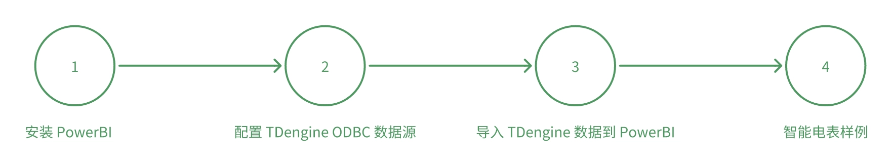

# 如何使用 Power BI 和 TDengine 进行时序数据分析

## 方案介绍

使用 ODBC 连接器，Power BI 可以快速的访问 TDengine。您可以将标签数据、原始时序数据或按时间聚合后的时序数据从 TDengine 导入到 Power BI，制作报表或仪表盘，整个过程不需要任何的代码编写过程。

### 整体步骤

### 前置要求
1. TDengine 服务端软件已经安装并运行
2. Power BI Desktop 软件已经安装并运行（如未安装，请从[官方地址](https://www.microsoft.com/zh-cn/download/details.aspx?id=58494)下载最新的 Windows X64 版本）。

### 安装驱动
从 TDengine 官网下载最新的 Windows X64 客户端驱动程序 [下载地址](https://docs.taosdata.com/get-started/package/)，并安装在 Power BI 运行的机器上

### 配置数据源
请参考 [ODBC](../../connector/odbc) 配置Websocket数据源。

### 导入 TDengine 数据到 Power BI
1. 打开 Power BI 并登录后，通过如下步骤添加数据源，“主页” -> “获取数据” -> “其他” -> “ODBC” -> “连接”
2. 选择数据源名称后，连接到配置好的数据源，进入导航器，浏览对应数据库的数据表并加载
3. 如果需要输入 SQL 语句，可以点击“高级选项”，在展开的对话框中输入并加载数据

为了更好的使用 Power BI 分析 TDengine 中的数据，您需要理解维度、度量、时序、相关性的概念，然后通过自定义的 SQL 语句导入数据。
1. 维度：通常是分类（文本）数据，描述设备、测点、型号等类别信息。在 TDengine 的超级表中，使用标签列存储数据的维度信息，可以通过形如 `select distinct tbname, tag1, tag2 from supertable` 的 SQL 语法快速获得维度信息。
2. 度量：可以用于进行计算的定量（数值）字段， 常见计算有求和、平均值和最小值等。如果测点的采集频率为秒，那么一年就有 31,536,000 条记录，把这些数据全部导入 Power BI 会严重影响其执行效率。在  TDengine 中，您可以使用数据切分查询、窗口切分查询等语法，结合与窗口相关的伪列，把降采样后的数据导入到 Power BI 中，具体语法参考 [TDengine 特色查询功能介绍](https://docs.taosdata.com/taos-sql/distinguished/)。
  - 窗口切分查询：比如温度传感器每秒采集一次数据，但需查询每隔 10 分钟的温度平均值，这种场景下可以使用窗口子句来获得需要的降采样查询结果，对应的 SQL 语句形如 `select tbname, _wstart date，avg(temperature) temp from table interval(10m)` ，其中 _wstart 是伪列，表示时间窗口起始时间，10m 表示时间窗口的持续时间，`avg(temperature)` 表示时间窗口内的聚合值。
  - 数据切分查询：如果需要同时获取很多温度传感器的聚合数值，可对数据进行切分然后在切分出的数据空间内再进行一系列的计算，对应的 SQL 语法参考 `partition by part_list`。数据切分子句最常见的用法就是在超级表查询中，按标签将子表数据进行切分，将每个子表的数据独立出来，形成一条条独立的时间序列，方便各种时序场景的统计分析。
3. 时序：在绘制曲线或者按照时间聚合数据时，通常需要引入日期表。日期表可以从 Excel 表格中导入，也可以在 TDengine 中执行 SQL 语句获取，例如 `select _wstart date, count(*) cnt from test.meters where ts between A and B interval(1d) fill(0)`，其中 fill 字句表示数据缺失情况下的填充模式，伪列_wstart 则为要获取的日期列。
4. 相关性：告诉数据之间如何关联，度量和维度可以通过 tbname 列关联在一起，日期表和度量则可以通过 date 列关联，配合形成可视化报表。

### 智能电表样例
TDengine 有自己独特的数据模型，它使用超级表作为模板，为每个设备创建一个表，每个表最多可创建 4096 个数据列和 128 个标签列。在智能电表样例中，假如一个电表每秒产生一条记录，一天就有 86,400 条记录，一年就有 31,536,000 条记录，1000 个电表将占用  600 GB 原始磁盘空间。因此，Power BI 更多的应用方式是将标签列映射为维度列，数据列的聚合结果导入为度量列，最终为关键决策制定者提供所需的指标。
1. 导入维度数据
在 Power BI 中导入表的标签列，取名为 tags，SQL 如下
select distinct tbname, groupid, location from test.meters;
2. 导入度量数据
在 Power BI 中，按照 1 小时的时间窗口，导入每个电表的电流均值、电压均值、相位均值，取名为 data，SQL 如下
`select tbname, _wstart ws, avg(current), avg(voltage), avg(phase) from test.meters PARTITION by tbname interval(1h)` ;
3. 建立维度和度量的关联关系
在 Power BI 中，打开模型视图，建立表 tags 和 data 的关联关系，将 tbname 设置为关联数据列。之后，就可以在柱状图、饼图等控件中使用这些数据。更多有关 Power BI 构建视觉效果的信息，请查询 [Power BI 文档](https://learn.microsoft.com/zh-cn/power-bi/)。