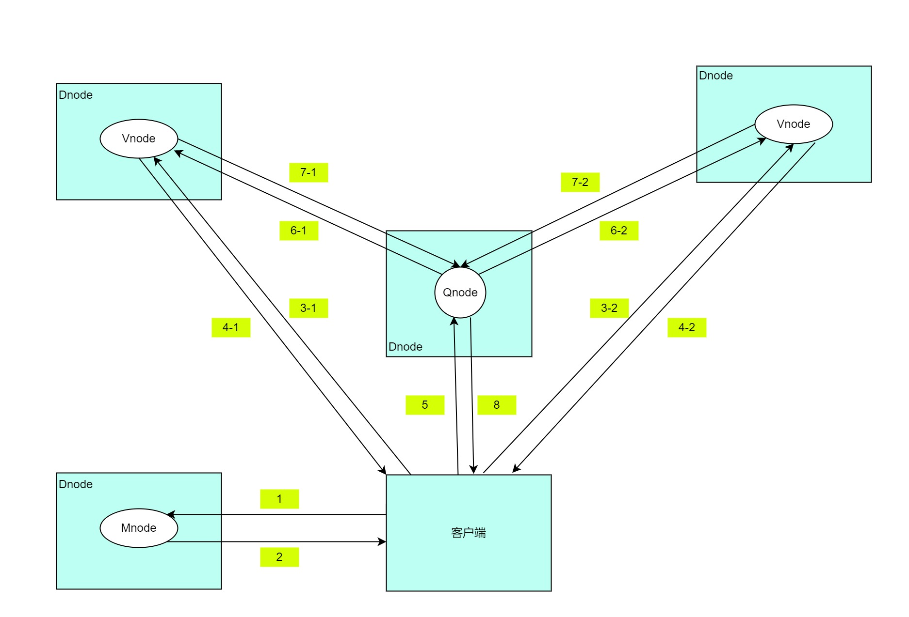

## 集群与基本逻辑单元

TDengine 的设计是基于单个硬件、软件系统不可靠，基于任何单台计算机都无法提供足够计算能力和存储能力处理海量数据的假设进行设计的。因此 TDengine 从研发的第一天起，就按照分布式高可靠架构进行设计，是支持水平扩展的，这样任何单台或多台服务器发生硬件故障或软件错误都不影响系统的可用性和可靠性。同时，通过节点虚拟化并辅以负载均衡技术，TDengine 能最高效率地利用异构集群中的计算和存储资源降低硬件投资。

### 主要逻辑单元

TDengine 分布式架构的逻辑结构图如下：


<center> 图 1 TDengine架构示意图  </center>

一个完整的 TDengine 系统是运行在一到多个物理节点上的，逻辑上，它包含数据节点（dnode）、TDengine 应用驱动（taosc）以及应用（app）。系统中存在一到多个数据节点，这些数据节点组成一个集群（cluster）。应用通过 taosc 的 API 与 TDengine 集群进行互动。下面对每个逻辑单元进行简要介绍。

**物理节点（pnode）：** pnode 是一独立运行、拥有自己的计算、存储和网络能力的计算机，可以是安装有 OS 的物理机、虚拟机或 Docker 容器。物理节点由其配置的 FQDN（Fully Qualified Domain Name）来标识。TDengine 完全依赖 FQDN 来进行网络通讯，如果不了解 FQDN，请看博文[《一篇文章说清楚 TDengine 的 FQDN》](https://www.taosdata.com/blog/2020/09/11/1824.html)。

**数据节点（dnode）：** dnode 是 TDengine 服务器侧执行代码 taosd 在物理节点上的一个运行实例，一个工作的系统必须有至少一个数据节点。dnode 包含零到多个逻辑的虚拟节点（vnode），零或者至多一个逻辑的管理节点（mnode），零或者至多一个逻辑的弹性计算节点（qnode），零或者至多一个逻辑的流计算节点（snode）。dnode 在系统中的唯一标识由实例的 End Point（EP）决定。EP 是 dnode 所在物理节点的 FQDN（Fully Qualified Domain Name）和系统所配置的网络端口号（Port）的组合。通过配置不同的端口，一个物理节点（一台物理机、虚拟机或容器）可以运行多个实例，或有多个数据节点。

**虚拟节点（vnode）：** 为更好的支持数据分片、负载均衡，防止数据过热或倾斜，数据节点被虚拟化成多个虚拟节点（vnode，图中 V2，V3，V4 等）。每个 vnode 都是一个相对独立的工作单元，是时序数据存储的基本单元，具有独立的运行线程、内存空间与持久化存储的路径。一个 vnode 包含一定数量的表（数据采集点）。当创建一个新 DB 时，系统会创建新的 vnode。一个数据节点上能创建的 vnode 的数量取决于该数据节点所在物理节点的硬件资源。一个 vnode 只属于一个 DB，但一个 DB 可以有多个 vnode。一个 vnode 除存储的时序数据外，也保存有所包含的表的 schema、标签值等。一个虚拟节点由所属的数据节点的 EP，以及所属的 VGroup ID 在系统内唯一标识，由管理节点创建并管理。

**管理节点（mnode）：** 一个虚拟的逻辑单元，负责所有数据节点运行状态的监控和维护，以及节点之间的负载均衡（图中 M）。同时，管理节点也负责元数据（包括用户、数据库、超级表等）的存储和管理，因此也称为 Meta Node。TDengine 集群中可配置多个（最多不超过 3 个）mnode，它们自动构建成为一个虚拟管理节点组（图中 M1，M2，M3）。mnode 支持多副本，采用 RAFT 一致性协议，保证系统的高可用与高可靠，任何数据更新操作只能在 Leader 上进行。mnode 集群的第一个节点在集群部署时自动完成，其他节点的创建与删除由用户通过 SQL 命令完成。每个 dnode 上至多有一个 mnode，由所属的数据节点的 EP 来唯一标识。每个 dnode 通过内部消息交互自动获取整个集群中所有 mnode 所在的 dnode 的 EP。

**计算节点（qnode）：** 一个虚拟的逻辑单元，运行查询计算任务，也包括基于系统表来实现的 show 命令（图中 Q）。集群中可配置多个 qnode，在整个集群内部共享使用（图中 Q1，Q2，Q3）。qnode 不与具体的 DB 绑定，即一个 qnode 可以同时执行多个 DB 的查询任务。每个 dnode 上至多有一个 qnode，由所属的数据节点的 EP 来唯一标识。客户端通过与 mnode 交互，获取可用的 qnode 列表，当没有可用的 qnode 时，计算任务在 vnode 中执行。当一个查询执行时，依赖执行计划，调度器会安排一个或多个 qnode 来一起执行。qnode 能从 vnode 获取数据，也可以将自己的计算结果发给其他 qnode 做进一步的处理。通过引入独立的计算节点，TDengine 实现了存储和计算分离。

**流计算节点（snode）：** 一个虚拟的逻辑单元，只运行流计算任务（图中 S）。集群中可配置多个 snode，在整个集群内部共享使用（图中 S1，S2，S3）。snode 不与具体的 stream 绑定，即一个 snode 可以同时执行多个 stream 的计算任务。每个 dnode 上至多有一个 snode，由所属的数据节点的 EP 来唯一标识。由 mnode 调度可用的 snode 完成流计算任务，当没有可用的 snode 时，流计算任务在 vnode 中执行。

**虚拟节点组（VGroup）：** 不同数据节点上的 vnode 可以组成一个虚拟节点组（vgroup），采用 RAFT 一致性协议，保证系统的高可用与高可靠。写操作只能在 leader vnode 上进行，系统采用异步复制的方式将数据同步到 follower vnode，这样确保了一份数据在多个物理节点上有拷贝。一个 vgroup 里虚拟节点个数就是数据的副本数。如果一个 DB 的副本数为 N，系统必须有至少 N 数据节点。副本数在创建 DB 时通过参数 replica 可以指定，缺省为 1。使用 TDengine 的多副本特性，可以不再需要昂贵的磁盘阵列等存储设备，就可以获得同样的数据高可靠性。虚拟节点组由管理节点创建、管理，并且由管理节点分配一个系统唯一的 ID，VGroup ID。如果两个虚拟节点的 VGroup ID 相同，说明他们属于同一个组，数据互为备份。虚拟节点组里虚拟节点的个数是可以动态改变的，容许只有一个，也就是没有数据复制。VGroup ID 是永远不变的，即使一个虚拟节点组被删除，它的 ID 也不会被收回重复利用。

**Taosc** taosc 是 TDengine 给应用提供的驱动程序（driver），负责处理应用与集群的接口交互，提供 C/C++ 语言原生接口，内嵌于 JDBC、C#、Python、Go、Node.js 语言连接库里。应用都是通过 taosc 而不是直接连接集群中的数据节点与整个集群进行交互的。这个模块负责获取并缓存元数据；将插入、查询等请求转发到正确的数据节点；在把结果返回给应用时，还需要负责最后一级的聚合、排序、过滤等操作。对于 JDBC、C/C++、C#、Python、Go、Node.js 接口而言，这个模块是在应用所处的物理节点上运行。同时，taosc 也可以与 taosAdapter 交互，支持全分布式的 RESTful 接口。

### 节点之间的通讯

**通讯方式：**TDengine 系统的各个数据节点之间，以及应用驱动与各数据节点之间的通讯是通过 TCP 进行的。TDengine 根据配置和数据包，会自动对数据进行压缩/解压缩，数字签名/认证等处理。

**FQDN 配置：**一个数据节点有一个或多个 FQDN，可以在系统配置文件 taos.cfg 通过参数“fqdn”进行指定，如果没有指定，系统将自动获取计算机的 hostname 作为其 FQDN。如果节点没有配置 FQDN，可以直接将该节点的配置参数 fqdn 设置为它的 IP 地址。但不建议使用 IP，因为 IP 地址可变，一旦变化，将让集群无法正常工作。一个数据节点的 EP（End Point）由 FQDN + Port 组成。采用 FQDN，需要保证 DNS 服务正常工作，或者在节点以及应用所在的节点配置好 hosts 文件。另外，这个参数值的长度需要控制在 96 个字符以内。

**端口配置：**一个数据节点对外的端口由 TDengine 的系统配置参数 serverPort 决定，默认为 6030。

**集群对外连接：**TDengine 集群可以容纳单个、多个甚至几千个数据节点。应用只需要向集群中任何一个数据节点发起连接即可，连接需要提供的网络参数是一数据节点的 End Point（FQDN 加配置的端口号）。通过命令行 CLI 启动应用 taos 时，可以通过选项-h 来指定数据节点的 FQDN，-P 来指定其配置的端口号，如果端口不配置，将采用 TDengine 的系统配置参数 serverPort。

**集群内部通讯：**各个数据节点之间通过 TCP 进行连接。一个数据节点启动时，将获取 mnode 所在的 dnode 的 EP 信息，然后与系统中的 mnode 建立起连接，交换信息。获取 mnode 的 EP 信息有三步：

1. 检查 dnode.json 文件是否存在，如果不存在或不能正常打开获得 mnode EP 信息，进入第二步；
2. 检查系统配置文件 taos.cfg，获取节点配置参数 firstEp、secondEp（这两个参数指定的节点可以是不带 mnode 的普通节点，这样的话，节点被连接时会尝试重定向到 mnode 节点），如果不存在或者 taos.cfg 里没有这两个配置参数，或无效，进入第三步；
3. 将自己的 EP 设为 mnode EP，并独立运行起来。

获取 mnode EP 列表后，数据节点发起连接，如果连接成功，则成功加入进工作的集群，如果不成功，则尝试 mnode EP 列表中的下一个。如果都尝试了，但连接都仍然失败，则休眠几秒后，再进行尝试。

**Mnode 的选择：**TDengine 逻辑上有管理节点，但没有单独的执行代码，服务器侧只有一套执行代码 taosd。那么哪个数据节点会是管理节点呢？在集群部署时，第一个数据节点自动成为管理节点。集群中的其他管理节点的创建与删除，由用户通过 SQL 语句完成。

**新数据节点的加入：**系统有了一个数据节点后，就已经成为一个工作的系统。添加新的节点进集群时，有两个步骤，第一步：使用 TDengine CLI 连接到现有工作的数据节点，然后用命令“CREATE DNODE”将新的数据节点的 End Point 添加进去；第二步：在新的数据节点的系统配置参数文件 taos.cfg 里，将 firstEp，secondEp 参数设置为现有集群中任意两个数据节点的 EP 即可。具体添加的详细步骤请见详细的用户手册。这样就把集群一步一步的建立起来。

**重定向：**无论是 dnode 还是 taosc，最先都是要发起与 mnode 的连接，由于 mnode 是可以动态调整的，所以对于用户来说，并不知道哪个 dnode 在运行 mnode。TDengine 只要求向系统中任何一个工作的 dnode 发起连接即可。因为任何一个正在运行的 dnode，都维护有目前运行的 mnode EP List。当收到一个来自新启动的 dnode 或 taosc 的连接请求，如果自己不是 mnode，则将 mnode EP List 回复给对方，taosc 或新启动的 dnode 收到这个 list，就重新尝试建立连接。当 mnode EP List 发生改变，通过节点之间的消息交互，各个数据节点就很快获取最新列表，并通知 taosc。

### 一个典型的消息流程

为解释 vnode、mnode、taosc 和应用之间的关系以及各自扮演的角色，下面对写入数据这个典型操作的流程进行剖析。


<center> 图 2 TDengine 典型的操作流程 </center>

1. 应用通过 JDBC 或其他 API 接口发起插入数据的请求。
2. taosc 会检查缓存，看是否保存有该表所在数据库的 vgroup-info 信息。如果有，直接到第 4 步。如果没有，taosc 将向 mnode 发出 get vgroup-info 请求。
3. mnode 将该表所在数据库的 vgroup-info 返回给 taosc。Vgroup-info 包含数据库的 vgroup 分布信息（vnode ID 以及所在的 dnode 的 End Point，如果副本数为 N，就有 N 组 End Point），还包含每个 vgroup 中存储数据表的 hash 范围。如果 taosc 迟迟得不到 mnode 回应，而且存在多个 mnode，taosc 将向下一个 mnode 发出请求。
4. taosc 会继续检查缓存，看是否保存有该表的 meta-data。如果有，直接到第 6 步。如果没有，taosc 将向 vnode 发出 get meta-data 请求。
5. vnode 将该表的 meta-data 返回给 taosc。Meta-data 包含有该表的 schema。
6. taosc 向 leader vnode 发起插入请求。
7. vnode 插入数据后，给 taosc 一个应答，表示插入成功。如果 taosc 迟迟得不到 vnode 的回应，taosc 会认为该节点已经离线。这种情况下，如果被插入的数据库有多个副本，taosc 将向 vgroup 里下一个 vnode 发出插入请求。
8. taosc 通知 APP，写入成功。

对于第二步，taosc 启动时，并不知道 mnode 的 End Point，因此会直接向配置的集群对外服务的 End Point 发起请求。如果接收到该请求的 dnode 并没有配置 mnode，该 dnode 会在回复的消息中告知 mnode EP 列表，这样 taosc 会重新向新的 mnode 的 EP 发出获取 meta-data 的请求。

对于第四和第六步，没有缓存的情况下，taosc 无法知道虚拟节点组里谁是 leader，就假设第一个 vnodeID 就是 leader，向它发出请求。如果接收到请求的 vnode 并不是 leader，它会在回复中告知谁是 leader，这样 taosc 就向建议的 leader vnode 发出请求。一旦得到插入成功的回复，taosc 会缓存 leader 节点的信息。

上述是插入数据的流程，查询、计算的流程也完全一致。taosc 把这些复杂的流程全部封装屏蔽了，对于应用来说无感知也无需任何特别处理。

通过 taosc 缓存机制，只有在第一次对一张表操作时，才需要访问 mnode，因此 mnode 不会成为系统瓶颈。但因为 schema 有可能变化，而且 vgroup 有可能发生改变（比如负载均衡发生），因此 taosc 会定时和 mnode 交互，自动更新缓存。

## 存储模型与数据分区、分片

### 存储模型

TDengine 存储的数据包括采集的时序数据以及库、表相关的元数据、标签数据等，这些数据具体分为三部分：

- 时序数据：存放于 vnode 里，由 data、head 和 last 三个文件组成，数据量大，查询量取决于应用场景。容许乱序写入，但暂时不支持删除操作，并且仅在 update 参数设置为 1 时允许更新操作。通过采用一个采集点一张表的模型，一个时间段的数据是连续存储，对单张表的写入是简单的追加操作，一次读，可以读到多条记录，这样保证对单个采集点的插入和查询操作，性能达到最优。
- 数据表元数据：包含标签信息和 Table Schema 信息，存放于 vnode 里的 meta 文件，支持增删改查四个标准操作。数据量很大，有 N 张表，就有 N 条记录，因此采用 LRU 存储，支持标签数据的索引。TDengine 支持多核多线程并发查询。只要计算内存足够，元数据全内存存储，千万级别规模的标签数据过滤结果能毫秒级返回。在内存资源不足的情况下，仍然可以支持数千万张表的快速查询。
- 数据库元数据：存放于 mnode 里，包含系统节点、用户、DB、STable Schema 等信息，支持增删改查四个标准操作。这部分数据的量不大，可以全内存保存，而且由于客户端有缓存，查询量也不大。因此目前的设计虽是集中式存储管理，但不会构成性能瓶颈。

与典型的 NoSQL 存储模型相比，TDengine 将标签数据与时序数据完全分离存储，它具有两大优势：

- 能够极大地降低标签数据存储的冗余度：一般的 NoSQL 数据库或时序数据库，采用的 K-V 存储，其中的 Key 包含时间戳、设备 ID、各种标签。每条记录都带有这些重复的内容，浪费存储空间。而且如果应用要在历史数据上增加、修改或删除标签，需要遍历数据，重写一遍，操作成本极其昂贵。
- 能够实现极为高效的多表之间的聚合查询：做多表之间聚合查询时，先把符合标签过滤条件的表查找出来，然后再查找这些表相应的数据块，这样大幅减少要扫描的数据集，从而大幅提高查询效率。

### 数据分片

对于海量的数据管理，为实现水平扩展，一般都需要采取分片（Sharding）分区（Partitioning）策略。TDengine 是通过 vnode 来实现数据分片的，通过一个时间段一个数据文件来实现时序数据分区的。

vnode（虚拟数据节点）负责为采集的时序数据提供写入、查询和计算功能。为便于负载均衡、数据恢复、支持异构环境，TDengine 将一个数据节点根据其计算和存储资源切分为多个 vnode。这些 vnode 的管理是 TDengine 自动完成的，对应用完全透明。

对于单独一个数据采集点，无论其数据量多大，一个 vnode（或 vgroup，如果副本数大于 1）有足够的计算资源和存储资源来处理（如果每秒生成一条 16 字节的记录，一年产生的原始数据不到 0.5G），因此 TDengine 将一张表（一个数据采集点）的所有数据都存放在一个 vnode 里，而不会让同一个采集点的数据分布到两个或多个 dnode 上。而且一个 vnode 可存储多个数据采集点（表）的数据，一个 vnode 可容纳的表的数目的上限为一百万。设计上，一个 vnode 里所有的表都属于同一个 DB。

TDengine 3.0 采用 hash 一致性算法，确定每张数据表所在的 vnode。创建 DB 时，系统会立刻分配指定数目的 vnode，并确定每个 vnode 所负责的数据表范围。当创建一张表时，系统根据数据表名计算出所在的 vnodeID，立即在该 vnode 创建表。如果 DB 有多个副本，系统不是只创建一个 vnode，而是一个 vgroup（虚拟数据节点组）。系统对 vnode 的数目没有任何限制，仅仅受限于物理节点本身的计算和存储资源。

每张表的 meta data（包含 schema，标签等）也存放于 vnode 里，而不是集中存放于 mnode，实际上这是对 meta 数据的分片，这样便于高效并行的进行标签过滤操作。

### 数据分区

TDengine 除 vnode 分片之外，还对时序数据按照时间段进行分区。每个数据文件只包含一个时间段的时序数据，时间段的长度由 DB 的配置参数 duration 决定。这种按时间段分区的方法还便于高效实现数据的保留策略，只要数据文件超过规定的天数（系统配置参数 keep），将被自动删除。而且不同的时间段可以存放于不同的路径和存储介质，以便于大数据的冷热管理，实现多级存储。

总的来说，**TDengine 是通过 vnode 以及时间两个维度，对大数据进行切分**，便于并行高效的管理，实现水平扩展。

### 负载均衡

每个 dnode 都定时向 mnode（虚拟管理节点）报告其状态（包括硬盘空间、内存大小、CPU、网络、虚拟节点个数等），因此 mnode 了解整个集群的状态。基于整体状态，当 mnode 发现某个 dnode 负载过重，它会将 dnode 上的一个或多个 vnode 挪到其他 dnode。在挪动过程中，对外服务继续进行，数据插入、查询和计算操作都不受影响。负载均衡的触发时间，由用户指定。

当新的数据节点被添加进集群，因为新的计算和存储被添加进来，用户需要手动触发负载均衡流程，使得系统在最优的情况下运行。

**提示：负载均衡由参数 balance 控制，决定开启/关闭自动负载均衡。**

## 数据写入与复制流程

如果一个数据库有 N 个副本，那一个虚拟节点组就有 N 个虚拟节点，但是只有一个是 leader，其他都是 follower。当应用将新的记录写入系统时，只有 leader vnode 能接受写的请求。如果 follower vnode 收到写的请求，系统将通知 taosc 需要重新定向。

### Leader Vnode 写入流程

Leader Vnode 遵循下面的写入流程：


<center> 图 3 TDengine Leader 写入流程  </center>

1. leader vnode 收到应用的数据插入请求，验证 OK，进入下一步；
2. vnode 将该请求的原始数据包写入数据库日志文件 WAL。如果 `wal_level` 设置为 2，而且 `wal_fsync_period` 设置为 0，TDengine 还将 WAL 数据立即落盘，以保证即使宕机，也能从数据库日志文件中恢复数据，避免数据的丢失；
3. 如果有多个副本，vnode 将把数据包转发给同一虚拟节点组内的 follower vnodes，该转发包带有数据的版本号（version）；
4. 写入内存，并将记录加入到 skip list。但如果未达成一致，会触发回滚操作；
5. leader vnode 返回确认信息给应用，表示写入成功；
6. 如果第 2、3、4 步中任何一步失败，将直接返回错误给应用；

### Follower Vnode 写入流程

对于 follower vnode，写入流程是：


<center> 图 4 TDengine Follower 写入流程  </center>

1. follower vnode 收到 leader vnode 转发了的数据插入请求。
2. vnode 将把该请求的原始数据包写入数据库日志文件 WAL。如果 `wal_level` 设置为 2，而且 `wal_fsync_period` 设置为 0，TDengine 还将 WAL 数据立即落盘，以保证即使宕机，也能从数据库日志文件中恢复数据，避免数据的丢失。
3. 写入内存，更新内存中的 skip list。

与 leader vnode 相比，follower vnode 不存在转发环节，也不存在回复确认环节，少了两步。但写内存与 WAL 是完全一样的。

### 主从选择

Vnode 会保持一个数据版本号（version），对内存数据进行持久化存储时，对该版本号也进行持久化存储。每个数据更新操作，无论是采集的时序数据还是元数据，这个版本号将增加 1。

一个 vnode 启动时，角色（leader、follower）是不定的，数据是处于未同步状态，它需要与虚拟节点组内其他节点建立 TCP 连接，并互相交换 status，按照标准的 raft 一致性算法完成选主。

### 同步复制

对于数据一致性要求更高的场景，异步数据复制提供的最终一致性无法满足要求。因此 TDengine 3.0 使用了同步复制的机制（参照 RAFT 协议的标准实现）。每次 leader vnode 转发给其他副本时，需要等待半数以上（包含自己）副本达成一致后，才能通知应用写入成功。如果在一定的时间内，得不到半数以上副本的确认，leader vnode 将返回错误给应用。

## 缓存与持久化

### 时序数据缓存

TDengine 采用时间驱动缓存管理策略（First-In-First-Out，FIFO），又称为写驱动的缓存管理机制。这种策略有别于读驱动的数据缓存模式（Least-Recent-Used，LRU），直接将最近写入的数据保存在系统的缓存中。当缓存达到临界值的时候，将最早的数据批量写入磁盘。一般意义上来说，对于物联网数据的使用，用户最为关心的是刚产生的数据，即当前状态。TDengine 充分利用这一特性，将最近到达的（当前状态）数据保存在缓存中。

TDengine 通过查询函数向用户提供毫秒级的数据获取能力。直接将最近到达的数据保存在缓存中，可以更加快速地响应用户针对最近一条或一批数据的查询分析，整体上提供更快的数据库查询响应能力。从这个意义上来说，**可通过设置合适的配置参数将 TDengine 作为数据缓存来使用，而不需要再部署 Redis 或其他额外的缓存系统**，可有效地简化系统架构，降低运维的成本。需要注意的是，TDengine 重启以后系统的缓存将被清空，之前缓存的数据均会被批量写入磁盘，缓存的数据将不会像专门的 key-value 缓存系统再将之前缓存的数据重新加载到缓存中。

每个 vnode 有自己独立的内存，而且由多个固定大小的内存块组成，不同 vnode 之间完全隔离。数据写入时，类似于日志的写法，数据被顺序追加写入内存，但每个 vnode 维护有自己的 skip list，便于迅速查找。当三分之一以上的内存块写满时，启动落盘操作，而且后续写的操作在新的内存块进行。这样，一个 vnode 里有三分之一内存块是保留有最近的数据的，以达到缓存、快速查找的目的。一个 vnode 的内存大小由配置参数 buffer 决定。

### 持久化存储

TDengine 采用数据驱动的方式让缓存中的数据写入硬盘进行持久化存储。当 vnode 中缓存的数据达到一定规模时，为了不阻塞后续数据的写入，TDengine 也会拉起落盘线程将缓存的数据写入持久化存储。TDengine 在数据落盘时会打开新的数据库日志文件，在落盘成功后则会删除老的数据库日志文件，避免日志文件无限制地增长。

为充分利用时序数据特点，TDengine 将一个 vnode 保存在持久化存储的数据切分成多个文件，每个文件只保存固定天数的数据，这个天数由系统配置参数 `duration` 决定。切分成多个文件后，给定查询的起止日期，无需任何索引，就可以立即定位需要打开哪些数据文件，大大加快读取速度。

对于采集的数据，一般有保留时长，这个时长由系统配置参数 `keep` 决定。超过这个设置天数的数据文件，将被系统自动删除，释放存储空间。

给定 `duration` 与 `keep` 两个参数，一个典型工作状态的 vnode 中总的数据文件数为：向上取整 `(keep/duration)+1` 个。总的数据文件个数不宜过大，也不宜过小。10 到 100 以内合适。基于这个原则，可以设置合理的 `duration`。目前的版本，参数 `keep` 可以修改，但对于参数 `duration`，一旦设置后，不可修改。

在每个数据文件里，一张表的数据是一块一块存储的。一张表可以有一到多个数据文件块。在一个文件块里，数据是列式存储的，占用的是一片连续的存储空间，这样大大提高读取速度。文件块的大小由系统参数 maxRows （每块最大记录条数）决定，缺省值为 4096。这个值不宜过大，也不宜过小。过大，定位具体时间段的数据的搜索时间会变长，影响读取速度；过小，数据块的索引太大，压缩效率偏低，也影响读取速度。

每个数据文件（.data 结尾）都有一个对应的索引文件（.head 结尾），该索引文件对每张表都有一数据块的摘要信息，记录了每个数据块在数据文件中的偏移量，数据的起止时间等信息，以帮助系统迅速定位需要查找的数据。每个数据文件还有一对应的 last 文件（.last 结尾），该文件是为防止落盘时数据块碎片化而设计的。如果一张表落盘的记录条数没有达到系统配置参数 minRows（每块最小记录条数），将被先存储到 last 文件，等下次落盘时，新落盘的记录将与 last 文件的记录进行合并，再写入数据文件。

数据写入磁盘时，根据系统配置参数 comp 决定是否压缩数据。TDengine 提供了三种压缩选项：无压缩、一阶段压缩和两阶段压缩，分别对应 comp 值为 0、1 和 2 的情况。一阶段压缩根据数据的类型进行了相应的压缩，压缩算法包括 delta-delta 编码、simple 8B 方法、zig-zag 编码、LZ4 等算法。二阶段压缩在一阶段压缩的基础上又用通用压缩算法进行了压缩，压缩率更高。

### 多级存储

说明：多级存储功能仅企业版支持，从 2.0.16.0 版本开始提供。

在默认配置下，TDengine 会将所有数据保存在 /var/lib/taos 目录下，而且每个 vnode 的数据文件保存在该目录下的不同目录。为扩大存储空间，尽量减少文件读取的瓶颈，提高数据吞吐率 TDengine 可通过配置系统参数 dataDir 让多个挂载的硬盘被系统同时使用。

除此之外，TDengine 也提供了数据分级存储的功能，将不同时间段的数据存储在挂载的不同介质上的目录里，从而实现不同“热度”的数据存储在不同的存储介质上，充分利用存储，节约成本。比如，最新采集的数据需要经常访问，对硬盘的读取性能要求高，那么用户可以配置将这些数据存储在 SSD 盘上。超过一定期限的数据，查询需求量没有那么高，那么可以存储在相对便宜的 HDD 盘上。

多级存储支持 3 级，每级最多可配置 16 个挂载点。

TDengine 多级存储配置方式如下（在配置文件/etc/taos/taos.cfg 中）：

```
dataDir [path] <level> <primary>
```

- path: 挂载点的文件夹路径
- level: 介质存储等级，取值为 0，1，2。
  0 级存储最新的数据，1 级存储次新的数据，2 级存储最老的数据，省略默认为 0。
  各级存储之间的数据流向：0 级存储 -> 1 级存储 -> 2 级存储。
  同一存储等级可挂载多个硬盘，同一存储等级上的数据文件分布在该存储等级的所有硬盘上。
  需要说明的是，数据在不同级别的存储介质上的移动，是由系统自动完成的，用户无需干预。
- primary: 是否为主挂载点，0（否）或 1（是），省略默认为 1。

在配置中，只允许一个主挂载点的存在（level=0，primary=1），例如采用如下的配置方式：

```
dataDir /mnt/data1 0 1
dataDir /mnt/data2 0 0
dataDir /mnt/data3 1 0
dataDir /mnt/data4 1 0
dataDir /mnt/data5 2 0
dataDir /mnt/data6 2 0
```

:::note

1. 多级存储不允许跨级配置，合法的配置方案有：仅 0 级，仅 0 级+ 1 级，以及 0 级+ 1 级+ 2 级。而不允许只配置 level=0 和 level=2，而不配置 level=1。
2. 禁止手动移除使用中的挂载盘，挂载盘目前不支持非本地的网络盘。
3. 多级存储目前不支持删除已经挂载的硬盘的功能。

:::

## 数据查询

TDengine 提供了多种多样针对表和超级表的查询处理功能，除了常规的聚合查询之外，还提供针对时序数据的窗口查询、统计聚合等功能。TDengine 的查询处理需要客户端、vnode、qnode、mnode 节点协同完成，一个复杂的超级表聚合查询可能需要多个 vnode 和 qnode 节点共同分担查询和计算任务。

### 查询基本流程

1. 客户端解析输入 SQL 语句并生成抽象语法树（Abstract Syntax Tree，AST），然后根据元数据信息对其进行校验和检查。在此期间，元数据管理模块（Catalog）会向管理节点（mnode）或 vnode 请求查询中指定库和表的元数据信息（table metadata）。
2. 在通过校验检查后，客户端将生成分布式的查询计划并对查询计划进行优化处理。
3. 客户端根据配置的查询策略进行任务调度处理，一个查询子任务会根据其数据亲缘关系或负载信息调度到某个 vnode 或 qnode 所属的数据节点（dnode）进行处理。
4. dnode 接收到查询请求后，识别出该查询请求指向的虚拟节点（vnode）或查询节点（qnode），将消息转发到 vnode 或 qnode 的查询执行队列。
5. vnode 或 qnode 的查询执行线程建立基础的查询执行环境，并立即执行该查询，在得到部分可获取查询结果后通知客户端。
6. 客户端将启动下级查询任务或直接获取查询结果。

### 按时间轴聚合、降采样、插值

时序数据有别于普通数据的显著特征是每条记录均具有时间戳，因此针对具有时间戳的数据在时间轴上进行聚合是不同于普通数据库的重要功能。从这点上来看，与流计算引擎的窗口查询有相似的地方。

在 TDengine 中引入关键词 interval 来进行时间轴上固定长度时间窗口的切分，并按照时间窗口对数据进行聚合，对窗口范围内的数据按需进行聚合。例如：

```sql
SELECT COUNT(*) FROM d1001 INTERVAL(1h);
```

针对 d1001 设备采集的数据，按照 1 小时的时间窗口返回每小时存储的记录数量。

在需要连续获得查询结果的应用场景下，如果给定的时间区间存在数据缺失，会导致该区间数据结果也丢失。TDengine 提供策略针对时间轴聚合计算的结果进行插值，通过使用关键词 fill 就能够对时间轴聚合结果进行插值。例如：

```sql
SELECT COUNT(*) FROM d1001 WHERE ts >= '2017-7-14 00:00:00' AND ts < '2017-7-14 23:59:59' INTERVAL(1h) FILL(PREV);
```

针对 d1001 设备采集数据统计每小时记录数，如果某一个小时不存在数据，则返回之前一个小时的统计数据。TDengine 提供前向插值（prev）、线性插值（linear）、空值填充（NULL）、特定值填充（value）。

### 多表聚合查询

TDengine 对每个数据采集点单独建表，但在实际应用中经常需要对不同的采集点数据进行聚合。为高效的进行聚合操作，TDengine 引入超级表（STable）的概念。超级表用来代表一特定类型的数据采集点，它是包含多张表的表集合，集合里每张表的模式（schema）完全一致，但每张表都带有自己的静态标签，标签可以有多个，可以随时增加、删除和修改。应用可通过指定标签的过滤条件，对一个 STable 下的全部或部分表进行聚合或统计操作，这样大大简化应用的开发。其具体流程如下图所示：



<center> 图 5 多表聚合查询原理图  </center>

1. 客户端从 mnode 获取库和表的元数据信息；
2. mnode 返回请求的元数据信息；
3. 客户端向超级表所属的每个 vnode 发送查询请求；
4. vnode 启动本地查询，在获得查询结果后返回查询响应；
5. 客户端向聚合节点 （在本例中为 qnode）发送查询请求；
6. qnode 向每个 vnode 节点发送数据请求消息来拉取数据；
7. vnode 返回本节点的查询计算结果；
8. qnode 完成多节点数据聚合后将最终查询结果返回给客户端；

由于 TDengine 在 vnode 内将标签数据与时序数据分离存储，通过在内存里过滤标签数据，先找到需要参与聚合操作的表的集合，将需要扫描的数据集大幅减少，大幅提升聚合计算速度。同时，由于数据分布在多个 vnode/dnode，聚合计算操作在多个 vnode 里并发进行，又进一步提升了聚合的速度。 对普通表的聚合函数以及绝大部分操作都适用于超级表，语法完全一样，细节请看 TDengine SQL。

### 预计算

为有效提升查询处理的性能，针对物联网数据的不可更改的特点，在数据块头部记录该数据块中存储数据的统计信息：包括最大值、最小值、和。我们称之为预计算单元。如果查询处理涉及整个数据块的全部数据，直接使用预计算结果，完全不需要读取数据块的内容。由于预计算数据量远小于磁盘上存储的数据块数据的大小，对于磁盘 I/O 为瓶颈的查询处理，使用预计算结果可以极大地减小读取 I/O 压力，加速查询处理的流程。预计算机制与 PostgreSQL 的索引 BRIN（block range index）有异曲同工之妙。
