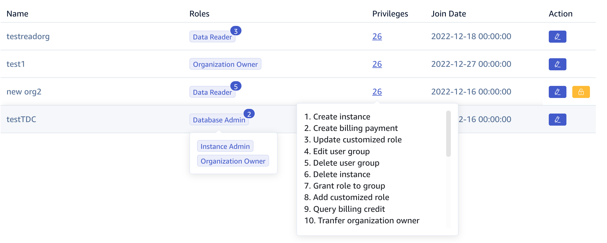
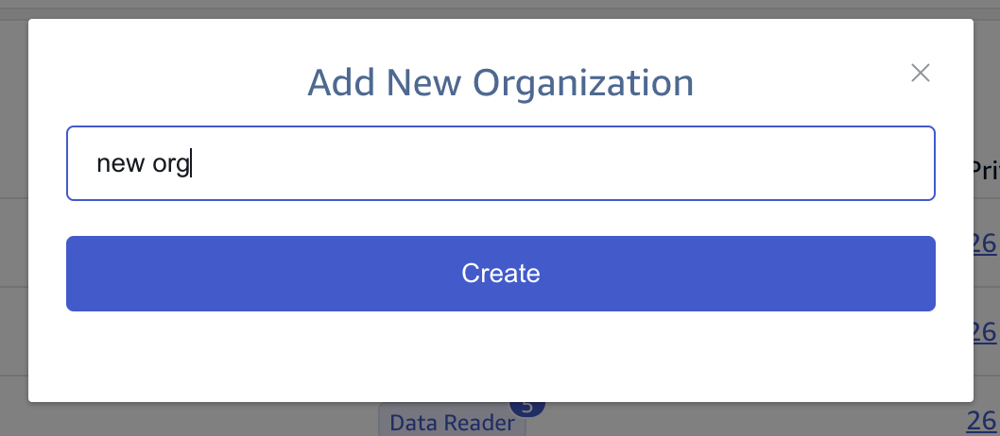
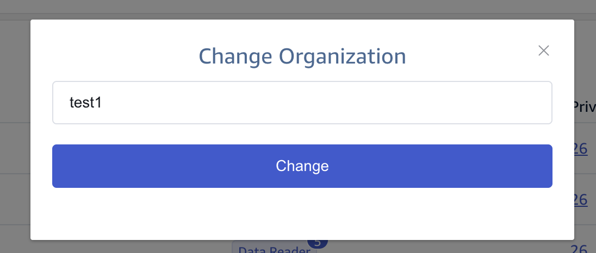
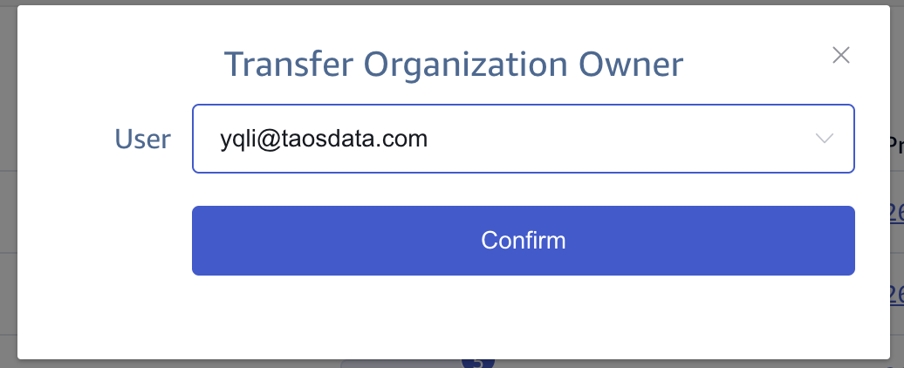

TDengine Cloud 为用户提供了一个列表页来管理您的组织。在这个页面上，您可以得到有权查看或编辑的组织。在组织列表的每一行，您可以得到组织的名称，在组织中的角色和可以进行的操作。

在**角色**列中，点击某一行的该值将弹出您在当前组织中所分配角色的详细信息。同时，在**权限**列中，点击某一行的该值也会弹出您在组织层面拥有的权限的详细信息。

## 添加新组织

您可以点击组织列表右上方的**添加新组织**按钮，会打开**添加新组织**对话框。在打开的对话框中，输入具体的名称，然后点击**创建**按钮，就可以创建一个新的组织。

## 修改组织名称

您可以点击每个组织的**操作**列的**编辑**图标，会打开**编辑组织**的对话框。在打开的对话框中，修改组织名称，然后点击**更改**按钮，保存修改后的组织名称。

## 转移组织所有者

如果您选择了左上角组织选择框里面的组织，并且你是该组织的所有者，在组织列表页面的同一组织行将显示**转移组织所有者**图标。然后点击该图标将显示**转移组织所有者**对话框。在打开的对话框中，您可以选择该组织的另一个活跃的用户，点击确定以后，被选中的活跃用户将收到一封关于转移操作的通知邮件。

