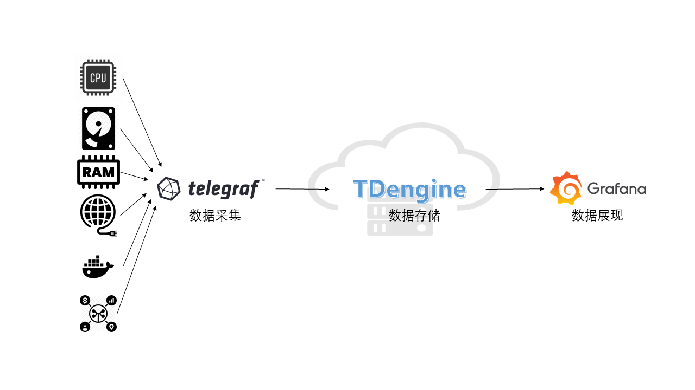
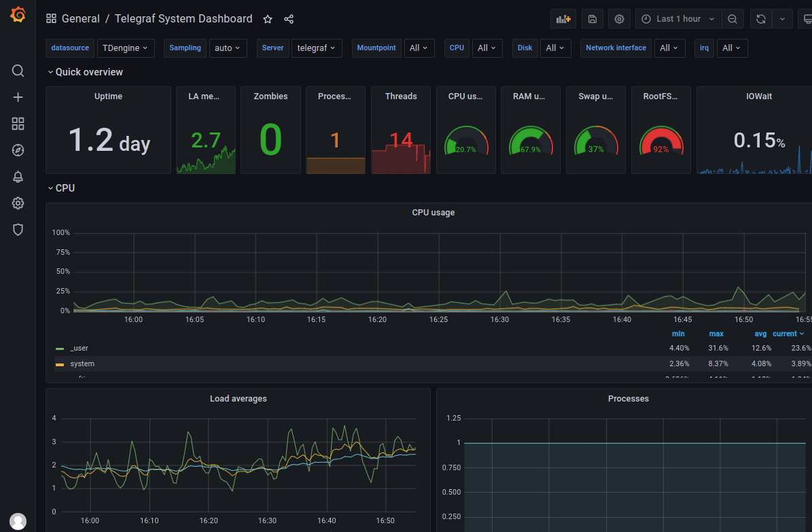

## 背景介绍

TDengine 是涛思数据专为物联网、车联网、工业互联网、IT 运维等设计和优化的大数据平台。自从 2019 年 7 月开源以来，凭借创新的数据建模设计、快捷的安装方式、易用的编程接口和强大的数据写入查询性能博得了大量时序数据开发者的青睐。

IT 运维监测数据通常都是对时间特性比较敏感的数据，例如：

- 系统资源指标：CPU、内存、IO、带宽等。
- 软件系统指标：存活状态、连接数目、请求数目、超时数目、错误数目、响应时间、服务类型及其他与业务有关的指标。

当前主流的 IT 运维系统通常包含一个数据采集模块，一个数据存储模块，和一个可视化显示模块。Telegraf 和 Grafana 分别是当前最流行的数据采集模块和可视化显示模块之一。而数据存储模块可供选择的软件比较多，其中 OpenTSDB 或 InfluxDB 比较流行。而 TDengine 作为新兴的时序大数据平台，具备极强的高性能、高可靠、易管理、易维护的优势。

本文介绍不需要写一行代码，通过简单修改几行配置文件，就可以快速搭建一个基于 TDengine + Telegraf + Grafana 的 IT 运维系统。架构如下图：



## 安装步骤

### 安装 Telegraf，Grafana 和 TDengine

安装 Telegraf、Grafana 和 TDengine 请参考相关官方文档。

### Telegraf

请参考[官方文档](https://portal.influxdata.com/downloads/)。

### Grafana

请参考[官方文档](https://grafana.com/grafana/download)。

### TDengine

从涛思数据官网[下载](http://taosdata.com/cn/all-downloads/)页面下载最新 TDengine-server 版本安装。

## 数据链路设置

### 安装 Grafana Plugin 并配置数据源

请参考[安装 Grafana Plugin 并配置数据源](/third-party/grafana/#%E5%AE%89%E8%A3%85-grafana-plugin-%E5%B9%B6%E9%85%8D%E7%BD%AE%E6%95%B0%E6%8D%AE%E6%BA%90)。

### 修改 /etc/telegraf/telegraf.conf

配置方法，在 `/etc/telegraf/telegraf.conf` 增加如下文字，其中 `database name` 请填写希望在 TDengine 保存 Telegraf 数据的数据库名，`TDengine server/cluster host`、`username` 和 `password` 填写 TDengine 实际值：

```
[[outputs.http]]
  url = "http://<TDengine server/cluster host>:6041/influxdb/v1/write?db=<database name>"
  method = "POST"
  timeout = "5s"
  username = "<TDengine's username>"
  password = "<TDengine's password>"
  data_format = "influx"
```

然后重启 Telegraf：

```bash
sudo systemctl start telegraf
```

### 导入 Dashboard

使用 Web 浏览器访问 `IP:3000` 登录 Grafana 界面，系统初始用户名密码为 admin/admin。
点击左侧齿轮图标并选择 `Plugins`，应该可以找到 TDengine data source 插件图标。
点击左侧加号图标并选择 `Import`，从 `https://github.com/taosdata/grafanaplugin/blob/master/examples/telegraf/grafana/dashboards/telegraf-dashboard-v3.json` (适配 TDengine 3.0, 如果使用 TDengine 2.x， 请下载 `telegraf-dashboard-v2.json`) 下载 dashboard JSON 文件后导入。之后可以看到如下界面的仪表盘：



## 总结

以上演示如何快速搭建一个完整的 IT 运维展示系统。得力于 TDengine 的 schemaless 协议解析功能，以及强大的生态软件适配能力，用户可以短短数分钟就可以搭建一个高效易用的 IT 运维系统。TDengine 强大的数据写入查询性能和其他丰富功能请参考官方文档和产品落地案例。
