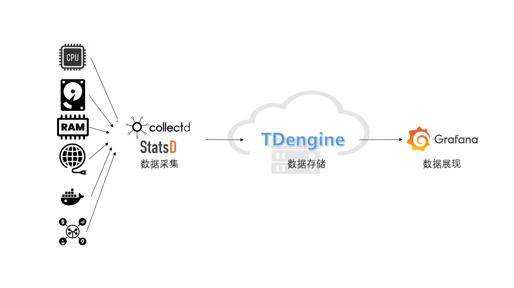

## 背景介绍

TDengine 是涛思数据专为物联网、车联网、工业互联网、IT 运维等设计和优化的大数据平台。自从 2019 年 7 月开源以来，凭借创新的数据建模设计、快捷的安装方式、易用的编程接口和强大的数据写入查询性能博得了大量时序数据开发者的青睐。

IT 运维监测数据通常都是对时间特性比较敏感的数据，例如：

- 系统资源指标：CPU、内存、IO、带宽等。
- 软件系统指标：存活状态、连接数目、请求数目、超时数目、错误数目、响应时间、服务类型及其他与业务有关的指标。

当前主流的 IT 运维系统通常包含一个数据采集模块，一个数据存储模块，和一个可视化显示模块。collectd / statsD 作为老牌开源数据采集工具，具有广泛的用户群。但是 collectd / StatsD 自身功能有限，往往需要配合 Telegraf、Grafana 以及时序数据库组合搭建成为完整的监控系统。而 TDengine 新版本支持多种数据协议接入，可以直接接受 collectd 和 statsD 的数据写入，并提供 Grafana dashboard 进行图形化展示。

本文介绍不需要写一行代码，通过简单修改几行配置文件，就可以快速搭建一个基于 TDengine + collectd / statsD + Grafana 的 IT 运维系统。架构如下图：



## 安装步骤

安装 collectd， StatsD， Grafana 和 TDengine 请参考相关官方文档。

### 安装 collectd

请参考[官方文档](https://collectd.org/documentation.shtml)。

### 安装 StatsD

请参考[官方文档](https://github.com/statsd/statsd)。

### 安装 Grafana

请参考[官方文档](https://grafana.com/grafana/download)。

### 安装 TDengine

从涛思数据官网[下载](http://taosdata.com/cn/all-downloads/)页面下载最新 TDengine-server 版本安装。

## 数据链路设置

### 安装 Grafana Plugin 并配置数据源

请参考[安装 Grafana Plugin 并配置数据源](/third-party/grafana/#%E5%AE%89%E8%A3%85-grafana-plugin-%E5%B9%B6%E9%85%8D%E7%BD%AE%E6%95%B0%E6%8D%AE%E6%BA%90)。

### 配置 collectd

在 `/etc/collectd/collectd.conf` 文件中增加如下内容，其中 `host` 和 `port` 请填写 TDengine 和 taosAdapter 配置的实际值：

```
LoadPlugin network
<Plugin network>
  Server "<TDengine cluster/server host>" "<port for collectd>"
</Plugin>

sudo systemctl start collectd
```

### 配置 StatsD

在 `config.js` 文件中增加如下内容后启动 StatsD，其中 `host` 和 `port` 请填写 TDengine 和 taosAdapter 配置的实际值：

```
backends 部分添加 "./backends/repeater"
repeater 部分添加 { host:'<TDengine server/cluster host>', port: <port for StatsD>}
```

### 导入 Dashboard

使用 Web 浏览器访问运行 Grafana 的服务器的 3000 端口 `host:3000` 登录 Grafana 界面，系统初始用户名密码为 `admin/admin`。
点击左侧齿轮图标并选择 `Plugins`，应该可以找到 TDengine data source 插件图标。

#### 导入 collectd 仪表盘

从 https://github.com/taosdata/grafanaplugin/blob/master/examples/collectd/grafana/dashboards/collect-metrics-with-tdengine-v0.1.0.json 下载 dashboard json 文件，点击左侧加号图标并选择 `Import`，按照界面提示选择 JSON 文件导入。之后可以看到如下界面的仪表盘：


#### 导入 StatsD 仪表盘

从 `https://github.com/taosdata/grafanaplugin/blob/master/examples/statsd/dashboards/statsd-with-tdengine-v0.1.0.json` 下载 dashboard json 文件，点击左侧加号图标并选择 `Import`，按照界面提示导入 JSON 文件。之后可以看到如下界面的仪表盘：


## 总结

TDengine 作为新兴的时序大数据平台，具备极强的高性能、高可靠、易管理、易维护的优势。得力于 TDengine 的 schemaless 协议解析功能，以及强大的生态软件适配能力，用户可以短短数分钟就可以搭建一个高效易用的 IT 运维系统或者适配一个已存在的系统。

TDengine 强大的数据写入查询性能和其他丰富功能请参考官方文档和产品成功落地案例。
