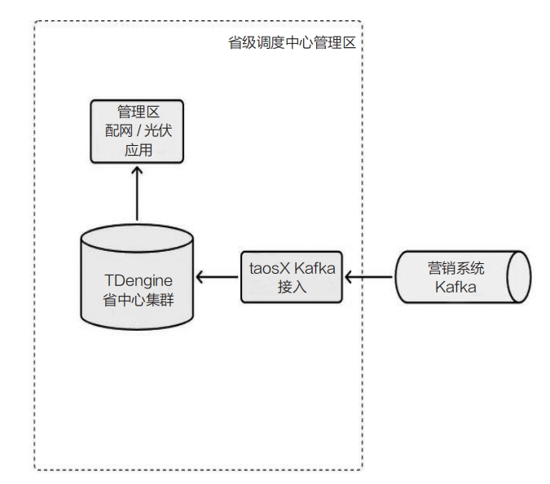
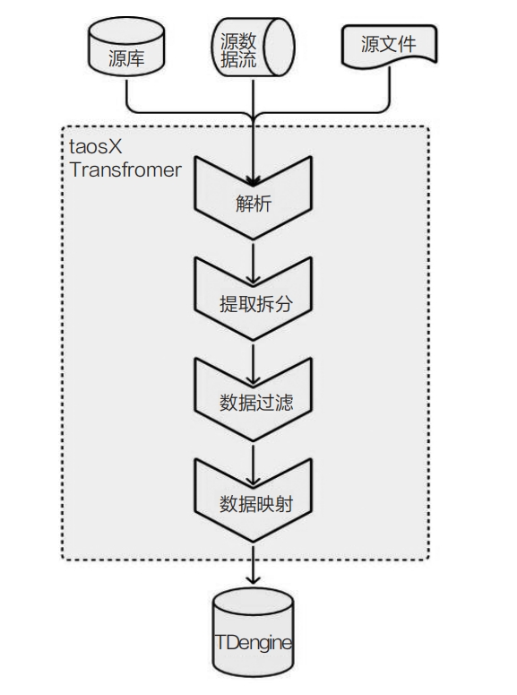
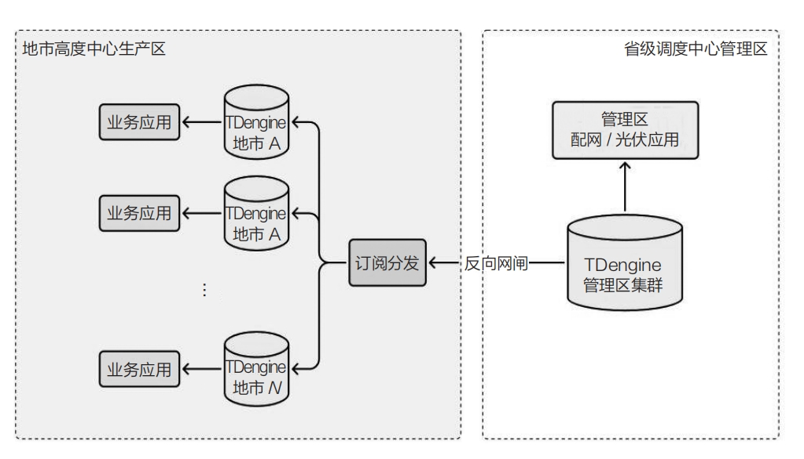

在当前可再生能源迅速发展的浪潮中，分布式光伏和可再生能源的装机容量已经达到相当可观的规模。尽管新能源的发展得到政策的鼎力扶持，但其并网后对电网的运行调度、供电可靠性以及系统的安全稳定带来诸多新挑战。

分布式光伏，即分布式光伏发电系统，是指将光伏电池板安装在城市的建筑物屋顶或墙壁上，甚至农田、山坡等非建筑用地上，利用采集到的太阳能为城市供电的一种绿色能源解决方案。其显著特点是电力产生地与用电地重合，可以直接向用户提供电力，或者通过配电变压器并入电网。这种能源系统不仅环保，而且高效，能有效降低长距离输电的损耗，减少能源使用成本。分布式光伏电站主要由光伏电池板、组串式逆变器、配电设备和监控系统4部分组成。光伏电池板负责将太阳能转换为直流电，组串式逆变器进一步将直流电转换为交流电，供用户使用或并入电网。电力公司普遍采用HPLC （High-speed Power Line Communication，高速电力线通信）方案对分布式光伏接入的电能表进行数据采集，以实现1分钟、15分钟级别的运行数据采集能力。

储能系统以其独特的能力，能够平滑新能源输出的不稳定性，实现削峰填谷，从而有望显著降低微电网的运行成本。更为重要的是，从长远角度考虑，引入储能系统有助于减轻对主电网的依赖，进一步优化整体的能源结构。

新能源的波动性无疑加剧了电网供电的不确定性，这使得储能系统成为确保电网稳定性和可靠性的关键。针对这方面，《2030年前碳达峰行动方案》明确强调了储能系统的重要性，并支持分布式新能源与储能系统的融合发展，旨在加速储能技术的示范应用和推广普及。

## 新能源面临的挑战

分布式光伏在绿色环保的电力生产方面做出了显著贡献，然而其并入电网后，对电网调度提出了新的挑战。这些挑战包括如何高效地将运行数据接入电网调度中心、如何迅速将数据分发至各个地区、如何进行有效的数据分析等。随着分布式光伏的大规模推广，电网运营商必须妥善解决这些问题，以确保电网的稳定性和安全性得以维持。

储能系统的核心组件是电芯，对其实时工作参数（如电流、电压、温度、内阻）的监控对于保障储能系统的安全和可靠运行至关重要。如何有效地存储和分析这些海量的测点和数据，已成为储能领域不得不正视的技术难题。这些难题主要体现在如下几个方面。
- 测点量大：分布式光伏组件众多，大型储能系统中电芯数量庞大，需要监测的测点数从数十万到数千万不等。加之较高的采集频率，每天产生的海量监测数据需要进行长期持久化存储。
- 数据接入难：电网调度中心须实时监控分布式光伏电站和储能系统的运行状况，但由于分布式光伏电站目前主要通过配网侧接入电网，数据接入过程面临挑战。
另外，由于营销系统与调度中心的信息化水平存在差异，数据接入过程中存在客观难题：数据提取规则复杂，测点数量庞大，传统的数据采集方案资源消耗大。
- 数据分发难：分布式光伏电站的运行数据一旦接入省级调度中心，就需要迅速分发至各地市的生产区以驱动后续业务。如何实现快速且高效的数据分发，是客户
需要解决的一个棘手问题。
- 聚合分析难：分布式光伏电站的运行数据须根据电站在电网拓扑中的具体隶属关系（如电站隶属于某台配电变压器、馈线、主网变压器）进行多维度的聚合分析。现有技术方案在提供高效聚合分析手段方面存在不足，如性能低下、耗时过长等问题尤为突出。

## TDengine在新能源中的核心价值

在新能源领域，特别是分布式光伏电站和储能系统的复杂任务与数据处理需求面前，TDengine的时序数据库技术扮演了不可或缺的角色。TDengine的核心优势体现在以下几个方面。

- 支持海量测点：TDengine能够支持高达10亿个时间线，充分满足分布式光伏电站和储能系统的数据处理需求。
- 高性能：面对千万级测点的分钟级数据采集场景，调度业务对时序数据库的写入性能和低延迟有着严苛的要求。TDengine凭借“一个数据采集点一张表”的创新设计理念，实现了卓越的写入性能，完全契合业务需求。
- 最新状态数据快速查询：在千万级测点数据写入后，调度业务需要时序数据库能够迅速查询各设备的最新状态数据，以驱动后续业务逻辑。TDengine通过超级表和内置的高速读缓存设计，使用户能够高效查询光伏设备和储能电芯的最新运行数据，使运维人员能够实时获取并监控设备状态，从而提高运维效率。
- 数据订阅与分发：针对需要实时数据分发的业务场景，TDengine内置的消息队列功能从机制上解决了大量数据即时分发的难题，简化了整个系统架构的复
杂性。
- 开放的生态：TDengine易于与其他系统集成，兼容多种大数据框架，支持数据的整合与分析，为开发者提供了一个灵活的生态平台。

## TDengine 在新能源中的应用

### 营销侧分布式光伏电站运行数据接入

分布式光伏电站的运行数据通常须从外部营销系统接入，而该营销系统所提供的数据接口采用的是Kafka，如下图所示：



针对外部数据源的接入场景，TDengine Enterprise提供了专业的taosX数据接入组件。用户无须编写任何代码，只须通过配置参数即可迅速接入营销侧Kafka消息队列中的分布式光伏电站采集数据，实现提取解析、过滤、数据映射等操作，并将处理后的数据写入TDengine。这种方法不再依赖第三方ETL工具，如下图所示：



taosX是一个高度灵活的数据接入工具，能够适应多样化的数据源格式。它配备了全面的过滤选项和丰富的数据映射功能，这些特性大幅缩短了从外部系统收集并整合数据的开发周期。在维持低资源消耗的同时，taosX保证了高效的数据接入能力。

与市面上常见的开源ETL工具相比，taosX在接入Kafka数据时能够显著减少服务器CPU资源的占用。这不仅意味着企业能够在更短的时间内完成数据接入任务，还能有效降低硬件成本，为企业的发展提供强有力的支持。

### 数据即时分发至各地市

针对汇总至省级调度中心的分布式光伏电站运行数据，用户须将这些数据及时分发至各地市的调度中心，以便推动下游业务的顺利进行。

利用TDengine内置的结构化消息队列功能，用户可以迅速构建数据分发子系统。通过订阅省级调度中心TDengine集群中的分布式光伏电站瞬时功率数据，并根据各地市进行分类，实时将数据分发至对应地市的TDengine。各地市调度中心根据收到的数据，进一步驱动后续业务，如本地电网负载调控等。分布式光伏电站运行数据的分发架构如下图所示：



### 分类聚合计算瞬时发电功率

分布式光伏电站通过配电变压器并入配电网，并逐级向上汇聚至配网的10kV线端和110kV主网变压器。各级配电变压器、10kV线端、馈线以及110kV主网变压器所汇集的分布式光伏电站瞬时发电功率，对电网的安全稳定运行具有决定性的影响。

在一个省份中，分布式光伏电站和配电变压器的数量庞大，可达百万级别。每个分布式光伏电站和配电变压器通常设有8至10个测点，涵盖三相电流电压、功率、功率因数、示值等指标，总测点数往往超过千万个。在这种大规模的测点环境下，实现快速聚合计算成为一个关键挑战。

TDengine的标签设计允许用户从超级表中迅速分类和检索数据，这一点对于基于分布式光伏电站产生的大量时序数据进行快速聚合计算尤为重要。在TDengine中，通常会分别为分布式光伏电站发电功率和配电变压器的瞬时功率创建超级表，每个分布式光伏电站和配电变压器分别对应一张子表。通过TDengine的静态标签，可以存储分布式光伏电站发电功率的相关分类信息，如地区、所属配电变压器、所属馈线、所属10kV单端线端、所属110kV主网变压器等。

用户可根据多样化的标签，如地区、所属配电变压器、所属馈线、所属主网变压器等，对分布式光伏电站执行指定条件的聚合查询，实现快速求解。例如，用户可以迅速查询特定地区内所有配电变压器的下辖分布式光伏电站瞬时发电功率，或根据业务需求，针对不同级别的电网变电站（220kV、110kV、35kV、10kV）进行下辖分布式光伏电站瞬时功率的条件聚合查询。这为电网调度和设备故障判断提供了高效的数据支持手段。此类条件聚合查询的结果集可能包含数百至数十万条记录。

在TDengine中，用户可以基于标签进行聚合分析，无须编写代码进行表关联和数据处理，仅须通过SQL查询超级表即可直接获得结果，性能表现卓越，通常能在几秒内返回查询结果。示例SQL如下。
```sql
select sum(val) from dpv_power_1m where ts > now-1m group by dtr;
```

借助TDengine的高效聚合特性，用户可以高效、及时地获得分布式光伏电站实时运行状态，为运行决策提供可靠的数据支持。

### 实时数据监测

在某储能项目中，TDengine被应用于实时监控电池的充放电过程，以保障电池的安全运行。所有电芯的充放电数据都被精确记录，得益于TDengine的强大分析能力，用户显著提高了数据处理和分析的效率。

### 智慧运维系统

在某储能智慧运维系统中，用户原有的解决方案受到站端系统在内存、CPU以及读写性能等硬件资源上的限制，这导致项目进度一再推迟。TDengine凭借卓越的架构设计和工程实现，以较低的资源消耗完美满足了项目需求，解决了客户的痛点问题，并迅速支持业务系统的顺利部署。

TDengine的加入为储能设备注入了信息感知、控制协调以及远程运维的能力，确保了电站和设备运行的安全性与可靠性。