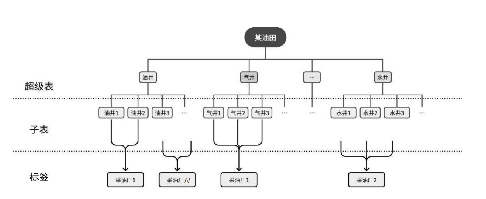
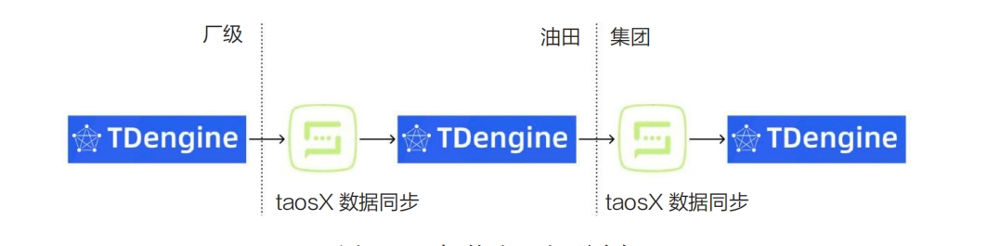

智慧油田，亦称为数字油田或智能油田，是一种采用尖端信息技术与先进装备的现代油田开发模式。该模式通过实时更新油气田层析图及动态生产数据，显著提高了油气田的开发效率与经济价值。

信息技术在此领域发挥着至关重要的作用，涵盖了数据采集、传输、分析以及处理等多个环节。借助这些技术，客户能够随时随地访问到最新、最准确的油田信息。在硬件设施方面，广泛部署的传感器和控制设备为油田生产的自动化与智能化提供了坚实的技术支撑。

智慧油田的核心特征体现在以下几个方面。
- 数据驱动：在智慧油田的管理中，决策的核心依据是源自现场的实际数据，而非传统依赖的人为经验和直觉。这种基于数据的决策方式显著提升了决策的精准度与可信度。
- 实时监控：得益于实时的数据采集与高效传输，客户能够全天候掌握油田的运营状况。这有助于迅速发现问题并采取措施，有效预防潜在损失，从而节省大量成本和资源。
- 智慧决策：将大数据分析技术融入决策流程，使得客户能够更深层次地理解油田的运作机制，并进行准确预测。基于这些数据和洞察，客户能够制定出更为科学合理的决策方案。
- 自动化操作：借助先进的自动化设备，客户可以将许多重复性高、劳动强度大乃至存在安全风险的任务交由机器执行。这不仅大幅提高了工作效率，降低了运营成本，还有效减少了意外事故的发生概率，保障了员工的安全和企业的稳定运营。

## 智慧油田面临的挑战

智慧油田的建设之旅是一场既复杂又漫长的征途，它横跨勘探、开发、生产等多个关键环节。随着技术的不断进步和业务的日益拓展，油田运营面临着效率提高、成本控制以及数据安全方面的全新挑战。

面对油田业务产生的庞大数据集，这些数据涵盖了钻井、录井、测井及生产开发等多个方面，油田信息化系统必须具备卓越的数据处理能力。这不仅要求系统能够确保运营的顺畅进行，还须借助先进的数据压缩技术，有效节约存储空间，进而降低硬件投资成本。

智慧油田系统还应设计为能够基于业务需求进行灵活扩展。系统须能够随着业务增长和数据量的上升，无缝地整合新的存储和计算资源，确保服务的连续性和性能的稳定性。此外，系统的用户友好性同样不容忽视，通过简洁直观的操作界面和标准化操作流程，减少员工的学习曲线，从而提高整体工作效率。

对于高价值的油田数据，安全保障措施至关重要。这包括实施持续的数据备份、监控系统健康状况、制订故障恢复计划，以及强化数据的加密和访问管理措施，以充分保障油田数据的安全性和可靠性。

为了满足智慧油田项目在数据处理、系统扩展性、用户体验以及数据安全等方面的需求，我们必须采取全面而审慎的态度。选择合适的大规模时序数据管理解决方案，例如TDengine，将为油田行业提供坚实的科技支撑，推动其向更高水平发展。

## TDengine在智慧油田中的应用

在一项致力于提升大型油田生产管理水平的技术方案中，客户设定了实现多个关键领域技术集成的目标。这些领域包括但不限于如下这些
- 自动化采集与控制：在生产现场构建先进的自动化系统，以实现数据的实时采集和精确控制，提升生产过程的自动化水平。
- 生产视频系统：整合高效的视频监控系统，对生产过程进行全面监控，确保作业安全，并为管理层提供实时、直观的决策支持。
- 工业物联网：运用物联网技术，将各种传感器和设备无缝连接，实现数据的远程采集与分析，提高油田运营的透明度和智能化程度。
- 生产数据服务：构建强大的数据服务平台，提供及时、准确的数据支持，为生产决策和运营优化提供有力工具。
- 智能化生产管控应用：研发智能化的生产管控应用，利用大数据分析和人工智能技术，提高生产效率，优化资源配置，加强生产管理。
- 信息化采集标准建设：制定统一的信息化采集标准和规范，确保数据的一致性、准确性和可管理性，为油田的数字化和智能化转型奠定坚实基础。

以往的技术解决方案中，客户普遍采用常规的实时数据库来搜集现场数据。然而，这些传统软件在数据分析功能上显得力不从心。鉴于此，用户不得不将数据迁移到以Oracle为代表的关系型数据库中，以期利用这些数据库作为数据汇聚与分析的核心平台。

但随着油田数据量的激增，客户遭遇了两大核心挑战：一是数据采集量的快速增长，二是数据采集频率的显著提高。在这种背景下，传统关系型数据库在数据处理上开始显现出一系列问题和瓶颈。

- 随着数据库中存储的数据量不断攀升，无论是数据写入还是查询操作的效率都遭受严重影响，尤其是在执行复杂查询和大数据集聚合操作时，性能下滑尤为显著。
- 数据压缩效率低下，导致数据库占用了巨量的存储空间，这不仅造成了资源的浪费，也给数据管理和维护带来了额外的负担。
- 当面临多用户或应用程序并发访问时，数据库常常会遇到并发控制和锁的竞争问题，这不仅影响系统性能，还可能引发数据一致性问题。
- 数据的分区和归档操作变得异常复杂，一旦系统出现故障，恢复数据所需的时间极为漫长，这对业务连续性构成了严重威胁。
- 数据协同效率低下，难以实现秒级的数据同步，这对于需要快速响应的业务场景来说是一个巨大的限制。

在这样的项目背景下，TDengine凭借作为时序数据库的独特优势，展现出强大的竞争力。TDengine以高效的数据处理速度、卓越的数据压缩率、直观的系统易用性以及出色的可扩展性，有效地支持了智慧油田项目在数据管理和分析方面的需求。此外，TDengine还覆盖了数据生命周期的全管理流程，并积极应对日益严峻的数据安全挑战，确保了大型项目在技术上的顺利优化和升级。

TDengine的“一个数据采集点一张表”与“超级表”的创新设计理念，极大地提高了时序数据的写入、查询和存储效率。如下图所示，当客户采用TDengine后，他们可以根据不同专业领域的多样化数据需求，创建相应的超级表。以油井为例，客户首先须细致梳理业务所需的数据项及其采集频率，随后为每一口油井建立一张独立的表，并为这些表附加相应的静态标签，如采油厂名称、所属业务部门等。这样的设计不仅确保了数据的精细化管理和高效检索，还极大地简化了数据的组织和维护工作。



在将Oracle全面迁移至TDengine之后，该项目的优化效果显著，具体体现在以下几个方面。
- 数据写入性能显著提升，同时硬件资源消耗得以降低，实现了更高的资源利用率。
- 集群支持在线水平扩展，使得未来面对扩容需求时能够轻松应对，保证了系统的可扩展性和前瞻性。
- 灵活定义数据的生命周期，简化了过期数据的管理流程，提高了数据管理的效率和便捷性。
- 达到每秒500万测点的同步速率，这一性能指标满足了用户在边云协同场景下的高实时性需求，为数据的高效流动和利用提供了有力保障。

如果说前3点是TDengine固有特性的体现，那么第4点无疑是其核心价值所在。为了满足人工智能研究、数据挖掘、设备预测性维护等多方面的数据需求，客户经常需要将各个厂级的油田实时数据集中汇聚至公司层面，然后再进一步将公司数据整合至集团或相应的业务板块。如下图所示，这一过程对数据的实时性和同步性提出了极高要求，TDengine的出色表现确保了这一关键环节的顺畅运行。



在传统业务模式中，由于需要定义众多复杂的数据接口，导致业务开发效率低下，且数据传输频率受限，难以满足对原始数据和原始频率进行同步的需求。在这一关键节点上，客户可以充分利用TDengine的边云协同功能，实现数据的实时高效同步。

边云协同允许将多个分散在不同地点的TDengine服务中的全量历史数据以及新产生的数据实时同步至云端TDengine。作为TDengine套件的重要组成部分，taosX工具简化了这一过程。用户只须在数据接收端部署taosX，并通过一行简单的命令，即可轻松实现实时数据同步、历史数据迁移，或是两者的混合处理方案。例如，同步某台服务器的db1 的历史数据以及实时数据到本地的db2数据库仅需要执行如下一条命令。
```shell
taosxrun-f'taos://192.168.1.101:6030/db1?mode=all'-t'taos://localhost:6030/db2'-v
```

此外，taosX提供了一种基于数据订阅的实时数据同步方法，它按照事件到达的顺序来处理数据。这种方法确保了无论是实时数据还是历史数据的写入，都能够实时同步到目标集群，并且不会遗漏任何补录的历史数据。

通过实施这一方案，多个TDengine服务得以通过taosX跨省份实时同步数据至云端总部集群。迄今为止，在该项目中，TDengine总部集群存储的数据量已达到36TB，总数据条目超过1034亿条，压缩率降至10%以内，这一成就令人瞩目。

边云协同功能的广泛采用充分验证了TDengine在处理大规模、高频工业数据方面的卓越实力。其灵活的架构设计和优化的存储机制不仅满足了工业物联网环境对实时数据处理的高要求，而且有效降低了存储成本。同时，TDengine的水平扩展性、实时分析支持、边缘计算集成以及强大的数据安全保护功能，为工业物联网的智能化发展奠定了坚实的技术基础。这不仅确保了数据处理的高效性和安全性，还简化了维护流程，相较于传统关系型数据库，展现了更高的成本效益。TDengine的这些优势为工业物联网的持续进步和发展提供了强有力的支持和保障。

随着项目的深入推进，TDengine的数据抽稀功能，作为处理和管理时序数据的一种高效策略，在与Kudu为核心的数据中台相结合时，展现出非凡的能力。数据抽稀通过精心挑选具有代表性的数据点，有效减少了数据的存储量，同时确保了数据的关键特征和趋势得以完整保留。这种方法特别适合于那些需要长期保存数据但又不必要保留所有细节的应用场景。例如，在监控系统中，随着时间的积累，只须保存关键时间节点的数据，而不是每个瞬间的数据。

因此，TDengine成为构建数据中台的理想选择，尤其是对于那些需要高效处理大量时序数据的中台环境。通过将TDengine集成到数据中台中，企业能够进一步优化其数据存储、查询和管理流程，从而提高数据平台的功能性和效率。TDengine的这一特性不仅提高了数据处理的速度和效率，还为企业提供了更加灵活和经济的数据管理解决方案。