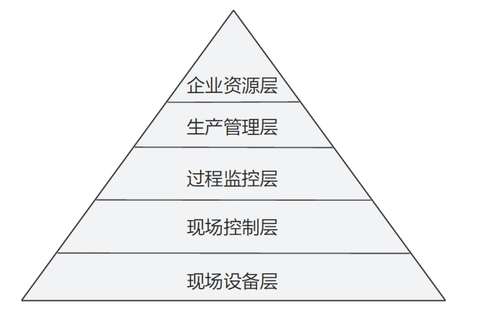
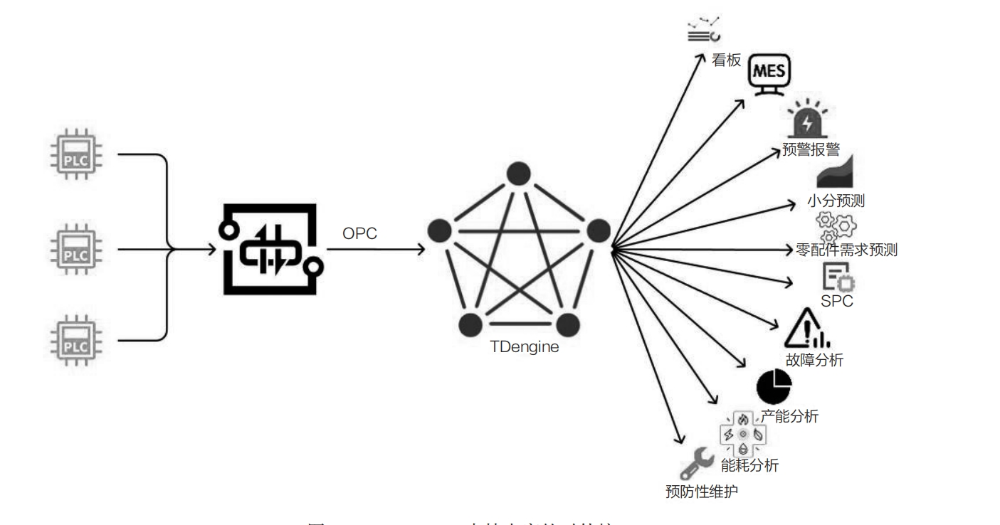
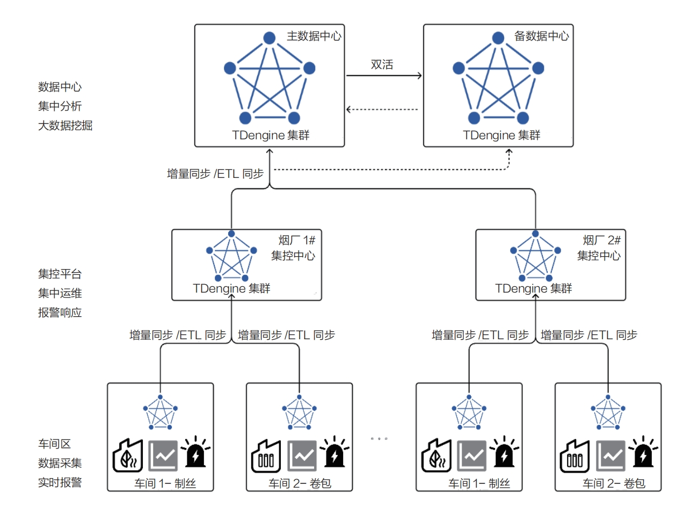

智能制造与数据库技术的深度融合，已成为现代工业技术进步的一个重要里程碑。随着信息技术的飞速发展，智能制造已经成为推动工业转型升级的关键动力。在这一进程中，数据库技术扮演着不可或缺的角色，它不仅承载着海量的生产数据，还为智能制造提供了强大的数据支持和服务。

特别是随着大数据、云计算等前沿技术的崛起，TDengine凭借灵活多变的数据模型和卓越的数据处理能力，在智能制造领域大放异彩。TDengine能够高效地管理和分析制造过程中的各类数据，从生产线的实时监控到产品质量的精细管理，再到供应链的优化协调，它都能提供精准可靠的数据支持。

## 智能制造面临的挑战

依照传统的IEC 62264-1层次模型，工业制造领域被划分为5个层级—现场设备层、现场控制层、过程监控层、生产管理层及企业资源层。这一模型清晰地描绘了从生产现场的实时操作到企业管理层面的战略规划，每一层级的跃迁都伴随着数据量的急剧增长和需求的变化，如下图所示。这种层级划分不仅反映了工业制造过程中信息流动的复杂性，也揭示了随着生产规模的扩大和自动程度的提高，对数据处理能力和效率的要求也在不断提升。

随着工业数字化的巨浪席卷而来，我们见证了数据采集量的爆炸式增长和分析需求的日益复杂化，随之而来的问题和挑战也愈发凸显。
- 海量设备数据采集：在过去的十余年里，制造业的数字化进程取得了显著进展。工厂的数据采集点从传统的数千个激增至数十万甚至数百万个。面对如此庞大的
数据采集需求，传统的实时数据库已显得力不从心。
- 动态扩容：随着数据的逐步接入，初期的硬件配置往往较为有限。随着业务量的增加和数据量的上升，硬件资源必须迅速扩展以满足业务的正常运行。然而，一旦系统上线运行，通常不允许进行停机扩容，这就要求系统在设计时就要考虑到未来的扩展性。
- 数据关联与多维分析：传统工业实时数据库通常只包含几个固定的字段，如变量名、变量值、质量戳和时间戳，缺乏信息间的关联性，这使得复杂的多维分析变
得难以执行。
- 截面查询与插值查询：为了满足报表和其他统计需求，系统需要支持历史截面查询以及按指定时间间隔进行的线性插值查询。
- 第三方系统数据库对接：除了设备数据以外，还须采集来自各个生产系统的数据，这些系统通常位于过程监控层或生产管理层。这就要求系统能够实时采集数据、迁移历史数据，并在网络断开时能够断线续传。除了API以外，常见的对接方式还包括数据库对接，例如，与LIMIS对接，采集其关系型数据库中存储的时序数据，或与第三方生产数据库（如AVEVA PI System或Wonderware系统）对接，获取实时、历史和报警数据。
- 与SCADA（Supervisory Control and Data Acquisition，监控控制与数据采集）系统对接：SCADA系统作为过程监控层的核心，汇集了站内和厂区的所有生产数据，并提供了直观易用的开发、运行和管理界面。然而，其自带的传统实时数据库在分析能力和高密度点位容量上存在限制，通常仅支持约1万个点位。因此，将SCADA系统与性能更优越的数据库相结合，充分发挥双方的优势，通过面向操作技术层的模块化组态开发，为工业控制系统注入新的活力，已成为工业数字化发展的重要方向。

## TDengine在智能制造中的核心价值

智能制造领域涵盖众多类型的数据设备、系统以及复杂的数据分析方法。TDengine 不仅巧妙解决了数据接入和存储的挑战，更通过强大的数据分析功能，为黄金批次、设备综合效率（Overall Equipment Effectiveness，OEE）、设备预防性维护、统计过程控制（Statistical Process Control，SPC）等关键分析系统提供了卓越的数据统计服务。这不仅显著提高了生产效率和产品品质，还有效降低了生产成本。

- 广泛兼容各种设备和系统：TDengine配备了可视化配置的采集器，能够轻松对接SQL Server、MySQL、Oracle、AVEVA PI System、AVEVA Historian、InfluxDB、OpenTSDB、ClickHouse等多种系统，支持实时数据采集、历史数据迁移以及断线续传等功能。通过与诸如Kepware或KingIOServer这样的强大第三方采集平台对接，TDengine能够应对各种工业互联网协议，实现海量生产设备数据的接入。
- 高效的集群管理：与传统实时数据库相比，TDengine采用了基于云原生技术的先进架构，能够轻松实现动态扩容。TDengine集群采用Raft强一致性协议，确保生产数据对外查询结果的一致性。集群的运维管理简便，内部自动完成数据分区和数据分片，实现了分布式、高可用性和负载均衡的集群环境。
- 设备物模型：TDengine秉承“一台设备一张表”的设计策略，构建了以设备对象为核心的变量关系模型，为相关分析提供了坚实的基础。
- 先进的时序分析：TDengine支持时序领域的截面查询、步进查询、线性插值查询等多种查询方式，并提供了窗口查询功能，使得设备状态时长统计、连续过载报警等时序分析变得简单易行。

## TDengine在智能制造中的应用

作为新一代时序大数据平台的杰出代表，TDengine针对工业场景中的种种挑战，凭借独特的设计理念和卓越的性能，为智能制造领域注入了强大的动力。接下来以某烟厂的实际应用案例为例进行阐述。

在该项目中，TDengine集群为工厂内的各类业务提供了坚实的时序数据服务。无论是看板展示还是预警系统等对实时数据要求极高的业务场景，TDengine都能够提供低延迟、高质量的数据响应。自系统上线以来，已稳定运行超过两年，成功存储超过2万亿条数据，且查询最新数据的延迟控制在毫秒级，完全达到项目立项的预期要求。该项目的亮点设计如下

- 高效采集：烟草项目初期规模有限，全厂测点数不足10万。数据采集网关将部分测点数据写入OPC（OLE for Process Control，用于过程控制的OLE）服务器，并通过OPC协议接入TDengine；另一部分测点数据则写入Kafka，进而接入TDengine。客户无须开发OPC或Kafka接口应用程序，即可实现数据的高效接入。对于采用关系型数据库如LIMIS的场景，TDengine通过可视化配置SQL Server采集器，实现了数据的同步更新、历史数据迁移、断线续传以及故障诊断等功能，无须编写代码，大幅降低了开发和运维成本。在其兄弟单位中，部分生产系统使用Wonderware数据库（现AVEVA Historian），TDengine通过建立AVEVA Historian采集器，同样实现了零代码可视化配置，轻松完成实时数据接入、历史数据迁移及断线续传等功能。相较于初次定制化开发长达3个月的交付周期，TDengine采集器的部署仅需要十几分钟，且具有更强的可靠性和灵活性。
- 动态扩容和负载再均衡：为应对未来业务的增长，TDengine支持在不停止服务的前提下进行动态的纵向和水平扩容。在单台计算机资源充足的场景下，TDengine 可通过拆分虚拟节点服务，充分利用计算机的额外CPU资源来提高数据库性能。而在资源不足的情况下，只须增加物理节点，TDengine集群便能根据需求进行自动负载均衡。
- 支持建立大宽表：TDengine的这一设计满足了数据关联和多维分析的需求，解决了传统工业实时数据库固定格式数据存储的限制。通过超级表的静态标签设计，
用户可以便捷地进行多维度数据分析。
- 支持丰富的对外接口：作为数据中心，TDengine可对接第三方可视化界面（如看板）、MES、预警报警、水分预测、零配件需求预测、SPC、故障分析、产能分析、能耗分析、预防性维护等系统，如下图所示：

- TDengine与SCADA系统的融合：生产调度中心常采用SCADA系统进行数据采集、监视和控制。SCADA系统通过TDengine的ODBC接口，将实时和历史数据、设备报警、操作记录、登录信息以及系统事件等数据存储到TDengine中。与SCADA系统自带的历史库相比，客户在查询曲线、报表等历史数据时耗时更短、响应更快、灵活性更强，这不仅降低了对SCADA系统的压力，还提高了整个系统的效率和稳定性。

此外，TDengine还支持云边系统部署，如下图所示：

在工厂侧部署TDengine，不仅为该烟厂提供数据存储、查询和分析服务，还能通过高效的数据同步工具，实现工厂数据实时同步至上一级或集团中心。TDengine的量化裁剪功能使其能够适应资源有限的计算机或边缘盒子环境，满足不同规模部署的需求。TDengine的同步特性如下。

- 统计意义的降采样同步：TDengine利用流计算技术，实现了具有统计意义的降采样数据同步。通过这种方式，可以在不损失数据精度的前提下，对数据进行降采样处理，确保即使在数据时间颗粒度增大的情况下，也能保持数据的准确性。流计算的使用方式简便，无须复杂配置，客户只须根据自己的需求编写SQL即可实现。
- 订阅式传输：TDengine采用了类似Kafka的消息订阅方式进行数据同步，相较于传统的周期性同步和普通订阅访问，这种方式实现了负载隔离和流量削峰，提高了同步的稳定性和效率。消息订阅机制遵循至少一次消费原则，确保在网络断线故障恢复后，能够从断点处继续消费数据，或者从头开始消费，以保证消费者能够接收到完整的生产数据。
- 操作行为同步：TDengine能够将操作行为同步到中心端，确保设备故障或人为对边缘侧数据的修改和删除操作能够实时反映到中心侧，维护了数据的一致性。
- 数据传输压缩：在数据传输过程中，TDengine实现了高达20%的数据压缩率，结合流计算的降采样同步，显著降低了同步过程对带宽的占用，提高了数据传输
效率。
- 多种同步方式：TDengine支持多对一、一对多以及多对多的数据同步模式，满足不同场景下的数据同步需求。
- 支持双活：数据中心侧可实现异地灾备。边缘侧的TDengine或第三方客户端能够根据集团中心侧的TDengine状态进行智能连接。若主TDengine集群发生故障，无法对外提供服务，异地备用的TDengine集群将立即激活，接管所有客户端的访问连接，包括写入和查询功能。一旦主TDengine集群恢复正常，备用集群会将历史缓存和实时数据同步回主集群，整个过程对客户端透明，无须人工干预。