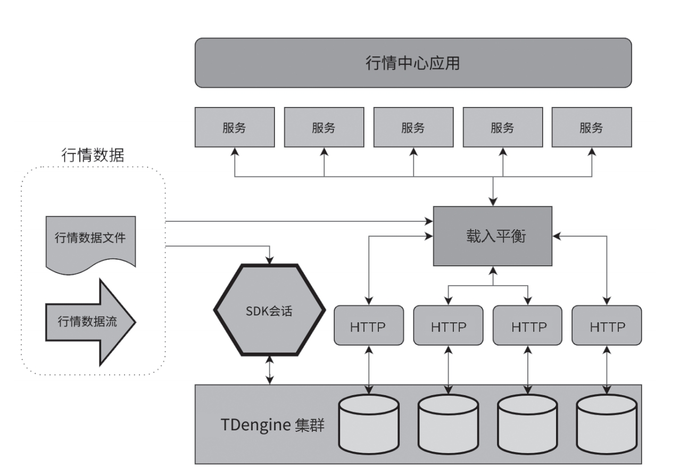

金融行业正处于数据处理能力革新的关键时期。随着市场数据量的爆炸式增长和复杂性的日益加深，金融机构面临着寻找能够高效处理大规模、高频次以及多样化时序数据的大数据处理系统的迫切需求。这一选择将成为金融机构提高数据处理效率、优化交易响应时间、提高客户满意度以及维持竞争优势的决定性因素。

在金融领域，行情数据的处理尤为复杂，不仅数据量大，而且具有标准化的数据格式、长期的存储需求以及高度分散的子表管理要求，这些特点共同构成了数据处理领域的一大难题。具体挑战如下。

- 数据量庞大：金融市场的数据量达到TB级别，这为数据的存储和管理带来巨大的挑战。金融机构需要确保有足够的能力来处理和存储这些数据，同时保证系统的稳定性和可扩展性。
- 标的数量众多：金融市场中资产和衍生品的种类繁多，这意味着行情中心需要管理数十万至数千万个不同的标的。这种多样性和数量级的增长要求系统必须具备高度的灵活性和高效的管理能力。
- 存储期限长：金融数据的敏感性要求这些数据必须被长期保存，通常存储期限为5至10年，有些关键数据甚至需要保存超过30年。这要求金融机构必须投资于可靠的存储解决方案，以确保长期数据的完整性和可访问性。

## 处理金融时序数据时面临的挑战

在时序数据处理领域，金融机构面临着一系列核心需求与挑战，这些需求与挑战不仅关系到日常运营的效率，还直接影响到决策的准确性和业务的创新能力。

- 高性能写入：金融机构需要的是一个能够实时处理巨量数据流的平台。随着交易活动的频繁和市场数据的不断更新，平台必须能够每秒处理数以亿计的数据点，
确保数据的即时性和完整性，以支持实时的交易决策和风险管理。
- 强大的读取及数据消费性能：金融市场的特点是业务场景多变，这要求平台必须具备高度的数据读取和计算能力。例如，量化投资策略的研发依赖于实时行情数据和衍生数据的深度分析。平台需要支持高效的数据查询和计算，以便量化分析师能够快速回测模型、优化策略，并进行实时学习和调整。
- 计算性能：资产和衍生品的监控对平台的计算性能提出了更高的要求。金融机构需要能够执行复杂的统计分析、风险预测和价格发现等计算任务，以监控市场动态和评估投资组合的风险。这要求平台不仅要有强大的计算能力，还要能够提供快速响应，以支持实时决策和快速反应市场变化。

## TDengine 在金融中的核心价值

TDengine，作为一个高性能、云原生的时序大数据平台，在金融行情数据处理领域表现卓越，为用户带来了显著的优势和收益。
- 高写入性能：TDengine 实现了惊人的写入速度，达到每秒 1 亿数据点，确保在数据高峰时段也能够保持稳定的写入性能，满足金融市场对实时数据处理的严苛要求。
- 高可用性：通过采用多副本技术和节点数据一致性机制，TDengine 提供了高可用性保障，确保在任何节点故障或网络异常情况下，数据都不会丢失，服务能够持
续不间断。
- 高查询性能：TDengine 的读取速度极快，单张子表的查询响应时间可在 1ms 内完成，满足金融分析师和交易系统对即时数据查询的迫切需求。
- 高压缩率：利用先进的二级压缩和浮点数压缩技术，TDengine 大幅降低存储空间的需求和成本，同时保持数据的完整性和准确性，为金融机构节省大量的存储资源。
- 赋能创新应用：在模型训练与验证的数据获取场景中，用户需要灵活选取任意时间段进行数据查询。TDengine 保持了全时间轴的无差异读取性能，极大地提高了数据的利用效能，加速了金融产品和服务的创新。
- 支持国产化：TDengine 适配并兼容国产 CPU 和操作系统，支持国产化替代，符合国内金融行业对于自主可控的技术发展趋势，增强了金融机构在技术选择上的灵活性和安全性。

## TDengine 在金融中的应用

### 量化交易 

随着科技的飞速发展，量化交易平台已经成为交易者在复杂金融市场中捕捉机遇、规避风险的重要工具。这些平台通过精确的市场分析和及时的响应机制，使交易者能够在瞬息万变的市场中把握投资机会，实现资产的稳定增值。在全球金融市场竞争日益激烈的背景下，基于行情数据的量化交易平台正逐渐成为投资者手中的一把利剑，为他们提供竞争优势。

特别是在金融科技取得突破性进展的今天，量化交易已成为资本市场中一股不可逆转的趋势。基于行情数据的量化交易平台，凭借其全面的应用模块和深入的数据应用能力，为金融市场提供了精准的分析和智能化的决策支持。这些平台不仅能够处理海量的市场数据，还能够运用先进的算法和模型，为交易者提供个性化的投资策略和风险管理方案。

在此背景下，TDengine作为一个专为时序数据设计的高性能数据库，其在量化交易平台中的应用，进一步提高了平台的性能和效率。TDengine的主要模块或功能如下。

1.  多路校验

TDengine 中的多路校验是一系列精心设计的特性，旨在确保金融行情数据的准确性和一致性，同时为风险管理提供坚实的数据支持。以下是这一功能的关键特性。
- 确保行情数据的真实性与一致性：在金融交易中，数据的准确性和一致性至关重要。多路校验通过比对来自不同渠道的数据，确保数据的真实性，防止因数据错误导致的误判和投资失误。
- 提供数据对比分析：多路校验允许用户对来自不同来源的数据进行深入对比分析，以检测潜在的数据偏差或错误。这种分析有助于及时发现并纠正数据问题，确保决策基于准确无误的信息。
- 减少异常数据导致的投资失误：金融市场中的异常数据可能会误导投资者，导致错误的交易决策。多路校验通过消除异常数据，提高了数据的质量和可靠性，从而降低因数据问题导致的投资风险。

2. 数据血缘

TDengine 中的数据血缘是一组强大的特性，它们共同确保了数据的可追溯性、透明度和可靠性，为金融行业的数据处理和风险管理提供了坚实的基础。以下是数据血缘的关键特性。
- 数据可追溯性：数据血缘允许用户追踪数据的起源和流转路径，确保每一条数据的来源都是清晰可辨的。这种可追溯性对于验证数据的准确性、审计数据变更历史以及追踪潜在的数据错误至关重要。
- 数据转换逻辑与依赖关系分析：借助 TDengine 的高效计算能力，用户可以对数据进行深度分析，揭示数据在转换过程中的逻辑链条和依赖关系。这有助于用户理解数据的生成过程，识别潜在的数据处理瓶颈，并优化数据处理流程。
- 提高数据处理的透明度和可靠性：通过在 TDengine 中存储数据，用户可以获得一个统一、可靠的数据视图。TDengine 的高性能和高可用性确保了数据处理的透明度和可靠性，使得客户在进行复杂的数据分析时能够信任所依赖的数据源。

3. 智能监控和分析

TDengine 中的智能监控和分析是一系列高级特性，它们共同构成了金融市场的实时监控和智能分析中心。以下是这些特性的介绍。
- 实时监控与预警：TDengine 结合聚合计算和流计算技术，能够对市场动态、行情波动、交易异常等关键指标进行实时监控。通过设定阈值，系统能够及时发现异常情况并触发警报，帮助交易者和风险管理者迅速响应市场变化。
- 智能分析与预测：利用 TDengine 的高速数据读取能力和先进的人工智能技术，系统可以对市场数据进行深度分析，预测市场走势，并提供潜在风险的及时警报。这种智能分析能力为投资决策提供了科学依据，提高了投资的前瞻性和预见性。
- 自动调整交易策略：TDengine 的函数、UDF 和流计算功能，结合其他计算框架，使得交易策略能够根据市场实时数据自动调整。这种自适应的策略调整机制优化了资产配置，提高了交易的灵活性和效率。
- 清晰的交易执行计划：通过对数据进行全面的计算分析，TDengine 能够输出清晰、明确的交易执行计划，为投资团队提供决策支持。这些计划结合了市场分析和风险评估，有助于团队制定出更加精准和有效的投资策略。

行情数据文件和实时数据流统一汇入TDengine集群后，客户可以通过HTTP接口轻松访问所有时序数据，构建各种金融服务应用。行情数据系统架构（见下图）不仅提供了数据的集中管理，还为开发者提供了开放的接口，使得构建复杂的数据分析工具和金融服务应用变得更加便捷和高效。通过这种架构，金融机构能够加快创新速度，提升服务质量，并在竞争激烈的金融市场中获得优势。

### 行情中心

行情中心在金融领域占据着举足轻重的地位，它构成了所有金融交易的基石，其性能的优劣直接影响着各类交易决策的正确与否。行情中心的主要职能涵盖数据采集、处理、持久化存储、分发以及展示，为证券投资、期货交易、量化投资、风险管理等下游业务提供至关重要的行情数据服务。其业务特点主要体现在以下几个方面。

- 实时性：行情中心必须实时处理股票市场的买卖信息和价格变动。对于投资者，能够即时获取最新的股票信息是做出快速而准确投资决策的关键。
- 海量数据：随着交易市场的日益扩大和交易速度的不断提高，行情中心需要处理和分析的数据量呈现出爆炸性增长，这对数据处理能力提出了更高的要求。
- 高并发：行情中心需要同时为众多应用提供高效的服务，必须具备强大的高并发处理能力。除了支持实时交易的核心业务以外，行情中心还须为量化回测、因子计算、风险管理等提供高效的时序数据服务。
- 稳定性：作为金融市场的心脏，行情中心的稳定运行至关重要。任何形式的停机或故障都可能导致不可估量的经济损失。系统的高稳定性和可靠性是不可或缺的。众多券商在经过全面评估后，纷纷选择 TDengine 作为构建行情中心的核心组件，并且已经稳定运行多年。这一选择充分验证了 TDengine 在以下几个关键方面的卓越价值。
- 实时性：TDengine 的高效写入能力能够处理大量的实时数据流，支持毫秒级甚至亚毫秒级的数据查询响应，完美契合行情中心对实时性的高标准要求。
- 高并发处理：TDengine 设计了卓越的并发处理机制，能够支持从千万到亿级别的QPS（Queries Per Second，每秒查询率）的时序数据读写操作，确保了各类业务对实时和历史行情数据的写入和查询需求得到满足。
- 海量数据处理能力：TDengine 的“一个数据采集点一张表”创新设计，结合先进的数据压缩技术和高效的存储格式，使得即使在存储超过 10 年历史数据的情况下，依然能够保持良好的读写性能，并且显著降低了存储空间的占用。
- 稳定性：TDengine 提供了服务的高可用性和数据的强一致性保障，即使在单个节点发生故障的情况下，也能确保系统连续稳定运行，满足了行情中心对系统稳定性的严格要求。

这些券商的选择不仅体现了TDengine在技术性能上的领先地位，也彰显了对TDengine在金融行业中可靠性和适用性的广泛认可。通过采用TDengine，券商能够进一步提升行情中心的服务质量，增强核心竞争力，并在激烈的市场竞争中占据有利地位。