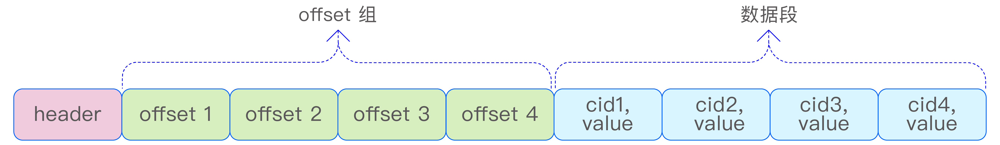
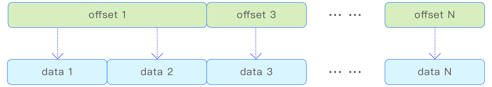
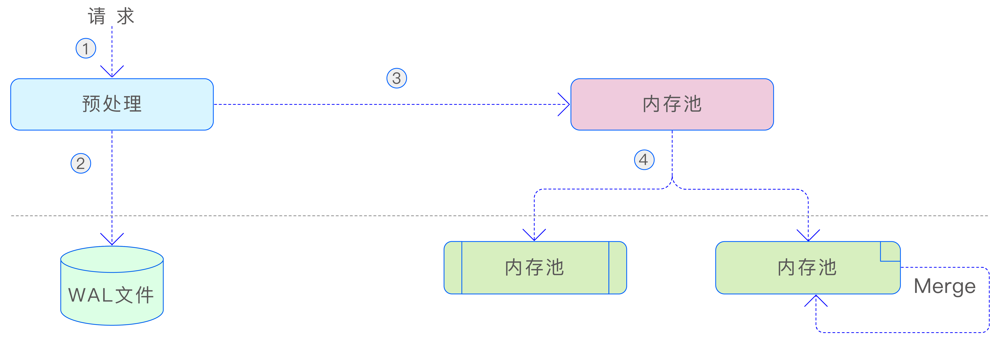
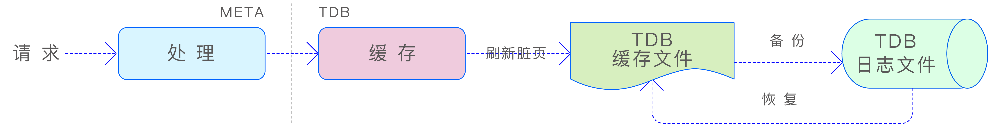
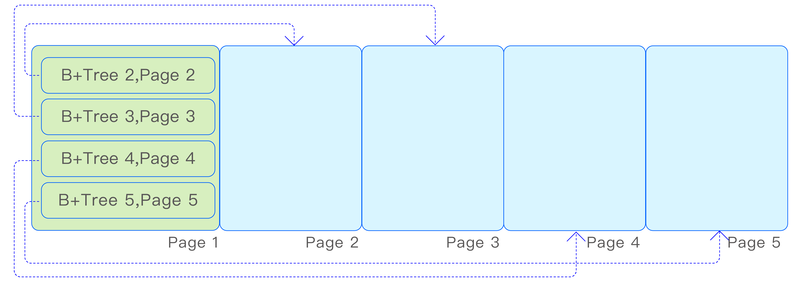
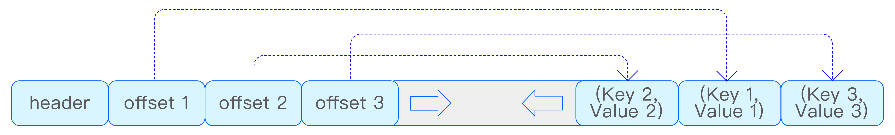
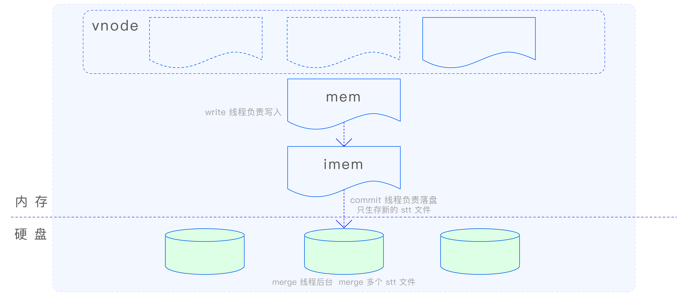
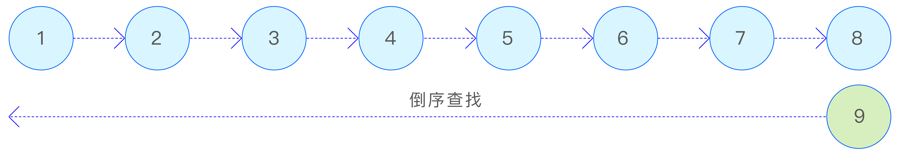
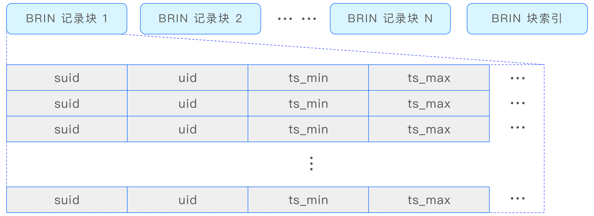

TDengine 的核心竞争力在于其卓越的写入和查询性能。相较于传统的通用型数据库，TDengine 在诞生之初便专注于深入挖掘时序数据场景的独特性。它充分利用了时序数据的时间有序性、连续性和高并发特点，自主研发了一套专为时序数据定制的写入及存储算法。

这套算法针对时序数据的特性进行了精心的预处理和压缩，不仅大幅提高了数据的写入速度，还显著降低了存储空间的占用。这种优化设计确保了在面对大量实时数据持续涌入的场景时，TDengine 仍能保持超高的吞吐能力和极快的响应速度。

## 行列格式

行列格式是 TDengine 中用来表示数据的最重要的数据结构之一。业内已经有许多开源的标准化的行列格式库，如 Apache Arrow 等。但 TDengine 面临的场景更加聚焦，且对于性能的要求也更高。因此，设计并实现自己的行列格式库有助于 TDengine 充分利用场景特点，实现高性能、低空间占用的行列格式数据结构。行列格式的需求有以下几点。
- 支持未指定值（NONE）与空值（NULL）的区分。
- 支持 NONE、NULL 以及有值共存的不同场景。
- 对于稀疏数据和稠密数据的高效处理。

### 行格式

TDengine 中的行格式有两种编码格式—Tuple 编码格式和 Key-Value 编码格式。具体采用哪种编码格式是由数据的特征决定的，以求最高效地处理不同数据特征的场景。

1. Tuple 编码格式

Tuple 编码格式主要用于非稀疏数据的场景，如所有列数据全部非 None 或少量 None 的场景。Tuple 编码的行直接根据表的 schema 提供的偏移量信息访问列数据，时间复杂度为O(1)，访问速度快。如下图所示：

2. Key-Value 编码格式

Key-Value 编码格式特别适合于稀疏数据的场景，即在表的 schema 中定义了大量列（例如数千列），但实际有值的列却非常少的情况。在这种情形下，如果采用传统的 Tuple 编码格式，会造成极大的空间浪费。相比之下，采用 Key-Value 编码格式可以显著减少行数据所占用的存储空间。如下图所示。

Key-Value 编码的行数据通过一个 offset 数组来索引各列的值，虽然这种方式的访问速度相对于直接访问列数据较慢，但它能显著减少存储空间的占用。在实际编码实现中，通过引入 flag 选项，进一步优化了空间占用。具体来说，当所有 offset 值均小于 256 时，Key-Value 编码行的 offset 数组采用 uint8_t 类型；若所有 offset 值均小于 65 536 时，则使用 uint16_t 类型；在其他情况下，则使用 uint32_t 类型。这样的设计使得空间利用率得到进一步提升。

### 列格式

在 TDengine 中，列格式的定长数据可以被视为数组，但由于存在 NONE、NULL和有值的并存情况，列格式中还需要一个 bitmap 来标识各个索引位置的值是 NONE、NULL 还是有值。而对于变长类型的数据，列格式则有所不同。除了数据数组以外，变长类型的数据列格式还包含一个 offset 数组，用于索引变长数据的起始位置。变长数据的长度可以通过两个相邻 offset 值之差来获得。这种设计使得数据的存储和访问更加高效，如下图所示：

## vnode 存储

### vnode 存储架构

vnode 是 TDengine 中数据存储、查询以及备份的基本单元。每个 vnode 中都存储了部分表的元数据信息以及属于这些表的全部时序数据。表在 vnode 上的分布是由一致性哈希决定的。每个 vnode 都可以被看作一个单机数据库。vnode 的存储可以分为如下 3 部分，如下图所示。
- WAL 文件的存储。
- 元数据的存储。
- 时序数据的存储。

当 vnode 收到写入数据请求时，首先会对请求进行预处理，以确保多副本上的数据保持一致。预处理的目的在于确保数据的安全性和一致性。在预处理完成后，数据会被写入到 WAL 文件中，以确保数据的持久性。接着，数据会被写入 vnode 的内存池中。当内存池的空间占用达到一定阈值时，后台线程会将写入的数据刷新到硬盘上（META 和TSDB），以便持久化。同时，标记内存中对应的 WAL 编号为已落盘。此外，TSDB 采用了 LSM（Log-Structured Merge-Tree，日志结构合并树）存储结构，这种结构在打开数据库的多表低频参数时，后台还会对 TSDB 的数据文件进行合并，以减少文件数量并提高查询性能。这种设计使得数据的存储和访问更加高效。

### 元数据的存储

vnode 中存储的元数据主要涉及表的元数据信息，包括超级表的名称、超级表的schema 定义、标签 schema 的定义、子表的名称、子表的标签信息以及标签的索引等。由于元数据的查询操作远多于写入操作，因此 TDengine 采用 B+Tree 作为元数据的存储结构。B+Tree 以其高效的查询性能和稳定的插入、删除操作，非常适合于处理这类读多
写少的场景，确保了元数据管理的效率和稳定性。元数据的写入过程如下图所示：

当 META 模块接收到元数据写入请求时，它会生成多个 Key-Value 数据对，并将这些数据对存储在底层的 TDB 存储引擎中。TDB 是 TDengine 根据自身需求研发的 B+Tree存储引擎，它由 3 个主要部分组成——内置 Cache、TDB 存储主文件和 TDB 的日志文件。数据在写入 TDB 时，首先被写入内置 Cache，如果 Cache 内存不足，系统会向 vnode的内存池请求额外的内存分配。如果写入操作涉及已有数据页的更改，系统会在修改数据页之前，先将未更改的数据页写入 TDB 的日志文件，作为备份。这样做可以在断电或其他故障发生时，通过日志文件回滚到原始数据，确保数据更新的原子性和数据完整性。

由于 vnode 存储了各种元数据信息，并且元数据的查询需求多样化，vnode 内部会创建多个 B+Tree，用于存储不同维度的索引信息。这些 B+Tree 都存储在一个共享的存储文件中，并通过一个根页编号为 1 的索引 B+Tree 来索引各个 B+Tree 的根页编号，如下图所示：

B+ Tree 的页结构如下图所示：

在 TDB 中，Key 和 Value 都具有变长的特性。为了处理超长 Key 或 Value 的情况，当它们超过文件页的大小时，TDB 采用了溢出页的设计来容纳超出部分的数据。此外，为了有效控制 B+Tree 的高度，TDB 限制了非溢出页中 Key 和 Value 的最大长度，确保B+Tree 的扇出度至少为 4。

### 时序数据的存储

时序数据在 vnode 中是通过 TSDB 引擎进行存储的。鉴于时序数据的海量特性及其持续的写入流量，若使用传统的 B+Tree 结构来存储，随着数据量的增长，树的高度会迅速增加，这将导致查询和写入性能的急剧下降，最终可能使引擎变得不可用。鉴于此，TDengine 选择了 LSM 存储结构来处理时序数据。LSM 通过日志结构的存储方式，优化了数据的写入性能，并通过后台合并操作来减少存储空间的占用和提高查询效率，从而确保了时序数据的存储和访问性能。TSDB 引擎的写入流程如下图所示：

在 MemTable 中，数据采用了 Red-Black Tree（红黑树）和 SkipList 相结合的索引方式。不同表的数据索引存储在 Red-Black Tree 中，而同一张表的数据索引则存储在SkipList 中。这种设计方式充分利用了时序数据的特点，提高了数据的存储和访问效率。

Red-Black Tree 是一种自平衡的二叉树，它通过对节点进行着色和旋转操作来保持树的平衡，从而确保了查询、插入和删除操作的时间复杂度为 O(log n)。在 MemTable 中，Red-Black Tree 用于存储不同表

SkipList 是一种基于有序链表的数据结构，它通过在链表的基础上添加多级索引来实现快速查找。SkipList 的查询、插入和删除操作的时间复杂度为 O(log n)，与 Red-Black Tree 相当。在 MemTable 中，SkipList 用于存储同一张表的数据索引，这样可以快速定位到特定时间范围内的数据，为时序数据的查询和写入提供高效支持。

通过将 Red-Black Tree 和 SkipList 相结合，TDengine 在 MemTable 中实现了一种高效的数据索引方式，既能够快速定位到不同表的数据，又能够快速定位到同一张表中特定时间范围内的数据。SkipList 索引如下图所示：

在 TSDB 引擎中，无论是在内存中还是数据文件中，数据都按照（ts, version）元组进行排序。为了更好地管理和组织这些按时间排序的数据，TSDB 引擎将数据文件按照时间范围切分为多个数据文件组。每个数据文件组覆盖一定时间范围的数据，这样可以确保数据的连续性和完整性，同时也便于对数据进行分片和分区操作。通过将数据按时间范围划分为多个文件组，TSDB 引擎可以更有效地管理和访问存储在硬盘上的数据。文件组如下图所示：

在查询数据时，根据查询数据的时间范围，可以快速计算文件组编号，从而快速定位所要查询的数据文件组。这种设计方式可以显著提高查询性能，因为它可以减少不必要的文件扫描和数据加载，直接定位到包含所需数据的文件组。接下来分别介绍数据文件组包含的文件：

#### head 文件
head 文件是时序数据存储文件（data 文件）的 BRIN（Block Range Index，块范围索引）文件，其中存储了每个数据块的时间范围、偏移量（offset）和长度等信息。

查询引擎根据 head 文件中的信息，可以高效地过滤要查询的数据块所包含的时间范围，并获取这些数据块的位置信息。

head 文件中存储了多个 BRIN 记录块及其索引。BRIN 记录块采用列存压缩的方式，这种方式可以大大减少空间占用，同时保持较高的查询性能。BRIN 索引结构如下图所示：

#### data 文件

data 文件是实际存储时序数据的文件。在 data 文件中，时序数据以数据块的形式进行存储，每个数据块包含了一定量数据的列式存储。根据数据类型和压缩配置，数据块采用了不同的压缩算法进行压缩，以减少存储空间的占用并提高数据传输的效率。

与 stt 文件不同，每个数据块在 data 文件中独立存储，代表了一张表在特定时间范围内的数据。这种设计方式使得数据的管理和查询更加灵活和高效。通过将数据按块存储，并结合列式存储和压缩技术，TSDB 引擎可以更有效地处理和访问时序数据，从而满足大数据量和高速查询的需求。

#### sma 文件

预计算文件，用于存储各个数据块中每列数据的预计算结果。这些预计算结果包括每列数据的总和（sum）、最小值（min）、最大值（max）等统计信息。通过预先计算并存储这些信息，查询引擎可以在执行某些查询时直接利用这些预计算结果，从而避免了读取原始数据的需要。

#### tomb 文件

用于存储删除记录的文件。存储记录为（suid, uid, start_timestamp, end_timestamp, version）元组。

#### stt 文件

在少表高频的场景下，系统仅维护一个 stt 文件。该文件专门用于存储每次数据落盘后剩余的碎片数据。这样，在下一次数据落盘时，这些碎片数据可以与内存中的新数据合并，形成较大的数据块，随后一并写入 data 文件中。这种机制有效地避免了数据文件的碎片化，确保了数据存储的连续性和高效性。

对于多表低频的场景，建议配置多个 stt 文件。这种场景下的核心思想是，尽管单张表每次落盘的数据量可能不大，但同一超级表下的所有子表累积的数据量却相当可观。通过合并这些数据，可以生成较大的数据块，从而减少数据块的碎片化。这不仅提升了数据的写入效率，还能显著提高查询性能，因为连续的数据存储更有利于快速的数据检索和访问。
