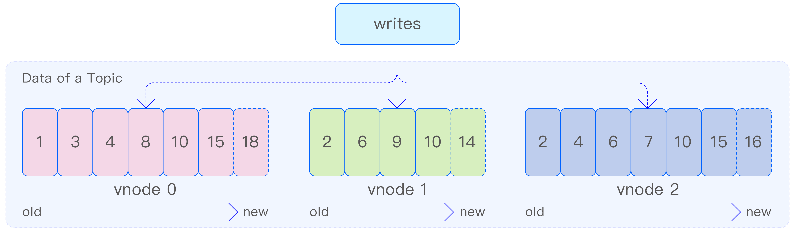
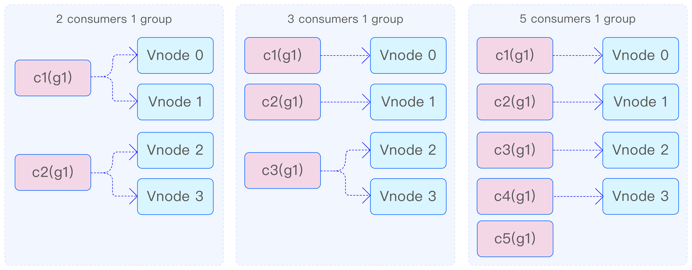
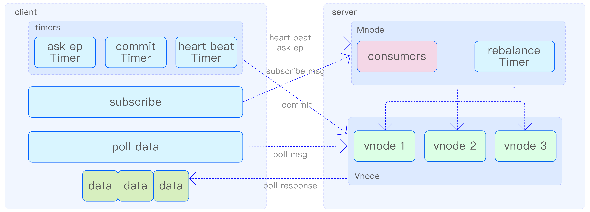
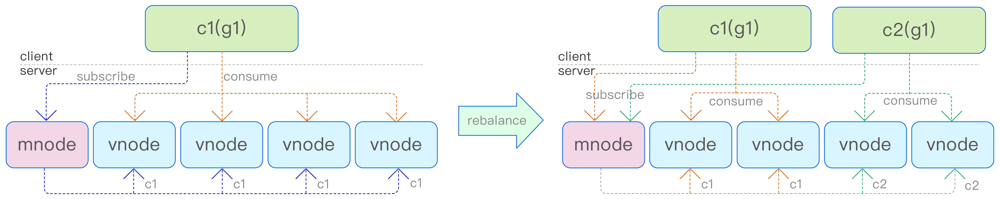
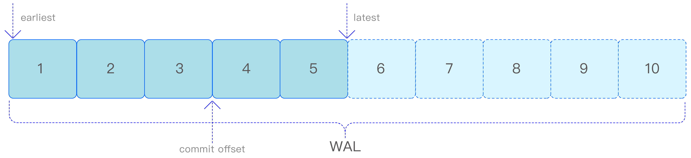

数据订阅作为 TDengine 的一个核心功能，为用户提供了灵活获取所需数据的能力。通过深入了解其内部原理，用户可以更加有效地利用这一功能，满足各种实时数据处理和监控需求。

## 基本概念

### 主题

与 Kafka 一样，使用 TDengine 数据订阅需要定义主题。TDengine 的主题可以是数据库、超级表，或者一个查询语句。数据库订阅和超级表订阅主要用于数据迁移，可以把整个库或超级表在另一个集群还原出来。查询语句订阅是 TDengine 数据订阅的一大亮点，它提供了更大的灵活性，因为数据过滤与预处理是由 TDengine 而不是应用程序完成的，所以这种方式可以有效地减少传输数据量与应用程序的复杂度。

如下图所示，每个主题涉及的数据表分布在多个 vnode（相当于 Kafka 的 partition）上，每个 vnode 的数据保存在 WAL 文件中，WAL 文件中的数据是顺序写入的。由于 WAL 文件中存储的不只有数据，还有元数据、写入消息等，因此数据的版本号不是连续的。

TDengine 会为 WAL 文件自动创建索引以支持快速随机访问。通过灵活可配置的文件切换与保留机制，用户可以按需指定 WAL 文件保留的时间以及大小。通过以上方式，WAL 被改造成一个保留事件到达顺序的、可持久化的存储引擎。

对于查询语句订阅，在消费时，TDengine 根据当前消费进度从 WAL 文件直接读取数据，并使用统一的查询引擎实现过滤、变换等操作，然后将数据推送给消费者。

### 生产者

生产者是与订阅主题相关联的数据表的数据写入应用程序。生产者可以通过多种方式产生数据，并将数据写入数据表所在的 vnode 的 WAL 文件中。这些方式包括 SQL、Stmt、Schemaless、CSV、流计算等。

### 消费者

消费者负责从主题中获取数据。在订阅主题之后，消费者可以消费分配给该消费者的 vnode 中的所有数据。为了实现高效、有序的数据获取，消费者采用了推拉（push 和poll）相结合的方式。

当 vnode 中存在大量未被消费的数据时，消费者会按照顺序向 vnode 发送推送请求，以便一次性拉取大量数据。同时，消费者会在本地记录每个 vnode 的消费位置，确保所有数据都能被顺序地推送。

当 vnode 中没有待消费的数据时，消费者将处于等待状态。一旦 vnode 中有新数据写入，系统会立即通过推送方式将数据推送给消费者，确保数据的实时性。

### 消费组

在创建消费者时，需要为其指定一个消费组。同一消费组内的消费者将共享消费进度，确保数据在消费者之间均匀分配。正如前面所述，一个主题的数据会被分布在多个vnode 中。为了提高消费速度和实现多线程、分布式地消费数据，可以在同一消费组中添加多个消费者。这些消费者首先会均分 vnode，然后分别对分配给自己的 vnode 进行消费。例如，假设数据分布在 4 个 vnode 上：
- 当有 2 个消费者时，每个消费者将消费 2 个 vnode；
- 当有 3 个消费者时，其中 2 个消费者各消费 1 个 vnode，而剩下的 1 个消费者将消费剩余的 2 个 vnode；
- 当有 5 个消费者时，其中 4 个消费者各分配 1 个 vnode，而剩下的 1 个消费者则不参与消费。

在一个消费组中新增一个消费者后，系统会通过再平衡（rebalance）机制自动完成消费者的重新分配。这一过程对用户来说是透明的，无须手动干预。再平衡机制能够确保数据在消费者之间重新分配，从而实现负载均衡。

此外，一个消费者可以订阅多个主题，以满足不同场景下的数据处理需求。TDengine 的数据订阅功能在面临宕机、重启等复杂环境时，依然能够保证至少一次消费，确保数据的完整性和可靠性。

### 消费进度

消费组在 vnode 中记录消费进度，以便在消费者重启或故障恢复时能够准确地恢复消费位置。消费者在消费数据的同时，可以提交消费进度，即 vnode 上 WAL 的版本号（对应于 Kafka 中的 offset）。消费进度的提交既可以通过手动方式进行，也可以通过参数设置实现周期性自动提交。

当消费者首次消费数据时，可以通过订阅参数来确定消费位置，也就是消费最新的数据还是最旧的数据。对于同一个主题及其任意一个消费组，每个 vnode 的消费进度都是唯一的。因此，当某个 vnode 的消费者提交消费进度并退出后，该消费组中的其他消费者将继续消费这个 vnode，并从之前消费者提交的进度开始继续消费。若之前的消费者未提交消费进度，新消费者将根据订阅参数设置值来确定起始消费位置。

值得注意的是，不同消费组中的消费者即使消费同一个主题，它们之间也不会共享消费进度。这种设计确保了各个消费组之间的独立性，使得它们可以独立地处理数据，而不会相互干扰。下图清晰地展示了这一过程。

## 数据订阅架构

数据订阅系统在逻辑上可划分为客户端和服务器两大核心模块。客户端承担消费者的创建任务，获取专属于这些消费者的 vnode 列表，并从服务器检索所需数据，同时维护必要的状态信息。而服务器则专注于管理主题和消费者的相关信息，处理来自客户端的订阅请求。它通过实施再平衡机制来动态分配消费节点，确保消费过程的连续性和数据的一致性，同时跟踪和管理消费进度。数据订阅架构如下图所示：

在客户端成功建立与服务器的连接之后，用户须首先指定消费组和主题，以创建相应的消费者实例。随后，客户端便会向服务器提交订阅请求。此刻，消费者的状态被标记为 rebalancing，表示正处于 rebalance 阶段。消费者随后会定期向服务器发送请求，以检索并获取待消费的 vnode 列表，直至服务器为其分配相应的 vnode。一旦分配完成，消费者的状态便更新为 ready，标志着订阅流程的成功完成。此刻，客户端便可正式启动向 vnode 发送消费数据请求的过程。

在消费数据的过程中，消费者会不断地向每个分配到的 vnode 发送请求，以尝试获取新的数据。一旦收到数据，消费者在完成消费后会继续向该 vnode 发送请求，以便持续消费。若在预设时间内未收到任何数据，消费者便会在 vnode 上注册一个消费 handle。这样一来，一旦 vnode 上有新数据产生，便会立即推送给消费者，从而确保数据消费的即时性，并有效减少消费者频繁主动拉取数据所导致的性能损耗。因此，可以看出，消费者从 vnode 获取数据的方式是一种拉取（pull）与推送（push）相结合的高效模式。

消费者在收到数据时，会同时收到数据的版本号，并将其记录为当前在每个 vnode上的消费进度。这一进度仅在消费者内部以内存形式存储，确保仅对该消费者有效。这种设计保证了消费者在每次启动时能够从上次的消费中断处继续，避免了数据的重复处理。然而，若消费者需要退出并希望在之后恢复上次的消费进度，就必须在退出前将消费进度提交至服务器，执行所谓的 commit 操作。这一操作会将消费进度在服务器进行持久化存储，支持自动提交或手动提交两种方式。

此外，为了维持消费者的活跃状态，客户端还实施了心跳保活机制。通过定期向服务器发送心跳信号，消费者能够向服务器证明自己仍然在线。若服务器在一定时间内未收到消费者的心跳，便会将其标记为 lost 状态，即认为消费者已离线。服务器依赖心跳机制来监控所有消费者的状态，进而有效地管理整个消费者群体。

mnode 主要负责处理订阅过程中的控制消息，包括创建和删除主题、订阅消息、查询 endpoint 消息以及心跳消息等。vnode 则专注于处理消费消息和 commit 消息。当 mnode 收到消费者的订阅消息时，如果该消费者尚未订阅过，其状态将被设置为 rebalancing。如果消费者已经订阅过，但订阅的主题发生变更，消费者的状态同样会被设置为 rebalancing。然后 mnode 会对 rebalancing 状态的消费者执行 rebalance 操作。心跳超过固定时间的消费者或主动关闭的消费者将被删除。

消费者会定期向 mnode 发送查询 endpoint 消息，以获取再平衡后的最新 vnode 分配结果。同时，消费者还会定期发送心跳消息，通知 mnode 自身处于活跃状态。此外，消费者的一些信息也会通过心跳消息上报至 mnode，用户可以查询 mnode 上的这些信息以监测各个消费者的状态。这种设计有助于实现对消费者的有效管理和监控。

## rebalance 过程

每个主题的数据可能分散在多个 vnode 上。服务器通过执行 rebalance 过程，将这些 vnode 合理地分配给各个消费者，确保数据的均匀分布和高效消费。

如下图所示，c1 表示消费者 1，c2 表示消费者 2，g1 表示消费组 1。起初 g1 中只有 c1 消费数据，c1 发送订阅信息到 mnode，mnode 把数据所在的所有 4 个vnode 分配给 c1。当 c2 增加到 g1 后，c2 将订阅信息发送给 mnode，mnode 检测到这个 g1 需要重新分配，就会启动 rebalance 过程，随后 c2 分得其中两个 vnode 消费。分配信息还会通过 mnode 发送给 vnode，同时 c1 和 c2 也会获取自己消费的 vnode 信息并开始消费。

再平衡计时器每 2s 检测一次是否需要再平衡。在再平衡过程中，如果消费者获取的状态是 not ready，则不能进行消费。只有再平衡正常结束后，消费者获取分配 vnode 的offset 后才可正常消费，否则消费者会重试指定次数后报错。

## 消费者状态处理

消费者的状态转换过程如下图所示。初始状态下，刚发起订阅的消费者处于 rebalancing 状态，表明消费者尚未准备好进行数据消费。一旦 mnode 检测到处于 rebalancing 状态的消费者，便会启动 rebalance 过程，成功后，消费者的状态将转变为 ready，表示消费者已准备就绪。随后，当消费者通过定时的查询 endpoint 消息获取自身的 ready 状态以及分配的 vnode 列表后，便能正式开始消费数据。

若消费者的心跳丢失时间超过 12s，经过 rebalance 过程，其状态将被更新为 clear，然后消费者将被系统删除。

当消费者主动退出时，会发送 unsubscribe 消息。该消息将清除消费者订阅的所有主题，并将消费者的状态设置为 rebalancing。随后，检测到处于 rebalancing 状态的消费者，便会启动 rebalance 过程，成功后，其状态将被更新为 clear，然后消费者将被系统删除。这一系列措施确保了消费者退出的有序性和系统的稳定性。

## 消费数据

时序数据都存储在 vnode 上，消费的本质就是从 vnode 上的 WAL 文件中读取数据。WAL 文件相当于一个消息队列，消费者通过记录 WAL 数据的版本号，实际上就是记录消费的进度。WAL 文件中的数据包含 data 数据和 meta 数据（如建表、改表操作），订阅根据主题的类型和参数获取相应的数据。如果订阅涉及带有过滤条件的查询，订阅逻辑会通过通用的查询引擎过滤不符合条件的数据。

如下图所示，vnode 可以通过设置参数自动提交消费进度，也可以在客户端确定处理数据后手动提交消费进度。如果消费进度被存储在 vnode 中，那么在相同消费组的不同消费者发生更换时，仍然会继续之前的进度消费。否则，根据配置参数，消费者可以选择消费最旧的数据或最新的数据。

earliest 参数表示消费者从 WAL 文件中最旧的数据开始消费，而 latest 参数表示从WAL 文件中最新的数据（即新写入的数据）开始消费。这两个参数仅在消费者首次消费数据时或者没有提交消费进度时生效。如果在消费过程中提交了消费进度，例如在消费到 WAL 文件中的第 3 条数据时提交一次进度（即 commit offset=3），那么下次在相同的 vnode 上，相同的消费组和主题的新消费者将从第 4 条数据开始消费。这种设计确保了消费者能够根据需求灵活地选择消费数据的起始位置，同时保持了消费进度的持久化和消费者之间的同步。