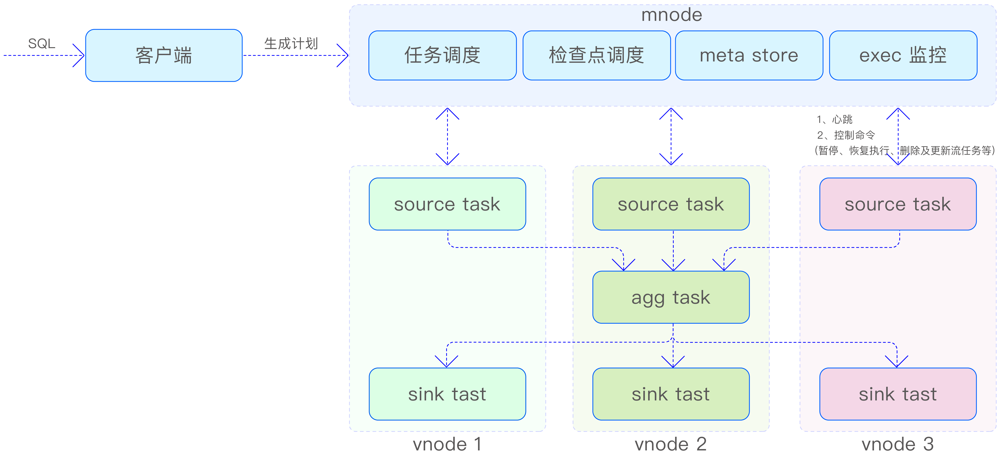
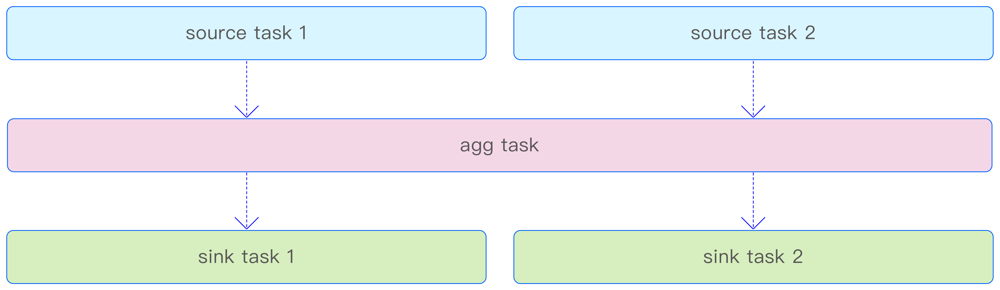

## 流计算架构

TDengine 流计算的架构如下图所示。当用户输入用于创建流的 SQL 后，首先，该 SQL 将在客户端进行解析，并生成流计算执行所需的逻辑执行计划及其相关属性信息。其次，客户端将这些信息发送至 mnode。mnode 利用来自数据源（超级）表所在数据库的 vgroups 信息，将逻辑执行计划动态转换为物理执行计划，并进一步生成流任务的有向无环图（Directed Acyclic Graph，DAG）。最后，mnode 启动分布式事务，将任务分发至每个 vgroup，从而启动整个流计算流程。

mnode 包含与流计算相关的如下 4 个逻辑模块。
- 任务调度，负责将逻辑执行计划转化为物理执行计划，并下发到每个 vnode。
- meta store，负责存储流计算任务的元数据信息以及流任务相应的 DAG 信息。
- 检查点调度，负责定期生成检查点（checkpoint）事务，并下发到各 source task（源
任务）。
- exec 监控，负责接收上报的心跳、更新 mnode 中各任务的执行状态，以及定期监控检查点执行状态和 DAG 变动信息。

此外，mnode 还承担着向流计算任务下发控制命令的重要角色，这些命令包括但不限于暂停、恢复执行、删除流任务及更新流任务的上下游信息等。

在每个 vnode 上，至少部署两个流任务：一个是 source task，它负责从 WAL（在必要时也会从 TSDB）中读取数据，以供后续任务处理，并将处理结果分发给下游任务；另一个是 sink task（写回任务），它的职责是将收到的数据写入所在的 vnode。为了确保数据流的稳定性和系统的可扩展性，每个 sink task 都配备了流量控制功能，以便根据实际情况调整数据写入速度。

## 基本概念

### 有状态的流计算

流计算引擎具备强大的标量函数计算能力，它处理的数据在时间序列上相互独立，无须保留计算的中间状态。这意味着，对于所有输入数据，引擎可以执行固定的变换操
作，如简单的数值加法，并直接输出结果。

同时，流计算引擎也支持对数据进行聚合计算，这类计算需要在执行过程中维护中间状态。以统计设备的日运行时间为例，由于统计周期可能跨越多天，应用程序必须持续追踪并更新当前的运行状态，直至统计周期结束，才能得出准确的结果。这正是有状态的流计算的一个典型应用场景，它要求引擎在执行过程中保持对中间状态的跟踪和管理，以确保最终结果的准确性。

### 预写日志

当数据写入 TDengine 时，首先会被存储在 WAL 文件中。每个 vnode 都拥有自己的 WAL 文件，并按照时序数据到达的顺序进行保存。由于 WAL 文件保留了数据到达的顺序，因此它成为流计算的重要数据来源。此外，WAL 文件具有自己的数据保留策略，通过数据库的参数进行控制，超过保留时长的数据将会被从 WAL 文件中清除。这种设计确保了数据的完整性和系统的可靠性，同时为流计算提供了稳定的数据来源。

### 事件驱动

事件在系统中指的是状态的变化或转换。在流计算架构中，触发流计算流程的事件是（超级）表数据的写入消息。在这一阶段，数据可能尚未完全写入 TSDB，而是在多个副本之间进行协商并最终达成一致。

流计算采用事件驱动的模式执行，其数据源并非直接来自 TSDB，而是 WAL。数据一旦写入 WAL 文件，就会被提取出来并加入待处理的队列中，等待流计算任务的进一步处理。这种数据写入后立即触发流计算引擎执行的方式，确保数据一旦到达就能得到及时处理，并能够在最短时间内将处理结果存储到目标表中。

### 时间

在流计算领域，时间是一个至关重要的概念。TDengine 的流计算中涉及 3 个关键的时间概念，分别是事件时间、写入时间和处理时间。
- 事件时间（Event Time）：这是时序数据中每条记录的主时间戳（也称为 Primary Timestamp），通常由生成数据的传感器或上报数据的网关提供，用以精确标记记录的生成时刻。事件时间是流计算结果更新和推送策略的决定性因素。
- 写入时间（Ingestion Time）：指的是记录被写入数据库的时刻。写入时间与事件时间通常是独立的，一般情况下，写入时间晚于或等于事件时间（除非出于特定目的，用户写入了未来时刻的数据）。
- 处理时间（Processing Time）：这是流计算引擎开始处理写入 WAL 文件中数据的时间点。对于那些设置了 max_delay 选项以控制流计算结果返回策略的场景，处理时间直接决定了结果返回的时间。值得注意的是，在 at_once 和 window_close 这两种计算触发模式下，数据一旦到达 WAL 文件，就会立即被写入 source task 的输入队列并开始计算。

这些时间概念的区分确保了流计算能够准确地处理时间序列数据，并根据不同时间点的特性采取相应的处理策略

### 时间窗口聚合

TDengine 的流计算功能允许根据记录的事件时间将数据划分到不同的时间窗口中。通过应用指定的聚合函数，计算出每个时间窗口内的聚合结果。当窗口中有新的记录到达时，系统会触发对应窗口的聚合结果更新，并根据预先设定的推送策略，将更新后的结果传递给下游流计算任务。

当聚合结果需要写入预设的超级表时，系统首先会根据分组规则生成相应的子表名称，然后将结果写入对应的子表中。值得一提的是，流计算中的时间窗口划分策略与批量查询中的窗口生成与划分策略保持一致，确保了数据处理的一致性和效率。

### 乱序处理

在网络传输和数据路由等复杂因素的影响下，写入数据库的数据可能无法维持事件时间的单调递增特性。这种现象，即在写入过程中出现的非单调递增数据，被称为乱序写入。

乱序写入是否会影响相应时间窗口的流计算结果，取决于创建流计算任务时设置的 watermark（水位线）参数以及是否忽略 ignore expired（过期数据）参数的配置。这两个参数共同作用于确定是丢弃这些乱序数据，还是将其纳入并增量更新所属时间窗口的计算结果。通过这种方式，系统能够在保持流计算结果准确性的同时，灵活处理乱序数据，确保数据的完整性和一致性。

## 流计算任务

每个激活的流计算实例都是由分布在不同 vnode 上的多个流任务组成的。这些流任务在整体架构上呈现出相似性，均包含一个全内存驻留的输入队列和输出队列，用于执行时序数据的执行器系统，以及用于存储本地状态的存储系统，如下图所示。这种设计确保了流计算任务的高性能和低延迟，同时提供了良好的可扩展性和容错性。

按照流任务承担任务的不同，可将其划分为 3 个类别—source task（源任务）、agg task（聚合任务）和 sink task（写回任务）。

### source task

流计算的数据处理始于本地 WAL 文件中的数据读取，这些数据随后在本地节点上进行局部计算。source task 遵循数据到达的自然顺序，依次扫描 WAL 文件，并从中筛选出符合特定要求的数据。随后，source task 对这些时序数据进行顺序处理。因此，流计算的数据源（超级）表无论分布在多少个 vnode 上，集群中都会相应地部署同等数量的源任务。这种分布式的处理方式确保了数据的并行处理和高效利用集群资源。

### agg task

source task 的下游任务是接收源任务聚合后的结果，并对这些结果进行进一步的汇总以生成最终输出。在集群中配置 snode 的情况下，agg task 会被优先安排在 snode 上执行，以利用其存储和处理能力。如果集群中没有 snode，mnode 则会随机选择一个vnode，在该 vnode 上调度执行 agg task。值得注意的是，agg task 并非在所有情况下都是必需的。对于那些不涉及窗口聚合的流计算场景（例如，仅包含标量运算的流计算，或者在数据库只有一个 vnode 时的聚合流计算），就不会出现 agg task。在这种情况下，流计算的拓扑结构将简化为仅包含两级流计算任务，即 source task 和直接输出结果的下游任务。

### sink task

sink task 承担着接收 agg task 或 source task 输出结果的重任，并将其妥善写入本地 vnode，以此完成数据的写回过程。与 source task 类似，每个结果（超级）表所分布的 vnode 都将配备一个专门的 sink task。用户可以通过配置参数来调节 sink task 的吞吐量，以满足不同的性能需求。

上述 3 类任务在流计算架构中各司其职，分布在不同的层级。显然，source task 的数量直接取决于 vnode 的数量，每个 source task 独立负责处理各自 vnode 中的数据，与其他 source task 互不干扰，不存在顺序性的约束。然而，值得指出的是，如果最终的流计算结果汇聚到一张表中，那么在该表所在的 vnode 上只会部署一个 sink task。这 3 种类型的任务之间的协作关系如下图所示，共同构成了流计算任务的完整执行流程。

## 流计算节点

snode 是一个专为流计算服务的独立 taosd 进程，它专门用于部署 agg task。snode 不仅具备本地状态管理能力，还内置了远程备份数据的功能。这使得 snode 能够收集并存储分散在各个 vgroup 中的检查点数据，并在需要时，将这些数据远程下载到重新启动流计算的节点上，从而确保流计算状态的一致性和数据的完整性。

## 状态与容错处理

### 检查点

在流计算过程中，系统采用分布式检查点机制来定期（默认为每 3min）保存计算过程中各个任务内部算子的状态。这些状态的快照即检查点（checkpoint）。生成检查点的操作仅与处理时间相关联，与事件时间无关。

在假定所有流任务均正常运行的前提下，mnode 会定期发起生成检查点的事务，并将这些事务分发至每个流的最顶层任务。负责处理这些事务的消息随后会进入数据处理队列。

TDengine 中的检查点生成方式与业界主流的流计算引擎保持一致，每次生成的检查点都包含完整的算子状态信息。对于每个任务，检查点数据仅在任务运行的节点上保留一份副本，与时序数据存储引擎的副本设置完全独立。值得注意的是，流任务的元数据信息也采用了多副本保存机制，并被纳入时序数据存储引擎的管理范畴。因此，在多副本集群上执行流计算任务时，其元数据信息也将实现多副本冗余。

为确保检查点数据的可靠性，TDengine 流计算引擎提供了远程备份检查点数据的功能，支持将检查点数据异步上传至远程存储系统。这样一来，即便本地保留的检查点数据受损，也能从远程存储系统下载相应数据，并在全新的节点上重启流计算，继续执行计算任务。这一措施进一步增强了流计算系统的容错能力和数据安全性。

### 状态存储后端

流任务中算子的计算状态信息以文件的方式持久化存储在本地硬盘中。

## 内存管理

每个非 sink task 都配备有相应的输入队列和输出队列，而 sink task 则只有输入队列，不设输出队列。这两种队列的数据容量上限均设定为 60MB，它们根据实际需求动态占用存储空间，当队列为空时，不会占用任何存储空间。此外，agg task 在内部保存计算状态时也会消耗一定的内存空间。这一内存占用可以通过设置参数 streamBufferSize 进行调整，该参数用于控制内存中窗口状态缓存的大小，默认值为 128MB。而参数 maxStreamBackendCache 用于限制后端存储在内存中的最大占用存储空间，默认同样为 128MB，用户可以根据需要将其调整为 16MB 至 1024MB 之间的任意值。

## 流量控制

流计算引擎在 sink task 中实现了流量控制机制，以优化数据写入性能并防止资源过度消耗。该机制主要通过以下两个指标来控制流量。
- 每秒写入操作调用次数：sink task 负责将处理结果写入其所属的 vnode。该指标的上限被固定为每秒 50 次，以确保写入操作的稳定性和系统资源的合理分配。
- 每秒写入数据吞吐量：通过配置参数 streamSinkDataRate，用户可以控制每秒写入的数据量，该参数的可调范围是 0.1MB/s 至 5MB/s，默认值为 2MB/s。这意味着对于单个 vnode，每个 sink task 每秒最多可以写入 2MB 的数据。

sink task 的流量控制机制不仅能够防止在多副本场景下因高频率写入导致的同步协商缓冲区溢出，还能避免写入队列中数据堆积过多而消耗大量内存空间。这样做可以有效减少输入队列的内存占用。得益于整体计算框架中应用的反压机制，sink task 能够将流量控制的效果直接反馈给最上层的任务，从而降低流计算任务对设备计算资源的占用，避免过度消耗资源，确保系统整体的稳定性和效率。

## 反压机制

TDengine 的流计算框架部署在多个计算节点上，为了协调这些节点上的任务执行进度并防止上游任务的数据持续涌入导致下游任务过载，系统在任务内部以及上下游任务之间均实施了反压机制。

在任务内部，反压机制通过监控输出队列的满载情况来实现。一旦任务的输出队列达到存储上限，当前计算任务便会进入等待状态，暂停处理新数据，直至输出队列有足够空间容纳新的计算结果，然后恢复数据处理流程。

而在上下游任务之间，反压机制则是通过消息传递来触发的。当下游任务的输入队列达到存储上限时（即流入下游的数据量持续超过下游任务的最大处理能力），上游任务将接收到下游任务发出的输入队列满载信号。此时，上游任务将适时暂停其计算处理，直到下游任务处理完毕并允许数据继续分发，上游任务才会重新开始计算。这种机制有效地平衡了任务间的数据流动，确保整个流计算系统的稳定性和高效性。