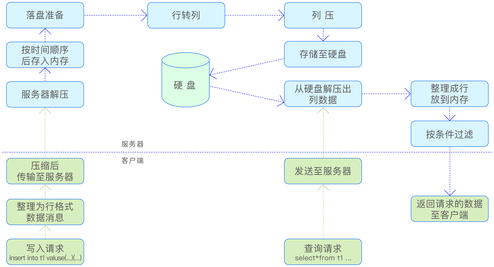

数据压缩是一种在不损失数据有效信息的前提下，利用特定算法对数据进行重新组织和处理，以减少数据占用的存储空间和提高数据传输效率的技术。TDengine 在数据的存储和传输过程中均采用了这一技术，旨在优化存储资源的使用并加快数据交换的速度。

## 存储压缩

TDengine 在存储架构上采用了列式存储技术，这意味着在存储介质中，数据是以列为单位进行连续存储的。这与传统的行式存储不同，后者在存储介质中是以行为单位进行连续存储的。列式存储与时序数据的特性相结合，尤其适合处理平稳变化的时序数据。

为了进一步提高存储效率，TDengine 采用了差值编码技术。这种技术通过计算相邻数据点之间的差异来存储数据，而不是直接存储原始值，从而大幅度减少存储所需的信息量。在差值编码之后，TDengine 还会使用通用的压缩技术对数据进行二次压缩，以实现更高的压缩率。

对于设备采集的稳定时序数据，TDengine 的压缩效果尤为显著，压缩率通常可以达到 10% 以内，甚至在某些情况下更高。这种高效的压缩技术为用户节约了大量的存储成本，同时也提高了数据的存储和访问效率。

### 一级压缩

时序数据自设备采集后，遵循 TDengine 的数据建模规则，每台采集设备会被构建为一张子表。如此，一台设备产生的所有时序数据均记录在同一张子表中。在数据存储过程中，数据是以块为单位进行分块存储的，每个数据块仅包含一张子表的数据。压缩操作也是以块为单位进行的，对子表中的每一列数据分别进行压缩，压缩后的数据仍然按
块存储至硬盘。

时序数据的平稳性是其主要特征之一，例如采集的大气温度、水温等，通常在一定范围内波动。利用这一特性，可以对数据进行重编码，并且根据不同的数据类型采用
应的编码技术，以实现最高的压缩效率。接下来将介绍各种数据类型的压缩方法。

- 时间戳类型：由于时间戳列通常记录设备连续采集数据的时刻，且采集频率固定，因此只须记录相邻时间点的差值。由于差值通常较小，这种方法比直接存储原始
时间戳更能节省存储空间。
- 布尔类型：布尔类型通过一个比特位表示一个布尔值，一个字节可以存储 8 个布尔值。通过紧凑的编码方式，可以显著减少存储空间。
- 数值类型：物联网设备产生的数值数据，如温度、湿度、气压、车速、油耗等，通常数值不大且在一定范围内波动。对于这类数据，统一采用 zigzag 编码技术。该技术将有符号整数映射为无符号整数，并将整数的补码最高位移动到低位，负数除了符号位以外的其他位取反，正数保持不变。这样做可以将有效数据位集中，同时增加前导零的数量，从而在后续压缩步骤中获得更佳的压缩效果。
- 浮点数类型：对于 float 和 double 两种浮点数类型，采用 delta-delta 编码方法。
- 字符串类型：字符串类型数据采用字典压缩算法，通过短的标识符替换原字符串中频繁出现的长字符串，从而减少存储的信息长度。

### 二级压缩

在完成针对特定数据类型的专用压缩之后，TDengine 进一步采用通用的压缩技术，将数据视为无差别的二进制数据进行二次压缩。与一级压缩相比，二级压缩的侧重点在于消除数据块之间的信息冗余。这种双重压缩技术，一方面专注于局部数据的精简，另一方面着眼于整体数据的重叠消除，二者相辅相成，共同实现了 TDengine 中的超高压缩率。

TDengine 支持多种压缩算法，包括 LZ4、ZLIB、ZSTD、XZ 等，用户可以根据具体的应用场景和需求，在压缩率和写入速度之间进行灵活权衡，选择最适合的压缩方案。

### 有损压缩

TDengine 引擎为浮点数类型数据提供了无损压缩和有损压缩两种模式。浮点数的精度通常由其小数点后的位数决定。在某些情况下，设备采集的浮点数精度较高，但实际应用中关注的精度却较低，此时采用有损压缩可以有效地节约存储空间。TDengine 的有损压缩算法基于预测模型，其核心思想是利用前序数据点的趋势来预测后续数据点的走势。这种算法能够显著提高压缩率，相比之下，其压缩效果远超无损压缩。有损压缩算法的名称为 TSZ。

## 传输压缩

TDengine 在数据传输过程中提供了压缩功能，以减少网络带宽的消耗。使用原生连接从客户端（如 taosc）向服务器传输数据时，可以通过配置压缩传输来节省带宽。在配置文件 taos.cfg 中，可以设置 compressMsgSize 选项来实现这一目标。可配置的值有以下3 个。
- 0：表示禁用压缩传输。
- 1：表示启用压缩传输，但仅对大于 1KB 的数据包进行压缩。
- 2：表示启用压缩传输，对所有数据包进行压缩。

在使用 RESTful 和 WebSocket 连接与 taosAdapter 通信时，taosAdapter 支持行业标准的压缩协议，允许连接端根据行业标准协议开启或关闭传输过程中的压缩。以下是具体的实现方式：
- RESTful 接口使用压缩：客户端在 HTTP 请求头部指定 Accept-Encoding 来告知服务器可接受的压缩类型，如 gzip、deflate 等。服务器在返回结果时，会在 ContentEncoding 头部中指定所使用的压缩算法，并返回压缩过的数据。
- WebSocket 接口使用压缩：可以参考 WebSocket 协议标准文档 RFC7692，了解如何在 WebSocket 连接中实现压缩。
- 数据备份迁移工具 taosX 与 taosX Agent 之间的通信也可以开启压缩传输。在agent.toml 配置文件中，设置压缩开关选项 compression=true 即可启用压缩功能。

## 压缩流程

下图展示了 TDengine 引擎在时序数据的整个传输及存储过程中的压缩及解压过程，以更好地理解整个处理过程。

