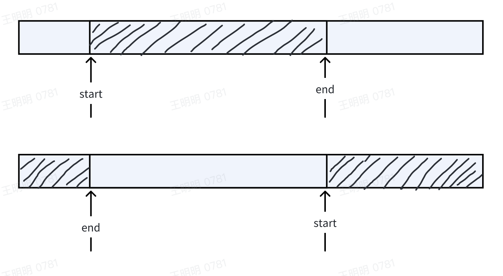
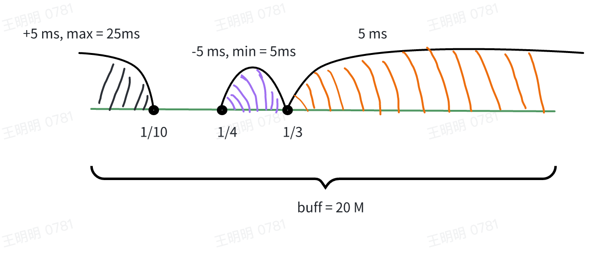
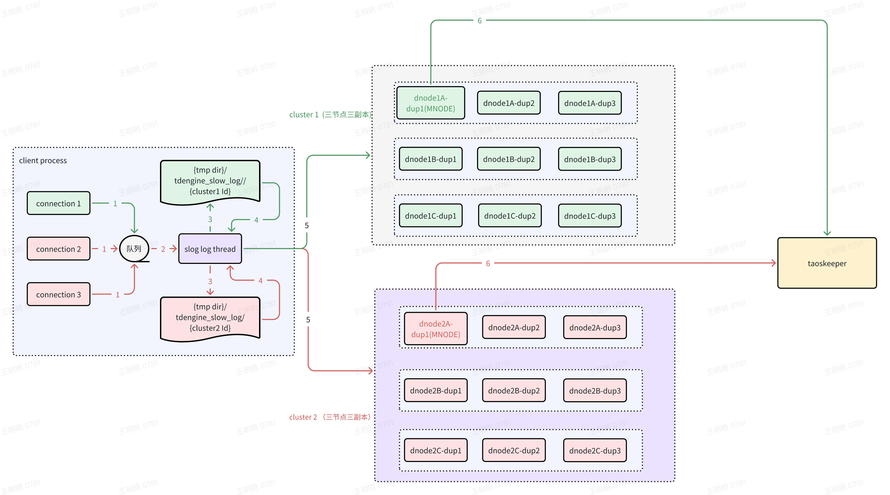
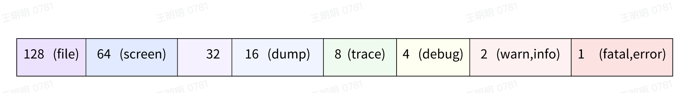

TDengine TSDB 通过日志文件记录系统运行状态，帮助用户监控系统运行情况，排查问题。Log 分为普通日志和慢日志。引擎测的运行状态通过普通日志的方式记录下来，系统运行相关的慢日志操作则记录到慢日志文件里。

## 普通日志

### 普通日志实现逻辑

- 普通日志分同步和异步两种方式，同步立即写入日志文件，异步写入到 buff 里，然后定时写入日志文件。
- 异步方式日志文件缓存在循环 buff 里，buff 的大小为 buffSize = 20M。如果某次写 buf 的日志大小大于 buf 可用空间，本次日志会舍弃，日志里记录： ...Lost N lines here...

- 异步线程里每隔 1s 会更新磁盘信息用于判断是否有空间写日志
- 异步线程每隔 Interval 时间处理一次写入逻辑。写入规则如下：
   - 如果 buff 里数据小于 buffSize/10，不写入磁盘，除非超过 1s。
   - 如果 buff 里数据大于 buffSize/10，全部写入磁盘。
- Interval 默认值为 25 ms，Interval 值会根据每次写入日志的大小动态调整。Interval 调试规则如下：
   - 数据量小时（小于 buffSize/10），增大写入间隔，Interval 每次增加 5ms，最大 25ms。
   - 数据量大时（大于 buffSize/3），写入间隔最小，Interval 为 5ms。
   - 数据量比较大时（大于 buffSize/4，小于等于buffSize/3），减小写入间隔，Interval 每次减小 5ms，最小 5ms。
   - 数据量适中时（大于等于 buffSize/10，小于等于buffSize/4），写入间隔不变。


### 普通日志行为说明   
- 普通日志命名规则
   - 同一台机器上可以起多个客户端进程，所以客户端日志命名方式为 taoslogX.Y，其中 X 为序号，为空或者 0 到 9，Y 为后缀 0 或者 1（windows 限制只有一个序号，所以格式为 taoslog.Y）。
   - 同一台机器上可以起多个服务端进程。所以服务端日志命名方式为 taosdlog.Y，其中 Y 为后缀，0 或者 1。
- 序号和后缀确定规则如下（假设日志路径为 /var/log/taos/）
   - 确定序号：使用 10 个序号作为日志命名方式，/var/log/taos/taoslog0.Y  -  /var/log/taos/taoslog9.Y，依次检测每个序号是否使用，找到第一个没使用的序号作为该进程的日志文件使用的序号。如果 10 个序号都被进程使用，不使用序号，即 /var/log/taos/taoslog.Y，进程都往相同的文件里写（序号为空）。
   - 确定后缀：0 或者 1。比如确定序号为 3，备选的日志文件名就为 /var/log/taos/taoslog3.0 /var/log/taos/taoslog3.1。如果两个文件都不存在用后缀 0，一个存在一个不存在，用存在的后缀。两个都存在，用修改时间最近的那个后缀。
   - 如果日志文件超过配置的条数 numOfLogLines，会切换后缀名，继续写日志，比如/var/log/taos/taoslog3.0 写够了，切换到 /var/log/taos/taoslog3.1 继续写日志。/var/log/taos/taoslog3.0  会添加时间戳后缀重命名并压缩存储（异步线程操作）。
   - 通过配置 logKeepDays 控制日志文件保存几天，几天之外的日志会被删除。比如配置为 1，则一天之前的日志会在新日志压缩存储时检测删除。不是自然天。
- 当文件里日志行数大于 numOfLogLines（默认 1000w，取值范围 1000-20 亿）时，会触发日志归档。
   - 举例：taoslog3.0 写满了，切换到 taoslog3.1 继续写。taoslog3.0 重命名为 taoslog.1735616543，然后压缩为 taoslog.1735616543.gz。同时，如果 logKeepDays > 0，会检测是否有超时的日志文件，然后删除。（该过程异步执行）

## 慢日志

系统除了记录普通日志以外，对于执行时间超过配置时间的操作，会被记录到慢日志中。慢日志文件主要用于分析系统性能，排查性能问题。
###  慢日志实现逻辑
#### 上报架构

#### 缓存逻辑
- 为了提高上报效率，慢 sql 日志上报方式为批量上报。
- 慢 sql 日志上报为了防止缓存丢失，采用写临时文件方式来实现缓存（crash 后不会丢失）。
- 每生成一条慢 sql 日志都会放到队列里，然后通知 slow log 线程从队列获取数据，slow log 线程根据数据里 clusterId 写到不同的文件里。
   数据格式如下（其中，clusterId 为当前日志所属的慢查询集群 id，value 为一条数据（json 字符串形式））
   ```c
    typedef struct {
        int64_t clusterId;
        char    *value;
    }MonitorSlowLogData
   ```
- 说明：
   - 因为客户端进程里可能存在很多个链接 connection，所以需要将慢查询日志根据 clusterId 来分组。分组方式通过临时文件名来实现，命名方式为 ```{tmp dir}/tdengine_slow_log/tdengeine-{clusterId1}-{processId}-{rand}```，processId 为进程 ID，主要为了区分多个客户端的上报。
   - 如上图 connection 1 连接的是 cluster 1。connection 2，connection 3 连接的是 cluster 2，所以 connection 1 的慢 sql 数据写入文件 ```{tmp dir}/tdengine_slow_log/tdengeine-{clusterId1}-{processId}-{rand}```，connection 2 和 connection 3 的慢 sql 数据写入文件 ```{tmp dir}/tdengine_slow_log/tdengeine-{clusterId1}-{processId}-{rand}```
#### 上报逻辑
- 读取 ```{tmp dir}/tdengine_slow_log/tdengeine-{clusterId1}-{processId}-{rand}``` 临时文件内容，每行数据作为 json 数组的一个元素，组装成 json 数组上报（文件里数据每接近 1M 大小上报一次，上报成功后记录读取文件进度，上报采用异步上报方式。在 callback 里继续根据上次的进度，继续读取文件的内容上报，直至整个文件读取上报完毕，上报完毕后，会清空临时文件，callback 里成功或失败都会继续读取文件，失败时会记录上报失败的数据日志）。每接近 1M 上报一次主要为了防止文件太大，放在一次上报失败）。
#### 上报时机
- 客户端运行过程中定时上报
   - 每个 monitorInterval 时间间隔上报数据。
- 客户端正常退出
   - 上报所有慢 sql 日志文件，上报成功后，删除文件。
- 客户端异常退出
   - 异常退出后再次与某个集群 (clusterId) 建立新的链接后遍历  ```{tmp dir}/tdengine_slow_log/``` 目录下 ```tdengine-{clusterId}``` 开头的所有文件进行重新上报（这些文件可能是另一个客户端进程或本进程正在操作的。所以每个文件打开时都需要添加文件锁），然后删除这个临时文件。
#### 一些异常行为说明
- 因为上报数据和删除文件里的上报内容没法作为一个原子操作，所以如果上报后还没删除数据就 crash，可能导致下次重复上报，重复上报的数据会覆盖，并没丢失，影响很小。
- 另外为了保证性能，slow log thread 线程把慢 sql 日志写入临时文件缓存，只保证刷新到操作系统的磁盘缓冲区，并不真正每次都 fsync 到磁盘，所以如果机器断电，仍可能丢失数据。该异常出现概率很小，可以容忍此种情况下的数据丢失。
###  慢日志行为说明
- 慢日志一方面会记录到本地慢日志文件中，另一方面会通过 taosAdapter 发送到 taosKeeper 进行结构化存储（需打开 monitor 开关）。
- 慢日志文件存储规则为：
   - 慢日志文件一天一个，如果当天没有慢日志，没有当天的文件。
   - 文件名为 taosSlowLog.yyyy-mm-dd（taosSlowLog.2024-08-02），日志存储路径通过 logDir 配置。
   - 多个客户端的日志存储在相应日志路径下的同一个 taosSlowLog.yyyy.mm.dd 文件里。
   - 慢日志文件不自动删除，不压缩。
   - 使用和普通日志文件相同的三个参数 logDir、minimalLogDirGB、asyncLog。另外两个参数 numOfLogLines、logKeepDays 不适用于慢日志。

## 日志级别说明

日志级别分为 9 种，如下所示：

```c
typedef enum {
    DEBUG_FATAL = 1,
    DEBUG_ERROR = 1,
    DEBUG_WARN = 2,
    DEBUG_INFO = 2,
    DEBUG_DEBUG = 4,
    DEBUG_TRACE = 8,
    DEBUG_DUMP = 16,
    DEBUG_SCREEN = 64,
    DEBUG_FILE = 128
} ELogLevel;
```

日志开关通过 bit 位来控制，具体如下：

  

例如：
- 131 = 128 + 2 + 1                      文件 + info + error
- 135 = 128 + 4 + 2 + 1                  文件 + debug + info + error
- 143 = 128 + 8 + 4 + 2 + 1              文件 + trace + debug + info + error

通过设置日志开关的参数，可以开启不同级别的日志。
