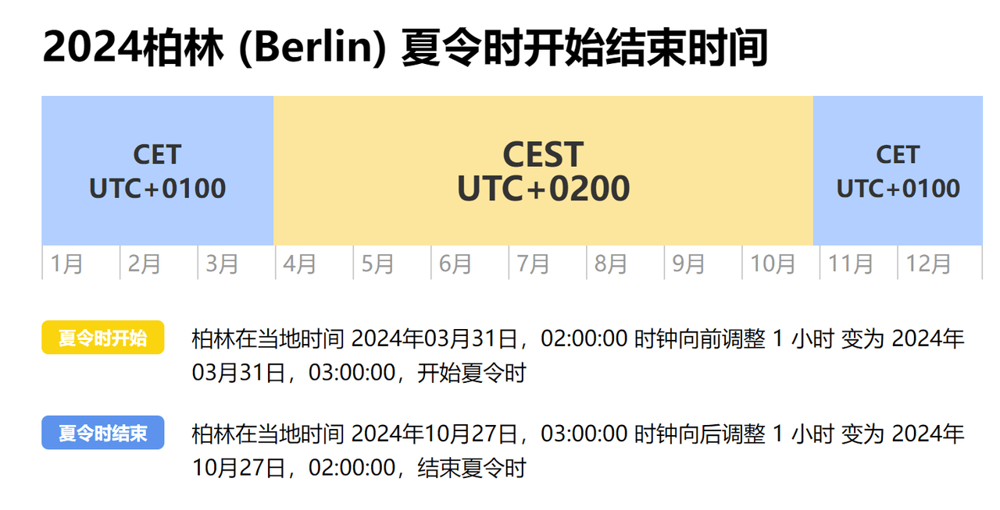
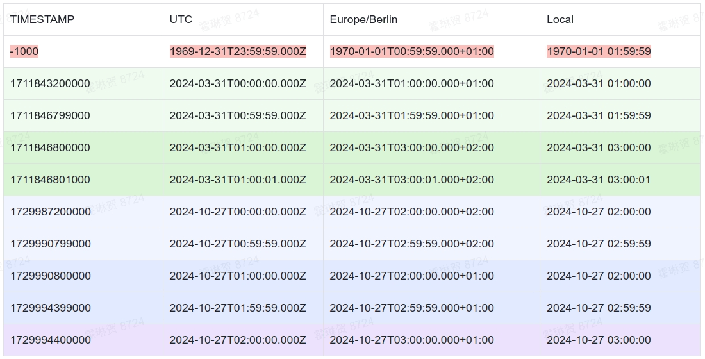
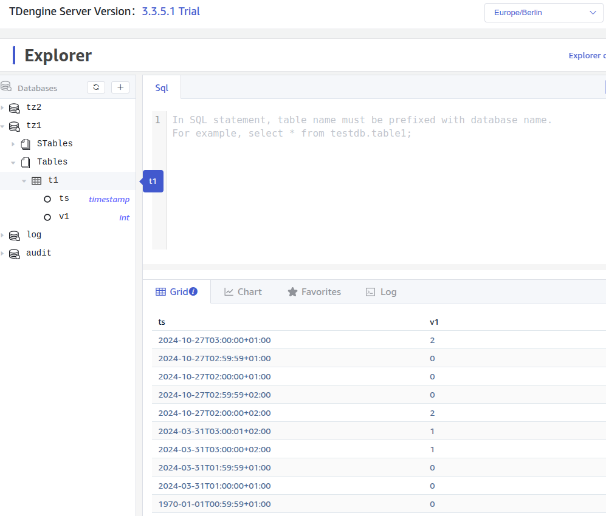

## 背景

在时序数据库的使用中，有时会遇到使用夏令时的情况。我们将 TDengine TSDB 中使用夏令时的情况和问题进行分析说明，以便您在 TDengine TSDB 的使用中更加顺利。

## 定义

### 时区

时区是地球上使用相同标准时间的区域。由于地球的自转，为了保证各地的时间与当地的日出日落相协调，全球划分为多个时区。

### IANA 时区

IANA（Internet Assigned Numbers Authority）时区数据库，也称为 tz database，提供全球时区信息的标准参考。它是现代各类系统和软件处理时区相关操作的基础。

IANA 使用“区域/城市”格式（如 Europe/Berlin）来明确标识时区。

TDengine TSDB 在不同组件中均支持使用 IANA 时区（除 Windows taos.cfg 时区设置外）。

### 标准时间与当地时间

标准时间是根据地球上某个固定经线确定的时间。它为各个时区提供了一个统一的参考点。

- 格林尼治标准时间（GMT）：历史上使用的参考时间，位于 0° 经线。
- 协调世界时（UTC）：现代的时间标准，类似于 GMT，但更加精确。

标准时间与时区的关系如下：

- 基准：标准时间（如 UTC）是时区设定的基准点。
- 偏移量：不同时区通过相对于标准时间的偏移量来定义。例如，UTC+1 表示比 UTC 快 1 小时。
- 区域划分：全球被划分为多个时区，每个时区使用一个或多个标准时间。

相对于标准时间，每个地区根据其所在时区设定其当地时间：

- 时区偏移：当地时间等于标准时间加上该时区的偏移量。例如，UTC+2 表示比 UTC 时间快 2 小时。
- 夏令时（DST）：某些地区在特定时间段调整当地时间，例如将时钟拨快一小时。详见下节。

### 夏令时

夏令时（Daylight Saving Time，DST）是一种通过将时间提前一小时，以充分利用日光、节约能源的制度。通常在春季开始，秋季结束。夏令时的具体开始和结束时间因地区而异。以下均以柏林时间为例，对夏令时和夏令时的影响做说明。



按照这个规则，可以看到：

- 柏林当地时间 2024 年 03 月 31 日 02:00:00 到 03:00:00（不含 03:00:00）之间的时间不存在（跳变）。
- 柏林当地时间 2024 年 10 月 27 日 02:00:00 到 03:00:00（不含 03:00:00）之间的时间出现了两次。

#### 夏令时与 IANA 时区数据库

- 记录规则：IANA 时区数据库详细记录了各地的夏令时规则，包括开始和结束的日期与时间。
- 自动调整：许多操作系统和软件利用 IANA 数据库来自动处理夏令时的调整。
- 历史变更：IANA 数据库还追踪历史上的夏令时变化，以确保准确性。

#### 夏令时与时间戳转换

- 时间戳转为当地时间是确定的。例如，1729990654 为柏林时间**夏令时** `2024-10-27 02:57:34`，1729994254 为柏林时间**冬令时** `2024-10-27 02:57:34`（这两个本地时间除时间偏移量外是一样的）。
- 不指定时间偏移量时，当地时间转为时间戳是不确定的。夏令时跳过的时间不存在会造成无法转换成时间戳，如 **柏林时间** `2024-03-31 02:34:56` 不存在，所以无法转换为时间戳。夏令时结束时重复导致无法确定是哪个时间戳，如 `2024-10-27 02:57:34` 不指定时间偏移量无法确定 是 1729990654 还是 1729994254。指定时间偏移量才能确定时间戳，如 `2024-10-27 02:57:34 CEST(+02:00) `，指定了夏令时 `2024-10-27 02:57:34` 时间戳 1729990654。

### RFC3339 时间格式

RFC 3339 是一种互联网时间格式标准，用于表示日期和时间。它基于 ISO 8601 标准，但更具体地规定了一些格式细节。

其格式如下：

- 基本格式：`YYYY-MM-DDTHH:MM:SSZ`
- 时区表示：
  - Z 表示协调世界时（UTC）。
  - 偏移量格式，例如 +02:00，表示与 UTC 的时差。

通过明确的时区偏移，RFC 3339 格式可以在全球范围内准确地解析和比较时间。

RFC 3339 的优势包括：

- 标准化：提供统一的格式，方便跨系统数据交换。
- 清晰性：明确时区信息，避免时间误解。

TDengine TSDB 在 REST API 和 Explorer UI 中，均使用 RFC3339 格式进行展示。在 SQL 语句中，可使用 RFC3339 格式写入时间戳数据：

```sql
insert into t1 values('2024-10-27T01:59:59.000Z', 0);
select * from t1 where ts >= '2024-10-27T01:59:59.000Z';
```

### 未定义行为

未定义行为（Undefined Behavior）是指特定代码或操作没有明确规定的结果，也不会对该结果作出兼容性的保证，TDengine TSDB 可能在某个版本后对当前的行为作出修改而不会通知用户。所以，在 TDengine TSDB 中，用户不可依赖当前未定义的行为进行判断或应用。

## 夏令时在 TDengine TSDB 中的写入与查询

我们使用下表来展示夏令时在写入和查询中的影响。



### 表格说明

- **TIMESTAMP**：TDengine TSDB 中使用 64 位整数来存储原始时间戳。
- **UTC**：时间戳对应的 UTC 时间表示。
- **Europe/Berlin**：表示时区 Europe/Berlin 对应的 RFC3339 格式时间。
- **Local**：表示时区 Europe/Berlin 对应的当地时间（不含时区）。

### 表格分析

- 在**夏令时开始**（柏林时间 3 月 31 日 02:00）时，时间直接从 02:00 跳到 03:00（往后跳一小时）。
  - 浅绿色是夏令时开始前一小时的时间戳；
  - 深绿色是夏令时开始后一小时的时间戳；
  - 红色为 TDengine TSDB 数据库中插入了不存在的当地时间：
    - 使用 SQL `INSERT INTO t1 values('2024-03-31 02:59:59',..)` 插入  `2024-03-31 02:00:00` 到 `2024-03-31 02:59:59` 的数据会被自动调整为 -1000（在 TDengine TSDB 中属于未定义行为，当前该值与数据库精度 precision 有关，毫秒数据库为 -1000，微秒数据库为 -1000000，纳秒数据库为 -1000000000），因为那一时刻在本地时间中不存在；
- 在**夏令时结束**（柏林时间 10 月 27 日 03:00）时，时间从 03:00 跳到 02:00（往前跳一小时）。
  - 浅蓝色表示时钟跳变前一小时的时间戳；
  - 深蓝色表示时钟跳变后一小时内的时间戳，其无时区的当地时间与上一小时一致。
  - 紫色表示时钟跳变一小时后的时间戳；
- **当地时间变化**：可见，由于夏令时的调整而导致了当地时间的变化，可能导致某些时间段出现重复或缺失。
- **UTC 时间不变**：UTC 时间保持不变，确保了时间的一致性和顺序性。
- **RFC3339**：RFC3339 格式时间显示了时间偏移量的变化，在夏令时开始后变为 +02:00，结束后变为 +01:00。
- **条件查询**：
  - **夏令时开始**时，跳过的时间（`[03-31 02:00:00,03-31 03:00:00)`）不存在，所以在使用该时间进行查询时，行为不确定：`SELECT ts FROM t1 WHERE ts BETWEEN '2024-03-31 02:00:00' AND  '2024-03-31 02:59:59'`（不存在的本地时间戳被转换为 `-1000`）:

    ```sql
    taos> SELECT ts FROM t1 WHERE ts BETWEEN '2024-03-31 02:00:00' AND '2024-03-31 02:59:59';
           ts       |
    =================
     -1000          |
    Query OK, 1 row(s) in set (0.003635s)
    ```

    当不存在的时间戳与存在的时间戳共同使用时，其结果同样不符合预期，以下为起始本地时间不存在：

    ```sql
    taos> SELECT ts, to_iso8601(ts,'Z') FROM t1 WHERE ts BETWEEN '2024-03-31 02:00:00' AND '2024-03-31 03:59:59';
         ts       |       to_iso8601(ts,'Z')       |
    ==================================================
    -1000         | 1969-12-31T23:59:59.000Z       |
    1711843200000 | 2024-03-31T00:00:00.000Z       |
    1711846799000 | 2024-03-31T00:59:59.000Z       |
    1711846800000 | 2024-03-31T01:00:00.000Z       |
    1711846801000 | 2024-03-31T01:00:01.000Z       |
    Query OK, 5 row(s) in set (0.003339s)
    ```

    以下语句中第一个 SQL 查询截止时间不存在，第二个截止时间存在，第一个 SQL 查询结果不符合预期：

    ```sql
    taos> SELECT ts, to_iso8601(ts,'Z') FROM t1 WHERE ts BETWEEN '2024-03-31 01:00:00' AND '2024-03-31 02:00:00';
    Query OK, 0 row(s) in set (0.000930s)

    taos> SELECT ts, to_iso8601(ts,'Z') FROM t1 WHERE ts BETWEEN '2024-03-31 01:00:00' AND '2024-03-31 01:59:59';
           ts      |       to_iso8601(ts,'Z')       |
    ==================================================
     1711843200000 | 2024-03-31T00:00:00.000Z       |
     1711846799000 | 2024-03-31T00:59:59.000Z       |
    Query OK, 2 row(s) in set (0.001227s)
    ```

  - 夏令时结束时，跳变的时间（`[10-27 02:00:00,10-27 03:00:00)` 不包含 `10-27 03:00:00`）重复了两次，TDengine TSDB 在使用该区间内的时间戳进行查询时，也属于未定义行为。
    - 查询 `[2024-10-27 02:00:00, 2024-10-27 03:00:00]` 之间的数据结果，包含了两次重复的时间戳和 `2024-10-27 03:00:00` 这个时间点的数据：

        ```sql
        taos> SELECT ts, to_iso8601(ts,'Z'), TO_CHAR(ts, 'YYYY-MM-DD HH:mi:ss') FROM t1 WHERE ts BETWEEN '2024-10-27 02:00:00' AND '2024-10-27 03:00:00';
               ts      |       to_iso8601(ts,'Z')       | to_char(ts, 'YYYY-MM-DD HH:mi:ss') |
        =======================================================================================
         1729987200000 | 2024-10-27T00:00:00.000Z       | 2024-10-27 02:00:00                |
         1729990799000 | 2024-10-27T00:59:59.000Z       | 2024-10-27 02:59:59                |
         1729990800000 | 2024-10-27T01:00:00.000Z       | 2024-10-27 02:00:00                |
         1729994399000 | 2024-10-27T01:59:59.000Z       | 2024-10-27 02:59:59                |
         1729994400000 | 2024-10-27T02:00:00.000Z       | 2024-10-27 03:00:00                |
        Query OK, 5 row(s) in set (0.001370s)
        ````

    - 但以下查询 [2024-10-27 02:00:00.000,2024-10-27 02:57:34.999] 区间只能查询到第一个 2024-10-27 02:00:00 时间点的数据：

        ```sql
        taos> SELECT ts, to_iso8601(ts,'Z'), TO_CHAR(ts, 'YYYY-MM-DD HH:mi:ss') FROM t1 WHERE ts >= '2024-10-27 02:00:00' AND ts <= '2024-10-27 02:57:00.999';
               ts      |       to_iso8601(ts,'Z')       | to_char(ts, 'YYYY-MM-DD HH:mi:ss') |
        =======================================================================================
         1729987200000 | 2024-10-27T00:00:00.000Z       | 2024-10-27 02:00:00                |
        Query OK, 1 row(s) in set (0.004480s)
        ```

    - 以下查询 `[2024-10-27 02:00:01,2024-10-27 02:57:35]` 却能查到 3 条数据（包含一条 02:59:59 的当地时间数据）：

        ```sql
        taos> SELECT ts, to_iso8601(ts,'Z'), TO_CHAR(ts, 'YYYY-MM-DD HH:mi:ss') FROM t1 WHERE ts >= '2024-10-27 02:00:00' AND ts <= '2024-10-27 02:57:35';;
                   ts            |       to_iso8601(ts,'Z')       | to_char(ts, 'YYYY-MM-DD HH:mi:ss') |
        ================================================================================================
         2024-10-27 02:00:00.000 | 2024-10-27T00:00:00.000Z       | 2024-10-27 02:00:00                |
         2024-10-27 02:59:59.000 | 2024-10-27T00:59:59.000Z       | 2024-10-27 02:59:59                |
         2024-10-27 02:00:00.000 | 2024-10-27T01:00:00.000Z       | 2024-10-27 02:00:00                |
        Query OK, 3 row(s) in set (0.004428s)
        ```

## 总结与建议

### 总结

仅针对使用当地时间带来的影响作说明，使用 UNIX 时间戳或 RFC3339 无影响。

- 写入：
  - 无法写入夏令时跳变时不存在的时间数据。
  - 写入夏令时跳变时重复的时间是未定义行为。
- 查询：
  - 查询条件指定夏令时开始时跳变的时间，其查询结果为未定义行为。
  - 查询条件指定夏令时结束时重复的时间，其查询结果为未定义行为。
- 显示：
  - 带时区显示不受影响。
  - 显示当地时间是准确的，但夏令时结束时重复的时间会无法区分。
  - 用户应谨慎使用不带时区的时间进行展示和应用。

### 建议

为避免夏令时给查询和写入造成不必要的影响，在 TDengine TSDB 中，建议使用明确的时间偏移量进行写入和查询。

- 使用 UNIX 时间戳：使用 UNIX 时间戳可避免时区问题。

  |     TIMESTAMP |           UTC            |         Europe/Berlin         |        Local        |
  | ------------: | :----------------------: | :---------------------------: | :-----------------: |
  | 1711846799000 | 2024-03-31T00:59:59.000Z | 2024-03-31T01:59:59.000+01:00 | 2024-03-31 01:59:59 |
  | 1711846800000 | 2024-03-31T01:00:00.000Z | 2024-03-31T03:00:00.000+02:00 | 2024-03-31 03:00:00 |

  ```sql
  taos> insert into t1 values(1711846799000, 1)(1711846800000, 2);
  Insert OK, 2 row(s) affected (0.001434s)

  taos> select * from t1 where ts between 1711846799000 and 1711846800000;
         ts      |     v1      |
  ===============================
   1711846799000 |           1 |
   1711846800000 |           2 |
  Query OK, 2 row(s) in set (0.003503s)
  ```

- 使用 RFC3339 时间格式：带时区偏移量的  RFC3339 时间格式可以有效避免夏令时的不确定性。

  |     TIMESTAMP |           UTC            |         Europe/Berlin         |        Local        |
  | ------------: | :----------------------: | :---------------------------: | :-----------------: |
  | 1729987200000 | 2024-10-27T00:00:00.000Z | 2024-10-27T02:00:00.000+02:00 | 2024-10-27 02:00:00 |
  | 1729990799000 | 2024-10-27T00:59:59.000Z | 2024-10-27T02:59:59.000+02:00 | 2024-10-27 02:59:59 |
  | 1729990800000 | 2024-10-27T01:00:00.000Z | 2024-10-27T02:00:00.000+01:00 | 2024-10-27 02:00:00 |
  | 1729994399000 | 2024-10-27T01:59:59.000Z | 2024-10-27T02:59:59.000+01:00 | 2024-10-27 02:59:59 |

  ```sql
  taos> insert into t1 values ('2024-10-27T02:00:00.000+02:00', 1)
                              ('2024-10-27T02:59:59.000+02:00', 2)
                              ('2024-10-27T02:00:00.000+01:00', 3)
                              ('2024-10-27T02:59:59.000+01:00', 4);
  Insert OK, 4 row(s) affected (0.001514s)

  taos> SELECT *,
               to_iso8601(ts,'Z'),
               to_char(ts, 'YYYY-MM-DD HH:mi:ss') FROM t1
        WHERE ts >= '2024-10-27T02:00:00.000+02:00'
          AND ts <= '2024-10-27T02:59:59.000+01:00';
         ts      |     v1  |       to_iso8601(ts,'Z')       | to_char(ts, 'YYYY-MM-DD HH:mi:ss') |
  =====================================================================================================
   1729987200000 |       1 | 2024-10-27T00:00:00.000Z       | 2024-10-27 02:00:00                |
   1729990799000 |       2 | 2024-10-27T00:59:59.000Z       | 2024-10-27 02:59:59                |
   1729990800000 |       3 | 2024-10-27T01:00:00.000Z       | 2024-10-27 02:00:00                |
   1729994399000 |       4 | 2024-10-27T01:59:59.000Z       | 2024-10-27 02:59:59                |
  Query OK, 4 row(s) in set (0.004275s)

  taos> SELECT *,
               to_iso8601(ts,'Z'),
               to_char(ts, 'YYYY-MM-DD HH:mi:ss') FROM t1
        WHERE ts >= '2024-10-27T02:00:00.000+02:00'
          AND ts <= '2024-10-27T02:59:59.000+02:00';
         ts      |     v1  |       to_iso8601(ts,'Z')       | to_char(ts, 'YYYY-MM-DD HH:mi:ss') |
  =====================================================================================================
   1729987200000 |       1 | 2024-10-27T00:00:00.000Z       | 2024-10-27 02:00:00                |
   1729990799000 |       2 | 2024-10-27T00:59:59.000Z       | 2024-10-27 02:59:59                |
  Query OK, 2 row(s) in set (0.004275s)
  ```

- 查询时注意时区设定：在查询和显示时，如果需要本地时间，务必考虑夏令时的影响。
  - taosAdapter：使用 REST API 时，支持设置 IANA 时区，结果使用 RFC3339 格式返回。

    ```shell
    $ curl -uroot:taosdata 'localhost:6041/rest/sql?tz=Europe/Berlin'\
      -d "select ts from tz1.t1"
    {"code":0,"column_meta":[["ts","TIMESTAMP",8]],"data":[["1970-01-01T00:59:59.000+01:00"],["2024-03-31T01:00:00.000+01:00"],["2024-03-31T01:59:59.000+01:00"],["2024-03-31T03:00:00.000+02:00"],["2024-03-31T03:00:01.000+02:00"],["2024-10-27T02:00:00.000+02:00"],["2024-10-27T02:59:59.000+02:00"],["2024-10-27T02:00:00.000+01:00"],["2024-10-27T02:59:59.000+01:00"],["2024-10-27T03:00:00.000+01:00"]],"rows":10}
    ```

  - Explorer：使用 Explorer 页面进行 SQL 查询时，用户可配置客户端时区，以 RFC3339 格式显示。

    

## 参考文档

- IANA Time Zone Database: [https://www.iana.org/time-zones](https://www.iana.org/time-zones)
- RFC3339: [https://datatracker.ietf.org/doc/html/rfc3339](https://datatracker.ietf.org/doc/html/rfc3339)
