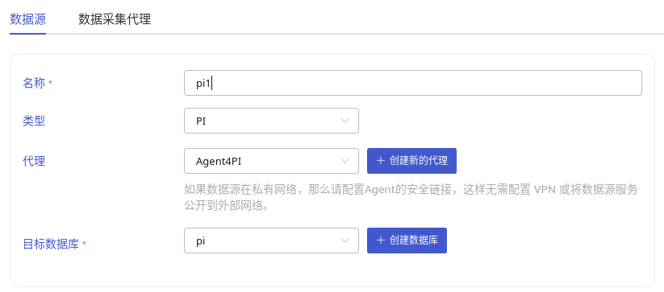
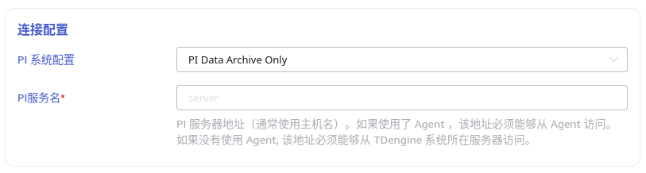
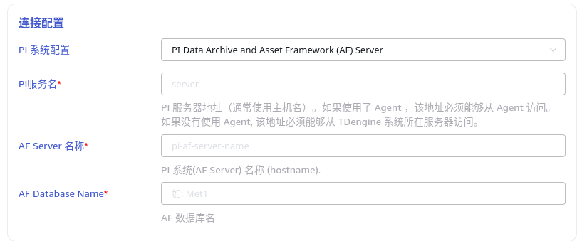
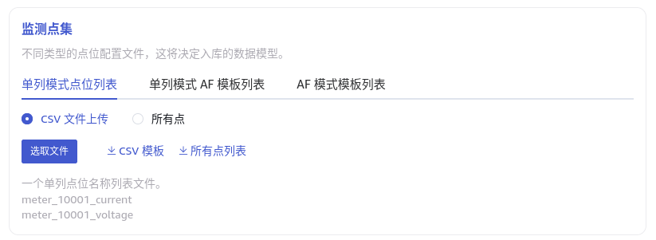
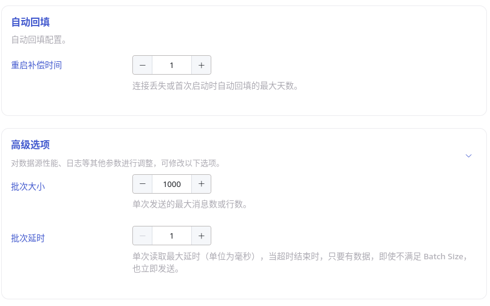

本节讲述如何通过 Explorer 界面创建数据迁移任务, 从 PI 系统迁移数据到当前 TDengine 集群。

## 功能概述

PI 系统是一套用于数据收集、查找、分析、传递和可视化的软件产品，可以作为管理实时数据和事件的企业级系统的基础架构。

taosX 可以通过 PI 连接器插件从 PI 系统中提取实时数据。

## 创建任务

### 1. 新增数据源

在数据写入页面中，点击 **+新增数据源** 按钮，进入新增数据源页面。


### 2. 配置基本信息

在 **名称** 中输入任务名称，如：“test”；

在 **类型** 下拉列表中选择 **PI**。

如果 taosX 服务运行在 PI 系统所在或可直连的服务器上（依赖 PI AF SDK），**代理** 是不必须的，否则，需要配置 **代理** ：在下拉框中选择指定的代理，也可以先点击右侧的 **+创建新的代理** 按钮创建一个新的代理 ，跟随提示进行代理的配置。即：taosX 或其代理需要部署在可直接连接 PI 系统的主机上。

在 **目标数据库** 下拉列表中选择一个目标数据库，也可以先点击右侧的 **+创建数据库** 按钮创建一个新的数据库。



### 3. 配置连接信息

PI 连接器支持两种连接方式：

1. **PI Data Archive Only**: 不使用 AF 模式。此模式下直接填写 **PI 服务名**（服务器地址，通常使用主机名）。

   
2. **PI Data Archive and Asset Framework (AF) Server**: 使用 AF SDK。此模式下除配置服务名外，还需要配置PI 系统(AF Server) 名称 (hostname) 和 AF 数据库名。

   

点击 **连通性检查** 按钮，检查数据源是否可用。

### 4. 配置监测点集

**监测点集** 可选择使用 CSV 文件模板或使用 **所有点**。



使用单列文本模板，每行表示一个点位名，示例如下：

```csv
meter_10001_current
meter_10001_voltage
meter_10002_current
meter_10002_voltage
```

### 5. 其他连接配置

如图所示：



其中：

- **重启补偿时间**: 连接丢失或首次启动时自动回填的最大天数。默认为 1 天。
- **批次大小**: 单次发送的最大消息数或行数。
- **批次延时**: 单次读取最大延时（单位为豪秒），当超时结束时，只要有数据，即使不满足 Batch Size，也立即发送。
