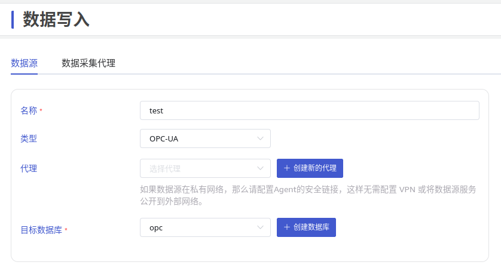
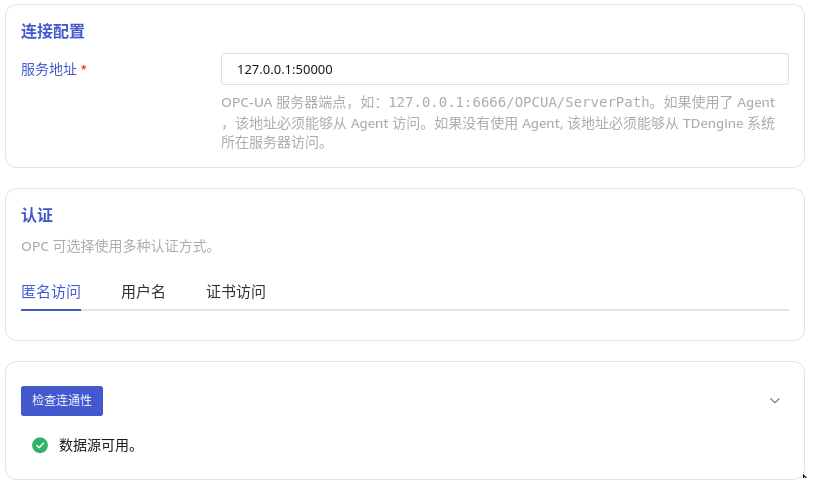
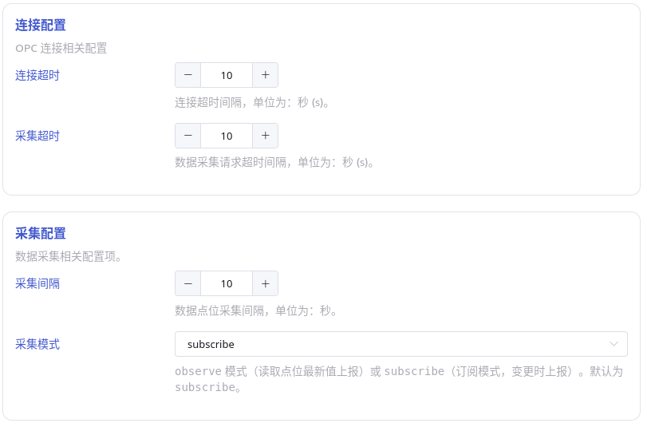

本节讲述如何通过 Explorer 界面创建数据迁移任务, 从 OPC-UA 服务器迁移数据到当前 TDengine 集群。

## 功能概述

OPC 是工业自动化领域和其他行业中安全可靠地交换数据的互操作标准之一。

OPC-UA 是经典 OPC 规范的下一代标准，是一个平台无关的面向服务的架构规范，集成了现有 OPC Classic 规范的所有功能，提供了一条迁移到更安全和可扩展解决方案的路径。

TDengine 可以高效地从 OPC-UA 服务器读取数据并将其写入 TDengine，以实现实时数据入库。

## 创建任务

### 1. 新增数据源

在数据写入页面中，点击 **+新增数据源** 按钮，进入新增数据源页面。


### 2. 配置基本信息

在 **名称** 中输入任务名称，如：“test”；

在 **类型** 下拉列表中选择 **OPC-UA**。

**代理** 是非必填项，如有需要，可以在下拉框中选择指定的代理，也可以先点击右侧的 **+创建新的代理** 按钮 [创建一个新的代理](#创建代理) 。

在 **目标数据库** 下拉列表中选择一个目标数据库，也可以先点击右侧的 **+创建数据库** 按钮 [创建一个新的数据库](#创建数据库) 。



### 3. 配置连接信息

在 **连接配置** 区域填写 **OPC-UA 服务地址**，例如：`127.0.0.1:5000`，并配置认证方式。

点击 **连通性检查** 按钮，检查数据源是否可用。



### 4. 配置点位集

**点位集** 可选择使用 CSV 文件模板或 **选择所有点位**。

CSV 文件模板形如：

```csv
序号（可选）,信息点编码（必填，用作点位子表名称）,OPC TAG点地址（必填字段）,数据类型（必填）,采集值列名(可配置，默认 val),质量位列名（可配置，默认 quality）,信息点是否启用 1-启用 0-未启用（可选，默认 启用）,对应超级表表名,OPC原始时间列名（默认ts且为首列）,TD服务端接收时间列名（可选，如配置则该列作为首列）, 标签列1（必填）,标签列2（可选）
0,tbname,point_id,type,value_col,quality_col,enabled,stable,ts_col,received_ts_col,tag::VARCHAR(200)::name,tag::VARCHAR(50)::unit
1,tbname1,ns=3;i=1002,int,val,quality,1,stb_int,ts,rts,入库温度,℃
2,tbname2,ns=3;i=1007,double,val,quality,0,stb_double,ts,rts,减压阀压力,kpa
```

其中以下信息是必填项：

- 信息点编码：用作点位子表名。
- TAG 点地址：通常是 `"ns=<num>;i=<name>"` 格式的字符串，可使用工具从 OPC-UA 服务器导出，或从本页面 **下载所有位点的列表** 下载后再编辑。
- 数据类型：用作点位写入值在 TDengine 集群中的数据类型。
- 标签列：第二行为标签定义，格式为 `tag::<类型>::<列名>`，如 `tag::VARCHAR(200)::name`。

其他列为可选项：
- 值列名：默认为 `val`，不可为空。
- 质量位列名：默认为 `quality`，不可为空。
- 超级表名：默认为 `opc_<数据类型>`，如 DOUBLE 类型的超级表名为 `opc_double`，自定义值不可包含 `.` 且不可为空。
- 原始时间列名：默认为 `ts`。
- 接收时间列名：默认为 `received_ts`，添加此列时，以接收时间为首列。

其中标记为 **可选** 的列，如果不需设置，请删除后再提交。

### 5. 其他连接配置

如图所示：



其中：

- **连接超时**: 配置连接超时间隔，默认为 10 秒。
- **采集超时**: 点位采集超时间隔，默认为 10 秒。
- **采集间隔**: 数据点位采集间隔，默认为 10 秒。
- **采集模式**: 可使用 `subscribe` 或 `observe` 模式：

  - `subscribe`: 订阅模式，变更时上报数据并写入。
  - `observe`：读取点位最新值并上报。

