本节讲述如何通过 Explorer 界面创建数据迁移任务, 从 Mqtt 迁移数据到当前 TDengine 集群。

## 功能概述

MQTT 表示 Message Queuing Telemetry Transport （消息队列遥测传输）。它是一种轻量级的消息协议，易于实现和使用。

TDengine 可以通过 Mqtt 连接器从 MQTT 代理订阅数据并将其写入 TDengine，以实现历史数据迁移或实时数据流入库。

## 创建任务

### 1. 新增数据源

在数据写入页面中，点击 **+新增数据源** 按钮，进入新增数据源页面。

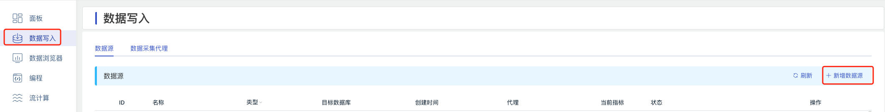

### 2. 配置基本信息

在 **名称** 中输入任务名称，如：“test_mqtt”；

在 **类型** 下拉列表中选择 **MQTT**。

**代理** 是非必填项，如有需要，可以在下拉框中选择指定的代理，也可以先点击右侧的 **+创建新的代理**
按钮 [创建一个新的代理](#创建代理) 。

在 **目标数据库** 下拉列表中选择一个目标数据库，也可以先点击右侧的 **+创建数据库**
按钮 [创建一个新的数据库](#创建数据库) 。

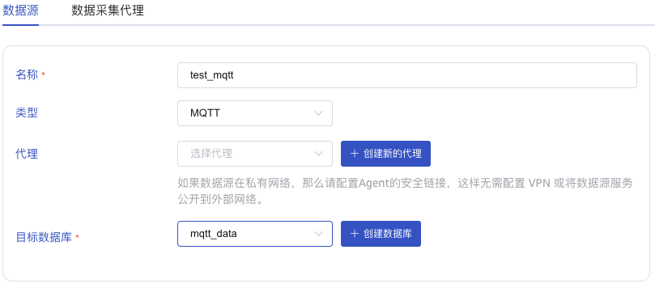

### 3. 配置连接和认证信息

在 **MQTT地址** 中填写 MQTT 代理的地址，例如：`192.168.1.42:1883`

在 **用户** 中填写 MQTT 代理的用户名。

在 **密码** 中填写 MQTT 代理的密码。

点击 **连通性检查** 按钮，检查数据源是否可用。

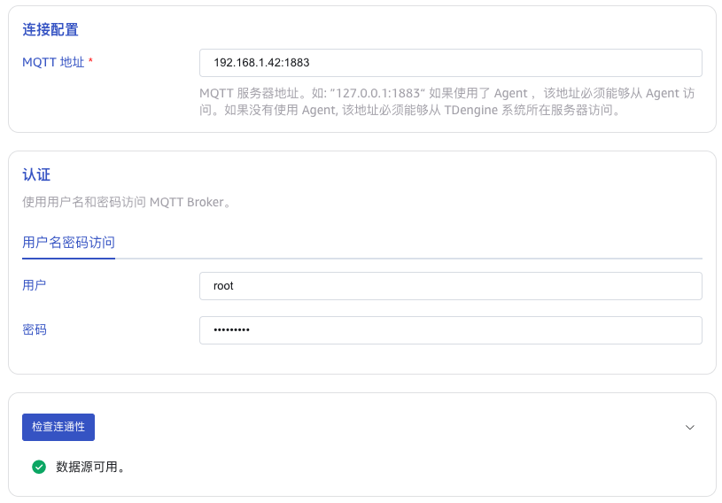

### 4. 配置 SSL 证书

如果 MQTT 代理使用了 SSL 证书，需要在 **SSL证书** 中上传证书文件。

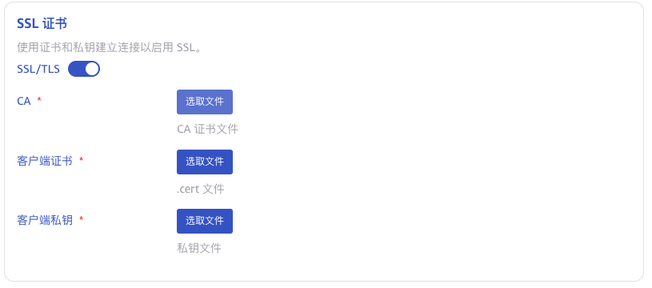

### 5. 配置采集信息

在 **采集配置** 区域填写采集任务相关的配置参数。

在 **MQTT 协议** 下拉列表中选择 MQTT 协议版本。有三个选项：`3.1`、`3.1.1`、`5.0`。 默认值为 3.1。

在 **Client ID** 中填写客户端 ID。

在 **Keep Alive** 中输入保持活动间隔。如果代理在保持活动间隔内没有收到来自客户端的任何消息，它将假定客户端已断开连接，并关闭连接。
保持活动间隔是指客户端和代理之间协商的时间间隔，用于检测客户端是否活动。如果客户端在保持活动间隔内没有向代理发送消息，则代理将断开连接。

在 **Clean Session** 中，选择是否清除会话。默认值为 true。

在 **订阅主题及 QoS 配置** 中填写要消费的 Topic 名称。使用如下格式设置： `topic1::0,topic2::1`。

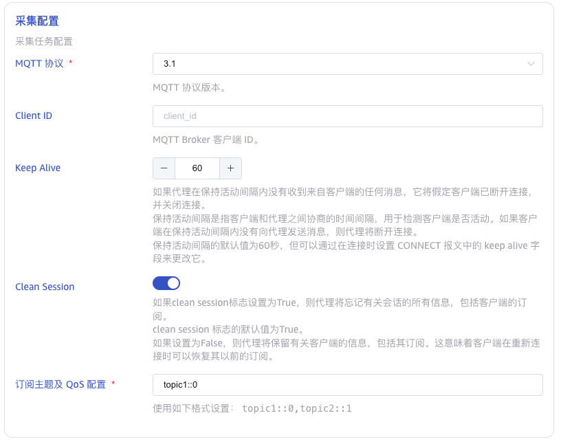

### 6. 配置 MQTT Payload 解析

在 **MQTT Payload 解析** 区域填写 Payload 解析相关的配置参数。
MQTT 连接器会上传以下四列到服务端：

* ts: 采集时间戳。
* topic: 订阅主题名。
* qos: 采集点质量。
* payload: 采集数据。

taosX 可以使用 JSON 提取器解析数据，并允许用户在数据库中指定数据模型，包括，指定表名称和超级表名，设置普通列会标签列等。

在 **消息体** 中填写 MQTT 消息体中的示例数据，例如：`{"id": 1, "message": "hello""}`。之后会使用这条示例数据来配置提取和过滤条件。

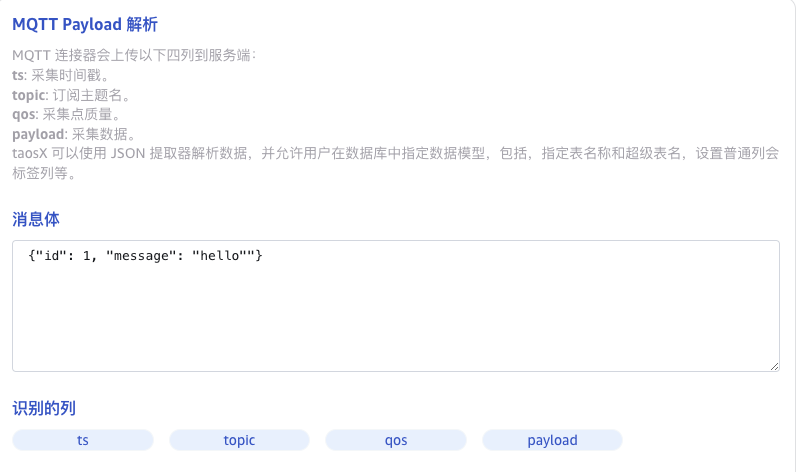

在 **从列中提取或拆分** 中填写从消息体中提取或拆分的字段，例如：将value字段拆分成`id`和`message`这2个字段，选择 json 提取器，
配置表达式为`id::int;message::binary`。

点击 **对勾**，可以查看拆分后的结果。

点击 **删除**，可以删除当前提取规则。

点击 **新增**，可以添加更多提取规则。

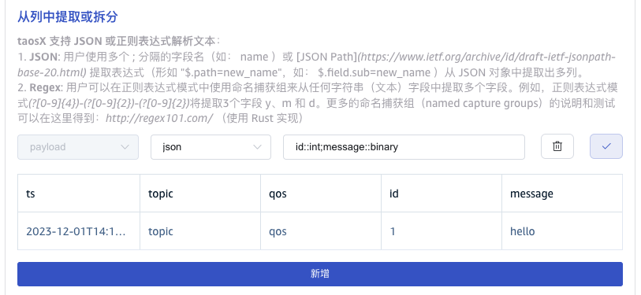

在 **过滤** 中，填写过滤条件，例如：填写`id != 0`，则只有 id 不为 0 的数据才会被写入 TDengine。

点击 **对勾**，可以查看过滤的结果。

点击 **删除**，可以删除当前过滤规则。

点击 **新增**，可以添加更多过滤规则。

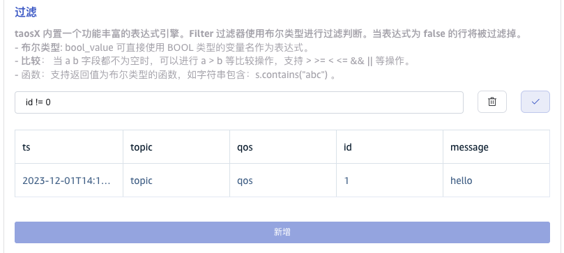

在 **目标超级表** 的下拉列表中选择一个目标超级表，也可以先点击右侧的 **创建超级表** 按钮 [创建超级表](#创建超级表) 。

在 **映射** 中，填写目标超级表中的子表名称，例如：`t_{id}`。

点击 **计算**，可以查看映射的结果。

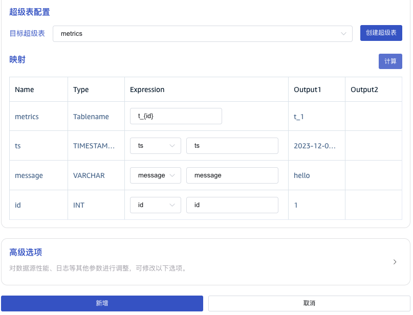

### 7. 高级选项

在 **日志级别** 下拉列表中选择日志级别。有五个选项：`TRACE`、`DEBUG`、`INFO`、`WARN`、`ERROR`。 默认值为 INFO。

### 8. 创建完成

点击 **新增** 按钮，完成创建 MQTT 到 TDengine 的数据同步任务。

## 查看任务运行情况

提交任务后，回到数据源页面可以查看任务状态。任务先会被加入执行队列，稍后就开始运行。

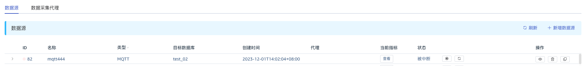

点击 “查看”按钮，可以监控任务的动态统计信息。也可以点击左侧折叠按钮，展开任务的活动信息。如果任务运行异常，此处可以看到详细的说明。

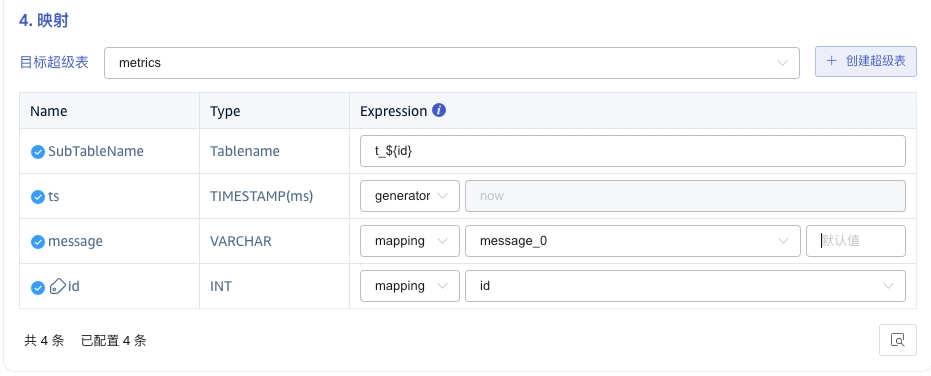
