本节讲述如何通过 Explorer 界面创建数据迁移任务, 从 Kafka 迁移数据到当前 TDengine 集群。

## 功能概述
Apache Kafka 是一个用于流处理、实时数据管道和大规模数据集成的开源分布式流系统。
TDengine 可以高效地从 Kafka 读取数据并将其写入 TDengine，以实现历史数据迁移或实时数据流入库。

## 创建任务
### 1. 新增数据源
在数据写入页面中，点击 **+新增数据源** 按钮，进入新增数据源页面。

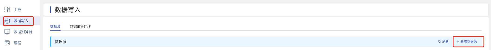

### 2. 配置基本信息
在 **名称** 中输入任务名称，如：“test_kafka”；

在 **类型** 下拉列表中选择 **Kafka**。

**代理** 是非必填项，如有需要，可以在下拉框中选择指定的代理，也可以先点击右侧的 **+创建新的代理** 按钮 [创建一个新的代理](#创建代理) 。

在 **目标数据库** 下拉列表中选择一个目标数据库，也可以先点击右侧的 **+创建数据库** 按钮 [创建一个新的数据库](#创建数据库) 。

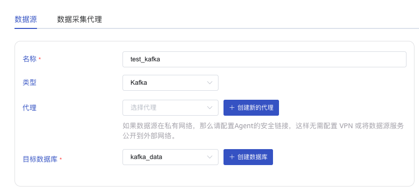

### 3. 配置连接信息
在 **连接配置** 区域填写 **bootstrap-servers**，例如：`192.168.1.92:9092`。

点击 **连通性检查** 按钮，检查数据源是否可用。

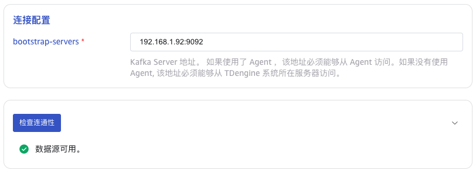

### 4. 配置采集信息
在 **采集配置** 区域填写采集任务相关的配置参数。

在 ** 超时时间 ** 中填写超时时间。当从 Kafka 消费不到任何数据，超过 timeout 后，数据采集任务会退出。 
默认值是 500 ms。 当 timeout 设置为 never 时，会一直等待，直到有数据可用，或者发生错误。

在 ** 主题 ** 中填写要消费的 Topic 名称。可以配置多个 Topic ， Topic 之间用逗号分隔。例如：`tp1,tp2`。

在 **Offset** 的下拉列表中选择从哪个 Offset 开始消费数据。有三个选项：`Earliest`、`Latest`、`ByTime(ms)`。 默认值为Earliest。
* Earliest：用于请求最早的 offset。
* Latest：用于请求最晚的 offset。
* ByTime：用于请求在特定时间（毫秒）之前的所有消息; 时间戳为毫秒精度。

在 **获取数据的最大时长** 中设置获取消息时等待数据不足的最长时间（以毫秒为单位），默认值为 100ms。

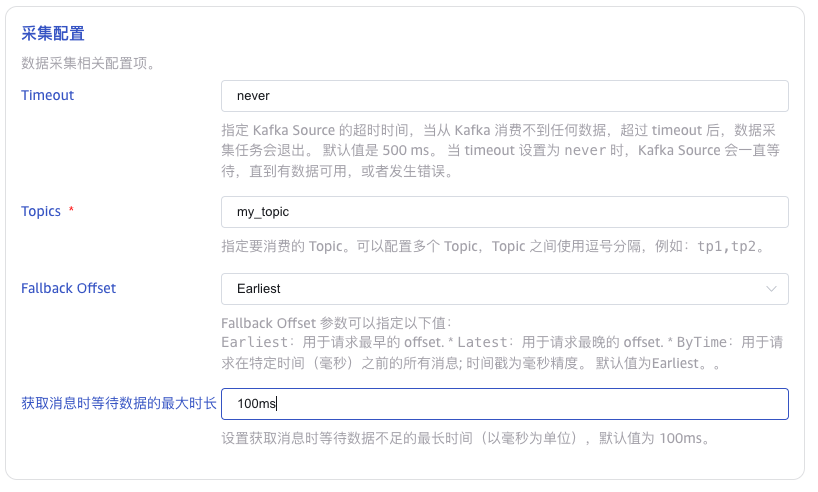

### 5. 配置 Payload 解析
在 **Payload 解析** 区域填写 Payload 解析相关的配置参数。

Kafka 数据源会上传以下字段：
* **ts**: 从 kafka 中读取到的数据的时间戳，单位为纳秒。
* **topic**: 从 kafka 中获取的 topic。
* **partition**: 消息所在的分区 ID。
* **offset**: 消息在分区中的偏移量。
* **key**: 消息的 key。
* **value**: 消息的 value。

taosX 可以从 value 中提取 JSON 格式的数据，然后将其拆分成新的列。

在 **消息体** 中填写 Kafka 消息体中的示例数据，例如：`{"id": 1, "message": "hello""}`。之后会使用这条示例数据来配置提取和过滤条件。

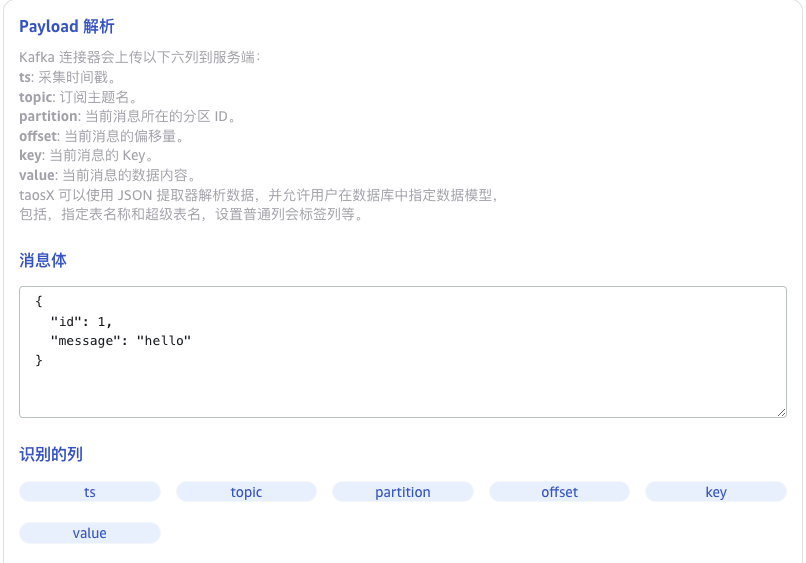

在 **从列中提取或拆分** 中填写从消息体中提取或拆分的字段，例如：将value字段拆分成`id`和`message`这2个字段，选择 json 提取器，
配置表达式为`id::int;message::binary`。
点击 **对勾**，可以查看拆分后的结果。
点击 **删除**，可以删除当前提取规则。
点击 **新增**，可以添加更多提取规则。

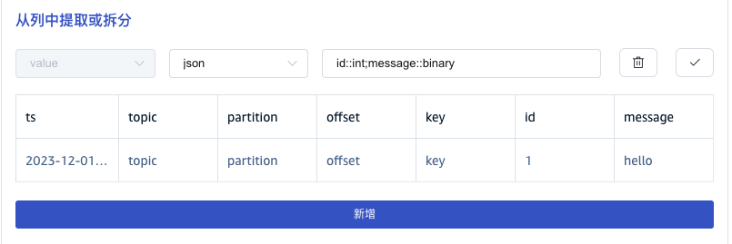

在 **过滤** 中，填写过滤条件，例如：填写`id != 0`，则只有 id 不为 0 的数据才会被写入 TDengine。
点击 **对勾**，可以查看过滤的结果。
点击 **删除**，可以删除当前过滤规则。
点击 **新增**，可以添加更多过滤规则。

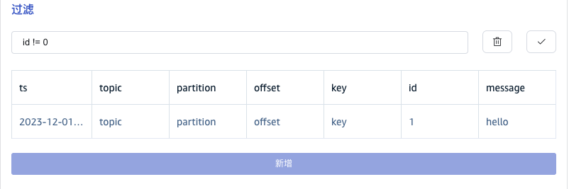

在 **目标超级表** 的下拉列表中选择一个目标超级表，也可以先点击右侧的 **创建超级表** 按钮 [创建超级表](#创建超级表) 。

在 **映射** 中，填写目标超级表中的子表名称，例如：`t_{id}`。

点击 **计算**，可以查看映射的结果。

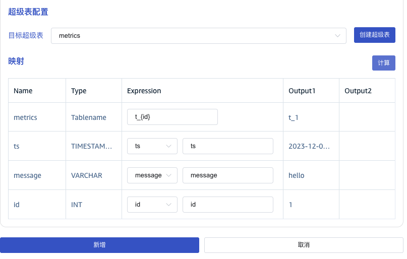

### 6. 创建完成
点击 **新增** 按钮，完成创建 Kafka 到 TDengine 的数据同步任务。

## 监控任务运行情况

提交任务后，回到数据源页面可以查看任务状态。任务先会被加入执行队列，稍后就开始运行。

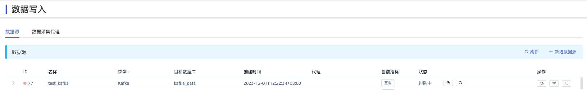

点击 “查看”按钮，可以监控任务的动态统计信息。

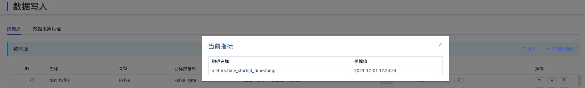

也可以点击左侧折叠按钮，展开任务的活动信息。如果任务运行异常，此处可以看到详细的说明。

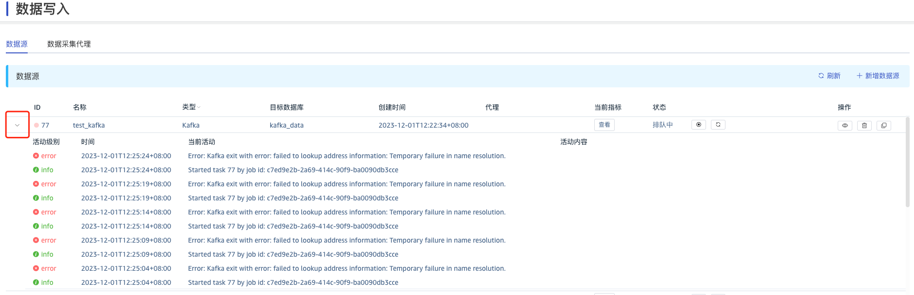
