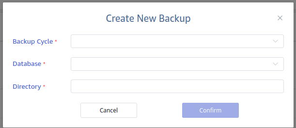

本节讲述如何使用可视化界面进行数据备份和恢复，具体请参考[可视化管理](../explorer)。服务安装与部署请参考 [安装与部署](../../get-started)。

## 备份和恢复

您可以将当前连接的 TDengine 集群中的数据备份至一个或多个本地文件中，稍后可以通过这些文件进行数据恢复。本章节将介绍数据备份和恢复的具体步骤。

### 备份数据到本地文件

1. 进入系统管理页面，点击【备份】进入数据备份页面，点击右上角【新增备份】。
2. 在数据备份配置页面中可以配置三个参数：
  - 备份周期：必填项，配置每次执行数据备份的时间间隔，可通过下拉框选择每天、每 7 天、每 30 天执行一次数据备份，配置后，会在对应的备份周期的0:00时启动一次数据备份任务；
  - 数据库：必填项，配置需要备份的数据库名（数据库的 wal_retention_period 参数需大于0）；
  - 目录：必填项，配置将数据备份到 taosX 所在运行环境中指定的路径下，如 /root/data_backup；
3. 点击【确定】，可创建数据备份任务。



### 从本地文件恢复

1. 完成数据备份任务创建后，在页面中对应的数据备份任务右侧点击【数据恢复】，可将已经备份到指定路径下的数据恢复到当前 TDengine 中。

## 常见错误排查

(1) 如果任务启动失败并报以下错误：

```text
Error: tmq to td task exec error

Caused by:
    [0x000B] Unable to establish connection
```
产生原因是与数据源的端口链接异常，需检查数据源 FQDN 是否联通及端口 6030 是否可正常访问。

(2) 如果使用 WebSocket 连接，任务启动失败并报以下错误：

```text
Error: tmq to td task exec error

Caused by:
    0: WebSocket internal error: IO error: failed to lookup address information: Temporary failure in name resolution
    1: IO error: failed to lookup address information: Temporary failure in name resolution
    2: failed to lookup address information: Temporary failure in name resolution
```

使用 WebSocket 连接时可能遇到多种错误类型，错误信息可以在 ”Caused by“ 后查看，以下是几种可能的错误：

- "Temporary failure in name resolution": DNS 解析错误，检查 IP 或 FQDN 是否能够正常访问。
- "IO error: Connection refused (os error 111)": 端口访问失败，检查端口是否配置正确或是否已开启和可访问。
- "IO error: received corrupt message": 消息解析失败，可能是使用了 wss 方式启用了 SSL，但源端口不支持。
- "HTTP error: *": 可能连接到错误的 taosAdapter 端口或 LSB/Nginx/Proxy 配置错误。
- "WebSocket protocol error: Handshake not finished": WebSocket 连接错误，通常是因为配置的端口不正确。

(3) 如果任务启动失败并报以下错误：

```text
Error: tmq to td task exec error

Caused by:
    [0x038C] WAL retention period is zero
```

是由于源端数据库 WAL 配置错误，无法订阅。

解决方式：
修改数据 WAL 配置：

```sql
alter database test wal_retention_period 3600;
```
