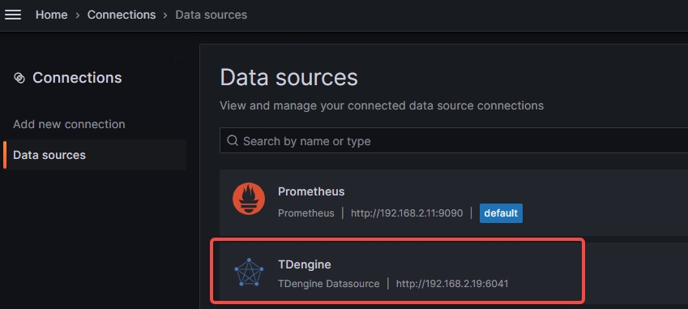
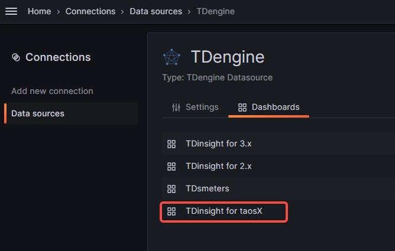
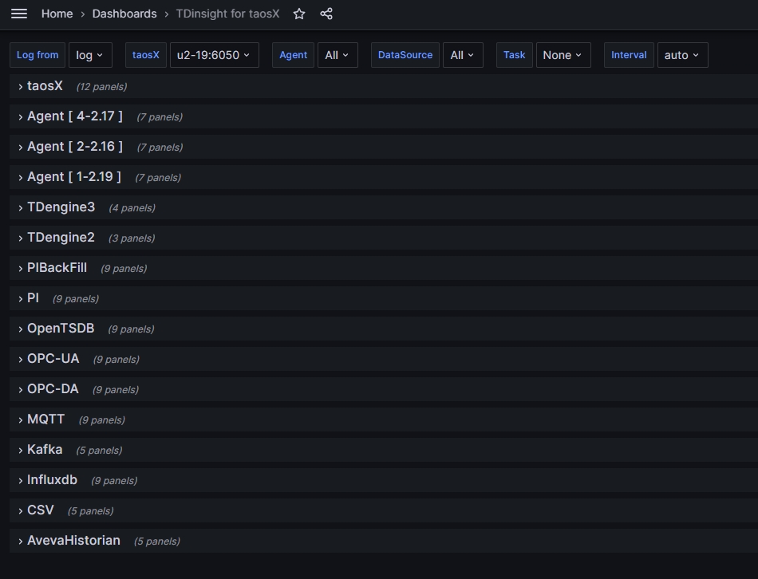
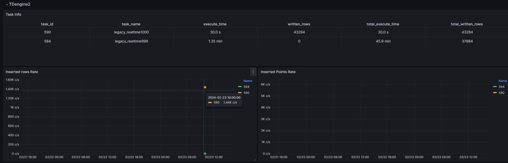
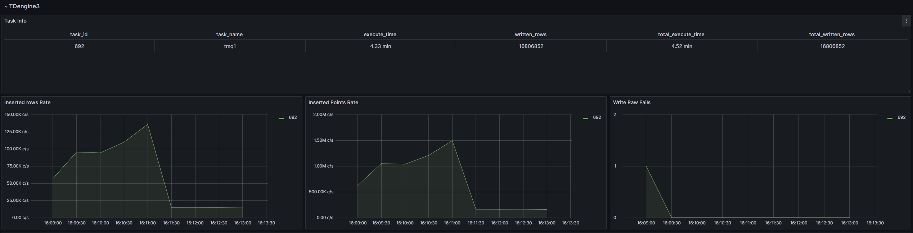
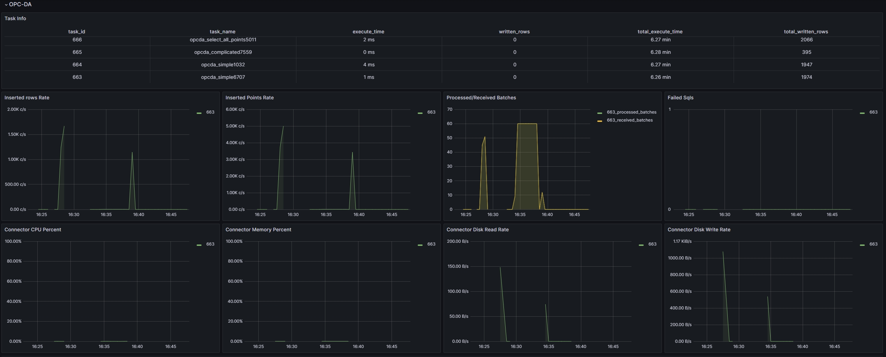

## 1. 功能介绍

本文主要介绍 taosX 与监控相关的配置和 taosX 对应的 TDinsight 面板。taosX 监控与 TDengine 监控类似，都是通过 taosKeeper 将服务搜集的 metrics 写入指定数据库，然后借助 Grafana 面板做可视化和报警。这个功能可监控的对象包括：
1. taosX 进程
2. 所有运行中的 taosx-agent 进程
3. 运行在 taosX 端或 taosx-agent 端的各个连接器子进程
4. 运行中的各类数据写入任务

## 2. 版本支持

1. TDengine 企业版本 3.2.3.0 或以上版本包含的 taosX 才包含此功能。如果单独安装 taosX，需要 taosX 1.5.0 或以上版本。
1. 需要安装 Grafana 插件 [TDengie Datasource v3.5.0](https://grafana.com/grafana/plugins/tdengine-datasource/) 或以上版本。

## 3. 准备工作
假设你已经部署好了 TDengine 和 taosAdapter。 那么还需要：
1. 参考 [参考手册/taosKeeper](../../reference/taosKeeper) 部署 taosKeeper。
2. 按照本文第 4 节的配置，启动 taosX 服务。
3. 参考 [第三方工具/Grafana](../../third-party/grafana) 部署 Grafana ，安装 TDengine Datasource 插件，配置好数据源。


## 4. taosX 配置

toasX 的配置文件(默认 /etc/taos/taosx.toml) 中与 monitor 相关的配置如下：

```toml
[monitor]
# FQDN of taosKeeper service, no default value
# fqdn = "localhost"
# port of taosKeeper service, default 6043
# port = 6043
# how often to send metrics to taosKeeper, default every 10 seconds. Only value from 1 to 10 is valid.
# interval = 10
```

每个配置也有对应的命令行选项和环境变量。通过以下表格说明：

| 配置文件配置项 | 命令行选项         | 环境变量          | 含义                                                    | 取值范围 | 默认值                                   |
| -------------- | ------------------ | ----------------- | ------------------------------------------------------- | -------- | ---------------------------------------- |
| fqdn           | --monitor-fqdn     | MONITOR_FQDN      | taosKeeper 服务的 FQDN                                  |          | 无默认值，配置 fqdn 就等于开启了监控功能 |
| port           | --monitor-port     | MONITOR_PORT      | taosKeeper 服务的端口                                   |          | 6043                                     |
| interval       | --monitor-interval | MONITTOR_INTERVAL | taosX 发送 metrics 数据到 taosKeeper 的时间间隔，单位秒 | 1-10     | 10                                       |

## 5. TDinsight for taosX

"TDinsight for taosX" 专门为 taosX 监控创建的 Grafana 面板。使用前需要先导入这个面板。

### 5.1 进入面板

1. 选择 TDengine Datasource
   
2. 点击 “Dashboard”, 选择 TDinsight for taosX 面板。（第一次使用需要先导入）。
   
   
    该面板每一行代表一个或一类监控对象。最上面是 taosX 监控行，然后是 Agent 监控行, 最后是各类数据写入任务的监控。
    :::note
    1. 如果打开这个面板后看不到任何数据，你很可能需要点击左上角的数据库列表（即 “Log from” 下拉菜单），切换到监控数据所在的数据库。
    2. 数据库包含多少个 Agent 的数据就会自动创建多少个 Agent 行。(如上图)

    :::


### 5.2 监控示例

#### 5.2.1 taosX 监控示例


#### 5.2.2 Agent 监控示例


#### 5.2.3 TDengine2 数据源监控示例



:::info
监控面板只展示了数据写入任务的部分监控指标，在 Explorer 页面上有更全面的监控指标，且有每个指标的具体说明。

:::

#### 5.2.4 TDengine3 数据源监控示例



#### 5.2.5 其它数据源监控示例



## 6. 限制

只有在以 server 模式运行 taosX 时，与监控相关的配置才生效。
