## 简介

为了易于企业版用户更容易使用和管理数据库，TDengine 3.0 企业版提供了一个全新的可视化组件 taosExplorer。用户能够在其中方便地管理数据库管理系统中中各元素（数据库、超级表、子表）的生命周期，执行查询，监控系统状态，管理用户和授权，完成数据备份和恢复，与其它集群之间进行数据同步，导出数据，管理主题和流计算。

## 部署服务

详情请参考 [部署服务](../../get-started)

## 登录

在 TDengine 管理系统的登录页面，输入正确的用户名和密码后，点击登录按钮，即可登录。

说明：
- 这里的用户，需要在所连接的 TDengine 中创建，TDengine 默认的用户名和密码为`root/taosdata`;
- 在 TDengine 中创建用户时，默认会设置用户的 SYSINFO 属性值为1, 表示该用户可以查看系统信息，只有 SYSINFO 属性为 1 的用户才能正常登录 TDengine 管理系统。

## 面板

taosExplorer 内置了一个简单的仪表盘展示以下集群信息，点击左侧功能列表中的 "面板" 可以启用此功能。

- 默认的仪表盘会返回对应 Grafana 的安装配置向导
- 配置过 Grafana 的仪表盘在点击' 面板' 时会跳转到对应的配置地址（该地址来源于 /profile 接口的返回值）

## 数据浏览器

点击功能列表的“数据浏览器”入口，在“数据浏览器”中可以创建和删除数据库、创建和删除超级表和子表，执行SQL语句，查看SQL语句的执行结果。此外，超级管理员还有对数据库的管理权限，其他用户不提供该功能。如下图所示：
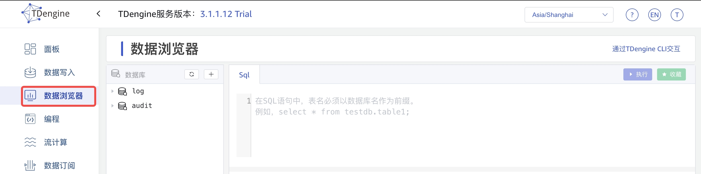

下面通过创建数据库，来熟悉数据浏览器页面的功能和操作，接下来看创建数据库的两种方式：

1. 通过点击图中的 + 号，跳转到创建数据数库页面，点击 创建 按钮，如下图：

第一步 点击 + 号；
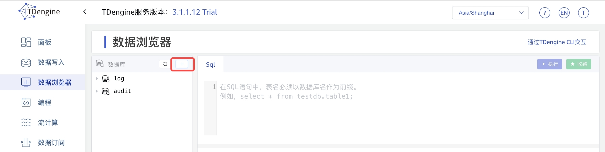

第二步 填写数据库名称、需要的数据库配置参数，配置参数进行了分类和折叠，点击可展开；
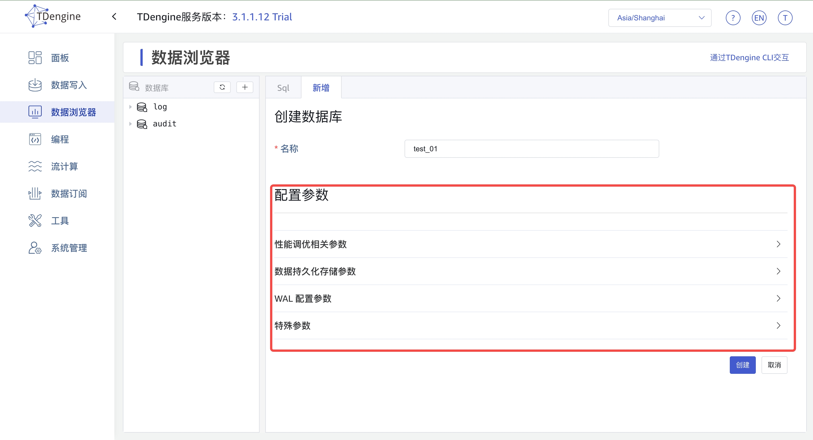

弟三步 点击“创建”按钮之后，如下图左边出现数据库名称则创建数据库成功。
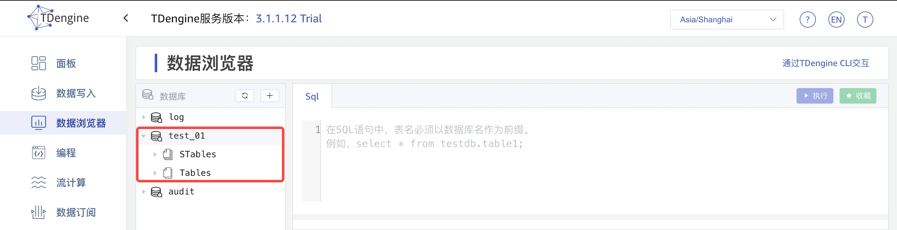

2. 通过在 Sql 编辑器中数据 sql 语句，点击 执行 按钮，如下图：

第一步 输入 sql 语句；
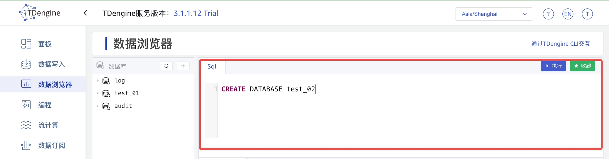

第二步 点击“执行”按钮，左边出现 test02, 则数据库创建成功。
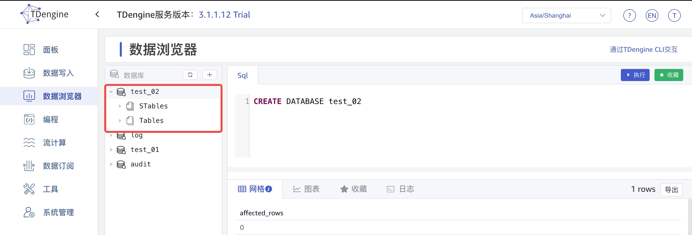

由于创建、修改和删除超级表、创建表、创建子表在行为上是一致的，就以创建超级表为示例做演示：

### 创建超级表

第一步 鼠标移动到 STables 上，点击出现的 + 号，出现创建超级表 tab；
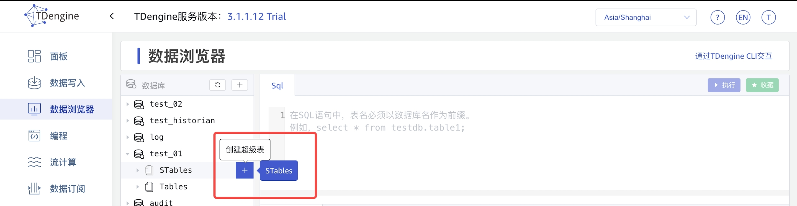

第二步 填写超级表信息， 点击“创建”按钮；
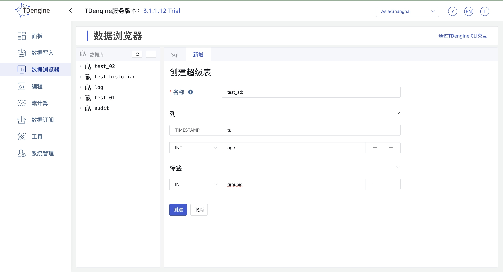

第三步 点击 Stables 出现刚才填写的超级表名，则证明创建成功。
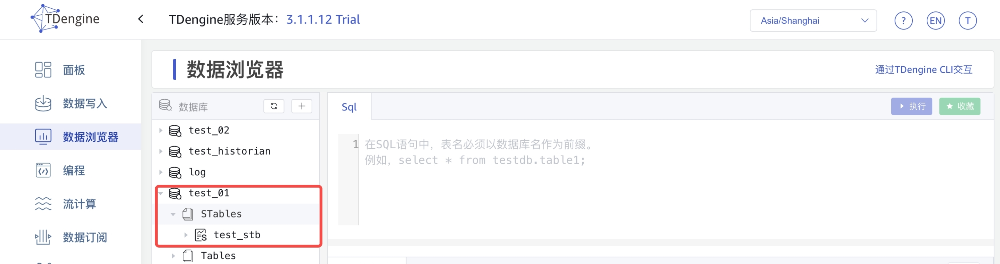

### 查看超级表

鼠标放在需要查看的超级表上，出现如下图所示图标，点击“眼睛图标”查看超级表信息 
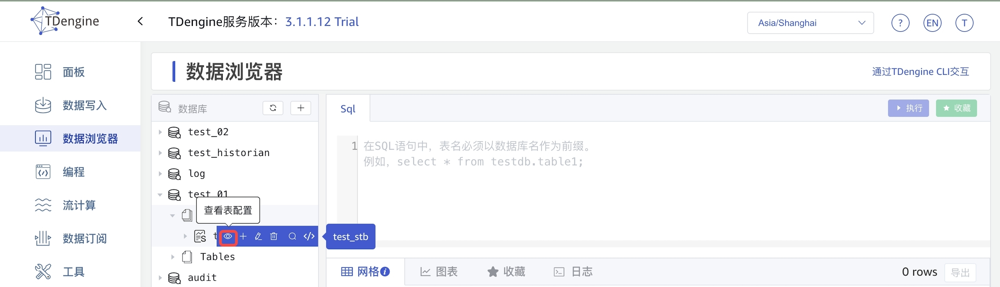
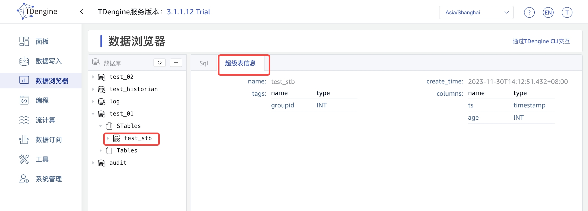

### 修改超级表

鼠标放在需要编辑的超级表上，出现如下图所示图标，点击“编辑图标”修改超级表信息 

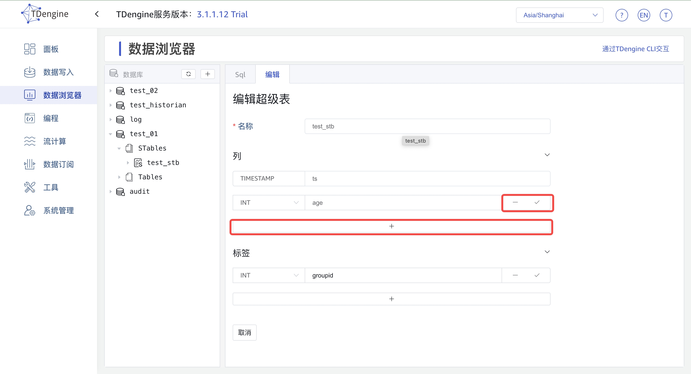

### 删除超级表

鼠标放在需要删除的超级表上，出现如下图所示图标，点击“删除图标”删除超级表
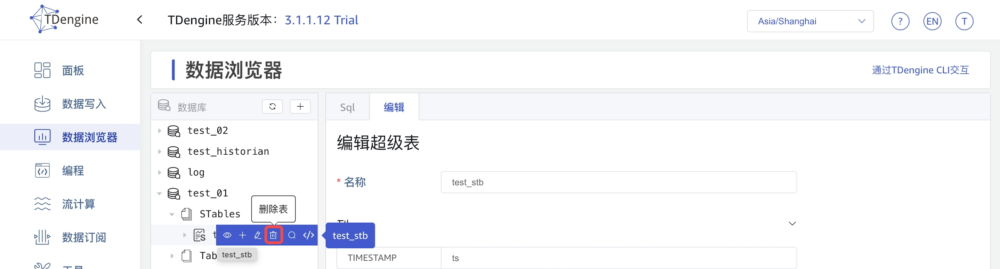

### Sql 编辑器使用

当输入多条语句，可以鼠标选中需要指执行的语句，也可以对语句进行注释（快捷键 Control-/ Command-/）,然后再点击执行即可
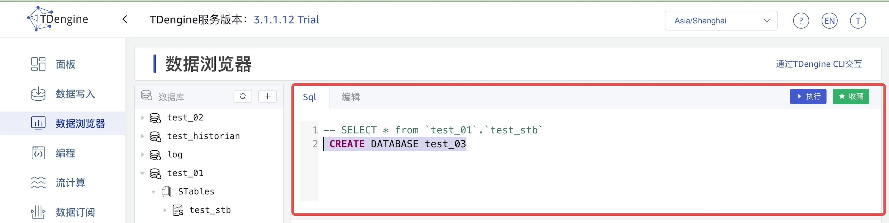

## 系统管理

点击功能列表中的“系统管理”入口，可以创建用户、对用户进行访问授权、以及删除用户。还能够对当前所管理的集群中的数据进行备份和恢复。也可以配置一个远程 TDengine 的地址进行数据同步。同时也提供了集群信息和许可证的信息以及代理信息以供查看。系统管理菜单只有 root 用户才有权限看到。

在“系统管理”的“许可证”标签页，为了方便用户对企业版进行激活操作，用户可以直接在这个页面查看当前 Explorer 所管理集群的 ID 信息。

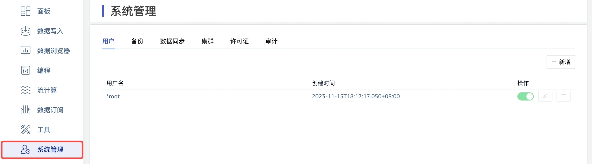

## 用户管理

点击“系统管理”后，默认会进入“用户”标签页。
在用户列表，可以查看系统中已存在的用户及其创建时间，并可以对用户进行启用、禁用，编辑（包括修改密码，数据库的读写权限等），删除等操作。

第一步 点击用户列表右上方的“+新增”按钮，即可打开“新增用户”对话框，填写新增用户的信息，点击“确定”按钮：
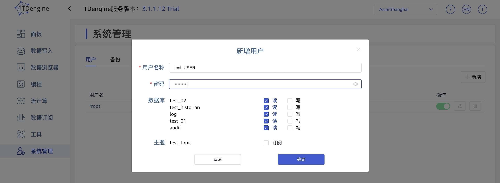

第二步 查看新增的用户
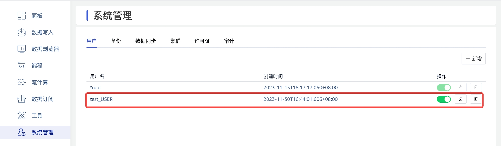

### 备份

您可以将当前连接的 TDengine 集群中的数据备份至一个或多个本地文件中

第一步 进入系统管理页面，点击【备份】进入数据备份页面，点击右上角【创建新备份】。
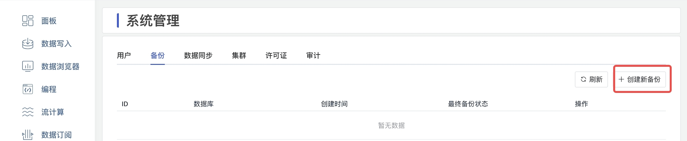

第二步 在数据备份配置页面中可以配置三个参数：
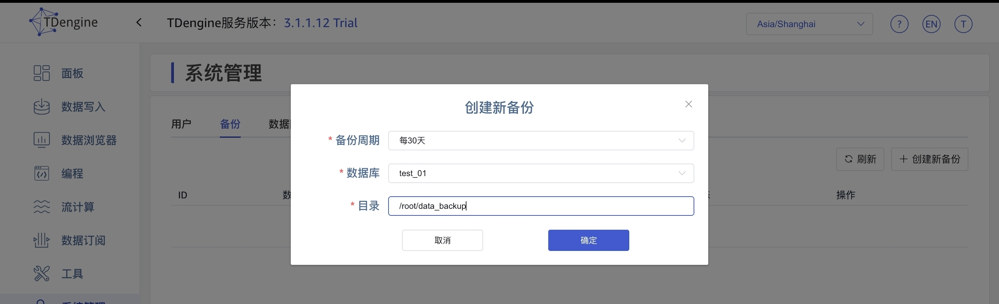
  
第三步 点击【确定】，可创建数据备份任务。

### 数据同步

进行数据库之间的数据同步，从DB1到DB2

第一步 进入系统管理页面，点击【数据同步页面】进入数据备份页面，点击右上角【添加新的复制】。

第二步 在数据同步页面配置参数

第三步 点击【确定】，可创建数据同步任务。

### 集群

点击“集群”标签后，可以查看DNodes, MNodes和QNodes的状态、创建时间等信息，并可以对以上节点进行新增和删除操作。

### 许可证管理

点击“许可证”标签后，可以查看系统和系统和各连接器的许可证信息。
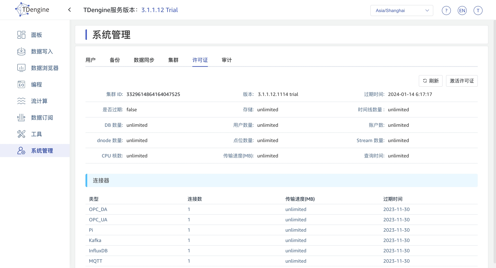

点击位于“许可证”标签页右上角的“激活许可证”按钮，输入“激活码”和“连接器激活码”后，点击“确定”按钮，即可激活，激活码请联系 TDengine 客户成功团队获取。
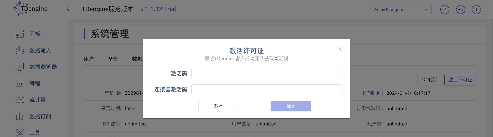

### 审计

点击“审计”标签后，可以查看各用户操作库表以及登陆等信息。
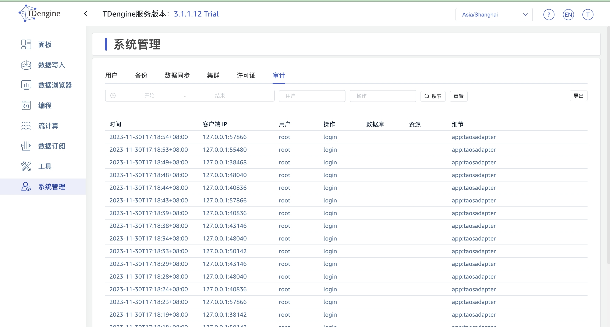

## 数据写入

点击功能列表中的 "数据写入"，可以配置不同类型的数据源，包括旧版本 TDengine（2.x）， TDengine 订阅，PI， OPC-UA，OPC-DA，InfluxDB，MQTT，Kafka，CSV 等，将它们的数据写入到当前正在被 Explorer 管理的 TDengine 集群中。

在数据源的任务列表，每个任务都支持编辑、删除和复制3种操作。通过点击复制按钮，对已有的任务进行简单的编辑后，即可快速提交新的任务。任务提交后，还可以点击Metrics的查看按钮，获取任务运行中的实时数据指标。

不同数据源的操作指南请参考 [数据写入](../datain)。

## 备份和恢复

您可以将当前连接的 TDengine 集群中的数据备份至一个或多个本地文件中，稍后可以通过这些文件进行数据恢复。本章节将介绍数据备份和恢复的具体步骤。

### 备份数据到本地文件

1. 进入系统管理页面，点击【备份】进入数据备份页面，点击右上角【新增备份】。
2. 在数据备份配置页面中可以配置三个参数：
  - 备份周期：必填项，配置每次执行数据备份的时间间隔，可通过下拉框选择每天、每 7 天、每 30 天执行一次数据备份，配置后，会在对应的备份周期的0:00时启动一次数据备份任务；
  - 数据库：必填项，配置需要备份的数据库名（数据库的 wal_retention_period 参数需大于0）；
  - 目录：必填项，配置将数据备份到 taosX 所在运行环境中指定的路径下，如 /root/data_backup；
3. 点击【确定】，可创建数据备份任务。

### 从本地文件恢复

1. 完成数据备份任务创建后，在页面中对应的数据备份任务右侧点击【数据恢复】，可将已经备份到指定路径下的数据恢复到当前 TDengine 中。

## 数据订阅
通过 Explorer, 您可以轻松地完成对数据订阅的管理，从而更好地利用 TDengine 提供的数据订阅能力。
点击左侧导航栏中的“数据订阅”，即可跳转至数据订阅配置管理页面。
您可以通过以下两种方式创建主题：使用向导和自定义 SQL 语句。通过自定义 SQL 创建主题时，您需要了解 TDengine 提供的数据订阅 SQL 语句的语法，并保证其正确性。

 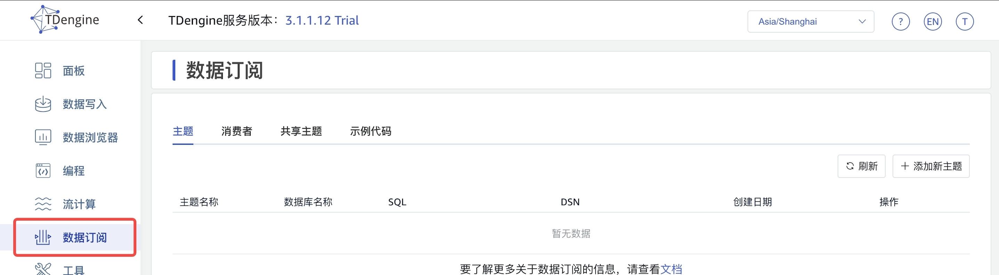

 ### 添加数据订阅
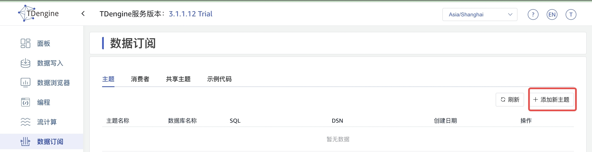
 1. Wizard 方式 
 第一步 填写添加新主题需要的信息，点击“创建”按钮；

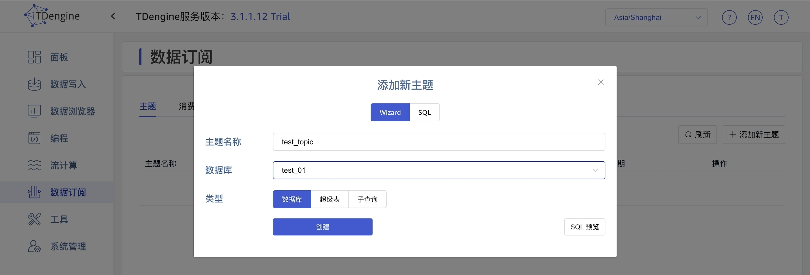

第二步 页面出现以下记录，则证明创建成功。
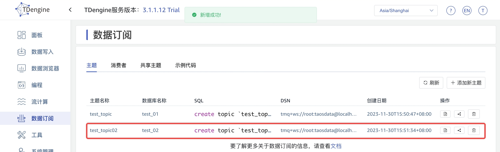

2. Sql 方式

第一步 切换到 SQL 页，直接输入添加新主题 sql, 点击“创建”按钮；
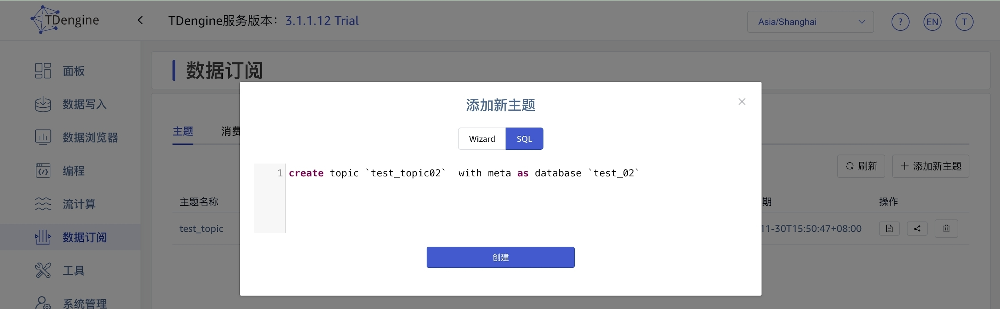

第二步 页面出现以下记录，则证明创建成功。
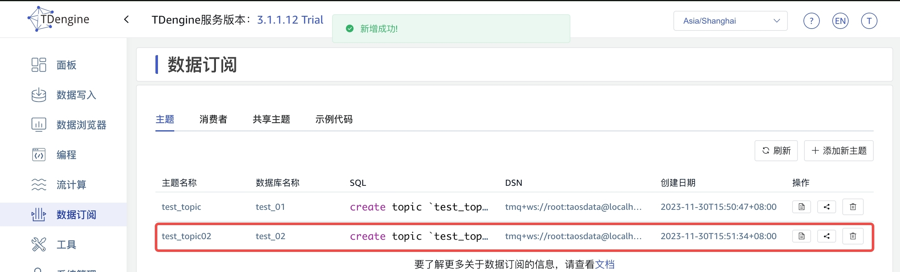

### 共享主题
在“共享主题”标签页，在“主题“下拉列表中，选择将要分享的主题；
点击“添加可消费该主题的用户”按钮，然后在“用户名”下拉列表中选择相应的用户，然后点击“新增”，即可将该主题分享给此用户

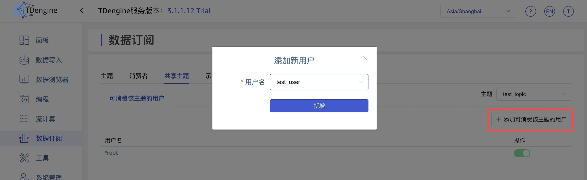

### 查看消费者信息
通过执行下一节“示例代码”所述的“完整实例”，即可消费共享主题
在“消费者”标签页，可查看到消费者的有关信息
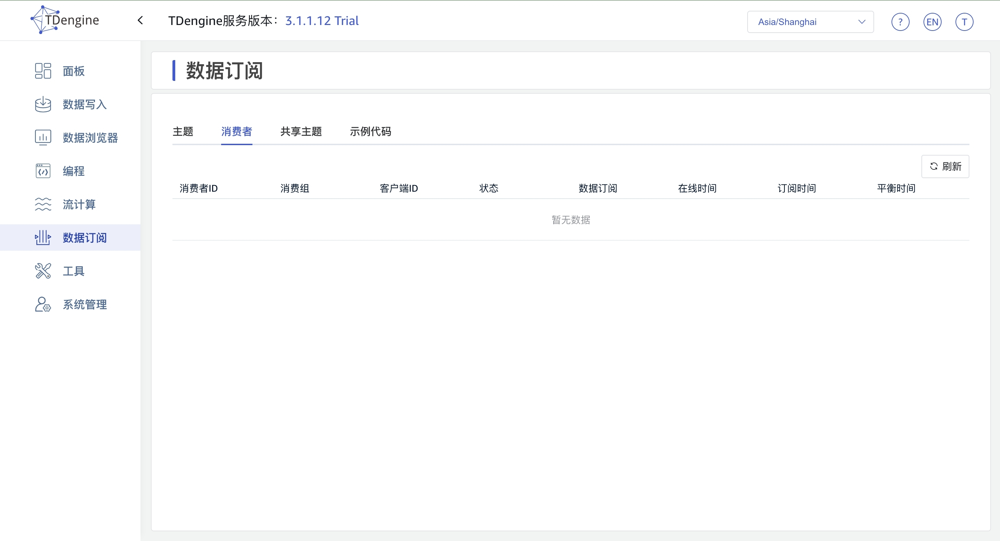

### 示例代码
在“示例代码”标签页，在“主题“下拉列表中，选择相应的主题；
选择您熟悉的语言，然后您可以阅读以及使用这部分示例代码用来”创建消费“，”订阅主题“，通过执行 “完整实例”中的程序即可消费共享主题

## 流计算

通过 Explorer, 您可以轻松地完成对流的管理，从而更好地利用 TDengine 提供的流计算能力。
点击左侧导航栏中的“流计算”，即可跳转至流计算配置管理页面。
您可以通过以下两种方式创建流：流计算向导和自定义 SQL 语句。当前，通过流计算向导创建流时，暂不支持分组功能。通过自定义 SQL 创建流时，您需要了解 TDengine 提供的流计算 SQL 语句的语法，并保证其正确性。
 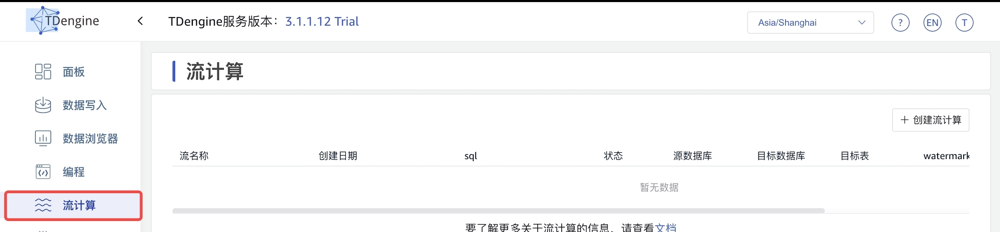

### 创建流计算

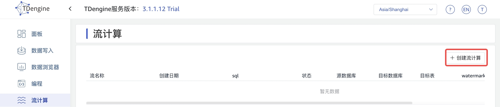
 1. Wizard 方式 
 第一步 填写创建流计算需要的信息，点击 创建 按钮；

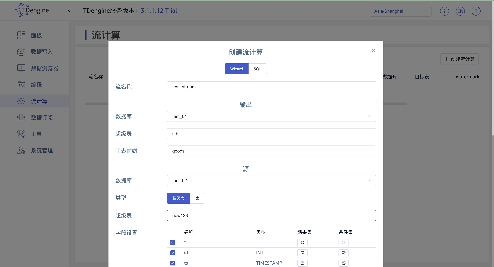

第二步 页面出现以下记录，则证明创建成功。
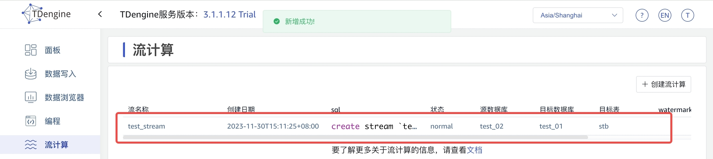

2. Sql 方式

第一步 切换到 SQL 页，直接输入创建流计算 sql, 点击 创建 按钮；
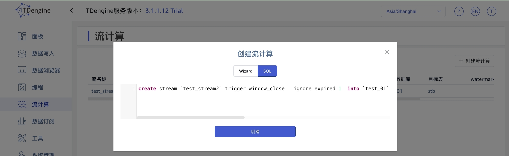

第二步 页面出现以下记录，则证明创建成功。
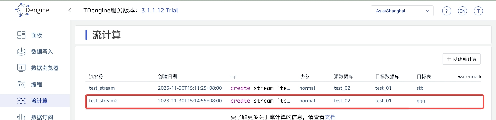
