### InfluxDB
1. 在数据写入页面中点击左上角的 <button style="color: #4259ce">+新增数据源</button> 按钮进入新增数据源页面，如下图所示：
  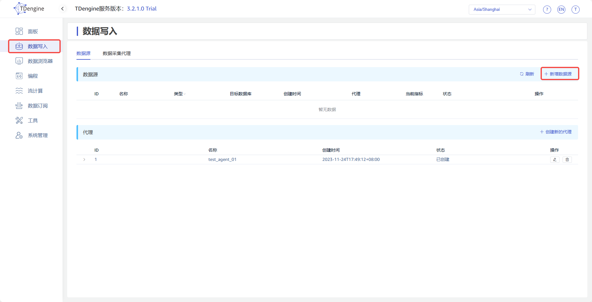
  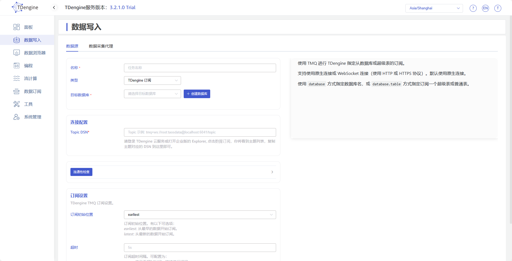
2. 在 **名称** 字段中输入任务名称，例如 *`test_influxdb_01`* 。
3. 选择 **类型** 下拉框中的 *`InfluxDB`* ，如下图所示（选择完成后页面中的字段会发生变化）：
  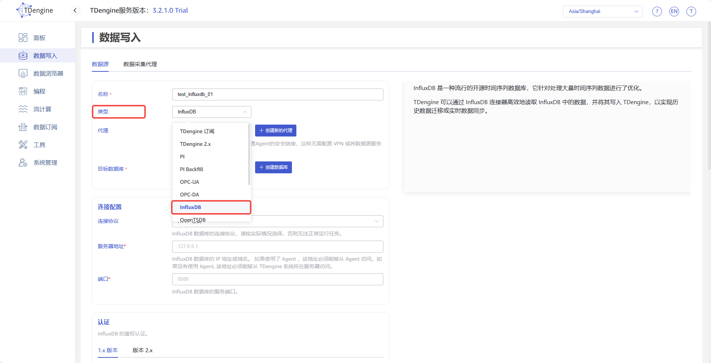
4. **代理** 是非必填项，如有需要，可以在下拉框中选择指定的代理，也可以先点击右侧的 <button style="color: #4259ce">+创建新的代理</button> 按钮 [创建一个新的代理](#创建代理) 。
5. **目标数据库** 是必填项，由于 InfluxDB 存储数据的时间精度可以同时存在秒、毫秒、微秒与纳秒等，所以这里需要选择一个 *`纳秒精度的数据库`* ，也可以先点击右侧的 <button style="color: #4259ce">+创建数据库</button> 按钮 [创建一个新的数据库](#创建数据库) 。
6. 在 **连接配置** 区域填写 *`源 InfluxDB 数据库的连接信息`*，如下图所示：
  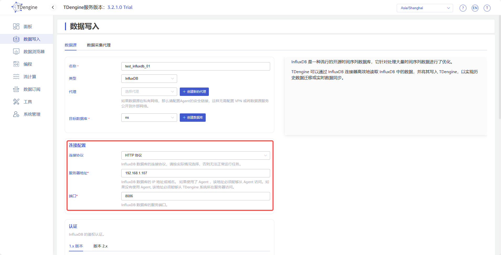
7. 在 **认证** 区域有两个选项卡，*`1.x 版本`* 与 *`2.x 版本`* ，这是由于不同版本的 InfluxDB 数据库的鉴权参数不同且 API 存在较大差异，请根据实际情况进行选择：  
  *`1.x 版本`*  
  **版本** 在下拉框中选择源 InfluxDB 数据库的版本。  
  **用户** 输入源 InfluxDB 数据库的用户，该用户必须在该组织中拥有读取权限。  
  **密码** 输入源 InfluxDB 数据库中上方用户的登陆密码。  
  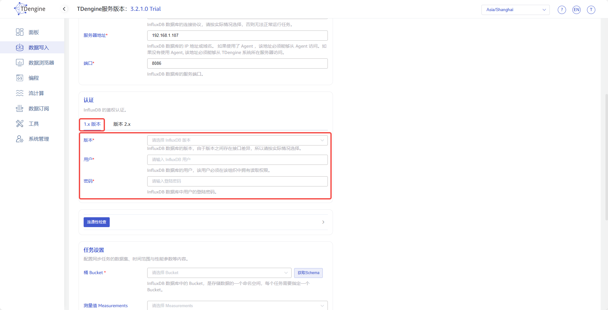
  *`2.x 版本`*  
  **版本** 在下拉框中选择源 InfluxDB 数据库的版本。  
  **组织 ID** 输入源 InfluxDB 数据库的组织 ID，它是一个由十六进制字符组成的字符串，而不是组织名称，可以从 InfluxDB 控制台的 Organization->About 页面获取。  
  **令牌 Token**：输入源 InfluxDB 数据库的访问令牌，该令牌必须在该组织中拥有读取权限。  
  **添加数据库保留策略** 这是一个 *`是/否`* 的开关项，InfluxQL 需要数据库与保留策略（DBRP）的组合才能查询数据，InfluxDB 的 Cloud 版本及某些 2.x 版本需要人工添加这个映射关系，打开这个开关，连接器可以在执行任务时自动添加。  
  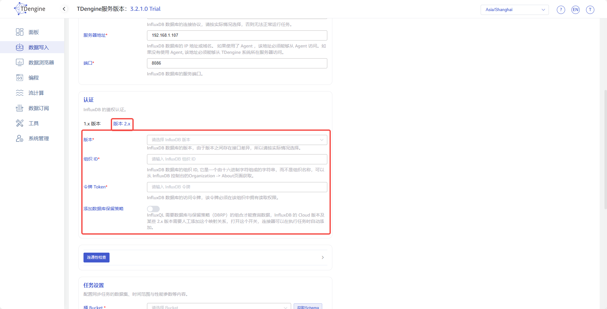
8. 在 **认证** 区域的下方有一个 <button style="color: #4259ce">连通性检查</button> 按钮，用户可以点击此按钮检查上方填写的信息是否可以正常获取源 InfluxDB 数据库的数据，检查结果如下图所示：  
  **失败**  
  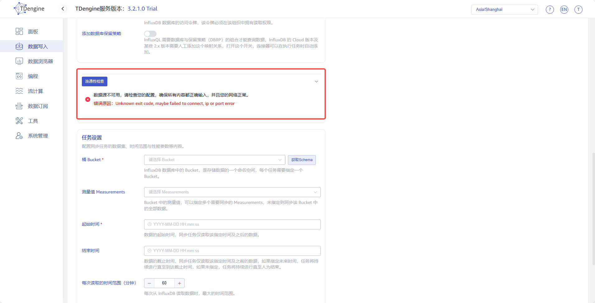
  **成功**  
  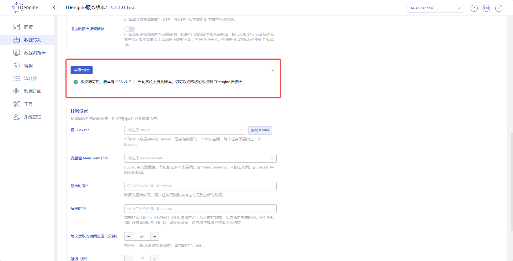
9. **桶 Bucket** 是 InfluxDB 数据库中存储数据的一个命名空间，每个任务需要指定一个 Bucket，用户需要先点击右侧的 <button style="color: #4259ce">获取 Schema</button> 按钮获取当前源 InfluxDB 数据库的数据结构信息，然后在下拉框中进行选择，如下图所示：
  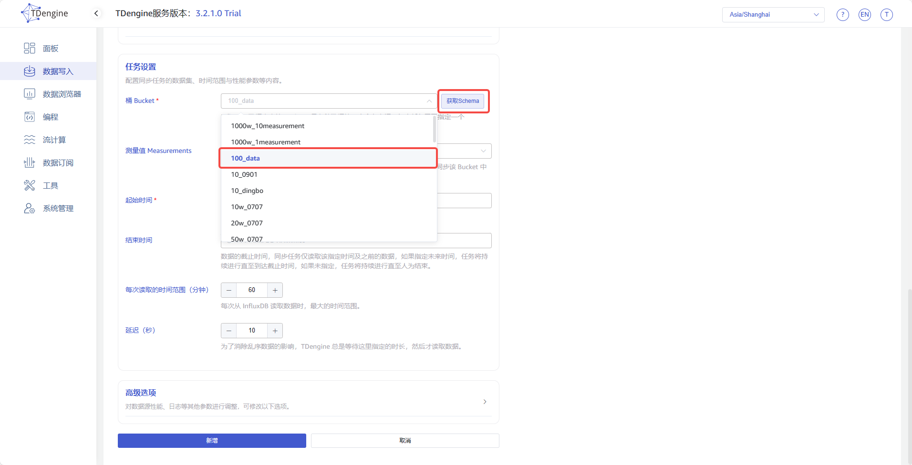
10. **测量值 Measurements** 是非必填项，用户可以在下拉框中选择一个或多个需要同步的 Measurements，未指定则同步全部。
11. **起始时间** 是指源 InfluxDB 数据库中数据的起始时间，起始时间的时区使用 explorer 所选时区，此项为必填字段。
12. **结束时间** 是指源 InfluxDB 数据库中数据的截止时间，当不指定结束时间时，将持续进行最新数据的同步；当指定结束时间时，将只同步到这个结束时间为止，结束时间的时区使用 explorer 所选时区，此项为可选字段。
13. **每次读取的时间范围（分钟）** 是连接器从源 InfluxDB 数据库中单次读取数据时的最大时间范围，这是一个很重要的参数，需要用户结合服务器性能及数据存储密度综合决定。如果范围过小，则同步任务的执行速度会很慢；如果范围过大，则可能因内存使用过高而导致 InfluxDB 数据库系统故障。
14. **延迟（秒）** 是一个范围在 1 到 30 之间的整数，为了消除乱序数据的影响，TDengine 总是等待这里指定的时长，然后才读取数据。
15. **高级选项** 区域是默认折叠的，点击右侧 `>` 可以展开，如下图所示：
  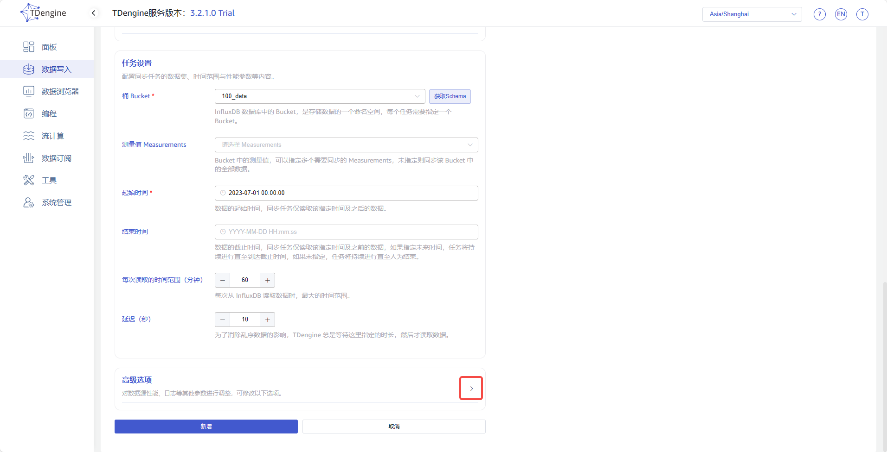
  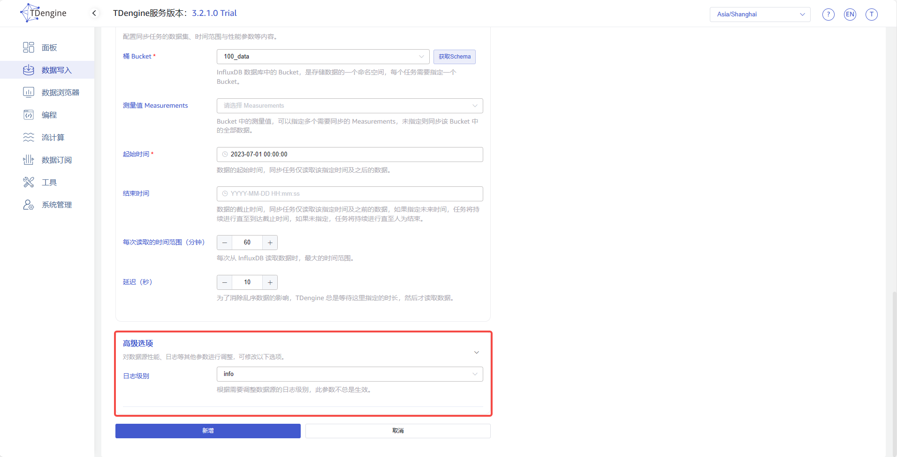
16. **日志级别** 默认是 *`info`* 级别，用户可以在下拉框中选择其他级别。
17. 填写完成以上信息后，点击提交按钮，即可直接启动从 InfluxDB 到 TDengine 的数据同步，如下图所示：
  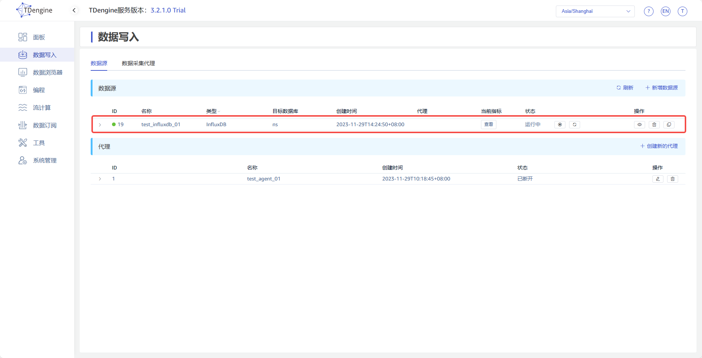
  