## 数据浏览器

点击功能列表的“数据浏览器”入口，在“数据浏览器”中可以创建和删除数据库、创建和删除超级表和子表，执行SQL语句，查看SQL语句的执行结果。此外，超级管理员还有对数据库的管理权限，其他用户不提供该功能。如下图所示：
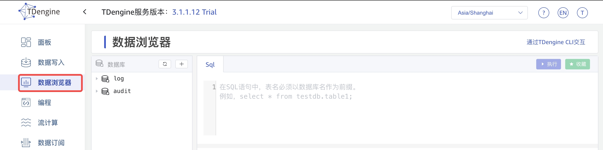

### 下面通过创建数据库，来熟悉数据浏览器页面的功能和操作，接下来看创建数据库的两种方式：

1. 通过点击图中的 + 号，跳转到创建数据数库页面，点击 创建 按钮，如下图：

第一步 点击 + 号；
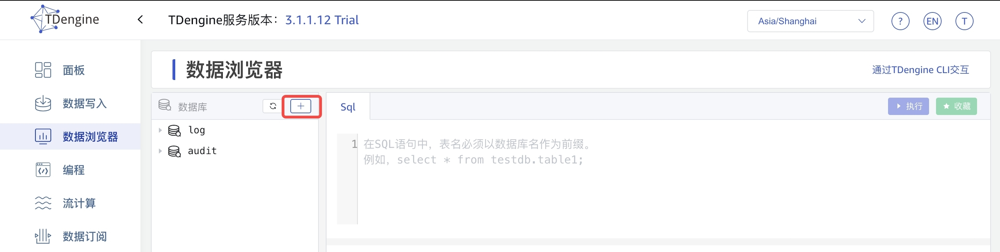

第二步 填写数据库名称、需要的数据库配置参数，配置参数进行了分类和折叠，点击可展开；

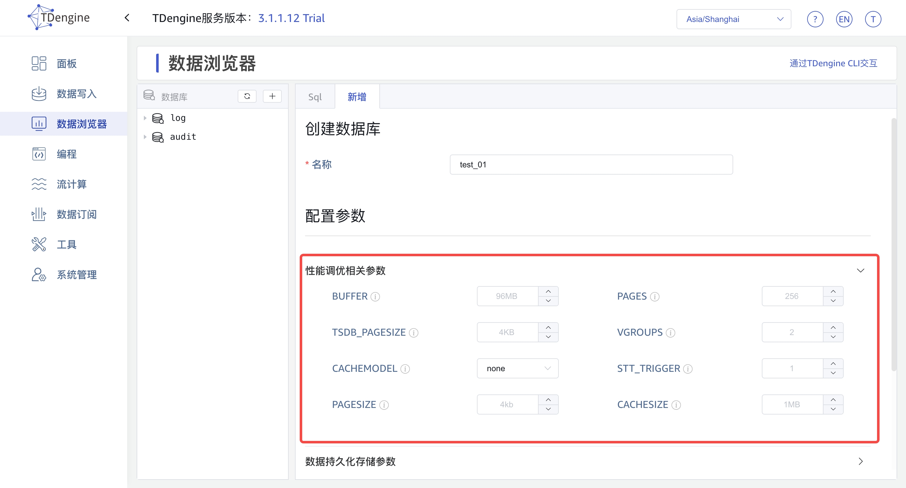

弟三步 点击“创建”按钮之后，如下图左边出现数据库名称则创建数据库成功。
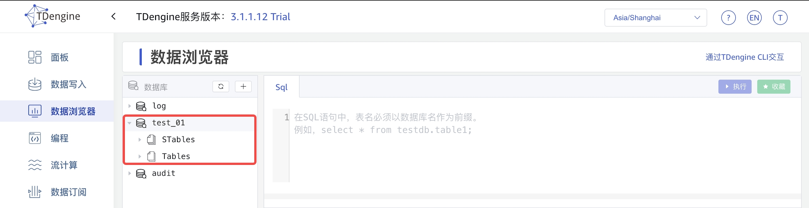

2. 通过在 Sql 编辑器中数据 sql 语句，点击 执行 按钮，如下图：

第一步 输入 sql 语句；
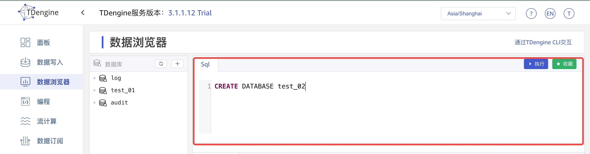

第二步 点击“执行”按钮，左边出现 test02, 则数据库创建成功。
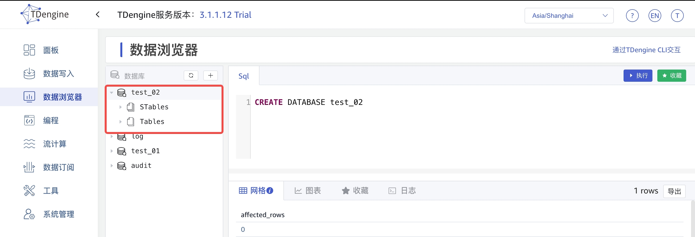

由于创建、修改和删除超级表、创建表、创建子表在行为上是一致的，就以创建超级表为示例做演示：

### 创建超级表
第一步 鼠标移动到 STables 上，点击出现的 + 号，出现创建超级表 tab；
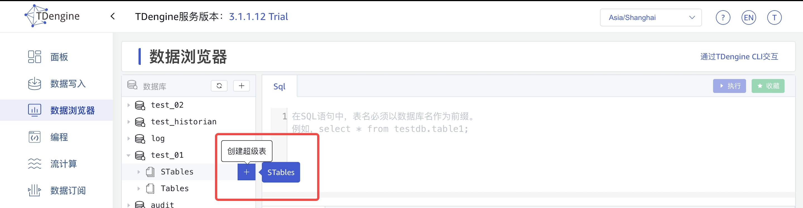

第二步 填写超级表信息， 点击“创建”按钮；

第三步 点击 Stables 出现刚才填写的超级表名，则证明创建成功。
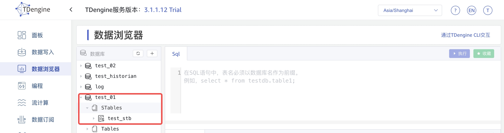

### 超看超级表
鼠标放在需要查看的超级表上，出现如下图所示图标，点击“眼睛图标”查看超级表信息 
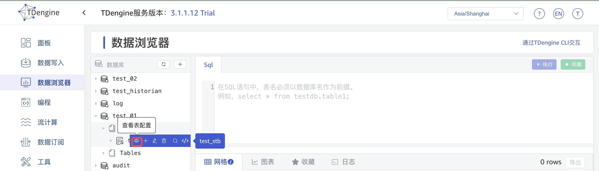
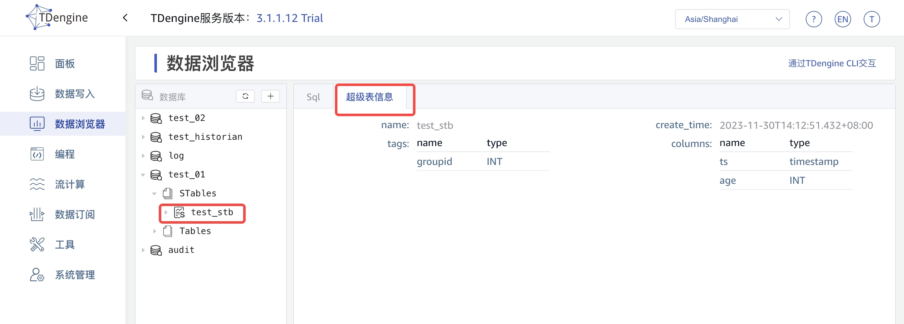

### 修改超级表
鼠标放在需要编辑的超级表上，出现如下图所示图标，点击“编辑图标”修改超级表信息 
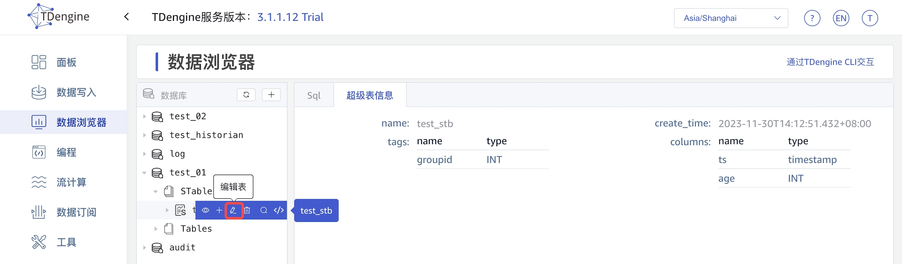

### 删除超级表
鼠标放在需要删除的超级表上，出现如下图所示图标，点击“删除图标”删除超级表
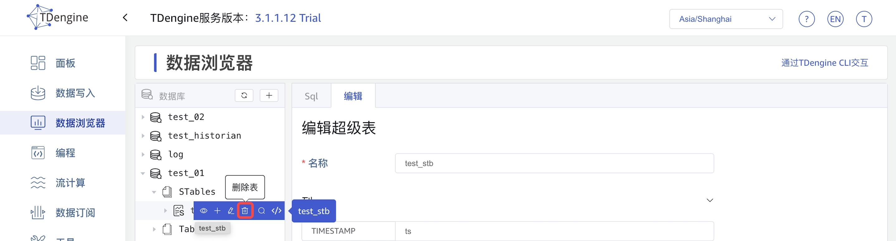

### Sql 编辑器使用
当输入多条语句，可以鼠标选中需要指执行的语句，也可以对语句进行注释（快捷键 Control-/ Command-/）,然后再点击执行即可
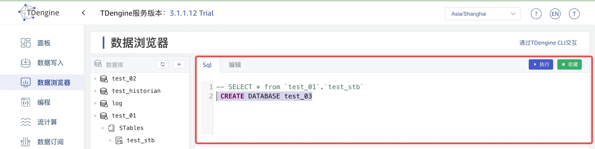

