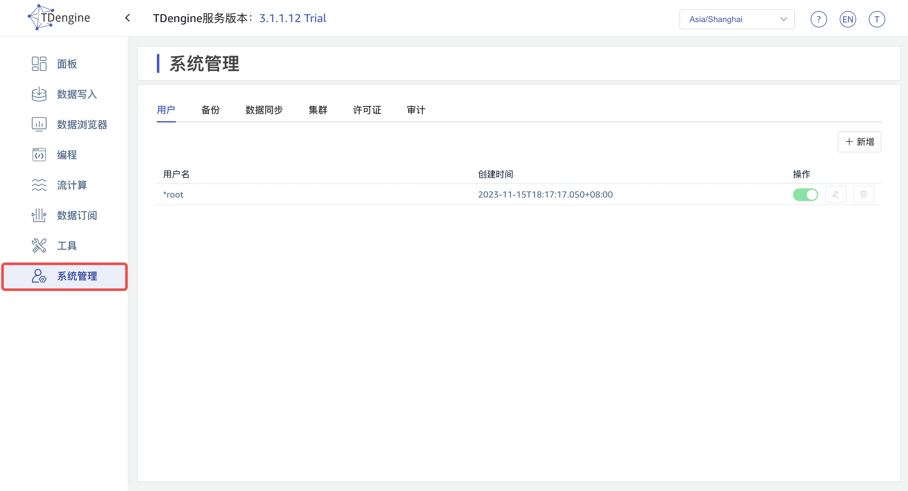
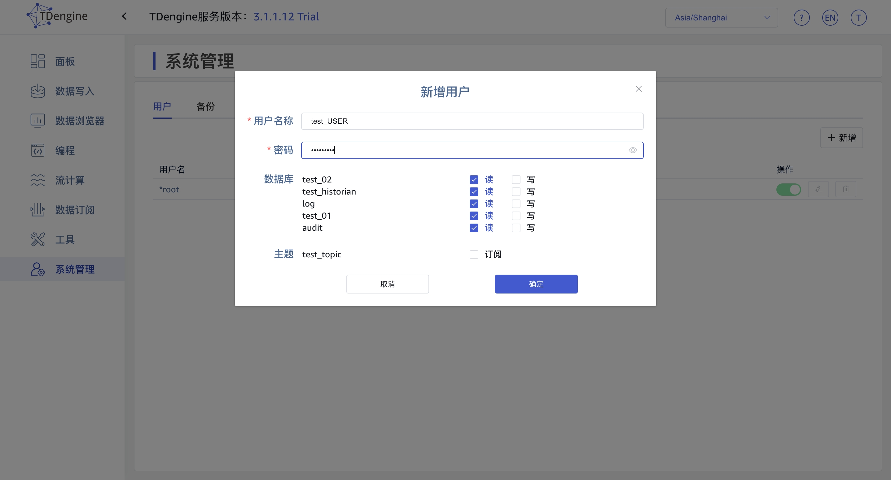
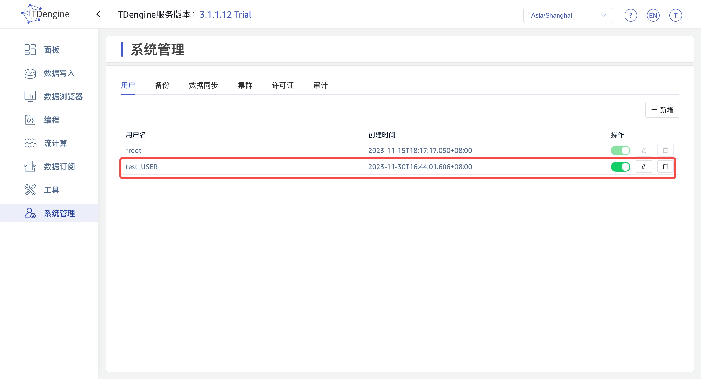
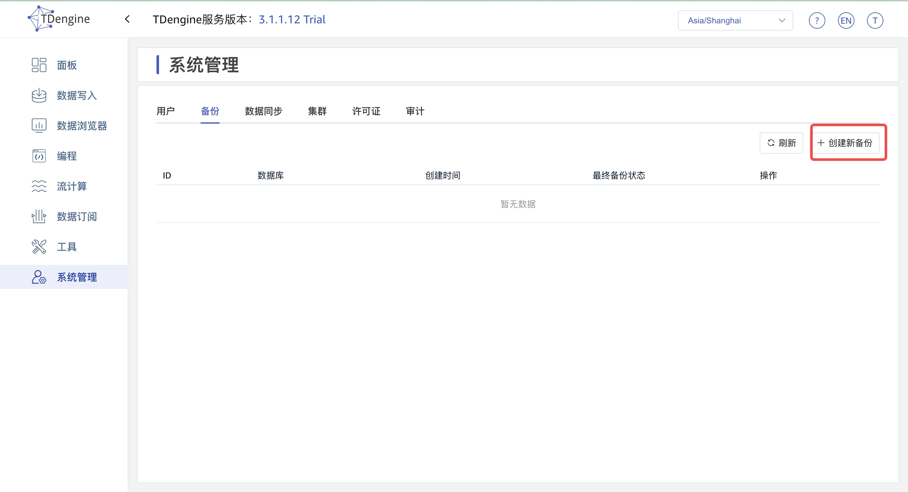
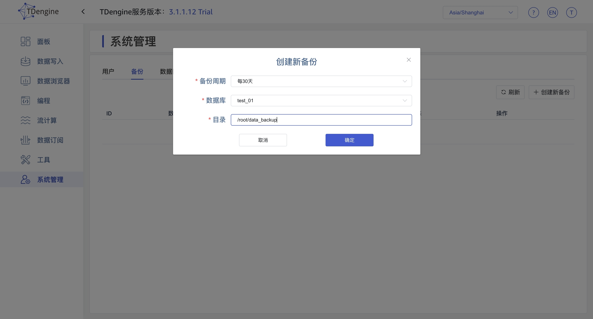
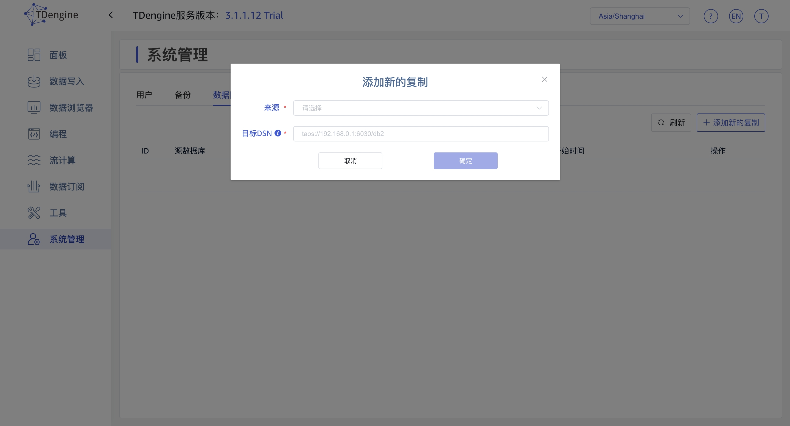
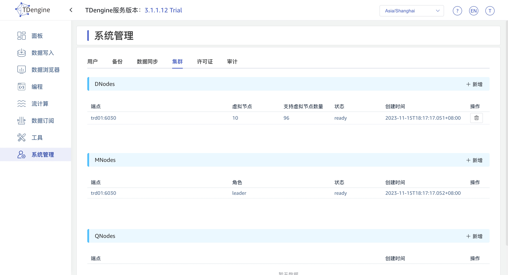

## 系统管理

点击功能列表中的“系统管理”入口，可以创建用户、对用户进行访问授权、以及删除用户。还能够对当前所管理的集群中的数据进行备份和恢复。也可以配置一个远程 TDengine 的地址进行数据同步。同时也提供了集群信息和许可证的信息以及代理信息以供查看。系统管理菜单只有 root 用户才有权限看到。

在“系统管理”的“许可证”标签页，为了方便用户对企业版进行激活操作，用户可以直接在这个页面查看当前 Explorer 所管理集群的 ID 信息。

## 用户管理

点击“系统管理”后，默认会进入“用户”标签页。
在用户列表，可以查看系统中已存在的用户及其创建时间，并可以对用户进行启用、禁用，编辑（包括修改密码，数据库的读写权限等），删除等操作。

第一步 点击用户列表右上方的“+新增”按钮，即可打开“新增用户”对话框，填写新增用户的信息，点击“确定”按钮：

第二步 查看新增的用户

### 备份

您可以将当前连接的 TDengine 集群中的数据备份至一个或多个本地文件中

第一步 进入系统管理页面，点击【备份】进入数据备份页面，点击右上角【创建新备份】。

第二步 在数据备份配置页面中可以配置三个参数：

  
第三步 点击【确定】，可创建数据备份任务。

### 数据同步

进行数据库之间的数据同步，从DB1到DB2

第一步 进入系统管理页面，点击【数据同步页面】进入数据备份页面，点击右上角【添加新的复制】。

第二步 在数据同步页面配置参数

第三步 点击【确定】，可创建数据同步任务。

### 集群

点击“集群”标签后，可以查看DNodes, MNodes和QNodes的状态、创建时间等信息，并可以对以上节点进行新增和删除操作。

### 许可证管理

点击“许可证”标签后，可以查看系统和系统和各连接器的许可证信息。

点击位于“许可证”标签页右上角的“激活许可证”按钮，输入“激活码”和“连接器激活码”后，点击“确定”按钮，即可激活，激活码请联系 TDengine 客户成功团队获取。

### 审计

点击“审计”标签后，可以查看各用户操作库表以及登陆等信息。

