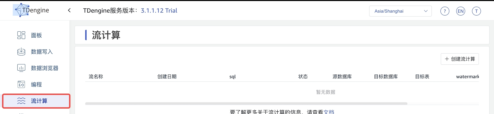
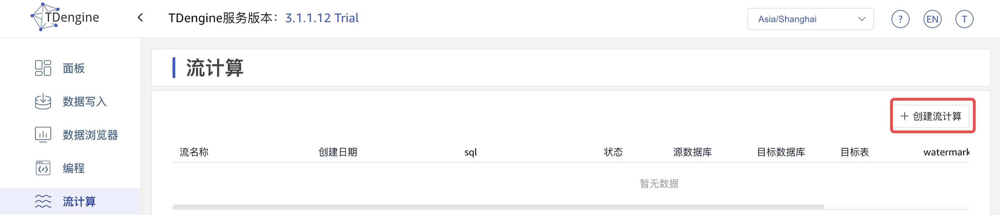
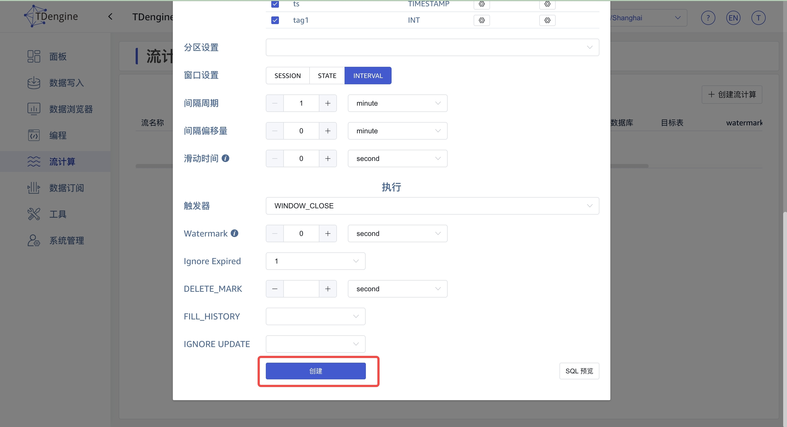
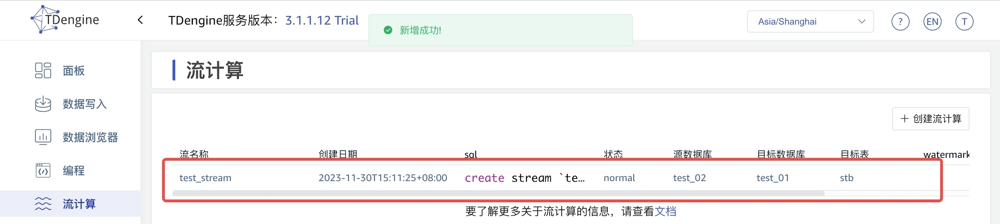
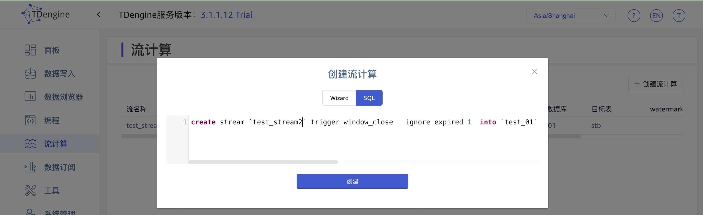
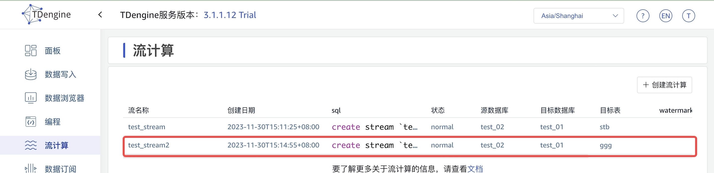

## 流计算
通过 Explorer, 您可以轻松地完成对流的管理，从而更好地利用 TDengine 提供的流计算能力。
点击左侧导航栏中的“流计算”，即可跳转至流计算配置管理页面。
您可以通过以下两种方式创建流：流计算向导和自定义 SQL 语句。当前，通过流计算向导创建流时，暂不支持分组功能。通过自定义 SQL 创建流时，您需要了解 TDengine 提供的流计算 SQL 语句的语法，并保证其正确性。
 

 ### 创建流计算

 1. Wizard 方式 
 第一步 填写创建流计算需要的信息，点击 创建 按钮；

第二步 页面出现以下记录，则证明创建成功。

2. Sql 方式

第一步 切换到 SQL 页，直接输入创建流计算 sql, 点击 创建 按钮；

第二步 页面出现以下记录，则证明创建成功。

