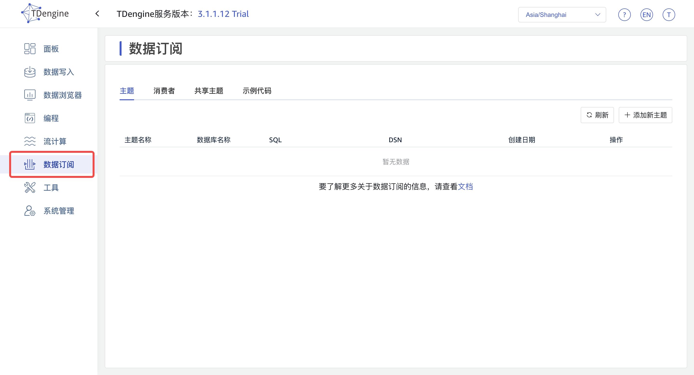
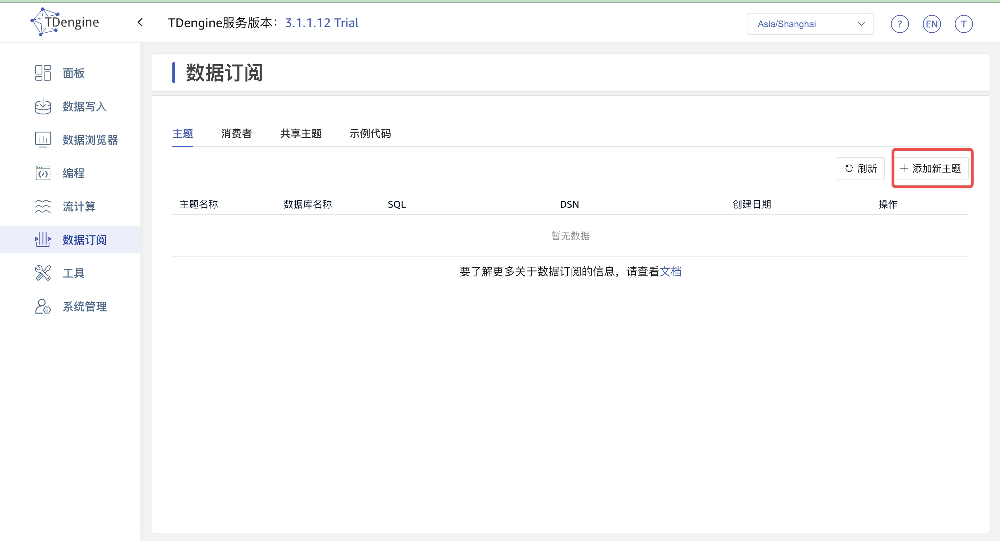
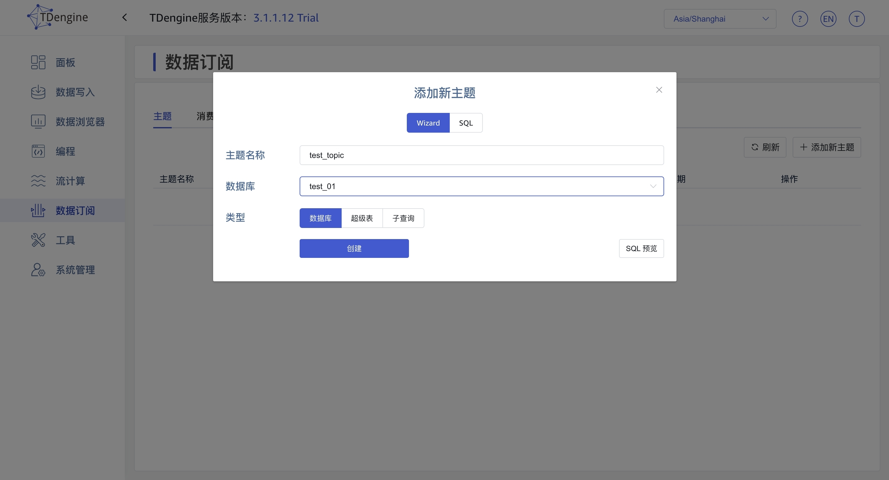
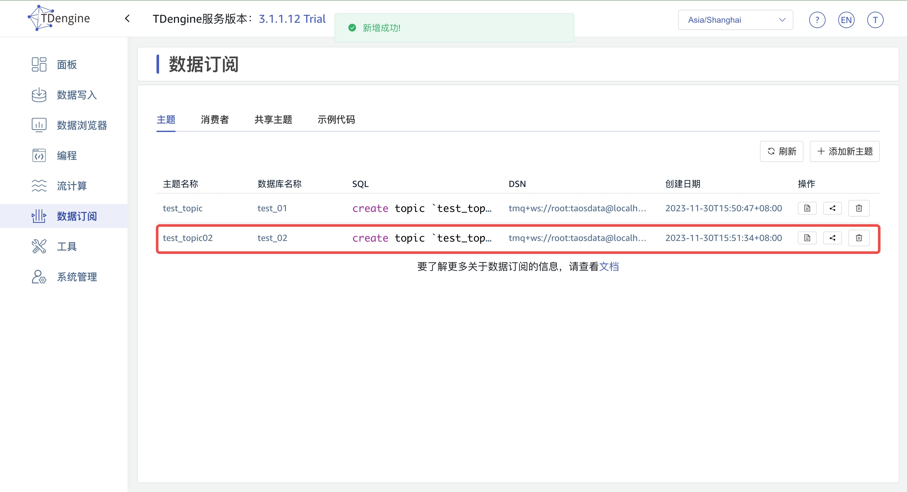
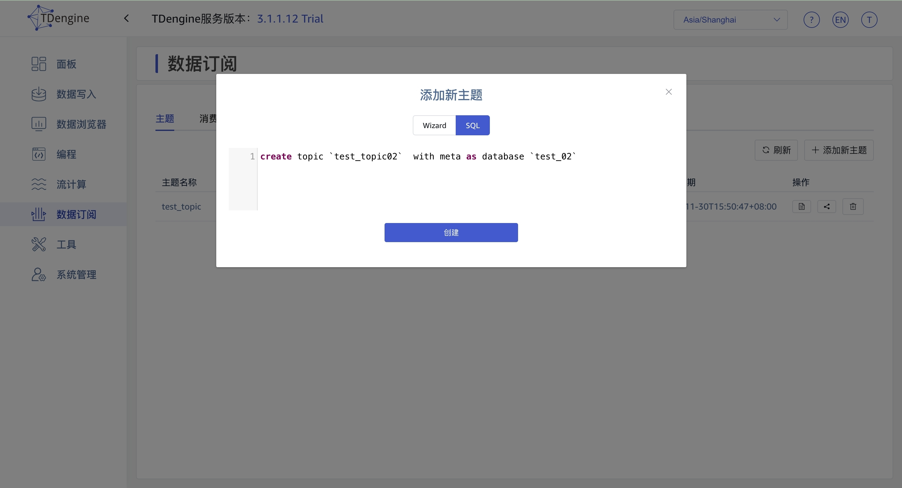
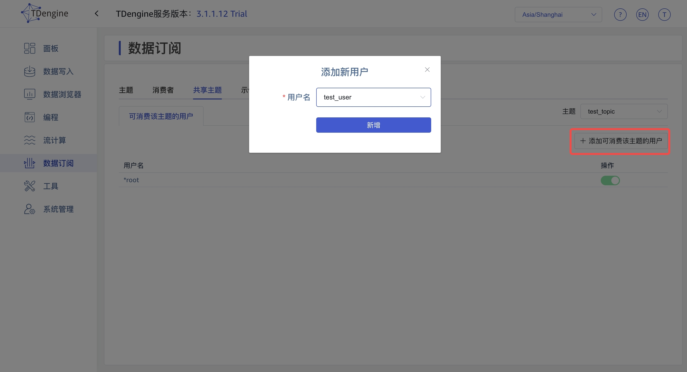
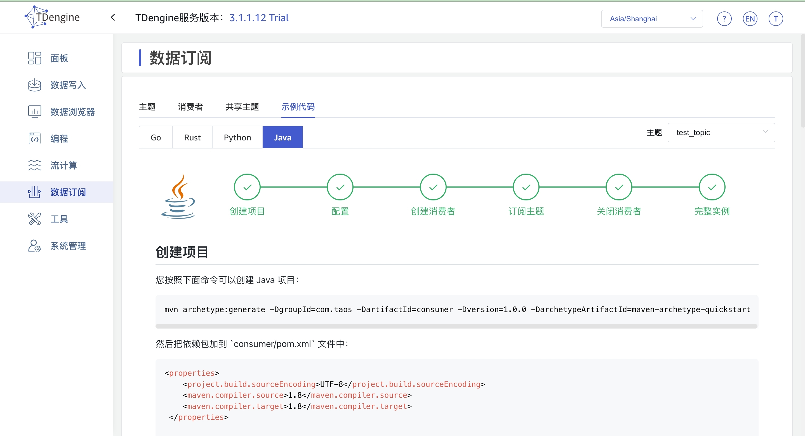

## 数据订阅
通过 Explorer, 您可以轻松地完成对数据订阅的管理，从而更好地利用 TDengine 提供的数据订阅能力。
点击左侧导航栏中的“数据订阅”，即可跳转至数据订阅配置管理页面。
您可以通过以下两种方式创建主题：使用向导和自定义 SQL 语句。通过自定义 SQL 创建主题时，您需要了解 TDengine 提供的数据订阅 SQL 语句的语法，并保证其正确性。

 

 ### 添加数据订阅

 1. Wizard 方式 
 第一步 填写添加新主题需要的信息，点击“创建”按钮；

第二步 页面出现以下记录，则证明创建成功。

2. Sql 方式

第一步 切换到 SQL 页，直接输入添加新主题 sql, 点击“创建”按钮；

第二步 页面出现以下记录，则证明创建成功。

### 共享主题
在“共享主题”标签页，在“主题“下拉列表中，选择将要分享的主题；
点击“添加可消费该主题的用户”按钮，然后在“用户名”下拉列表中选择相应的用户，然后点击“新增”，即可将该主题分享给此用户

### 查看消费者信息
通过执行下一节“示例代码”所述的“完整实例”，即可消费共享主题
在“消费者”标签页，可查看到消费者的有关信息

### 示例代码
在“示例代码”标签页，在“主题“下拉列表中，选择相应的主题；
选择您熟悉的语言，然后您可以阅读以及使用这部分示例代码用来”创建消费“，”订阅主题“，通过执行 “完整实例”中的程序即可消费共享主题

