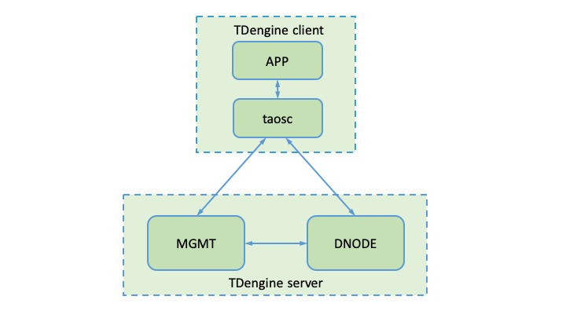

# Data Model and Architecture
## Data Model

### A Typical IoT Scenario 

In a typical IoT scenario, there are many types of devices. Each device is collecting one or multiple metrics. For a specific type of device, the collected data could look like the table below: 

| Device ID |  Time Stamp   | Value 1 | Value 2 | Value 3 | Tag 1 | Tag 2 |
| :-------: | :-----------: | :-----: | :-----: | :-----: | :---: | :---: |
|   D1001   | 1538548685000 |  10.3   |   219   |  0.31   |  Red  | Tesla |
|   D1002   | 1538548684000 |  10.2   |   220   |  0.23   | Blue  |  BMW  |
|   D1003   | 1538548686500 |  11.5   |   221   |  0.35   | Black | Honda |
|   D1004   | 1538548685500 |  13.4   |   223   |  0.29   |  Red  | Volvo |
|   D1001   | 1538548695000 |  12.6   |   218   |  0.33   |  Red  | Tesla |
|   D1004   | 1538548696600 |  11.8   |   221   |  0.28   | Black | Honda |

Each data record contains the device ID, timestamp, collected metrics, and static tags associated with the device. Each device generates a data record in a pre-defined timer or triggered by an event. It is a sequence of data points like a stream. 

### Data Characteristics

As the data points are a series of data points over time, the data points generated by devices, sensors, servers, and/or applications have some strong common characteristics: 

1. metrics are always structured data; 
2. there are rarely delete/update operations on collected data; 
3. there is only one single data source for one device or sensor; 
4. ratio of read/write is much lower than typical Internet applications; 
5. the user pays attention to the trend of data, not a specific value at a specific time; 
6. there is always a data retention policy; 
7. the data query is always executed in a given time range and a subset of devices; 
8. real-time aggregation or analytics is mandatory; 
9. traffic is predictable based on the number of devices and sampling frequency; 
10. data volume is huge, a system may generate 10 billion data points in a day.    

By utilizing the above characteristics, TDengine designs the storage and computing engine in a special and optimized way for time-series data, resulting in massive improvements in system efficiency.

### Relational Database Model 

Since time-series data is most likely to be structured data, TDengine adopts the traditional relational database model to process them. You need to create a database, create tables with schema definitions, then insert data points and execute queries to explore the data. Standard SQL is used, making it easy for anyone to get started and eliminating any learning curve.

### One Table for One Device

Due to different network latencies, the data points from different devices may arrive to the server out of order. But for the same device, data points will arrive to the server in order if the system is designed well. To utilize this special feature, TDengine requires the user to create a table for each device (time-stream). For example, if there are over 10,000 smart meters, 10,000 tables shall be created. For the table above, 4 tables shall be created for device D1001, D1002, D1003, and D1004 to store the data collected. 

This strong requirement can guarantee that all data points from a device can be saved in a continuous memory/hard disk space block by block. If queries are applied only on one device in a time range, this design will reduce the read latency significantly since a whole block is owned by one single device. Additionally, write latency can be significantly reduced too as the data points generated by the same device will arrive in order, the new data point will be simply appended to a block. Cache block size and the rows of records in a file block can be configured to fit different scenarios for optimal efficiency.

### Best Practices

**Table**: TDengine suggests to use device ID as the table name (like D1001 in the above diagram). Each device may collect one or more metrics (like value1, value2, value3 in the diagram). Each metric has a column in the table, the metric name can be used as the column name. The data type for a column can be int, float, double, tinyint, bigint, bool or binary. Sometimes, a device may have multiple metric groups, each group containing different sampling periods, so for best practice you should create a table for each group for each device. The first column in the table must be a time stamp. TDengine uses the time stamp as the index, and won’t build the index on any metrics stored.

**Tags:** To support aggregation over multiple tables efficiently, the [STable(Super Table)](../super-table) concept is introduced by TDengine. A STable is used to represent the same type of device. The schema is used to define the collected metrics (like value1, value2, value3 in the diagram), and tags are used to define the static attributes for each table or device (like tag1, tag2 in the diagram). A table is created via STable with a specific tag value. All or a subset of tables in a STable can be aggregated by filtering tag values.  

**Database:** Different types of devices may generate data points in different patterns and should be processed differently. For example, sampling frequency, data retention policy, replication number, cache size, record size, the compression algorithm may be different. To make the system more efficient, TDengine suggests creating a different database with unique configurations for different scenarios.

**Schemaless vs Schema:** Compared with NoSQL databases, since a table with schema definitions must be created before the data points can be inserted, flexibilities are not that good, especially when the schema is changed. But in most IoT scenarios, the schema is well defined and is rarely changed, the loss of flexibility won't pose any impact to developers or administrators. TDengine allows the application to change the schema in a second even there is a huge amount of historical data when schema has to be changed. 

TDengine does not impose a limitation on the number of tables, [STables](../super-table), or databases. You can create any number of STable or databases to fit different scenarios.   

## Architecture

There are two main modules in TDengine server as shown in Picture 1: **Management Module (MGMT)** and **Data Module(DNODE)**. The whole TDengine architecture also includes a **TDengine Client Module**.

  

 Picture 1 TDengine Architecture  

### MGMT Module
The MGMT module deals with the storage and querying on metadata, which includes information about users, databases, and tables. Applications will connect to the MGMT module at first when connecting the TDengine server. When creating/dropping databases/tables, The request is sent to the MGMT module at first to create/delete metadata. Then the MGMT module will send requests to the data module to allocate/free resources required. In the case of writing or querying, applications still need to visit the MGMT module to get meta data, according to which, then access the DNODE module.

### DNODE Module
The DNODE module is responsible for storing and querying data. For the sake of future scaling and high-efficient resource usage, TDengine applies virtualization on resources it uses. TDengine introduces the concept of a virtual node (vnode), which is the unit of storage, resource allocation and data replication (enterprise edition). As is shown in Picture 2, TDengine treats each data node as an aggregation of vnodes. 

When a DB is created, the system will allocate a vnode. Each vnode contains multiple tables, but a table belongs to only one vnode. Each DB has one or mode vnodes, but one vnode belongs to only one DB. Each vnode contains all the data in a set of tables. Vnodes have their own cache and directory to store data. Resources between different vnodes are exclusive with each other, no matter cache or file directory. However, resources in the same vnode are shared between all the tables in it. Through virtualization, TDengine can distribute resources reasonably to each vnode and improve resource usage and concurrency. The number of vnodes on a dnode is configurable according to its hardware resources.

   

 Picture 2 TDengine Virtualization  
 

### Client Module
TDengine client module accepts requests (mainly in SQL form) from applications and converts the requests to internal representations and sends to the server side. TDengine supports multiple interfaces, which are all built on top of TDengine client module. 

For the communication between client and MGMT module, TCP/UDP is used, the port is set by the parameter `mgmtShellPort` in system configuration file `taos.cfg`, default is 6030. For communication between the client and the DNODE module, TCP/UDP is used, the port is set by the parameter `vnodeShellPort` in the system configuration file, default is 6035. 

## Writing Process
Picture 3 shows the full writing process of TDengine. TDengine uses the [Writing Ahead Log] (http://en.wikipedia.org/wiki/Write-ahead_logging) strategy to assure data security and integrity. Data received from the client is written to the commit log at first. When TDengine recovers from crashes caused by power loss or other situations, the commit log is used to recover data. After writting to the commit log, data will be wrtten to the corresponding vnode cache, then an acknowledgment is sent to the application. There are two mechanisms that can flush data in cache to disk for persistent storage:

1. **Flush driven by timer**: There is a backend timer which flushes data in cache periodically to disks. The period is configurable via parameter commitTime in system configuration file taos.cfg.
2. **Flush driven by data**: Data in the cache is also flushed to disks when the left buffer size is below a threshold. Flush driven by data can reset the timer of flush driven by the timer.

   

 Picture 3 TDengine Writting Process  

New commit log files will be opened when the committing process begins. When the committing process finishes, the old commit file will be removed.

## Data Storage

TDengine data are saved in _/var/lib/taos_ directory by default. It can be changed to other directories by setting the parameter `dataDir` in system configuration file taos.cfg.

TDengine's metadata includes the database, table, user, super table and tag information. To reduce the latency, metadata are all buffered in the cache.

Data records saved in tables are sharded according to the time range. Data from tables in the same vnode in a certain time range are saved in the same file group. This sharding strategy can effectively improve data search speed. By default, one group of files contain data in 10 days, which can be configured by `daysPerFile` in the configuration file or by the *DAYS* keyword in *CREATE DATABASE* clause. 

Data records are removed automatically once their lifetime is passed. The lifetime is configurable via parameter daysToKeep in the system configuration file. The default value is 3650 days. 

Data in files are blockwise. A data block only contains one table's data. Records in the same data block are sorted according to the primary timestamp. To improve the compression ratio, records are stored column by column, and different compression algorithms are applied based on each column's data type. 