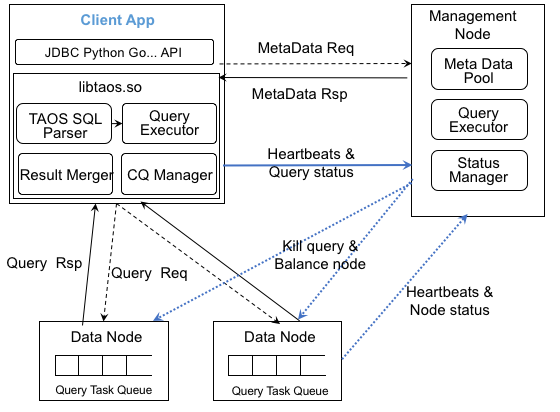
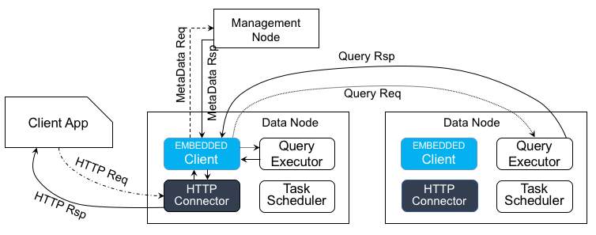
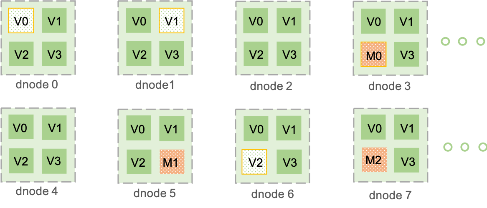
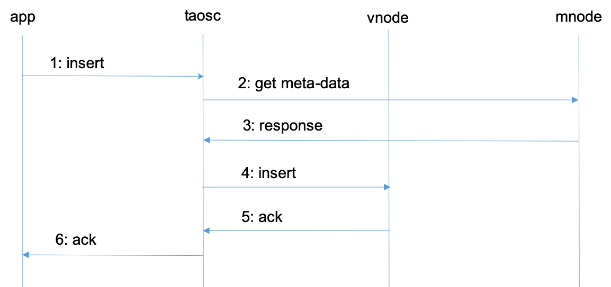

# TDengine的技术设计

## 存储设计

TDengine的数据存储主要包含**元数据的存储**和**写入数据的存储**。以下章节详细介绍了TDengine各种数据的存储结构。

### 元数据的存储

TDengine中的元数据信息包括TDengine中的数据库，表，超级表等信息。元数据信息默认存放在 _/var/lib/taos/mgmt/_ 文件夹下。该文件夹的目录结构如下所示：
```
/var/lib/taos/
      +--mgmt/
          +--db.db
          +--meters.db
          +--user.db
          +--vgroups.db
```
元数据在文件中按顺序排列。文件中的每条记录代表TDengine中的一个元数据机构（数据库、表等）。元数据文件只进行追加操作，即便是元数据的删除，也只是在数据文件中追加一条删除的记录。

### 写入数据的存储

TDengine中写入的数据在硬盘上是按时间维度进行分片的。同一个vnode中的表在同一时间范围内的数据都存放在同一文件组中，如下图中的v0f1804*文件。这一数据分片方式可以大大简化数据在时间维度的查询，提高查询速度。在默认配置下，硬盘上的每个文件存放10天数据。用户可根据需要调整数据库的 _daysPerFile_ 配置项进行配置。 数据在文件中是按块存储的。每个数据块只包含一张表的数据，且数据是按照时间主键递增排列的。数据在数据块中按列存储，这样使得同类型的数据存放在一起，可以大大提高压缩的比例，节省存储空间。TDengine对不同类型的数据采用了不同的压缩算法进行压缩，以达到最优的压缩结果。TDengine使用的压缩算法包括simple8B、delta-of-delta、RLE以及LZ4等。

TDengine的数据文件默认存放在 */var/lib/taos/data/* 下。而 */var/lib/taos/tsdb/* 文件夹下存放了vnode的信息、vnode中表的信息以及数据文件的链接等。其完整目录结构如下所示：
```
/var/lib/taos/
      +--tsdb/
      |   +--vnode0
      |        +--meterObj.v0
      |        +--db/
      |            +--v0f1804.head->/var/lib/taos/data/vnode0/v0f1804.head1
      |            +--v0f1804.data->/var/lib/taos/data/vnode0/v0f1804.data
      |            +--v0f1804.last->/var/lib/taos/data/vnode0/v0f1804.last1
      |            +--v0f1805.head->/var/lib/taos/data/vnode0/v0f1805.head1
      |            +--v0f1805.data->/var/lib/taos/data/vnode0/v0f1805.data
      |            +--v0f1805.last->/var/lib/taos/data/vnode0/v0f1805.last1
      |                   :
      +--data/
          +--vnode0/
                +--v0f1804.head1
                +--v0f1804.data
                +--v0f1804.last1
                +--v0f1805.head1
                +--v0f1805.data
                +--v0f1805.last1
                        :
```

#### meterObj文件
每个vnode中只存在一个 _meterObj_ 文件。该文件中存储了vnode的基本信息（创建时间，配置信息，vnode的统计信息等）以及该vnode中表的信息。其结构如下所示：
```
<文件开始>
[文件头]
[表记录1偏移量和长度]
[表记录2偏移量和长度]
...
[表记录N偏移量和长度]
[表记录1]
[表记录2]
...
[表记录N]
[表记录]
<文件结尾>
```
其中，文件头大小为512字节，主要存放vnode的基本信息。每条表记录代表属于该vnode中的一张表在硬盘上的表示。

#### head文件
head文件中存放了其对应的data文件中数据块的索引信息。该文件组织形式如下：
```
<文件开始>
[文件头]
[表1偏移量]
[表2偏移量]
...
[表N偏移量]
[表1数据索引]
[表2数据索引]
...
[表N数据索引]
<文件结尾>
```
文件开头的偏移量列表表示对应表的数据索引块的开始位置在文件中的偏移量。每张表的数据索引信息在head文件中都是连续存放的。这也使得TDengine在读取单表数据时，可以将该表所有的数据块索引一次性读入内存，大大提高读取速度。表的数据索引块组织如下：
```
[索引块信息]
[数据块1索引]
[数据块2索引]
...
[数据块N索引]
```
其中，索引块信息中记录了数据块的个数等描述信息。每个数据块索引对应一个在data文件或last文件中的一个单独的数据块。索引信息中记录了数据块存放的文件、数据块起始位置的偏移量、数据块中数据时间主键的范围等。索引块中的数据块索引是按照时间范围顺序排放的，这也就是说，索引块M对应的数据块中的数据时间范围都大于索引块M-1的。这种预先排序的存储方式使得在TDengine在进行按照时间戳进行查询时可以使用折半查找算法，大大提高查询速度。

#### data文件
data文件中存放了真实的数据块。该文件只进行追加操作。其文件组织形式如下：
```
<文件开始>
[文件头]
[数据块1]
[数据块2]
...
[数据块N]
<文件结尾>
```
每个数据块只属于vnode中的一张表，且数据块中的数据按照时间主键排列。数据块中的数据按列组织排放，使得同一类型的数据排放在一起，方便压缩和读取。每个数据块的组织形式如下所示：
```
[列1信息]
[列2信息]
...
[列N信息]
[列1数据]
[列2数据]
...
[列N数据]
```
列信息中包含该列的类型，列的压缩算法，列数据在文件中的偏移量以及长度等。除此之外，列信息中也包含该内存块中该列数据的预计算结果，从而在过滤查询时根据预计算结果判定是否读取数据块，大大提高读取速度。

#### last文件
为了防止数据块的碎片化，提高查询速度和压缩率，TDengine引入了last文件。当要落盘的数据块中的数据条数低于某个阈值时，TDengine会先将该数据块写入到last文件中进行暂时存储。当有新的数据需要落盘时，last文件中的数据会被读取出来与新数据组成新的数据块写入到data文件中。last文件的组织形式与data文件类似。

### TDengine数据存储小结
TDengine通过其创新的架构和存储结构设计，有效提高了计算机资源的使用率。一方面，TDengine的虚拟化使得TDengine的水平扩展及备份非常容易。另一方面，TDengine将表中数据按时间主键排序存储且其列式存储的组织形式都使TDengine在写入、查询以及压缩方面拥有非常大的优势。


## 查询处理

### 概述

TDengine提供了多种多样针对表和超级表的查询处理功能，除了常规的聚合查询之外，还提供针对时序数据的窗口查询、统计聚合等功能。TDengine的查询处理需要客户端、管理节点、数据节点协同完成。 各组件包含的与查询处理相关的功能和模块如下：

客户端（Client App）。客户端包含TAOS SQL的解析（SQL Parser）和查询请求执行器（Query Executor），第二阶段聚合器（Result Merger），连续查询管理器（Continuous Query Manager）等主要功能模块构成。SQL解析器负责对SQL语句进行解析校验，并转化为抽象语法树，查询执行器负责将抽象语法树转化查询执行逻辑，并根据SQL语句查询条件，将其转换为针对管理节点元数据查询和针对数据节点的数据查询两级查询处理。由于TAOS SQL当前不提供复杂的嵌套查询和pipeline查询处理机制，所以不再需要查询计划优化、逻辑查询计划到物理查询计划转换等过程。第二阶段聚合器负责将各数据节点查询返回的独立结果进行二阶段聚合生成最后的结果。连续查询管理器则负责针对用户建立的连续查询进行管理，负责定时拉起查询请求并按需将结果写回TDengine或返回给客户应用。此外，客户端还负责查询失败后重试、取消查询请求、以及维持连接心跳、向管理节点上报查询状态等工作。

管理节点（Management Node）。管理节点保存了整个集群系统的全部数据的元数据信息，向客户端节点提供查询所需的数据的元数据，并根据集群的负载情况切分查询请求。通过超级表包含了通过该超级表创建的所有表的信息，因此查询处理器（Query Executor）负责针对标签（TAG）的查询处理，并将满足标签查询请求的表信息返回给客户端。此外，管理节点还维护集群的查询状态（Query Status Manager）维护，查询状态管理中在内存中临时保存有当前正在执行的全部查询，当客户端使用 *show queries* 命令的时候，将当前系统正在运行的查询信息返回客户端。

数据节点（Data Node）。数据节点保存了数据库中全部数据内容，并通过查询执行器、查询处理调度器、查询任务队列（Query Task Queue）进行查询处理的调度执行，从客户端接收到的查询处理请求都统一放置到处理队列中，查询执行器从队列中获得查询请求，并负责执行。通过查询优化器（Query Optimizer）对于查询进行基本的优化处理，以及通过数据节点的查询执行器（Query Executor）扫描符合条件的数据单元并返回计算结果。等接收客户端发出的查询请求，执行查询处理，并将结果返回。同时数据节点还需要响应来自管理节点的管理信息和命令，例如 *kill query* 命令以后，需要即刻停止执行的查询任务。

<center>  </center>
<center>图 1. 系统查询处理架构图(只包含查询相关组件)</center>

### 普通查询处理

客户端、管理节点、数据节点协同完成TDengine的查询处理全流程。我们以一个具体的SQL查询为例，说明TDengine的查询处理流程。SQL语句向超级表*FOO_SUPER_TABLE*查询获取时间范围在2019年1月12日整天，标签TAG_LOC是'beijing'的表所包含的所有记录总数，SQL语句如下：

```sql
SELECT COUNT(*) 
FROM FOO_SUPER_TABLE
WHERE TAG_LOC = 'beijing' AND TS >= '2019-01-12 00:00:00' AND TS < '2019-01-13 00:00:00'
```

首先，客户端调用TAOS SQL解析器对SQL语句进行解析及合法性检查，然后生成语法树，并从中提取查询的对象 — 超级表 *FOO_SUPER_TABLE* ，然后解析器向管理节点（Management Node）请求其相应的元数据信息，并将过滤信息（TAG_LOC='beijing'）同时发送到管理节点。

管理节点接收元数据获取的请求，首先找到超级表 *FOO_SUPER_TABLE* 基础信息，然后应用查询条件来过滤通过该超级表创建的全部表，最后满足查询条件（TAG_LOC='beijing'），即 *TAG_LOC* 标签列是 'beijing' 的的通过其查询执行器将满足查询要求的对象（表或超级表）的元数据信息返回给客户端。

客户端获得了 *FOO_SUPER_TABLE* 的元数据信息后，查询执行器根据元数据中的数据分布，分别向保存有相应数据的节点发起查询请求，此时时间戳范围过滤条件（TS >= '2019-01-12 00:00:00' AND TS < '2019-01-13 00:00:00'）需要同时发送给全部的数据节点。

数据节点接收到发自客户端的查询，转化为内部结构并进行优化以后将其放入任务执行队列，等待查询执行器执行。当查询结果获得以后，将查询结果返回客户端。数据节点执行查询的过程均相互独立，完全只依赖于自身的数据和内容进行计算。

当所有查询涉及的数据节点返回结果后，客户端将每个数据节点查询的结果集再次进行聚合（针对本案例，即将所有结果再次进行累加），累加的结果即为最后的查询结果。第二阶段聚合并不是所有的查询都需要。例如，针对数据的列选取操作，实际上是不需要第二阶段聚合。

### REST查询处理

在 C/C++ 、Python接口、 JDBC 接口之外，TDengine 还提供基于 HTTP 协议的 REST 接口。不同于使用应用客户端开发程序进行的开发。当用户使用 REST 接口的时候，所有的查询处理过程都是在服务器端来完成，用户的应用服务不会参与数据库的计算过程，查询处理完成后结果通过 HTTP的 JSON 格式返回给用户。

<center>  </center>
<center>图 2.  REST查询架构</center>

当用户使用基于HTTP的REST查询接口，HTTP的请求首先与位于数据节点的HTTP连接器（ Connector），建立连接，然后通过REST的签名机制，使用Token来确保请求的可靠性。对于数据节点，HTTP连接器接收到请求后，调用内嵌的客户端程序发起查询请求，内嵌客户端将解析通过HTTP连接器传递过来的SQL语句，解析该SQL语句并按需向管理节点请求元数据信息，然后向本机或集群中其他节点发送查询请求，最后按需聚合计算结果。HTTP连接器接收到请求SQL以后，后续的流程处理与采用应用客户端方式的查询处理完全一致。最后，还需要将查询的结果转换为JSON格式字符串，并通过HTTP 响应返回给客户端。

可以看到，在处理HTTP流程的整个过程中，用户应用不再参与到查询处理的过程中，只负责通过HTTP协议发送SQL请求并接收JSON格式的结果。同时还需要注意的是，每个数据节点均内嵌了一个HTTP连接器和客户端程序，因此请求集群中任何一个数据节点，该数据节点均能够通过HTTP协议返回用户的查询结果。

### 技术特征

由于TDengine采用数据和标签分离存储的模式，能够极大地降低标签数据存储的冗余度。标签数据直接关联到每个表，并采用全内存的结构进行管理和维护标签数据,全内存的结构提供快速的查询处理，千万级别规模的标签数据查询可以在毫秒级别返回。首先针对标签数据的过滤可以有效地降低第二阶段的查询涉及的数据规模。为有效地提升查询处理的性能，针对物联网数据的不可更改的特点，TDengine采用在每个保存的数据块上，都记录下该数据块中数据的最大值、最小值、和等统计数据。如果查询处理涉及整个数据块的全部数据，则直接使用预计算结果，不再读取数据块的内容。由于预计算模块的大小远小于磁盘上存储的具体数据的大小，对于磁盘IO为瓶颈的查询处理，使用预计算结果可以极大地减小读取IO，并加速查询处理的流程。

由于TDengine采用按列存储数据。当从磁盘中读取数据块进行计算的时候，按照查询列信息读取该列数据，并不需要读取其他不相关的数据，可以最小化读取数据。此外，由于采用列存储结构，数据节点针对数据的扫描采用该列数据块进行，可以充分利用CPU L2高速缓存，极大地加速数据扫描的速度。此外，对于某些查询，并不会等全部查询结果生成后再返回结果。例如，列选取查询，当第一批查询结果获得以后，数据节点直接将其返回客户端。同时，在查询处理过程中，系统在数据节点接收到查询请求以后马上返回客户端查询确认信息，并同时拉起查询处理过程，并等待查询执行完成后才返回给用户查询有响应。

## 集群设计

### 1：集群与主要逻辑单元

TDengine是基于硬件、软件系统不可靠、一定会有故障的假设进行设计的，是基于任何单台计算机都无足够能力处理海量数据的假设进行设计的。因此TDengine从研发的第一天起，就按照分布式高可靠架构进行设计，是完全去中心化的，是水平扩展的，这样任何单台或多台服务器宕机或软件错误都不影响系统的服务。通过节点虚拟化并辅以自动化负载均衡技术，TDengine能最大限度地利用异构集群中的计算和存储资源。而且只要数据副本数大于一，无论是硬软件的升级、还是IDC的迁移等都无需停止集群的服务，极大地保证系统的正常运行，并且降低了系统管理员和运维人员的工作量。

下面的示例图上有八个物理节点，每个物理节点被逻辑的划分为多个虚拟节点。下面对系统的基本概念进行介绍。 




**物理节点(dnode)**：集群中的一物理服务器或云平台上的一虚拟机。为安全以及通讯效率，一个物理节点可配置两张网卡，或两个IP地址。其中一张网卡用于集群内部通讯，其IP地址为**privateIp**, 另外一张网卡用于与集群外部应用的通讯，其IP地址为**publicIp**。在一些云平台（如阿里云），对外的IP地址是映射过来的，因此publicIp还有一个对应的内部IP地址**internalIp**(与privateIp不同)。对于只有一个IP地址的物理节点，publicIp, privateIp以及internalIp都是同一个地址，没有任何区别。一个dnode上有而且只有一个taosd实例运行。 

**虚拟数据节点(vnode)**：在物理节点之上的可独立运行的基础逻辑单元，时序数据写入、存储、查询等操作逻辑都在虚拟节点中进行(图中V)，采集的时序数据就存储在vnode上。一个vnode包含固定数量的表。当创建一张新表时，系统会检查是否需要创建新的vnode。一个物理节点上能创建的vnode的数量取决于物理节点的硬件资源。一个vnode只属于一个DB，但一个DB可以有多个vnode。

**虚拟数据节点组(vgroup)**: 位于不同物理节点的vnode可以组成一个虚拟数据节点组vnode group(如上图dnode0中的V0, dnode1中的V1, dnode6中的V2属于同一个虚拟节点组)。归属于同一个vgroup的虚拟节点采取master/slave的方式进行管理。写只能在master上进行，但采用asynchronous的方式将数据同步到slave，这样确保了一份数据在多个物理节点上有拷贝。如果master节点宕机，其他节点监测到后，将重新选举vgroup里的master, 新的master能继续处理数据请求，从而保证系统运行的可靠性。一个vgroup里虚拟节点个数就是数据的副本数。如果一个DB的副本数为N，系统必须有至少N个物理节点。副本数在创建DB时通过参数replica可以指定，缺省为1。使用TDengine, 数据的安全依靠多副本解决，因此不再需要昂贵的磁盘阵列等存储设备。

**虚拟管理节点(mnode)**：负责所有节点运行状态的监控和维护，以及节点之间的负载均衡（图中M）。同时，虚拟管理节点也负责元数据(包括用户、数据库、表、静态标签等)的存储和管理，因此也称为Meta Node。TDengine集群中可配置多个(最多不超过5个) mnode，它们自动构建成为一个管理节点集群(图中M0, M1, M2)。mnode间采用master/slave的机制进行管理，而且采取强一致方式进行数据同步。mnode集群的创建由系统自动完成，无需人工干预。每个dnode上至多有一个mnode，而且每个dnode都知道整个集群中所有mnode的IP地址。 

**taosc**：一个软件模块，是TDengine给应用提供的驱动程序（driver）,内嵌于JDBC、ODBC driver中，或者C语言连接库里。应用都是通过taosc而不是直接来与整个集群进行交互的。这个模块负责获取并缓存元数据；将插入、查询等请求转发到正确的虚拟节点；在把结果返回给应用时，还需要负责最后一级的聚合、排序、过滤等操作。对于JDBC, ODBC, C/C++接口而言，这个模块是在应用所处的计算机上运行，但消耗的资源很小。为支持全分布式的REST接口，taosc在TDengine集群的每个dnode上都有一运行实例。 

**对外服务地址**：TDengine集群可以容纳单台、多台甚至几千台物理节点。应用只需要向集群中任何一个物理节点的publicIp发起连接即可。启动CLI应用taos时，选项-h需要提供的就是publicIp。

**master/secondIp**：每一个dnode都需要配置一个masterIp。dnode启动后，将对配置的masterIp发起加入集群的连接请求。masterIp是已经创建的集群中的任何一个节点的privateIp，对于集群中的第一个节点，就是它自己的privateIp。为保证连接成功，每个dnode还可配置secondIp, 该IP地址也是已创建的集群中的任何一个节点的privateIp。如果一个节点连接masterIp失败,它将试图链接secondIp。

dnode启动后，会获知集群的mnode IP列表，并且定时向mnode发送状态信息。

vnode与mnode只是逻辑上的划分，都是执行程序taosd里的不同线程而已，无需安装不同的软件，做任何特殊的配置。最小的系统配置就是一个物理节点,vnode,mnode和taosc都存在而且都正常运行，但单一节点无法保证系统的高可靠。 

### 2：一典型的操作流程

为解释vnode, mnode, taosc和应用之间的关系以及各自扮演的角色，下面对写入数据这个典型操作的流程进行剖析。

 



 

1. 应用通过JDBC、ODBC或其他API接口发起插入数据的请求。
2. taosc会检查缓存，看是有保存有该表的meta data。如果有，直接到第4步。如果没有，taosc将向mnode发出get meta-data请求。
3. mnode将该表的meta-data返回给taosc。Meta-data包含有该表的schema, 而且还有该表所属的vgroup信息（vnode ID以及所在的dnode的IP地址，如果副本数为N，就有N组vnodeID/IP)。如果taosc迟迟得不到mnode回应，而且存在多个mnode,taosc将向下一个mnode发出请求。
4. taosc向master vnode发起插入请求。
5. vnode插入数据后，给taosc一个应答，表示插入成功。如果taosc迟迟得不到vnode的回应，taosc会认为该节点已经离线。这种情况下，如果被插入的数据库有多个副本，taosc将向vgroup里下一个vnode发出插入请求。
6. taosc通知APP，写入成功。 

对于第二和第三步，taosc启动时，并不知道mnode的IP地址，因此会直接向配置的集群对外服务的IP地址发起请求。如果接收到该请求的dnode并没有配置mnode，该dnode会在回复的消息中告知mnode的IP地址列表（如果有多个dnodes，mnode的IP地址可以有多个），这样taosc会重新向新的mnode的IP地址发出获取meta-data的请求。

对于第四和第五步，没有缓存的情况下，taosc无法知道虚拟节点组里谁是master，就假设第一个vnodeID/IP就是master,向它发出请求。如果接收到请求的vnode并不是master,它会在回复中告知谁是master，这样taosc就向建议的master vnode发出请求。一旦得到插入成功的回复，taosc会缓存住master节点的信息。

上述是插入数据的流程，查询、计算的流程也完全一致。taosc把这些复杂的流程全部封装屏蔽了，因此应用无需处理重定向、获取meta data等细节，完全是透明的。

通过taosc缓存机制，只有在第一次对一张表操作时，才需要访问mnode, 因此mnode不会成为系统瓶颈。但因为schema有可能变化，而且vgroup有可能发生改变（比如负载均衡发生），因此taosc需要定时自动刷新缓存。

### 3：数据分区

vnode(虚拟数据节点)保存采集的时序数据，而且查询、计算都在这些节点上进行。为便于负载均衡、数据恢复、支持异构环境，TDengine将一个物理节点根据其计算和存储资源切分为多个vnode。这些vnode的管理是TDengine自动完成的，对应用完全透明。 

对于单独一个数据采集点，无论其数据量多大，一个vnode（或vnode group, 如果副本数大于1）有足够的计算资源和存储资源来处理（如果每秒生成一条16字节的记录，一年产生的原始数据不到0.5G），因此TDengine将一张表的所有数据都存放在一个vnode里，而不会让同一个采集点的数据分布到两个或多个dnode上。而且一个vnode可存储多张表的数据，一个vnode可容纳的表的数目由配置参数tables指定，缺省为2000。设计上，一个vnode里所有的表都属于同一个DB。因此一个数据库DB需要的vnode或vgroup的个数等于：数据库表的数目/tables。 

创建DB时，系统并不会马上分配资源。但当创建一张表时，系统将看是否有已经分配的vnode, 而且是否有空位，如果有，立即在该有空位的vnode创建表。如果没有，系统将从集群中，根据当前的负载情况，在一个dnode上创建一新的vnode, 然后创建表。如果DB有多个副本，系统不是只创建一个vnode，而是一个vgroup(虚拟数据节点组)。系统对vnode的数目没有任何限制，仅仅受限于物理节点本身的计算和存储资源。

参数tables的设置需要考虑具体场景，创建DB时，可以个性化指定该参数。该参数不宜过大，也不宜过小。过小，极端情况，就是每个数据采集点一个vnode, 这样导致系统数据文件过多。过大，虚拟化带来的优势就会丧失。给定集群计算资源的情况下，整个系统vnode的个数应该是CPU核的数目的两倍以上。

### 4：负载均衡

每个dnode(物理节点)都定时向 mnode(虚拟管理节点)报告其状态（包括硬盘空间、内存大小、CPU、网络、虚拟节点个数等），因此mnode了解整个集群的状态。基于整体状态，当mnode发现某个dnode负载过重，它会将dnode上的一个或多个vnode挪到其他dnode。在挪动过程中，对外服务继续进行，数据插入、查询和计算操作都不受影响。负载均衡操作结束后，应用也无需重启，将自动连接新的vnode。 

如果mnode一段时间没有收到dnode的状态报告，mnode会认为这个dnode已经离线。如果离线时间超过一定时长（时长由配置参数offlineThreshold决定），该dnode将被mnode强制剔除出集群。该dnode上的vnodes如果副本数大于一，系统将自动在其他dnode上创建新的副本，以保证数据的副本数。


**Note：**目前集群功能仅仅限于企业版
