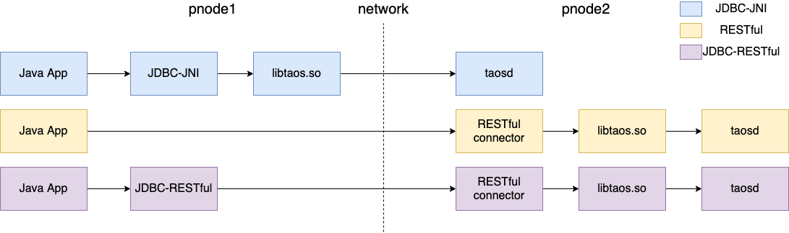

#  Java Connector

## 总体介绍

`taos-jdbcdriver` 的实现包括 2 种形式： JDBC-JNI 和 JDBC-RESTful（taos-jdbcdriver-2.0.18 开始支持 JDBC-RESTful）。 JDBC-JNI 通过调用客户端 libtaos.so（或 taos.dll ）的本地方法实现， JDBC-RESTful 则在内部封装了 RESTful 接口实现。



上图显示了 3 种 Java 应用使用连接器访问 TDengine 的方式：

* JDBC-JNI：Java 应用在物理节点1（pnode1）上使用 JDBC-JNI 的 API ，直接调用客户端 API（libtaos.so 或 taos.dll）将写入和查询请求发送到位于物理节点2（pnode2）上的 taosd 实例。
* RESTful：应用将 SQL 发送给位于物理节点2（pnode2）上的 RESTful 连接器，再调用客户端 API（libtaos.so）。
* JDBC-RESTful：Java 应用通过 JDBC-RESTful 的 API ，将 SQL 封装成一个 RESTful 请求，发送给物理节点2的 RESTful 连接器。

TDengine 的 JDBC 驱动实现尽可能与关系型数据库驱动保持一致，但TDengine与关系对象型数据库的使用场景和技术特征存在差异，导致 `taos-jdbcdriver` 与传统的 JDBC driver 也存在一定差异。在使用时需要注意以下几点：

* TDengine 目前不支持针对单条数据记录的删除操作。
* 目前不支持事务操作。

### JDBC-JNI和JDBC-RESTful的对比

<table>
<tr align="center"><th>对比项</th><th>JDBC-JNI</th><th>JDBC-RESTful</th></tr>
<tr align="center">
  <td>支持的操作系统</td>
  <td>Linux、Windows</td>
  <td>全平台</td>
</tr>
<tr align="center">
  <td>是否需要安装 client</td>
  <td>需要</td>
  <td>不需要</td>
</tr>
<tr align="center">
  <td>server 升级后是否需要升级 client</td>
  <td>需要</td>
  <td>不需要</td>
</tr>
<tr align="center">
  <td>写入性能</td>
  <td colspan="2">JDBC-RESTful 是 JDBC-JNI 的 50%～90% </td>
</tr>
<tr align="center">
  <td>查询性能</td>
  <td colspan="2">JDBC-RESTful 与 JDBC-JNI 没有差别</td>
</tr>
</table>

注意：
* 与 JNI 方式不同，RESTful 接口是无状态的。在使用JDBC-RESTful时，需要在sql中指定表、超级表的数据库名称。例如：
```sql
INSERT INTO test.t1 USING test.weather (ts, temperature) TAGS('beijing') VALUES(now, 24.6);
```
* 从taos-jdbcdriver-2.0.36和TDengine 2.2.0.0 版本开始，如果在url中指定了dbname，那么，JDBC-RESTful会默认使用/rest/sql/dbname作为 restful 请求的 url，在 SQL 中不需要指定dbname。例如：url为jdbc:TAOS-RS://127.0.0.1:6041/test，那么，可以执行sql：insert into t1 using weather(ts, temperature) tags('beijing') values(now, 24.6);

## <a class="anchor" id="version"></a>TAOS-JDBCDriver 版本以及支持的 TDengine 版本和 JDK 版本

| taos-jdbcdriver 版本 | TDengine 2.0.x.x 版本 | TDengine 2.2.x.x 版本 | TDengine 2.4.x.x 版本 | JDK 版本 |
| -------------------- | --------------------- | --------------------- | --------------------- | -------- |
| 2.0.38               | X                     | X                     | 2.4.0.14 及以上       | 1.8.x    |
| 2.0.37               | X                     | X                     | 2.4.0.6 及以上        | 1.8.x    |
| 2.0.36               | X                     | 2.2.2.11 及以上       | 2.4.0.0 - 2.4.0.5     | 1.8.x    |
| 2.0.35               | X                     | 2.2.2.11 及以上       | 2.3.0.0 - 2.4.0.5     | 1.8.x    |
| 2.0.33 - 2.0.34      | 2.0.3.0 及以上        | 2.2.0.0 及以上        | 2.4.0.0 - 2.4.0.5     | 1.8.x    |
| 2.0.31 - 2.0.32      | 2.1.3.0 - 2.1.7.7     | X                     | X                     | 1.8.x    |
| 2.0.22 - 2.0.30      | 2.0.18.0 - 2.1.2.1    | X                     | X                     | 1.8.x    |
| 2.0.12 - 2.0.21      | 2.0.8.0 - 2.0.17.4    | X                     | X                     | 1.8.x    |
| 2.0.4 - 2.0.11       | 2.0.0.0 - 2.0.7.3     | X                     | X                     | 1.8.x    |


## TDengine DataType 和 Java DataType

TDengine 目前支持时间戳、数字、字符、布尔类型，与 Java 对应类型转换如下：

| TDengine DataType | JDBCType （driver 版本 < 2.0.24） | JDBCType （driver 版本 >= 2.0.24） |
| ----------------- | --------------------------------- | ---------------------------------- |
| TIMESTAMP         | java.lang.Long                    | java.sql.Timestamp                 |
| INT               | java.lang.Integer                 | java.lang.Integer                  |
| BIGINT            | java.lang.Long                    | java.lang.Long                     |
| FLOAT             | java.lang.Float                   | java.lang.Float                    |
| DOUBLE            | java.lang.Double                  | java.lang.Double                   |
| SMALLINT          | java.lang.Short                   | java.lang.Short                    |
| TINYINT           | java.lang.Byte                    | java.lang.Byte                     |
| BOOL              | java.lang.Boolean                 | java.lang.Boolean                  |
| BINARY            | java.lang.String                  | byte array                         |
| NCHAR             | java.lang.String                  | java.lang.String                   |
| JSON              | -                                 | java.lang.String                   |

注意：JSON类型仅在tag中支持。

## 安装Java Connector

### 安装前准备

使用Java Connector连接数据库前，需要具备以下条件：
1. Linux或Windows操作系统
2. Java 1.8以上运行时环境
3. TDengine-client（使用JDBC-JNI时必须，使用JDBC-RESTful时非必须）

**注意**：由于 TDengine 的应用驱动是使用C语言开发的，使用 taos-jdbcdriver 驱动包时需要依赖系统对应的本地函数库。
- libtaos.so 在 Linux 系统中成功安装 TDengine 后，依赖的本地函数库 libtaos.so 文件会被自动拷贝至 /usr/lib/libtaos.so，该目录包含在 Linux 自动扫描路径上，无需单独指定。
- taos.dll 在 Windows 系统中安装完客户端之后，驱动包依赖的 taos.dll 文件会自动拷贝到系统默认搜索路径 C:/Windows/System32 下，同样无需要单独指定。

**注意**：在 Windows 环境开发时需要安装 TDengine 对应的 [windows 客户端](https://www.taosdata.com/cn/all-downloads/#TDengine-Windows-Client)，Linux 服务器安装完 TDengine 之后默认已安装 client，也可以单独安装 [Linux 客户端](https://www.taosdata.com/cn/getting-started/#快速上手) 连接远程 TDengine Server。

### 通过maven获取JDBC driver

目前 taos-jdbcdriver 已经发布到 [Sonatype Repository](https://search.maven.org/artifact/com.taosdata.jdbc/taos-jdbcdriver) 仓库，且各大仓库都已同步。
- [sonatype](https://search.maven.org/artifact/com.taosdata.jdbc/taos-jdbcdriver)
- [mvnrepository](https://mvnrepository.com/artifact/com.taosdata.jdbc/taos-jdbcdriver)
- [maven.aliyun](https://maven.aliyun.com/mvn/search)

maven 项目中，在pom.xml 中添加以下依赖：
```xml-dtd
<dependency>
 <groupId>com.taosdata.jdbc</groupId>
 <artifactId>taos-jdbcdriver</artifactId>
 <!--具体版本请参考上面的版本对应表-->
 <version>2.x.xx</version>
</dependency>
```

### 通过源码编译获取JDBC driver

可以通过下载TDengine的源码，自己编译最新版本的java connector
```shell
git clone https://github.com/taosdata/TDengine.git
cd TDengine/src/connector/jdbc
mvn clean package -Dmaven.test.skip=true
```

编译后，在target目录下会产生taos-jdbcdriver-2.0.XX-dist.jar的jar包。

## Java连接器的使用

### 获取连接

#### 指定URL获取连接

通过指定URL获取连接，如下所示：

```java
Class.forName("com.taosdata.jdbc.rs.RestfulDriver");
String jdbcUrl = "jdbc:TAOS-RS://taosdemo.com:6041/test?user=root&password=taosdata";
Connection conn = DriverManager.getConnection(jdbcUrl);
```

以上示例，使用 **JDBC-RESTful** 的 driver，建立了到 hostname 为 taosdemo.com，端口为 6041，数据库名为 test 的连接。这个 URL 中指定用户名（user）为 root，密码（password）为 taosdata。

使用 JDBC-RESTful 接口，不需要依赖本地函数库。与 JDBC-JNI 相比，仅需要：
1. driverClass 指定为“com.taosdata.jdbc.rs.RestfulDriver”；
2. jdbcUrl 以“jdbc:TAOS-RS://”开头；
3. 使用 6041 作为连接端口。

从 taos-jdbcdriver-2.0.38 和 TDengine 2.4.0.12 版本开始，**JDBC-RESTful** 的 driver 增加批量拉取数据功能。taos-jdbcdriver 与 TDengine 之间通过 WebSocket 连接进行数据传输。相较于 HTTP，WebSocket 可以使 **JDBC-RESTful** 支持大数据量查询，并提升查询性能。

连接开启批量拉取方式：

```
String url = "jdbc:TAOS-RS://taosdemo.com:6041/?user=root&password=taosdata";Properties properties = new Properties();
properties.setProperty(TSDBDriver.PROPERTY_KEY_BATCH_LOAD, "true");
Connection connection = DriverManager.getConnection(url, properties);
```

如果希望获得更好的写入和查询性能，Java 应用可以使用 **JDBC-JNI** 的 driver，如下所示：

```java
Class.forName("com.taosdata.jdbc.TSDBDriver");
String jdbcUrl = "jdbc:TAOS://taosdemo.com:6030/test?user=root&password=taosdata";
Connection conn = DriverManager.getConnection(jdbcUrl);
```

以上示例，使用了 JDBC-JNI 的 driver，建立了到 hostname 为 taosdemo.com，端口为 6030（TDengine 的默认端口），数据库名为 test 的连接。这个 URL 中指定用户名（user）为 root，密码（password）为 taosdata。

**注意**：使用 JDBC-JNI 的 driver，taos-jdbcdriver 驱动包时需要依赖系统对应的本地函数库（Linux 下是 libtaos.so；Windows 下是 taos.dll）。

> 在 Windows 环境开发时需要安装 TDengine 对应的 [windows 客户端](https://www.taosdata.com/cn/all-downloads/#TDengine-Windows-Client)，Linux 服务器安装完 TDengine 之后默认已安装 client，也可以单独安装 [Linux 客户端](https://www.taosdata.com/cn/getting-started/#%E5%AE%A2%E6%88%B7%E7%AB%AF) 连接远程 TDengine Server。

JDBC-JNI 的使用请参见[视频教程](https://www.taosdata.com/blog/2020/11/11/1955.html)。

TDengine 的 JDBC URL 规范格式为：
`jdbc:[TAOS|TAOS-RS]://[host_name]:[port]/[database_name]?[user={user}|&password={password}|&charset={charset}|&cfgdir={config_dir}|&locale={locale}|&timezone={timezone}]`

url中的配置参数如下：
* user：登录 TDengine 用户名，默认值 'root'。
* password：用户登录密码，默认值 'taosdata'。
* cfgdir：客户端配置文件目录路径，Linux OS 上默认值 `/etc/taos`，Windows OS 上默认值 `C:/TDengine/cfg`。
* charset：客户端使用的字符集，默认值为系统字符集。
* locale：客户端语言环境，默认值系统当前 locale。
* timezone：客户端使用的时区，默认值为系统当前时区。
* batchfetch: 仅在使用JDBC-JNI时生效。true：在执行查询时批量拉取结果集；false：逐行拉取结果集。默认值为：false。
* timestampFormat: 仅在使用JDBC-RESTful时生效. 'TIMESTAMP'：结果集中timestamp类型的字段为一个long值; 'UTC'：结果集中timestamp类型的字段为一个UTC时间格式的字符串; 'STRING'：结果集中timestamp类型的字段为一个本地时间格式的字符串。默认值为'STRING'。
* batchErrorIgnore：true：在执行Statement的executeBatch时，如果中间有一条sql执行失败，继续执行下面的sql了。false：不再执行失败sql后的任何语句。默认值为：false。

#### 指定URL和Properties获取连接

除了通过指定的 URL 获取连接，还可以使用 Properties 指定建立连接时的参数，如下所示：
```java
public Connection getConn() throws Exception{
  Class.forName("com.taosdata.jdbc.TSDBDriver");
  // Class.forName("com.taosdata.jdbc.rs.RestfulDriver");
  String jdbcUrl = "jdbc:TAOS://taosdemo.com:6030/test?user=root&password=taosdata";
  // String jdbcUrl = "jdbc:TAOS-RS://taosdemo.com:6041/test?user=root&password=taosdata";
  Properties connProps = new Properties();
  connProps.setProperty(TSDBDriver.PROPERTY_KEY_CHARSET, "UTF-8");
  connProps.setProperty(TSDBDriver.PROPERTY_KEY_LOCALE, "en_US.UTF-8");
  connProps.setProperty(TSDBDriver.PROPERTY_KEY_TIME_ZONE, "UTC-8");
  Connection conn = DriverManager.getConnection(jdbcUrl, connProps);
  return conn;
}
```

以上示例，建立一个到 hostname 为 taosdemo.com，端口为 6030，数据库名为 test 的连接。注释为使用 JDBC-RESTful 时的方法。这个连接在 url 中指定了用户名(user)为 root，密码（password）为 taosdata，并在 connProps 中指定了使用的字符集、语言环境、时区等信息。

properties 中的配置参数如下：
* TSDBDriver.PROPERTY_KEY_USER：登录 TDengine 用户名，默认值 'root'。
* TSDBDriver.PROPERTY_KEY_PASSWORD：用户登录密码，默认值 'taosdata'。
* TSDBDriver.PROPERTY_KEY_CONFIG_DIR：客户端配置文件目录路径，Linux OS 上默认值 `/etc/taos`，Windows OS 上默认值 `C:/TDengine/cfg`。
* TSDBDriver.PROPERTY_KEY_CHARSET：客户端使用的字符集，默认值为系统字符集。
* TSDBDriver.PROPERTY_KEY_LOCALE：客户端语言环境，默认值系统当前 locale。
* TSDBDriver.PROPERTY_KEY_TIME_ZONE：客户端使用的时区，默认值为系统当前时区。
* TSDBDriver.PROPERTY_KEY_BATCH_LOAD: true：在执行查询时批量拉取结果集；false：逐行拉取结果集。默认值为：false。
* TSDBDriver.PROPERTY_KEY_TIMESTAMP_FORMAT: 仅在使用JDBC-RESTful时生效. 'TIMESTAMP'：结果集中timestamp类型的字段为一个long值; 'UTC'：结果集中timestamp类型的字段为一个UTC时间格式的字符串; 'STRING'：结果集中timestamp类型的字段为一个本地时间格式的字符串。默认值为'STRING'。
* TSDBDriver.PROPERTY_KEY_BATCH_ERROR_IGNORE：true：在执行Statement的executeBatch时，如果中间有一条sql执行失败，继续执行下面的sq了。false：不再执行失败sql后的任何语句。默认值为：false。

#### 使用客户端配置文件建立连接

当使用 JDBC-JNI 连接 TDengine 集群时，可以使用客户端配置文件，在客户端配置文件中指定集群的 firstEp、secondEp参数。如下所示：

1. 在 Java 应用中不指定 hostname 和 port

```java
public Connection getConn() throws Exception{
  Class.forName("com.taosdata.jdbc.TSDBDriver");
  String jdbcUrl = "jdbc:TAOS://:/test?user=root&password=taosdata";
  Properties connProps = new Properties();
  connProps.setProperty(TSDBDriver.PROPERTY_KEY_CHARSET, "UTF-8");
  connProps.setProperty(TSDBDriver.PROPERTY_KEY_LOCALE, "en_US.UTF-8");
  connProps.setProperty(TSDBDriver.PROPERTY_KEY_TIME_ZONE, "UTC-8");
  Connection conn = DriverManager.getConnection(jdbcUrl, connProps);
  return conn;
}
```

2. 在配置文件中指定 firstEp 和 secondEp

```
# first fully qualified domain name (FQDN) for TDengine system
firstEp               cluster_node1:6030

# second fully qualified domain name (FQDN) for TDengine system, for cluster only
secondEp              cluster_node2:6030

# default system charset
# charset               UTF-8  

# system locale
# locale                en_US.UTF-8
```

以上示例，jdbc 会使用客户端的配置文件，建立到 hostname 为 cluster_node1、端口为 6030、数据库名为 test 的连接。当集群中 firstEp 节点失效时，JDBC 会尝试使用 secondEp 连接集群。

TDengine 中，只要保证 firstEp 和 secondEp 中一个节点有效，就可以正常建立到集群的连接。

> 注意：这里的配置文件指的是调用 JDBC Connector 的应用程序所在机器上的配置文件，Linux OS 上默认值 /etc/taos/taos.cfg ，Windows OS 上默认值 C://TDengine/cfg/taos.cfg。

#### 配置参数的优先级

通过以上 3 种方式获取连接，如果配置参数在 url、Properties、客户端配置文件中有重复，则参数的`优先级由高到低`分别如下：
1. JDBC URL 参数，如上所述，可以在 JDBC URL 的参数中指定。
2. Properties connProps
3. 客户端配置文件 taos.cfg

例如：在 url 中指定了 password 为 taosdata，在 Properties 中指定了 password 为 taosdemo，那么，JDBC 会使用 url 中的 password 建立连接。

> 更多详细配置请参考[客户端配置](https://www.taosdata.com/cn/documentation/administrator/#client)

### 创建数据库和表

```java
Statement stmt = conn.createStatement();

// create database
stmt.executeUpdate("create database if not exists db");

// use database
stmt.executeUpdate("use db");

// create table
stmt.executeUpdate("create table if not exists tb (ts timestamp, temperature int, humidity float)");
```

> 注意：如果不使用 `use db` 指定数据库，则后续对表的操作都需要增加数据库名称作为前缀，如 db.tb。

### 插入数据

```java
// insert data
int affectedRows = stmt.executeUpdate("insert into tb values(now, 23, 10.3) (now + 1s, 20, 9.3)");

System.out.println("insert " + affectedRows + " rows.");
```

> now 为系统内部函数，默认为客户端所在计算机当前时间。
> `now + 1s` 代表客户端当前时间往后加 1 秒，数字后面代表时间单位：a(毫秒)，s(秒)，m(分)，h(小时)，d(天)，w(周)，n(月)，y(年)。

### 查询数据

```java
// query data
ResultSet resultSet = stmt.executeQuery("select * from tb");

Timestamp ts = null;
int temperature = 0;
float humidity = 0;
while(resultSet.next()){

    ts = resultSet.getTimestamp(1);
    temperature = resultSet.getInt(2);
    humidity = resultSet.getFloat("humidity");

    System.out.printf("%s, %d, %s\n", ts, temperature, humidity);
}
```

> 查询和操作关系型数据库一致，使用下标获取返回字段内容时从 1 开始，建议使用字段名称获取。

### 处理异常

在报错后，通过SQLException可以获取到错误的信息和错误码：

```java
try (Statement statement = connection.createStatement()) {
    // executeQuery
    ResultSet resultSet = statement.executeQuery(sql);
    // print result
    printResult(resultSet);
} catch (SQLException e) {
    System.out.println("ERROR Message: " + e.getMessage());
    System.out.println("ERROR Code: " + e.getErrorCode());
    e.printStackTrace();
}
```

JDBC连接器可能报错的错误码包括3种：JDBC driver本身的报错（错误码在0x2301到0x2350之间），JNI方法的报错（错误码在0x2351到0x2400之间），TDengine其他功能模块的报错。

具体的错误码请参考：
* https://github.com/taosdata/TDengine/blob/develop/src/connector/jdbc/src/main/java/com/taosdata/jdbc/TSDBErrorNumbers.java
* https://github.com/taosdata/TDengine/blob/develop/src/inc/taoserror.h

### <a class="anchor" id="stmt-java"></a>通过参数绑定写入数据

从 2.1.2.0 版本开始，TDengine 的 JDBC-JNI 实现大幅改进了参数绑定方式对数据写入（INSERT）场景的支持。采用这种方式写入数据时，能避免 SQL 语法解析的资源消耗，从而在很多情况下显著提升写入性能。
注意：
* JDBC-RESTful 实现并不提供参数绑定这种使用方式
* 以下示例代码基于taos-jdbcdriver-2.0.36
* binary类型数据需要调用setString方法，nchar类型数据需要调用setNString方法
* setString 和 setNString 都要求用户在 size 参数里声明表定义中对应列的列宽

示例代码：

```java
public class ParameterBindingDemo {
 
    private static final String host = "127.0.0.1";
    private static final Random random = new Random(System.currentTimeMillis());
    private static final int BINARY_COLUMN_SIZE = 20;
    private static final String[] schemaList = {
            "create table stable1(ts timestamp, f1 tinyint, f2 smallint, f3 int, f4 bigint) tags(t1 tinyint, t2 smallint, t3 int, t4 bigint)",
            "create table stable2(ts timestamp, f1 float, f2 double) tags(t1 float, t2 double)",
            "create table stable3(ts timestamp, f1 bool) tags(t1 bool)",
            "create table stable4(ts timestamp, f1 binary(" + BINARY_COLUMN_SIZE + ")) tags(t1 binary(" + BINARY_COLUMN_SIZE + "))",
            "create table stable5(ts timestamp, f1 nchar(" + BINARY_COLUMN_SIZE + ")) tags(t1 nchar(" + BINARY_COLUMN_SIZE + "))"
    };
    private static final int numOfSubTable = 10, numOfRow = 10;
 
    public static void main(String[] args) throws SQLException {
 
        String jdbcUrl = "jdbc:TAOS://" + host + ":6030/";
        Connection conn = DriverManager.getConnection(jdbcUrl, "root", "taosdata");
 
        init(conn);
 
        bindInteger(conn);
 
        bindFloat(conn);
 
        bindBoolean(conn);
 
        bindBytes(conn);
 
        bindString(conn);
 
        conn.close();
    }
 
    private static void init(Connection conn) throws SQLException {
        try (Statement stmt = conn.createStatement()) {
            stmt.execute("drop database if exists test_parabind");
            stmt.execute("create database if not exists test_parabind");
            stmt.execute("use test_parabind");
            for (int i = 0; i < schemaList.length; i++) {
                stmt.execute(schemaList[i]);
            }
        }
    }
 
    private static void bindInteger(Connection conn) throws SQLException {
        String sql = "insert into ? using stable1 tags(?,?,?,?) values(?,?,?,?,?)";
 
        try (TSDBPreparedStatement pstmt = conn.prepareStatement(sql).unwrap(TSDBPreparedStatement.class)) {
 
            for (int i = 1; i <= numOfSubTable; i++) {
                // set table name
                pstmt.setTableName("t1_" + i);
                // set tags
                pstmt.setTagByte(0, Byte.parseByte(Integer.toString(random.nextInt(Byte.MAX_VALUE))));
                pstmt.setTagShort(1, Short.parseShort(Integer.toString(random.nextInt(Short.MAX_VALUE))));
                pstmt.setTagInt(2, random.nextInt(Integer.MAX_VALUE));
                pstmt.setTagLong(3, random.nextLong());
                // set columns
                ArrayList<Long> tsList = new ArrayList<>();
                long current = System.currentTimeMillis();
                for (int j = 0; j < numOfRow; j++)
                    tsList.add(current + j);
                pstmt.setTimestamp(0, tsList);
 
                ArrayList<Byte> f1List = new ArrayList<>();
                for (int j = 0; j < numOfRow; j++)
                    f1List.add(Byte.parseByte(Integer.toString(random.nextInt(Byte.MAX_VALUE))));
                pstmt.setByte(1, f1List);
 
                ArrayList<Short> f2List = new ArrayList<>();
                for (int j = 0; j < numOfRow; j++)
                    f2List.add(Short.parseShort(Integer.toString(random.nextInt(Short.MAX_VALUE))));
                pstmt.setShort(2, f2List);
 
                ArrayList<Integer> f3List = new ArrayList<>();
                for (int j = 0; j < numOfRow; j++)
                    f3List.add(random.nextInt(Integer.MAX_VALUE));
                pstmt.setInt(3, f3List);
 
                ArrayList<Long> f4List = new ArrayList<>();
                for (int j = 0; j < numOfRow; j++)
                    f4List.add(random.nextLong());
                pstmt.setLong(4, f4List);
 
                // add column
                pstmt.columnDataAddBatch();
            }
            // execute column
            pstmt.columnDataExecuteBatch();
        }
    }
 
    private static void bindFloat(Connection conn) throws SQLException {
        String sql = "insert into ? using stable2 tags(?,?) values(?,?,?)";
 
        TSDBPreparedStatement pstmt = conn.prepareStatement(sql).unwrap(TSDBPreparedStatement.class);
 
        for (int i = 1; i <= numOfSubTable; i++) {
            // set table name
            pstmt.setTableName("t2_" + i);
            // set tags
            pstmt.setTagFloat(0, random.nextFloat());
            pstmt.setTagDouble(1, random.nextDouble());
            // set columns
            ArrayList<Long> tsList = new ArrayList<>();
            long current = System.currentTimeMillis();
            for (int j = 0; j < numOfRow; j++)
                tsList.add(current + j);
            pstmt.setTimestamp(0, tsList);
 
            ArrayList<Float> f1List = new ArrayList<>();
            for (int j = 0; j < numOfRow; j++)
                f1List.add(random.nextFloat());
            pstmt.setFloat(1, f1List);
 
            ArrayList<Double> f2List = new ArrayList<>();
            for (int j = 0; j < numOfRow; j++)
                f2List.add(random.nextDouble());
            pstmt.setDouble(2, f2List);
 
            // add column
            pstmt.columnDataAddBatch();
        }
        // execute
        pstmt.columnDataExecuteBatch();
        // close if no try-with-catch statement is used
        pstmt.close();
    }
 
    private static void bindBoolean(Connection conn) throws SQLException {
        String sql = "insert into ? using stable3 tags(?) values(?,?)";
 
        try (TSDBPreparedStatement pstmt = conn.prepareStatement(sql).unwrap(TSDBPreparedStatement.class)) {
            for (int i = 1; i <= numOfSubTable; i++) {
                // set table name
                pstmt.setTableName("t3_" + i);
                // set tags
                pstmt.setTagBoolean(0, random.nextBoolean());
                // set columns
                ArrayList<Long> tsList = new ArrayList<>();
                long current = System.currentTimeMillis();
                for (int j = 0; j < numOfRow; j++)
                    tsList.add(current + j);
                pstmt.setTimestamp(0, tsList);
 
                ArrayList<Boolean> f1List = new ArrayList<>();
                for (int j = 0; j < numOfRow; j++)
                    f1List.add(random.nextBoolean());
                pstmt.setBoolean(1, f1List);
 
                // add column
                pstmt.columnDataAddBatch();
            }
            // execute
            pstmt.columnDataExecuteBatch();
        }
    }
 
    private static void bindBytes(Connection conn) throws SQLException {
        String sql = "insert into ? using stable4 tags(?) values(?,?)";
 
        try (TSDBPreparedStatement pstmt = conn.prepareStatement(sql).unwrap(TSDBPreparedStatement.class)) {
 
            for (int i = 1; i <= numOfSubTable; i++) {
                // set table name
                pstmt.setTableName("t4_" + i);
                // set tags
                pstmt.setTagString(0, new String("abc"));
 
                // set columns
                ArrayList<Long> tsList = new ArrayList<>();
                long current = System.currentTimeMillis();
                for (int j = 0; j < numOfRow; j++)
                    tsList.add(current + j);
                pstmt.setTimestamp(0, tsList);
 
                ArrayList<String> f1List = new ArrayList<>();
                for (int j = 0; j < numOfRow; j++) {
                    f1List.add(new String("abc"));
                }
                pstmt.setString(1, f1List, BINARY_COLUMN_SIZE);
 
                // add column
                pstmt.columnDataAddBatch();
            }
            // execute
            pstmt.columnDataExecuteBatch();
        }
    }
 
    private static void bindString(Connection conn) throws SQLException {
        String sql = "insert into ? using stable5 tags(?) values(?,?)";
 
        try (TSDBPreparedStatement pstmt = conn.prepareStatement(sql).unwrap(TSDBPreparedStatement.class)) {
 
            for (int i = 1; i <= numOfSubTable; i++) {
                // set table name
                pstmt.setTableName("t5_" + i);
                // set tags
                pstmt.setTagNString(0, "北京-abc");
 
                // set columns
                ArrayList<Long> tsList = new ArrayList<>();
                long current = System.currentTimeMillis();
                for (int j = 0; j < numOfRow; j++)
                    tsList.add(current + j);
                pstmt.setTimestamp(0, tsList);
 
                ArrayList<String> f1List = new ArrayList<>();
                for (int j = 0; j < numOfRow; j++) {
                    f1List.add("北京-abc");
                }
                pstmt.setNString(1, f1List, BINARY_COLUMN_SIZE);
 
                // add column
                pstmt.columnDataAddBatch();
            }
            // execute
            pstmt.columnDataExecuteBatch();
        }
    }
}
```

用于设定 TAGS 取值的方法总共有：

```java
public void setTagNull(int index, int type)
public void setTagBoolean(int index, boolean value)
public void setTagInt(int index, int value)
public void setTagByte(int index, byte value)
public void setTagShort(int index, short value)
public void setTagLong(int index, long value)
public void setTagTimestamp(int index, long value)
public void setTagFloat(int index, float value)
public void setTagDouble(int index, double value)
public void setTagString(int index, String value)
public void setTagNString(int index, String value)
```

用于设定 VALUES 数据列的取值的方法总共有：

```java
public void setInt(int columnIndex, ArrayList<Integer> list) throws SQLException
public void setFloat(int columnIndex, ArrayList<Float> list) throws SQLException
public void setTimestamp(int columnIndex, ArrayList<Long> list) throws SQLException
public void setLong(int columnIndex, ArrayList<Long> list) throws SQLException
public void setDouble(int columnIndex, ArrayList<Double> list) throws SQLException
public void setBoolean(int columnIndex, ArrayList<Boolean> list) throws SQLException
public void setByte(int columnIndex, ArrayList<Byte> list) throws SQLException
public void setShort(int columnIndex, ArrayList<Short> list) throws SQLException
public void setString(int columnIndex, ArrayList<String> list, int size) throws SQLException
public void setNString(int columnIndex, ArrayList<String> list, int size) throws SQLException
```

### <a class="anchor" id="schemaless_java"></a>无模式写入

从 2.2.0.0 版本开始，TDengine 增加了对无模式写入功能。无模式写入兼容 InfluxDB 的 行协议（Line Protocol）、OpenTSDB 的 telnet 行协议和 OpenTSDB 的 JSON 格式协议。详情请参见[无模式写入](https://www.taosdata.com/docs/cn/v2.0/insert#schemaless)。

注意：
* JDBC-RESTful 实现并不提供无模式写入这种使用方式
* 以下示例代码基于taos-jdbcdriver-2.0.36

示例代码：

```java
public class SchemalessInsertTest {
    private static final String host = "127.0.0.1";
    private static final String lineDemo = "st,t1=3i64,t2=4f64,t3=\"t3\" c1=3i64,c3=L\"passit\",c2=false,c4=4f64 1626006833639000000";
    private static final String telnetDemo = "stb0_0 1626006833 4 host=host0 interface=eth0";
    private static final String jsonDemo = "{\"metric\": \"meter_current\",\"timestamp\": 1346846400,\"value\": 10.3, \"tags\": {\"groupid\": 2, \"location\": \"Beijing\", \"id\": \"d1001\"}}";

    public static void main(String[] args) throws SQLException {
        final String url = "jdbc:TAOS://" + host + ":6030/?user=root&password=taosdata";
        try (Connection connection = DriverManager.getConnection(url)) {
            init(connection);

            SchemalessWriter writer = new SchemalessWriter(connection);
            writer.write(lineDemo, SchemalessProtocolType.LINE, SchemalessTimestampType.NANO_SECONDS);
            writer.write(telnetDemo, SchemalessProtocolType.TELNET, SchemalessTimestampType.MILLI_SECONDS);
            writer.write(jsonDemo, SchemalessProtocolType.JSON, SchemalessTimestampType.NOT_CONFIGURED);
        }
    }

    private static void init(Connection connection) throws SQLException {
        try (Statement stmt = connection.createStatement()) {
            stmt.executeUpdate("drop database if exists test_schemaless");
            stmt.executeUpdate("create database if not exists test_schemaless");
            stmt.executeUpdate("use test_schemaless");
        }
    }
}
```

### <a class="anchor" id="set-client-configuration"></a>设置客户端参数

从TDengine-2.3.5.0版本开始，jdbc driver支持在应用的第一次连接中，设置TDengine的客户端参数。Driver支持JDBC-JNI方式中，通过jdbcUrl和properties两种方式设置client parameter。

注意：
* JDBC-RESTful不支持设置client parameter的功能。
* 应用中设置的client parameter为进程级别的，即如果要更新client的参数，需要重启应用。这是因为client parameter是全局参数，仅在应用程序的第一次设置生效。
* 以下示例代码基于taos-jdbcdriver-2.0.36。

示例代码：

```java
public class ClientParameterSetting {
    private static final String host = "127.0.0.1";
 
    public static void main(String[] args) throws SQLException {
        setParameterInJdbcUrl();
 
        setParameterInProperties();
    }
 
    private static void setParameterInJdbcUrl() throws SQLException {
        String jdbcUrl = "jdbc:TAOS://" + host + ":6030/?debugFlag=135&asyncLog=0";
 
        Connection connection = DriverManager.getConnection(jdbcUrl, "root", "taosdata");
 
        printDatabase(connection);
 
        connection.close();
    }
 
    private static void setParameterInProperties() throws SQLException {
        String jdbcUrl = "jdbc:TAOS://" + host + ":6030/";
        Properties properties = new Properties();
        properties.setProperty("user", "root");
        properties.setProperty("password", "taosdata");
        properties.setProperty("debugFlag", "135");
        properties.setProperty("asyncLog", "0");
        properties.setProperty("maxSQLLength", "1048576");
 
        try (Connection conn = DriverManager.getConnection(jdbcUrl, properties)) {
            printDatabase(conn);
        }
    }
 
    private static void printDatabase(Connection connection) throws SQLException {
        try (Statement stmt = connection.createStatement()) {
            ResultSet rs = stmt.executeQuery("show databases");
 
            ResultSetMetaData meta = rs.getMetaData();
            while (rs.next()) {
                for (int i = 1; i <= meta.getColumnCount(); i++) {
                    System.out.print(meta.getColumnLabel(i) + ": " + rs.getString(i) + "\t");
                }
                System.out.println();
            }
        }
    }
}
```


## <a class="anchor" id="subscribe"></a>订阅

### 创建

```java
TSDBSubscribe sub = ((TSDBConnection)conn).subscribe("topic", "select * from meters", false);
```

`subscribe` 方法的三个参数含义如下：

* topic：订阅的主题（即名称），此参数是订阅的唯一标识
* sql：订阅的查询语句，此语句只能是 `select` 语句，只应查询原始数据，只能按时间正序查询数据
* restart：如果订阅已经存在，是重新开始，还是继续之前的订阅

如上面的例子将使用 SQL 语句 `select * from meters` 创建一个名为 `topic` 的订阅，如果这个订阅已经存在，将继续之前的查询进度，而不是从头开始消费所有的数据。

### 消费数据

```java
int total = 0;
while(true) {
    TSDBResultSet rs = sub.consume();
    int count = 0;
    while(rs.next()) {
        count++;
    }
    total += count;
    System.out.printf("%d rows consumed, total %d\n", count, total);
    Thread.sleep(1000);
}
```

`consume` 方法返回一个结果集，其中包含从上次 `consume` 到目前为止的所有新数据。请务必按需选择合理的调用 `consume` 的频率（如例子中的 `Thread.sleep(1000)`），否则会给服务端造成不必要的压力。

### 关闭订阅

```java
sub.close(true);
```

`close` 方法关闭一个订阅。如果其参数为 `true` 表示保留订阅进度信息，后续可以创建同名订阅继续消费数据；如为 `false` 则不保留订阅进度。

## 关闭资源

```java
resultSet.close();
stmt.close();
conn.close();
```

> `注意务必要将 connection 进行关闭`，否则会出现连接泄露。

## 与连接池使用

### HikariCP

使用示例如下：

```java
 public static void main(String[] args) throws SQLException {
    HikariConfig config = new HikariConfig();
    // jdbc properties
    config.setJdbcUrl("jdbc:TAOS://127.0.0.1:6030/log");
    config.setUsername("root");
    config.setPassword("taosdata");
    // connection pool configurations
    config.setMinimumIdle(10);           //minimum number of idle connection
    config.setMaximumPoolSize(10);      //maximum number of connection in the pool
    config.setConnectionTimeout(30000); //maximum wait milliseconds for get connection from pool
    config.setMaxLifetime(0);       // maximum life time for each connection
    config.setIdleTimeout(0);       // max idle time for recycle idle connection
    config.setConnectionTestQuery("select server_status()"); //validation query

    HikariDataSource ds = new HikariDataSource(config); //create datasource

    Connection  connection = ds.getConnection(); // get connection
    Statement statement = connection.createStatement(); // get statement

    //query or insert
    // ...

    connection.close(); // put back to conneciton pool
}
```

> 通过 HikariDataSource.getConnection() 获取连接后，使用完成后需要调用 close() 方法，实际上它并不会关闭连接，只是放回连接池中。
> 更多 HikariCP 使用问题请查看[官方说明](https://github.com/brettwooldridge/HikariCP)。

### Druid

使用示例如下：

```java
public static void main(String[] args) throws Exception {

    DruidDataSource dataSource = new DruidDataSource();
    // jdbc properties
    dataSource.setDriverClassName("com.taosdata.jdbc.TSDBDriver");
    dataSource.setUrl(url);
    dataSource.setUsername("root");
    dataSource.setPassword("taosdata");
    // pool configurations
    dataSource.setInitialSize(10);
    dataSource.setMinIdle(10);
    dataSource.setMaxActive(10);
    dataSource.setMaxWait(30000);
    dataSource.setValidationQuery("select server_status()");
	
    Connection  connection = dataSource.getConnection(); // get connection
    Statement statement = connection.createStatement(); // get statement
    //query or insert 
    // ...

    connection.close(); // put back to conneciton pool
}
```

> 更多 druid 使用问题请查看[官方说明](https://github.com/alibaba/druid)。

**注意事项：**
* TDengine `v1.6.4.1` 版本开始提供了一个专门用于心跳检测的函数 `select server_status()`，所以在使用连接池时推荐使用 `select server_status()` 进行 Validation Query。

如下所示，`select server_status()` 执行成功会返回 `1`。
```sql
taos> select server_status();
server_status()|
================
1              |
Query OK, 1 row(s) in set (0.000141s)
```

## 在框架中使用

* Spring JdbcTemplate 中使用 taos-jdbcdriver，可参考 [SpringJdbcTemplate](https://github.com/taosdata/TDengine/tree/develop/examples/JDBC/SpringJdbcTemplate)
* Springboot + Mybatis 中使用，可参考 [springbootdemo](https://github.com/taosdata/TDengine/tree/develop/examples/JDBC/springbootdemo)

## 示例程序

示例程序源码位于TDengine/test/examples/JDBC下:
* JDBCDemo：JDBC示例源程序
* JDBCConnectorChecker：JDBC安装校验源程序及jar包
* Springbootdemo：springboot示例源程序
* SpringJdbcTemplate：SpringJDBC模板

请参考：[JDBC example](https://github.com/taosdata/TDengine/tree/develop/examples/JDBC)

## 常见问题
* 使用 Statement 的 addBatch() 和 executeBatch() 来执行“批量写入/更新”，为什么没有带来性能上的提升？
  **原因**：TDengine 的 JDBC 实现中，通过 addBatch() 方法提交的sql语句，会按照添加的顺序，依次执行，这种方式没有减少与服务端的交互次数，不会带来性能上的提升。
  **解决方法**：1. 在一条 insert 语句中拼接多个 values 值；2. 使用多线程的方式并发插入；3. 使用参数绑定的写入方式
  
* java.lang.UnsatisfiedLinkError: no taos in java.library.path
  **原因**：程序没有找到依赖的本地函数库 taos。
  **解决方法**：Windows 下可以将 C:\TDengine\driver\taos.dll 拷贝到 C:\Windows\System32\ 目录下，Linux 下将建立如下软链 `ln -s /usr/local/taos/driver/libtaos.so.x.x.x.x /usr/lib/libtaos.so` 即可。

* java.lang.UnsatisfiedLinkError: taos.dll Can't load AMD 64 bit on a IA 32-bit platform
  **原因**：目前 TDengine 只支持 64 位 JDK。
  **解决方法**：重新安装 64 位 JDK。

* 其它问题请参考 [Issues](https://github.com/taosdata/TDengine/issues)

