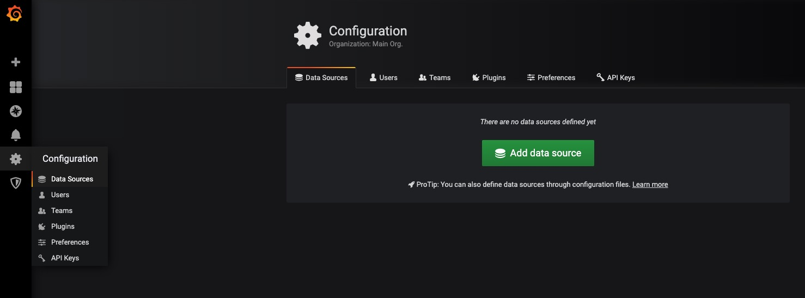
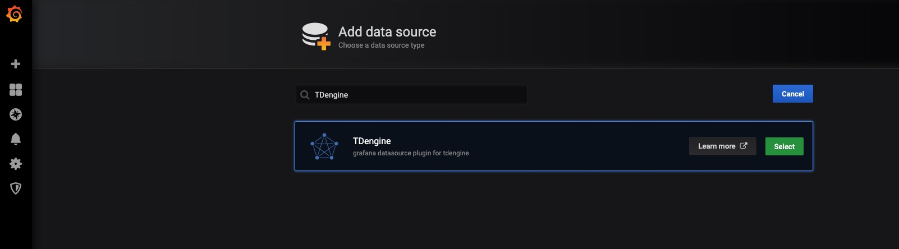
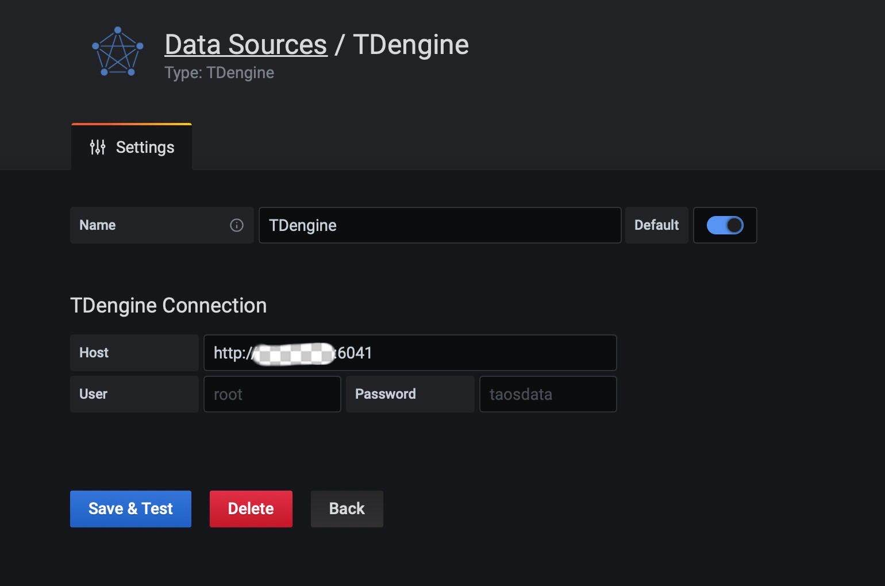
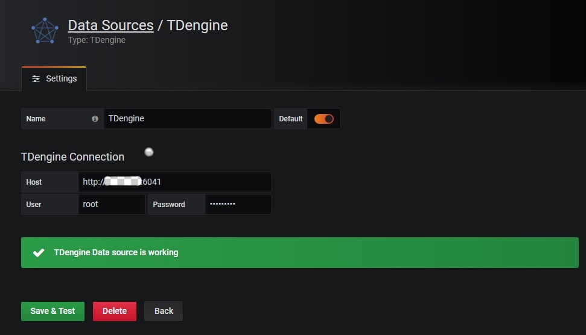
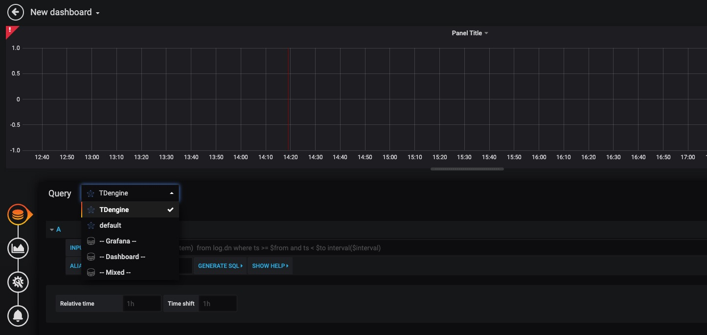
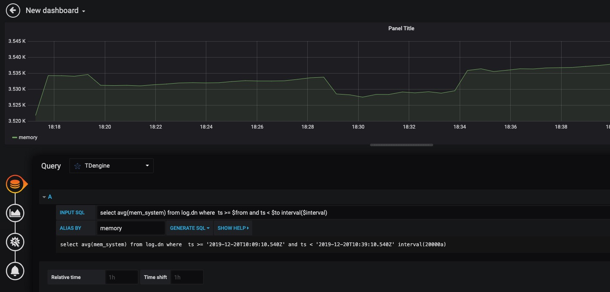

# 与其他工具的连接

## <a class="anchor" id="grafana"></a>Grafana

TDengine 能够与开源数据可视化系统 [Grafana](https://www.grafana.com/) 快速集成搭建数据监测报警系统，整个过程无需任何代码开发，TDengine 中数据表中内容可以在仪表盘(DashBoard)上进行可视化展现。关于 TDengine 插件的使用您可以在 [GitHub](https://github.com/taosdata/grafanaplugin/blob/master/README.md) 中了解更多。

### 安装Grafana

目前 TDengine 支持 Grafana 7.0 以上的版本。用户可以根据当前的操作系统，到 Grafana 官网下载安装包，并执行安装。下载地址如下：<https://grafana.com/grafana/download>。

### 配置Grafana

TDengine 的 Grafana 插件托管在 GitHub，可从 <https://github.com/taosdata/grafanaplugin/releases/latest> 下载，当前最新版本为 3.1.3。

推荐使用 [`grafana-cli` 命令行工具](https://grafana.com/docs/grafana/latest/administration/cli/) 进行插件安装。

```bash
sudo -u grafana grafana-cli \
  --pluginUrl https://github.com/taosdata/grafanaplugin/releases/download/v3.1.3/tdengine-datasource-3.1.3.zip \
  plugins install tdengine-datasource
```

或者下载到本地并解压到 Grafana 插件目录。

```bash
GF_VERSION=3.1.3
wget https://github.com/taosdata/grafanaplugin/releases/download/v$GF_VERSION/tdengine-datasource-$GF_VERSION.zip
```

以 CentOS 7.2 操作系统为例，将插件包解压到 /var/lib/grafana/plugins 目录下，重新启动 grafana 即可。

```bash
sudo unzip tdengine-datasource-$GF_VERSION.zip -d /var/lib/grafana/plugins/
```

Grafana 7.3+ / 8.x 版本会对插件进行签名检查，因此还需要在 grafana.ini 文件中增加如下行，才能正确使用插件：

```ini
[plugins]
allow_loading_unsigned_plugins = tdengine-datasource
```

在 Docker 环境下，可以使用如下的环境变量设置自动安装并设置 TDengine 插件：

```bash
GF_INSTALL_PLUGINS=https://github.com/taosdata/grafanaplugin/releases/download/v3.1.3/tdengine-datasource-3.1.3.zip;tdengine-datasource
GF_PLUGINS_ALLOW_LOADING_UNSIGNED_PLUGINS=tdengine-datasource
```

### 使用 Grafana

#### 配置数据源

用户可以直接通过 `http://localhost:3000` 的网址，登录 Grafana 服务器（用户名/密码：admin/admin），通过左侧 `Configuration -> Data Sources` 可以添加数据源，如下图所示：



点击 `Add data source` 可进入新增数据源页面，在查询框中输入 TDengine 可选择添加，如下图所示：



进入数据源配置页面，按照默认提示修改相应配置即可：



* Host： TDengine 集群的中任意一台服务器的 IP 地址与 TDengine RESTful 接口的端口号(6041)，默认 `http://localhost:6041`。注意：从 2.4 版本开始 RESTful 服务默认使用独立组件 taosAdapter 提供，请参考相关文档配置部署。
* User：TDengine 用户名。
* Password：TDengine 用户密码。

点击 `Save & Test` 进行测试，成功会有如下提示：



#### 创建 Dashboard

回到主界面创建 Dashboard，点击 Add Query 进入面板查询页面：



如上图所示，在 Query 中选中 `TDengine` 数据源，在下方查询框可输入相应 SQL 进行查询，具体说明如下：

* INPUT SQL：输入要查询的语句（该 SQL 语句的结果集应为两列多行），例如：`select avg(mem_system) from log.dn where  ts >= $from and ts < $to interval($interval)` ，其中，from、to 和 interval 为 TDengine 插件的内置变量，表示从 Grafana 插件面板获取的查询范围和时间间隔。除了内置变量外，`也支持可以使用自定义模板变量`。
* ALIAS BY：可设置当前查询别名。
* GENERATE SQL： 点击该按钮会自动替换相应变量，并生成最终执行的语句。

按照默认提示查询当前 TDengine 部署所在服务器指定间隔系统内存平均使用量如下：



> 关于如何使用 Grafana 创建相应的监测界面以及更多有关使用 Grafana 的信息，请参考 Grafana 官方的[文档](https://grafana.com/docs/)。

#### 导入 Dashboard

在 2.3.3.0 及以上版本，您可以导入 TDinsight Dashboard (Grafana Dashboard ID： [15167](https://grafana.com/grafana/dashboards/15167)) 作为 TDengine 集群的监控可视化工具。安装和使用说明请见 [TDinsight 用户手册](https://www.taosdata.com/cn/documentation/tools/insight)。

## <a class="anchor" id="matlab"></a>Matlab

MatLab 可以通过安装包内提供的 JDBC Driver 直接连接到 TDengine 获取数据到本地工作空间。

### MatLab 的 JDBC 接口适配

MatLab 的适配有下面几个步骤，下面以 Windows10 上适配 MatLab2017a 为例：

- 从 (maven.org)[https://repo1.maven.org/maven2/com/taosdata/jdbc/taos-jdbcdriver/] 或其他 maven 镜像网站下载 TDengine JDBC 驱动程序 JDBCDriver-x.x.x-dist.jar 拷贝到 ${matlab_root}\MATLAB\R2017a\java\jar\toolbox
- 将 TDengine 安装包内的 taos.lib 文件拷贝至${matlab_ root _dir}\MATLAB\R2017a\lib\win64
- 将新添加的驱动 jar 包加入 MatLab 的 classpath。在 ${matlab_ root _dir}\MATLAB\R2017a\toolbox\local\classpath.txt 文件中添加下面一行

```
$matlabroot/java/jar/toolbox/JDBCDriver-x.x.x-dist.jar
```

- 在${user_home}\AppData\Roaming\MathWorks\MATLAB\R2017a\下添加一个文件 javalibrarypath.txt, 并在该文件中添加 taos.dll 的路径，比如您的 taos.dll 是在安装时拷贝到了 C:\Windows\System32 下，那么就应该在 javalibrarypath.txt 中添加如下一行：

```
C:\Windows\System32
```

### 在 MatLab 中连接 TDengine 获取数据

在成功进行了上述配置后，打开 MatLab。

- 创建一个连接：

```matlab
conn = database(‘db’, ‘root’, ‘taosdata’, ‘com.taosdata.jdbc.TSDBDriver’, ‘jdbc:TSDB://127.0.0.1:0/’)
```

- 执行一次查询：

```matlab
sql0 = [‘select * from tb’]
data = select(conn, sql0);
```

- 插入一条记录:

```matlab
sql1 = [‘insert into tb values (now, 1)’]
exec(conn, sql1)
```

更多例子细节请参考安装包内 examples\Matlab\TDengineDemo.m 文件。

## <a class="anchor" id="r"></a>R

R 语言支持通过 JDBC 接口来连接 TDengine 数据库。首先需要安装 R 语言的 JDBC 包，下载 RJDBC 的时候，还会自动下载 RJDBC 依赖的 DBI 和 rJava 这两个package。启动 R 语言环境，然后执行以下命令安装 R 语言的 JDBC 支持库：

```R
install.packages('RJDBC', repos='http://cran.us.r-project.org')
library('DBI')
library('rJava')
library('RJDBC')
```

安装完成以后，通过执行`library('RJDBC')`命令加载 _RJDBC_ 包：

然后加载 TDengine 的 JDBC 驱动：

```R
drv<-JDBC("com.taosdata.jdbc.TSDBDriver","JDBCDriver-2.0.0-dist.jar", identifier.quote="\"")
```

如果执行成功，不会出现任何错误信息。之后通过以下命令尝试连接数据库：

```R
conn<-dbConnect(drv,"jdbc:TSDB://127.0.0.1:0/?user=root&password=taosdata","root","taosdata")
```

也可以使用 RESTful 来连接 TDengine。

```R
conn<-dbConnect(drv,"jdbc:TAOS-RS://127.0.0.1:6041/test?user=root&password=taosdata","root","taosdata")
```

注意将上述命令中的IP地址替换成正确的IP地址。如果没有任务错误的信息，则连接数据库成功，否则需要根据错误提示调整连接的命令。TDengine 支持以下的 _RJDBC_ 包中函数：

-	dbWriteTable(conn, "test", iris, overwrite=FALSE, append=TRUE)：将数据框 iris 写入表 test 中，overwrite 必须设置为 false，append 必须设为 TRUE，且数据框 iris 要与表 test 的结构一致。
-	dbGetQuery(conn, "select count(*) from test")：查询语句
-	dbSendUpdate(conn, "use db")：执行任何非查询 SQL 语句。例如 dbSendUpdate(conn, "use db")， 写入数据 dbSendUpdate(conn, "insert into t1 values(now, 99)") 等。
-	dbReadTable(conn, "test")：读取表 test 中数据
-	dbDisconnect(conn)：关闭连接
-	dbRemoveTable(conn, "test")：删除表 test

