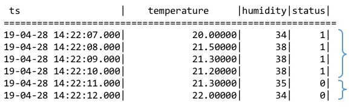

# TAOS SQL

本文档说明 TAOS SQL 支持的语法规则、主要查询功能、支持的 SQL 查询函数，以及常用技巧等内容。阅读本文档需要读者具有基本的 SQL 语言的基础。

TAOS SQL 是用户对 TDengine 进行数据写入和查询的主要工具。TAOS SQL 为了便于用户快速上手，在一定程度上提供类似于标准 SQL 类似的风格和模式。严格意义上，TAOS SQL 并不是也不试图提供 SQL 标准的语法。此外，由于 TDengine 针对的时序性结构化数据不提供删除功能，因此在 TAO SQL 中不提供数据删除的相关功能。

TAOS SQL 目前仅支持 DESCRIBE 关键字的缩写，DESCRIBE 可以缩写为 DESC。

本章节 SQL 语法遵循如下约定：

- < > 里的内容是用户需要输入的，但不要输入 <> 本身
- \[ \] 表示内容为可选项，但不能输入 [] 本身
- | 表示多选一，选择其中一个即可，但不能输入 | 本身
- … 表示前面的项可重复多个

为更好地说明 SQL 语法的规则及其特点，本文假设存在一个数据集。以智能电表(meters)为例，假设每个智能电表采集电流、电压、相位三个量。其建模如下：
```mysql
taos> DESCRIBE meters;
             Field              |        Type        |   Length    |    Note    |
=================================================================================
 ts                             | TIMESTAMP          |           8 |            |
 current                        | FLOAT              |           4 |            |
 voltage                        | INT                |           4 |            |
 phase                          | FLOAT              |           4 |            |
 location                       | BINARY             |          64 | TAG        |
 groupid                        | INT                |           4 | TAG        |
```
数据集包含 4 个智能电表的数据，按照 TDengine 的建模规则，对应 4 个子表，其名称分别是 d1001, d1002, d1003, d1004。

## <a class="anchor" id="data-type"></a>支持的数据类型

使用 TDengine，最重要的是时间戳。创建并插入记录、查询历史记录的时候，均需要指定时间戳。时间戳有如下规则：

- 时间格式为 ```YYYY-MM-DD HH:mm:ss.MS```，默认时间分辨率为毫秒。比如：```2017-08-12 18:25:58.128```
- 内部函数 now 是客户端的当前时间
- 插入记录时，如果时间戳为 now，插入数据时使用提交这条记录的客户端的当前时间
- Epoch Time：时间戳也可以是一个长整数，表示从格林威治时间 1970-01-01 00:00:00.000 (UTC/GMT) 开始的毫秒数（相应地，如果所在 Database 的时间精度设置为“微秒”，则长整型格式的时间戳含义也就对应于从格林威治时间 1970-01-01 00:00:00.000 (UTC/GMT) 开始的微秒数；纳秒精度的逻辑也是类似的。）
- 时间可以加减，比如 now-2h，表明查询时刻向前推 2 个小时（最近 2 小时）。数字后面的时间单位可以是 b(纳秒)、u(微秒)、a(毫秒)、s(秒)、m(分)、h(小时)、d(天)、w(周)。 比如 `select * from t1 where ts > now-2w and ts <= now-1w`，表示查询两周前整整一周的数据。在指定降采样操作（down sampling）的时间窗口（interval）时，时间单位还可以使用 n(自然月) 和 y(自然年)。

TDengine 缺省的时间戳是毫秒精度，但通过在 CREATE DATABASE 时传递的 PRECISION 参数就可以支持微秒和纳秒。（从 2.1.5.0 版本开始支持纳秒精度） 

```mysql
CREATE DATABASE db_name PRECISION 'ns';
```

在TDengine中，普通表的数据模型中可使用以下 10 种数据类型。 

| #    | **类型**          | **Bytes** | **说明**                                                     |
| ---- | :-------: | ------ | ------------------------------------------------------------ |
| 1    | TIMESTAMP | 8      | 时间戳。缺省精度毫秒，可支持微秒和纳秒。从格林威治时间 1970-01-01 00:00:00.000 (UTC/GMT) 开始，计时不能早于该时间。（从 2.0.18.0 版本开始，已经去除了这一时间范围限制）（从 2.1.5.0 版本开始支持纳秒精度） |
| 2    |    INT    | 4      | 整型，范围 [-2^31+1,   2^31-1], -2^31 用作 NULL           |
| 3    |  BIGINT   | 8      | 长整型，范围 [-2^63+1,   2^63-1], -2^63 用于 NULL                                 |
| 4    |   FLOAT   | 4      | 浮点型，有效位数 6-7，范围 [-3.4E38, 3.4E38]                  |
| 5    |  DOUBLE   | 8      | 双精度浮点型，有效位数 15-16，范围 [-1.7E308, 1.7E308]      |
| 6    |  BINARY   | 自定义 | 记录单字节字符串，建议只用于处理 ASCII 可见字符，中文等多字节字符需使用 nchar。理论上，最长可以有 16374 字节。binary 仅支持字符串输入，字符串两端需使用单引号引用。使用时须指定大小，如 binary(20) 定义了最长为 20 个单字节字符的字符串，每个字符占 1 byte 的存储空间，总共固定占用 20 bytes 的空间，此时如果用户字符串超出 20 字节将会报错。对于字符串内的单引号，可以用转义字符反斜线加单引号来表示，即 `\’`。 |
| 7    | SMALLINT  | 2      | 短整型， 范围 [-32767, 32767], -32768 用于 NULL                                |
| 8    |  TINYINT  | 1      | 单字节整型，范围 [-127, 127], -128 用于 NULL                                |
| 9    |   BOOL    | 1      | 布尔型，{true, false}                                      |
| 10   |   NCHAR   | 自定义 | 记录包含多字节字符在内的字符串，如中文字符。每个 nchar 字符占用 4 bytes 的存储空间。字符串两端使用单引号引用，字符串内的单引号需用转义字符 `\’`。nchar 使用时须指定字符串大小，类型为 nchar(10) 的列表示此列的字符串最多存储 10 个 nchar 字符，会固定占用 40 bytes 的空间。如果用户字符串长度超出声明长度，将会报错。 |
| 11   |   JSON    |       | json数据类型， 只有tag类型可以是json格式                                    |
<!-- REPLACE_OPEN_TO_ENTERPRISE__COLUMN_TYPE_ADDONS -->

**Tips**:
1. TDengine 对 SQL 语句中的英文字符不区分大小写，自动转化为小写执行。因此用户大小写敏感的字符串及密码，需要使用单引号将字符串引起来。
2. **注意**，虽然 Binary 类型在底层存储上支持字节型的二进制字符，但不同编程语言对二进制数据的处理方式并不保证一致，因此建议在 Binary 类型中只存储 ASCII 可见字符，而避免存储不可见字符。多字节的数据，例如中文字符，则需要使用 nchar 类型进行保存。如果强行使用 Binary 类型保存中文字符，虽然有时也能正常读写，但并不带有字符集信息，很容易出现数据乱码甚至数据损坏等情况。
3. **注意**，SQL语句中的数值类型将依据是否存在小数点，或使用科学计数法表示，来判断数值类型是否为整型或者浮点型，因此在使用时要注意相应类型越界的情况。例如，9999999999999999999会认为超过长整型的上边界而溢出，而9999999999999999999.0会被认为是有效的浮点数。

## <a class="anchor" id="management"></a>数据库管理

- **创建数据库**  

    ```mysql
    CREATE DATABASE [IF NOT EXISTS] db_name [KEEP keep] [DAYS days] [UPDATE 1];
    ```
    说明：<!-- 注意：上一行中的 SQL 语句在企业版文档中会被替换，因此修改此语句的话，需要修改企业版文档的替换字典键值！！ -->

    1) KEEP是该数据库的数据保留多长天数，缺省是3650天(10年)，数据库会自动删除超过时限的数据；<!-- REPLACE_OPEN_TO_ENTERPRISE__KEEP_PARAM_DESCRIPTION -->

    2) UPDATE 标志数据库支持更新相同时间戳数据；（从 2.1.7.0 版本开始此参数支持设为 2，表示允许部分列更新，也即更新数据行时未被设置的列会保留原值。）（从 2.0.8.0 版本开始支持此参数。注意此参数不能通过 `ALTER DATABASE` 指令进行修改。）

        1) UPDATE设为0时，表示不允许更新数据，后发送的相同时间戳的数据会被直接丢弃；
        
        2) UPDATE设为1时，表示更新全部列数据，即如果更新一个数据行，其中某些列没有提供取值，那么这些列会被设为 NULL；
        
        3) UPDATE设为2时，表示支持更新部分列数据，即如果更新一个数据行，其中某些列没有提供取值，那么这些列会保持原有数据行中的对应值；
        
        4) 更多关于UPDATE参数的用法，请参考[FAQ](https://www.taosdata.com/cn/documentation/faq)。

    3) 数据库名最大长度为32；

    4) 一条SQL 语句的最大长度为65480个字符；

    5) 数据库还有更多与存储相关的配置参数，请参见 [服务端配置](https://www.taosdata.com/cn/documentation/administrator#config) 章节。

- **显示系统当前参数**

    ```mysql
    SHOW VARIABLES;
    ```

- **使用数据库**

    ```mysql
    USE db_name;
    ```
    使用/切换数据库（在 RESTful 连接方式下无效）。

- **删除数据库**
    ```mysql
    DROP DATABASE [IF EXISTS] db_name;
    ```
    删除数据库。指定 Database 所包含的全部数据表将被删除，谨慎使用！

- **修改数据库参数**
    ```mysql
    ALTER DATABASE db_name COMP 2;
    ```
    COMP 参数是指修改数据库文件压缩标志位，缺省值为 2，取值范围为 [0, 2]。0 表示不压缩，1 表示一阶段压缩，2 表示两阶段压缩。

    ```mysql
    ALTER DATABASE db_name REPLICA 2;
    ```
    REPLICA 参数是指修改数据库副本数，取值范围 [1, 3]。在集群中使用，副本数必须小于或等于 DNODE 的数目。

    ```mysql
    ALTER DATABASE db_name KEEP 365;
    ```
    KEEP 参数是指修改数据文件保存的天数，缺省值为 3650，取值范围 [days, 365000]，必须大于或等于 days 参数值。

    ```mysql
    ALTER DATABASE db_name QUORUM 2;
    ```
    QUORUM 参数是指数据写入成功所需要的确认数，取值范围 [1, 2]。对于异步复制，quorum 设为 1，具有 master 角色的虚拟节点自己确认即可。对于同步复制，quorum 设为 2。原则上，Quorum >= 1 并且 Quorum <= replica(副本数)，这个参数在启动一个同步模块实例时需要提供。

    ```mysql
    ALTER DATABASE db_name BLOCKS 100;
    ```
    BLOCKS 参数是每个 VNODE (TSDB) 中有多少 cache 大小的内存块，因此一个 VNODE 的用的内存大小粗略为（cache * blocks）。取值范围 [3, 10000]。

    ```mysql
    ALTER DATABASE db_name CACHELAST 0;
    ```
    CACHELAST 参数控制是否在内存中缓存子表的最近数据。缺省值为 0，取值范围 [0, 1, 2, 3]。其中 0 表示不缓存，1 表示缓存子表最近一行数据，2 表示缓存子表每一列的最近的非 NULL 值，3 表示同时打开缓存最近行和列功能。（从 2.0.11.0 版本开始支持参数值 [0, 1]，从 2.1.2.0 版本开始支持参数值 [0, 1, 2, 3]。）  
    说明：缓存最近行，将显著改善 LAST_ROW 函数的性能表现；缓存每列的最近非 NULL 值，将显著改善无特殊影响（WHERE、ORDER BY、GROUP BY、INTERVAL）下的 LAST 函数的性能表现。

    **Tips**: 以上所有参数修改后都可以用show databases来确认是否修改成功。另外，从 2.1.3.0 版本开始，修改这些参数后无需重启服务器即可生效。

- **显示系统所有数据库**

    ```mysql
    SHOW DATABASES;
    ```

- **显示一个数据库的创建语句**

    ```mysql
    SHOW CREATE DATABASE db_name;
    ```
    常用于数据库迁移。对一个已经存在的数据库，返回其创建语句；在另一个集群中执行该语句，就能得到一个设置完全相同的 Database。


## <a class="anchor" id="table"></a>表管理

- **创建数据表**

    ```mysql
    CREATE TABLE [IF NOT EXISTS] tb_name (timestamp_field_name TIMESTAMP, field1_name data_type1 [, field2_name data_type2 ...]);
    ```
    说明：

    1) 表的第一个字段必须是 TIMESTAMP，并且系统自动将其设为主键；

    2) 表名最大长度为 192；

    3) 表的每行长度不能超过 48K 个字符（2.1.7.0 之前的版本为 16K，每个 BINARY/NCHAR 类型的列还会额外占用 2 个 byte 的存储位置）

    4) 子表名只能由字母、数字和下划线组成，且不能以数字开头，不区分大小写

    5) 使用数据类型 binary 或 nchar，需指定其最长的字节数，如 binary(20)，表示 20 字节；
    
    6) 为了兼容支持更多形式的表名，TDengine 引入新的转义符 "\`"，可以让表名与关键词不冲突，同时不受限于上述表名称合法性约束检查。但是同样具有长度限制要求。使用转义字符以后，不再对转义字符中的内容进行大小写统一。
    例如：\`aBc\` 和 \`abc\` 是不同的表名，但是 abc 和 aBc 是相同的表名。
    需要注意的是转义字符中的内容必须是可打印字符。
    上述的操作逻辑和约束要求与MySQL数据的操作一致。
    从 2.3.0.0 版本开始支持这种方式。

- **以超级表为模板创建数据表**

    ```mysql
    CREATE TABLE [IF NOT EXISTS] tb_name USING stb_name TAGS (tag_value1, ...);
    ```
    以指定的超级表为模板，指定 TAGS 的值来创建数据表。

- **以超级表为模板创建数据表，并指定具体的 TAGS 列**

    ```mysql
    CREATE TABLE [IF NOT EXISTS] tb_name USING stb_name (tag_name1, ...) TAGS (tag_value1, ...);
    ```
    以指定的超级表为模板，指定一部分 TAGS 列的值来创建数据表（没被指定的 TAGS 列会设为空值）。  
    说明：从 2.0.17.0 版本开始支持这种方式。在之前的版本中，不允许指定 TAGS 列，而必须显式给出所有 TAGS 列的取值。

- **批量创建数据表**

    ```mysql
    CREATE TABLE [IF NOT EXISTS] tb_name1 USING stb_name TAGS (tag_value1, ...) [IF NOT EXISTS] tb_name2 USING stb_name TAGS (tag_value2, ...) ...;
    ```
    以更快的速度批量创建大量数据表（服务器端 2.0.14 及以上版本）。
    
    说明：

    1）批量建表方式要求数据表必须以超级表为模板。

    2）在不超出 SQL 语句长度限制的前提下，单条语句中的建表数量建议控制在 1000～3000 之间，将会获得比较理想的建表速度。

- **删除数据表**

    ```mysql
    DROP TABLE [IF EXISTS] tb_name;
    ```

- **显示当前数据库下的所有数据表信息**

    ```mysql
    SHOW TABLES [LIKE tb_name_wildcar];
    ```

    显示当前数据库下的所有数据表信息。

- **显示一个数据表的创建语句**

    ```mysql
    SHOW CREATE TABLE tb_name;
    ```
    常用于数据库迁移。对一个已经存在的数据表，返回其创建语句；在另一个集群中执行该语句，就能得到一个结构完全相同的数据表。

- **在线修改显示字符宽度**

    ```mysql
    SET MAX_BINARY_DISPLAY_WIDTH <nn>;
    ```
    如显示的内容后面以...结尾时，表示该内容已被截断，可通过本命令修改显示字符宽度以显示完整的内容。

- **获取表的结构信息**

    ```mysql
    DESCRIBE tb_name;
    ```

- **表增加列**

    ```mysql
    ALTER TABLE tb_name ADD COLUMN field_name data_type;
    ```
    说明：

    1) 列的最大个数为1024，最小个数为2；（从 2.1.7.0 版本开始，改为最多允许 4096 列）

    2) 列名最大长度为64。

- **表删除列**

    ```mysql
    ALTER TABLE tb_name DROP COLUMN field_name; 
    ```
    如果表是通过超级表创建，更改表结构的操作只能对超级表进行。同时针对超级表的结构更改对所有通过该结构创建的表生效。对于不是通过超级表创建的表，可以直接修改表结构。

- **表修改列宽**

    ```mysql
    ALTER TABLE tb_name MODIFY COLUMN field_name data_type(length); 
    ```
    如果数据列的类型是可变长格式（BINARY 或 NCHAR），那么可以使用此指令修改其宽度（只能改大，不能改小）。（2.1.3.0 版本新增）  
    如果表是通过超级表创建，更改表结构的操作只能对超级表进行。同时针对超级表的结构更改对所有通过该结构创建的表生效。对于不是通过超级表创建的表，可以直接修改表结构。

## <a class="anchor" id="super-table"></a>超级表STable管理

注意：在 2.0.15.0 及以后的版本中，开始支持 STABLE 保留字。也即，在本节后文的指令说明中，CREATE、DROP、ALTER 三个指令在老版本中保留字需写作 TABLE 而不是 STABLE。

- **创建超级表**

    ```mysql
    CREATE STABLE [IF NOT EXISTS] stb_name (timestamp_field_name TIMESTAMP, field1_name data_type1 [, field2_name data_type2 ...]) TAGS (tag1_name tag_type1, tag2_name tag_type2 [, tag3_name tag_type3]);
    ```
    创建 STable，与创建表的 SQL 语法相似，但需要指定 TAGS 字段的名称和类型。

    说明：

    1) TAGS 列的数据类型不能是 timestamp 类型；（从 2.1.3.0 版本开始，TAGS 列中支持使用 timestamp 类型，但需注意在 TAGS 中的 timestamp 列写入数据时需要提供给定值，而暂不支持四则运算，例如 `NOW + 10s` 这类表达式）

    2) TAGS 列名不能与其他列名相同；

    3) TAGS 列名不能为预留关键字（参见：[参数限制与保留关键字](https://www.taosdata.com/cn/documentation/administrator#keywords) 章节）；

    4) TAGS 最多允许 128 个，至少 1 个，总长度不超过 16 KB。

- **删除超级表**

    ```mysql
    DROP STABLE [IF EXISTS] stb_name;
    ```
    删除 STable 会自动删除通过 STable 创建的子表。

- **显示当前数据库下的所有超级表信息**

    ```mysql
    SHOW STABLES [LIKE tb_name_wildcard];
    ```
    查看数据库内全部 STable，及其相关信息，包括 STable 的名称、创建时间、列数量、标签（TAG）数量、通过该 STable 建表的数量。

- **显示一个超级表的创建语句**

    ```mysql
    SHOW CREATE STABLE stb_name;
    ```
    常用于数据库迁移。对一个已经存在的超级表，返回其创建语句；在另一个集群中执行该语句，就能得到一个结构完全相同的超级表。

- **获取超级表的结构信息**

    ```mysql
    DESCRIBE stb_name;
    ```

- **超级表增加列**

    ```mysql
    ALTER STABLE stb_name ADD COLUMN field_name data_type;
    ```

- **超级表删除列**

    ```mysql
    ALTER STABLE stb_name DROP COLUMN field_name; 
    ```

- **超级表修改列宽**

    ```mysql
    ALTER STABLE stb_name MODIFY COLUMN field_name data_type(length); 
    ```
    如果数据列的类型是可变长格式（BINARY 或 NCHAR），那么可以使用此指令修改其宽度（只能改大，不能改小）。（2.1.3.0 版本新增）

## <a class="anchor" id="tags"></a>超级表 STable 中 TAG 管理

- **添加标签**

    ```mysql
    ALTER STABLE stb_name ADD TAG new_tag_name tag_type;
    ```
    为 STable 增加一个新的标签，并指定新标签的类型。标签总数不能超过 128 个，总长度不超过 16K 个字符。

- **删除标签**

    ```mysql
    ALTER STABLE stb_name DROP TAG tag_name;
    ```
    删除超级表的一个标签，从超级表删除某个标签后，该超级表下的所有子表也会自动删除该标签。

- **修改标签名**

    ```mysql
    ALTER STABLE stb_name CHANGE TAG old_tag_name new_tag_name;
    ```
    修改超级表的标签名，从超级表修改某个标签名后，该超级表下的所有子表也会自动更新该标签名。

- **修改标签列宽度**

    ```mysql
    ALTER STABLE stb_name MODIFY TAG tag_name data_type(length); 
    ```
    如果标签的类型是可变长格式（BINARY 或 NCHAR），那么可以使用此指令修改其宽度（只能改大，不能改小）。（2.1.3.0 版本新增）

- **修改子表标签值**

    ```mysql
    ALTER TABLE tb_name SET TAG tag_name=new_tag_value;
    ```
    说明：除了更新标签的值的操作是针对子表进行，其他所有的标签操作（添加标签、删除标签等）均只能作用于 STable，不能对单个子表操作。对 STable 添加标签以后，依托于该 STable 建立的所有表将自动增加了一个标签，所有新增标签的默认值都是 NULL。

## <a class="anchor" id="insert"></a>数据写入

### 写入语法：

```mysql
INSERT INTO
    tb_name
        [USING stb_name [(tag1_name, ...)] TAGS (tag1_value, ...)]
        [(field1_name, ...)]
        VALUES (field1_value, ...) [(field1_value2, ...) ...] | FILE csv_file_path
    [tb2_name
        [USING stb_name [(tag1_name, ...)] TAGS (tag1_value, ...)]
        [(field1_name, ...)]
        VALUES (field1_value, ...) [(field1_value2, ...) ...] | FILE csv_file_path
    ...];
```

### 详细描述及示例：

- **插入一条或多条记录**  
    指定已经创建好的数据子表的表名，并通过 VALUES 关键字提供一行或多行数据，即可向数据库写入这些数据。例如，执行如下语句可以写入一行记录：
    ```mysql
    INSERT INTO d1001 VALUES (NOW, 10.2, 219, 0.32);
    ```
    或者，可以通过如下语句写入两行记录：  
    ```mysql
    INSERT INTO d1001 VALUES ('2021-07-13 14:06:32.272', 10.2, 219, 0.32) (1626164208000, 10.15, 217, 0.33);
    ```
    **注意：**  
    1）在第二个例子中，两行记录的首列时间戳使用了不同格式的写法。其中字符串格式的时间戳写法不受所在 DATABASE 的时间精度设置影响；而长整形格式的时间戳写法会受到所在 DATABASE 的时间精度设置影响——例子中的时间戳在毫秒精度下可以写作 1626164208000，而如果是在微秒精度设置下就需要写为 1626164208000000，纳秒精度设置下需要写为 1626164208000000000。  
    2）在使用“插入多条记录”方式写入数据时，不能把第一列的时间戳取值都设为 NOW，否则会导致语句中的多条记录使用相同的时间戳，于是就可能出现相互覆盖以致这些数据行无法全部被正确保存。其原因在于，NOW 函数在执行中会被解析为所在 SQL 语句的实际执行时间，出现在同一语句中的多个 NOW 标记也就会被替换为完全相同的时间戳取值。  
    3）允许插入的最老记录的时间戳，是相对于当前服务器时间，减去配置的 keep 值（数据保留的天数）；允许插入的最新记录的时间戳，是相对于当前服务器时间，加上配置的 days 值（数据文件存储数据的时间跨度，单位为天）。keep 和 days 都是可以在创建数据库时指定的，缺省值分别是 3650 天和 10 天。

- **插入记录，数据对应到指定的列**  
    向数据子表中插入记录时，无论插入一行还是多行，都可以让数据对应到指定的列。对于 SQL 语句中没有出现的列，数据库将自动填充为 NULL。主键（时间戳）不能为 NULL。例如：
    ```mysql
    INSERT INTO d1001 (ts, current, phase) VALUES ('2021-07-13 14:06:33.196', 10.27, 0.31);
    ```
    **说明：**如果不指定列，也即使用全列模式——那么在 VALUES 部分提供的数据，必须为数据表的每个列都显式地提供数据。全列模式写入速度会远快于指定列，因此建议尽可能采用全列写入方式，此时空列可以填入 NULL。

- **向多个表插入记录**  
    可以在一条语句中，分别向多个表插入一条或多条记录，并且也可以在插入过程中指定列。例如：
    ```mysql
    INSERT INTO d1001 VALUES ('2021-07-13 14:06:34.630', 10.2, 219, 0.32) ('2021-07-13 14:06:35.779', 10.15, 217, 0.33)
                d1002 (ts, current, phase) VALUES ('2021-07-13 14:06:34.255', 10.27, 0.31）;
    ```

- <a class="anchor" id="auto_create_table"></a>**插入记录时自动建表**  
    如果用户在写数据时并不确定某个表是否存在，此时可以在写入数据时使用自动建表语法来创建不存在的表，若该表已存在则不会建立新表。自动建表时，要求必须以超级表为模板，并写明数据表的 TAGS 取值。例如：  
    ```mysql
    INSERT INTO d21001 USING meters TAGS ('Beijing.Chaoyang', 2) VALUES ('2021-07-13 14:06:32.272', 10.2, 219, 0.32);
    ```
    也可以在自动建表时，只是指定部分 TAGS 列的取值，未被指定的 TAGS 列将置为 NULL。例如：  
    ```mysql
    INSERT INTO d21001 USING meters (groupId) TAGS (2) VALUES ('2021-07-13 14:06:33.196', 10.15, 217, 0.33);
    ```
    自动建表语法也支持在一条语句中向多个表插入记录。例如：  
    ```mysql
    INSERT INTO d21001 USING meters TAGS ('Beijing.Chaoyang', 2) VALUES ('2021-07-13 14:06:34.630', 10.2, 219, 0.32) ('2021-07-13 14:06:35.779', 10.15, 217, 0.33)
                d21002 USING meters (groupId) TAGS (2) VALUES ('2021-07-13 14:06:34.255', 10.15, 217, 0.33)
                d21003 USING meters (groupId) TAGS (2) (ts, current, phase) VALUES ('2021-07-13 14:06:34.255', 10.27, 0.31);
    ```
    **说明：**在 2.0.20.5 版本之前，在使用自动建表语法并指定列时，子表的列名必须紧跟在子表名称后面，而不能如例子里那样放在 TAGS 和 VALUES 之间。从 2.0.20.5 版本开始，两种写法都可以，但不能在一条 SQL 语句中混用，否则会报语法错误。

- **插入来自文件的数据记录**  
    除了使用 VALUES 关键字插入一行或多行数据外，也可以把要写入的数据放在 CSV 文件中（英文逗号分隔、英文单引号括住每个值）供 SQL 指令读取。其中 CSV 文件无需表头。例如，如果 /tmp/csvfile.csv 文件的内容为：  
    ```
    '2021-07-13 14:07:34.630', '10.2', '219', '0.32'
    '2021-07-13 14:07:35.779', '10.15', '217', '0.33'
    ```
    那么通过如下指令可以把这个文件中的数据写入子表中：  
    ```mysql
    INSERT INTO d1001 FILE '/tmp/csvfile.csv';
    ```

- **插入来自文件的数据记录，并自动建表**  
    从 2.1.5.0 版本开始，支持在插入来自 CSV 文件的数据时，以超级表为模板来自动创建不存在的数据表。例如：  
    ```mysql
    INSERT INTO d21001 USING meters TAGS ('Beijing.Chaoyang', 2) FILE '/tmp/csvfile.csv';
    ```
    也可以在一条语句中向多个表以自动建表的方式插入记录。例如：  
    ```mysql
    INSERT INTO d21001 USING meters TAGS ('Beijing.Chaoyang', 2) FILE '/tmp/csvfile_21001.csv'
                d21002 USING meters (groupId) TAGS (2) FILE '/tmp/csvfile_21002.csv';
    ```

**历史记录写入**：可使用IMPORT或者INSERT命令，IMPORT的语法，功能与INSERT完全一样。

**说明：**针对 insert 类型的 SQL 语句，我们采用的流式解析策略，在发现后面的错误之前，前面正确的部分 SQL 仍会执行。下面的 SQL 中，INSERT 语句是无效的，但是 d1001 仍会被创建。

```mysql
taos> CREATE TABLE meters(ts TIMESTAMP, current FLOAT, voltage INT, phase FLOAT) TAGS(location BINARY(30), groupId INT);
Query OK, 0 row(s) affected (0.008245s)

taos> SHOW STABLES;
              name              |      created_time       | columns |  tags  |   tables    |
============================================================================================
 meters                         | 2020-08-06 17:50:27.831 |       4 |      2 |           0 |
Query OK, 1 row(s) in set (0.001029s)

taos> SHOW TABLES;
Query OK, 0 row(s) in set (0.000946s)

taos> INSERT INTO d1001 USING meters TAGS('Beijing.Chaoyang', 2) VALUES('a');

DB error: invalid SQL: 'a' (invalid timestamp) (0.039494s)

taos> SHOW TABLES;
           table_name           |      created_time       | columns |          stable_name           |
======================================================================================================
 d1001                          | 2020-08-06 17:52:02.097 |       4 | meters                         |
Query OK, 1 row(s) in set (0.001091s)
```

## <a class="anchor" id="select"></a>数据查询

### 查询语法：

```mysql
SELECT select_expr [, select_expr ...]
    FROM {tb_name_list}
    [WHERE where_condition]
    [SESSION(ts_col, tol_val)]
    [STATE_WINDOW(col)]
    [INTERVAL(interval_val [, interval_offset]) [SLIDING sliding_val]]
    [FILL(fill_mod_and_val)]
    [GROUP BY col_list]
    [ORDER BY col_list { DESC | ASC }]
    [SLIMIT limit_val [SOFFSET offset_val]]
    [LIMIT limit_val [OFFSET offset_val]]
    [>> export_file];
```

#### 通配符

通配符 * 可以用于代指全部列。对于普通表，结果中只有普通列。
```mysql
taos> SELECT * FROM d1001;
           ts            |       current        |   voltage   |        phase         |
======================================================================================
 2018-10-03 14:38:05.000 |             10.30000 |         219 |              0.31000 |
 2018-10-03 14:38:15.000 |             12.60000 |         218 |              0.33000 |
 2018-10-03 14:38:16.800 |             12.30000 |         221 |              0.31000 |
Query OK, 3 row(s) in set (0.001165s)
```

在针对超级表，通配符包含 _标签列_ 。
```mysql
taos> SELECT * FROM meters;
           ts            |       current        |   voltage   |        phase         |            location            |   groupid   |
=====================================================================================================================================
 2018-10-03 14:38:05.500 |             11.80000 |         221 |              0.28000 | Beijing.Haidian                |           2 |
 2018-10-03 14:38:16.600 |             13.40000 |         223 |              0.29000 | Beijing.Haidian                |           2 |
 2018-10-03 14:38:05.000 |             10.80000 |         223 |              0.29000 | Beijing.Haidian                |           3 |
 2018-10-03 14:38:06.500 |             11.50000 |         221 |              0.35000 | Beijing.Haidian                |           3 |
 2018-10-03 14:38:04.000 |             10.20000 |         220 |              0.23000 | Beijing.Chaoyang               |           3 |
 2018-10-03 14:38:16.650 |             10.30000 |         218 |              0.25000 | Beijing.Chaoyang               |           3 |
 2018-10-03 14:38:05.000 |             10.30000 |         219 |              0.31000 | Beijing.Chaoyang               |           2 |
 2018-10-03 14:38:15.000 |             12.60000 |         218 |              0.33000 | Beijing.Chaoyang               |           2 |
 2018-10-03 14:38:16.800 |             12.30000 |         221 |              0.31000 | Beijing.Chaoyang               |           2 |
Query OK, 9 row(s) in set (0.002022s)
```

通配符支持表名前缀，以下两个SQL语句均为返回全部的列：
```mysql
SELECT * FROM d1001;
SELECT d1001.* FROM d1001;
```
在JOIN查询中，带前缀的\*和不带前缀\*返回的结果有差别， \*返回全部表的所有列数据（不包含标签），带前缀的通配符，则只返回该表的列数据。
```mysql
taos> SELECT * FROM d1001, d1003 WHERE d1001.ts=d1003.ts;
           ts            | current |   voltage   |    phase     |           ts            | current |   voltage   |    phase     |
==================================================================================================================================
 2018-10-03 14:38:05.000 | 10.30000|         219 |      0.31000 | 2018-10-03 14:38:05.000 | 10.80000|         223 |      0.29000 |
Query OK, 1 row(s) in set (0.017385s)
```
```mysql
taos> SELECT d1001.* FROM d1001,d1003 WHERE d1001.ts = d1003.ts;
           ts            |       current        |   voltage   |        phase         |
======================================================================================
 2018-10-03 14:38:05.000 |             10.30000 |         219 |              0.31000 |
Query OK, 1 row(s) in set (0.020443s)
```

在使用SQL函数来进行查询的过程中，部分SQL函数支持通配符操作。其中的区别在于：
```count(*)```函数只返回一列。```first```、```last```、```last_row```函数则是返回全部列。

```mysql
taos> SELECT COUNT(*) FROM d1001;
       count(*)        |
========================
                     3 |
Query OK, 1 row(s) in set (0.001035s)
```

```mysql
taos> SELECT FIRST(*) FROM d1001;
        first(ts)        |    first(current)    | first(voltage) |     first(phase)     |
=========================================================================================
 2018-10-03 14:38:05.000 |             10.30000 |            219 |              0.31000 |
Query OK, 1 row(s) in set (0.000849s)
```

#### 标签列

从 2.0.14 版本开始，支持在普通表的查询中指定 _标签列_，且标签列的值会与普通列的数据一起返回。
```mysql
taos> SELECT location, groupid, current FROM d1001 LIMIT 2;
            location            |   groupid   |       current        |
======================================================================
 Beijing.Chaoyang               |           2 |             10.30000 |
 Beijing.Chaoyang               |           2 |             12.60000 |
Query OK, 2 row(s) in set (0.003112s)
```

注意：普通表的通配符 * 中并不包含 _标签列_。

#### 获取标签列或普通列的去重取值

从 2.0.15.0 版本开始，支持在超级表查询标签列时，指定 DISTINCT 关键字，这样将返回指定标签列的所有不重复取值。注意，在 2.1.6.0 版本之前，DISTINCT 只支持处理单个标签列，而从 2.1.6.0 版本开始，DISTINCT 可以对多个标签列进行处理，输出这些标签列取值不重复的组合。
```sql
SELECT DISTINCT tag_name [, tag_name ...] FROM stb_name;
```

从 2.1.7.0 版本开始，DISTINCT 也支持对数据子表或普通表进行处理，也即支持获取单个普通列的不重复取值，或多个普通列取值的不重复组合。
```sql
SELECT DISTINCT col_name [, col_name ...] FROM tb_name;
```


说明：
1. cfg 文件中的配置参数 maxNumOfDistinctRes 将对 DISTINCT 能够输出的数据行数进行限制。其最小值是 100000，最大值是 100000000，默认值是 10000000。如果实际计算结果超出了这个限制，那么会仅输出这个数量范围内的部分。
2. 由于浮点数天然的精度机制原因，在特定情况下，对 FLOAT 和 DOUBLE 列使用 DISTINCT 并不能保证输出值的完全唯一性。
3. 在当前版本下，DISTINCT 不能在嵌套查询的子查询中使用，也不能与聚合函数、GROUP BY、或 JOIN 在同一条语句中混用。

#### 结果集列名

```SELECT```子句中，如果不指定返回结果集合的列名，结果集列名称默认使用```SELECT```子句中的表达式名称作为列名称。此外，用户可使用```AS```来重命名返回结果集合中列的名称。例如：
```mysql
taos> SELECT ts, ts AS primary_key_ts FROM d1001;
           ts            |     primary_key_ts      |
====================================================
 2018-10-03 14:38:05.000 | 2018-10-03 14:38:05.000 |
 2018-10-03 14:38:15.000 | 2018-10-03 14:38:15.000 |
 2018-10-03 14:38:16.800 | 2018-10-03 14:38:16.800 |
Query OK, 3 row(s) in set (0.001191s)
```
但是针对```first(*)```、```last(*)```、```last_row(*)```不支持针对单列的重命名。

#### 隐式结果列

```Select_exprs```可以是表所属列的列名，也可以是基于列的函数表达式或计算式，数量的上限256个。当用户使用了```interval```或```group by tags```的子句以后，在最后返回结果中会强制返回时间戳列（第一列）和group by子句中的标签列。后续的版本中可以支持关闭group by子句中隐式列的输出，列输出完全由select子句控制。

#### 表（超级表）列表

FROM关键字后面可以是若干个表（超级表）列表，也可以是子查询的结果。
如果没有指定用户的当前数据库，可以在表名称之前使用数据库的名称来指定表所属的数据库。例如：```power.d1001``` 方式来跨库使用表。
```mysql
SELECT * FROM power.d1001;
------------------------------
USE power;
SELECT * FROM d1001;
```

#### 特殊功能

部分特殊的查询功能可以不使用FROM子句执行。获取当前所在的数据库 database()： 
```mysql
taos> SELECT DATABASE();
           database()           |
=================================
 power                          |
Query OK, 1 row(s) in set (0.000079s)
```
如果登录的时候没有指定默认数据库，且没有使用```USE```命令切换数据，则返回NULL。
```mysql
taos> SELECT DATABASE();
           database()           |
=================================
 NULL                           |
Query OK, 1 row(s) in set (0.000184s)
```
获取服务器和客户端版本号：
```mysql
taos> SELECT CLIENT_VERSION();
 client_version() |
===================
 2.0.0.0          |
Query OK, 1 row(s) in set (0.000070s)

taos> SELECT SERVER_VERSION();
 server_version() |
===================
 2.0.0.0          |
Query OK, 1 row(s) in set (0.000077s)
```
服务器状态检测语句。如果服务器正常，返回一个数字（例如 1）。如果服务器异常，返回error code。该SQL语法能兼容连接池对于TDengine状态的检查及第三方工具对于数据库服务器状态的检查。并可以避免出现使用了错误的心跳检测SQL语句导致的连接池连接丢失的问题。
```mysql
taos> SELECT SERVER_STATUS();
 server_status() |
==================
               1 |
Query OK, 1 row(s) in set (0.000074s)

taos> SELECT SERVER_STATUS() AS status;
   status    |
==============
           1 |
Query OK, 1 row(s) in set (0.000081s)
```

函数_block_dist()使用说明
<br/>语法

SELECT _block_dist() FROM { tb_name | stb_name }

功能说明：获得指定的（超级）表的数据块分布信息

返回结果类型：字符串。


适用数据类型：不能输入任何参数。

嵌套子查询支持：不支持子查询或嵌套查询。


说明：

返回 FROM 子句中输入的表或超级表的数据块分布情况。不支持查询条件。

返回的结果是该表或超级表的数据块所包含的行数的数据分布直方图。

返回结果如下：
```
summary:
5th=[392], 10th=[392], 20th=[392], 30th=[392], 40th=[792], 50th=[792] 60th=[792], 70th=[792], 80th=[792], 90th=[792], 95th=[792], 99th=[792] Min=[392(Rows)] Max=[800(Rows)] Avg=[666(Rows)] Stddev=[2.17] Rows=[2000], Blocks=[3], Size=[5.440(Kb)] Comp=[0.23] RowsInMem=[0] SeekHeaderTime=[1(us)]
```
上述信息的说明如下：
<br/>1、查询的（超级）表所包含的存储在文件中的数据块（data block）中所包含的数据行的数量分布直方图信息：5%， 10%， 20%， 30%， 40%， 50%， 60%， 70%， 80%， 90%， 95%， 99% 的数值；
<br/>2、所有数据块中，包含行数最少的数据块所包含的行数量， 其中的 Min 指标 392 行。
<br/>3、所有数据块中，包含行数最多的数据块所包含的行数量， 其中的 Max 指标 800 行。
<br/>4、所有数据块行数的算数平均值 666行（其中的 Avg 项）。
<br/>5、所有数据块中行数分布的均方差为 2.17 ( stddev ）。
<br/>6、数据块包含的行的总数为 2000 行（Rows）。
<br/>7、数据块总数是 3 个数据块 （Blocks）。
<br/>8、数据块占用磁盘空间大小 5.44 Kb （size）。
<br/>9、压缩后的数据块的大小除以原始数据的所获得的压缩比例： 23%（Comp），及压缩后的数据规模是原始数据规模的 23%。
<br/>10、内存中存在的数据行数是0，表示内存中没有数据缓存。
<br/>11、获取数据块信息的过程中读取头文件的时间开销 1 微秒（SeekHeaderTime）。

支持版本：指定计算算法的功能从2.1.0.x 版本开始，2.1.0.0之前的版本不支持指定使用算法的功能。


#### TAOS SQL中特殊关键词

 >   TBNAME： 在超级表查询中可视为一个特殊的标签，代表查询涉及的子表名<br>
    \_c0: 表示表（超级表）的第一列
    \_qstart,\_qstop,\_qduration: 表示查询过滤窗口的起始，结束以及持续时间（从 2.6.0.0 版本开始支持）
    \_wstart,\_wstop,\_wduration: 窗口切分聚合查询（例如 interval/session window/state window）中表示每个切分窗口的起始，结束以及持续时间（从 2.6.0.0 版本开始支持）

#### 小技巧

获取一个超级表所有的子表名及相关的标签信息：
```mysql
SELECT TBNAME, location FROM meters;
```
统计超级表下辖子表数量：
```mysql
SELECT COUNT(TBNAME) FROM meters;
```
以上两个查询均只支持在WHERE条件子句中添加针对标签（TAGS）的过滤条件。例如：
```mysql
taos> SELECT TBNAME, location FROM meters;
             tbname             |            location            |
==================================================================
 d1004                          | Beijing.Haidian                |
 d1003                          | Beijing.Haidian                |
 d1002                          | Beijing.Chaoyang               |
 d1001                          | Beijing.Chaoyang               |
Query OK, 4 row(s) in set (0.000881s)

taos> SELECT COUNT(tbname) FROM meters WHERE groupId > 2;
     count(tbname)     |
========================
                     2 |
Query OK, 1 row(s) in set (0.001091s)
```

- 可以使用 * 返回所有列，或指定列名。可以对数字列进行四则运算，可以给输出的列取列名。
  * 暂不支持含列名的四则运算表达式用于条件过滤算子（例如，不支持 `where a*2>6;`，但可以写 `where a>6/2;`）。
  * 暂不支持含列名的四则运算表达式作为 SQL 函数的应用对象（例如，不支持 `select min(2*a) from t;`，但可以写 `select 2*min(a) from t;`）。
- WHERE 语句可以使用各种逻辑判断来过滤数字值，或使用通配符来过滤字符串。
- 输出结果缺省按首列时间戳升序排序，但可以指定按降序排序( _c0 指首列时间戳)。使用 ORDER BY 对其他字段进行排序,排序结果顺序不确定。
- 参数 LIMIT 控制输出条数，OFFSET 指定从第几条开始输出。LIMIT/OFFSET 对结果集的执行顺序在 ORDER BY 之后。且 `LIMIT 5 OFFSET 2` 可以简写为 `LIMIT 2, 5`。
  * 在有 GROUP BY 子句的情况下，LIMIT 参数控制的是每个分组中至多允许输出的条数。
- 参数 SLIMIT 控制由 GROUP BY 指令划分的分组中，至多允许输出几个分组的数据。且 `SLIMIT 5 SOFFSET 2` 可以简写为 `SLIMIT 2, 5`。
- 通过 “>>” 输出结果可以导出到指定文件。

### 支持的条件过滤操作

| **Operation** | **Note**                 | **Applicable Data Types**                 |
| ------------- | ------------------------ | ----------------------------------------- |
| >             | larger than              | all types except bool                     |
| <             | smaller than             | all types except bool                     |
| >=            | larger than or equal to  | all types except bool                     |
| <=            | smaller than or equal to | all types except bool                     |
| =             | equal to                 | all types                                 |
| <>            | not equal to             | all types                                 |
| is [not] null | is null or is not null   | all types                                 |
| between and   | within a certain range   | all types except bool                     |
| in            | match any value in a set | all types except first column `timestamp` |
| like          | match a wildcard string  | **`binary`** **`nchar`**                  |
| match/nmatch  | filter regex             | **`binary`** **`nchar`**                  |

1. <> 算子也可以写为 != ，请注意，这个算子不能用于数据表第一列的 timestamp 字段。
2. like 算子使用通配符字符串进行匹配检查。
  * 在通配符字符串中：'%'（百分号）匹配 0 到任意个字符；'\_'（下划线）匹配单个任意ASCII字符。
    * 如果希望匹配字符串中原本就带有的 \_（下划线）字符，那么可以在通配符字符串中写作 `\_`，也即加一个反斜线来进行转义。（从 2.2.0.0 版本开始支持）
  * 通配符字符串最长不能超过 20 字节。（从 2.1.6.1 版本开始，通配符字符串的长度放宽到了 100 字节，并可以通过 taos.cfg 中的 maxWildCardsLength 参数来配置这一长度限制。但不建议使用太长的通配符字符串，将有可能严重影响 LIKE 操作的执行性能。）
3. 同时进行多个字段的范围过滤，需要使用关键词 AND 来连接不同的查询条件，暂不支持 OR 连接的不同列之间的查询过滤条件。
  * 从 2.3.0.0 版本开始，已支持完整的同一列和/或不同列间的 AND/OR 运算。
4. 针对单一字段的过滤，如果是时间过滤条件，则一条语句中只支持设定一个；但针对其他的（普通）列或标签列，则可以使用 `OR` 关键字进行组合条件的查询过滤。例如： `((value > 20 AND value < 30) OR (value < 12))`。
  * 从 2.3.0.0 版本开始，允许使用多个时间过滤条件，但首列时间戳的过滤运算结果只能包含一个区间。
5. 从 2.0.17.0 版本开始，条件过滤开始支持 BETWEEN AND 语法，例如 `WHERE col2 BETWEEN 1.5 AND 3.25` 表示查询条件为“1.5 ≤ col2 ≤ 3.25”。

6. 从 2.1.4.0 版本开始，条件过滤开始支持 IN 算子，例如 `WHERE city IN ('Beijing', 'Shanghai')`。说明：BOOL 类型写作 `{true, false}` 或 `{0, 1}` 均可，但不能写作 0、1 之外的整数；FLOAT 和 DOUBLE 类型会受到浮点数精度影响，集合内的值在精度范围内认为和数据行的值完全相等才能匹配成功；TIMESTAMP 类型支持非主键的列。

7. 从2.3.0.0版本开始，条件过滤开始支持正则表达式，关键字 match/nmatch 不区分大小写。

   **语法**

   WHERE (column|tag|tbname) **match/MATCH/nmatch/NMATCH** *regex*

   match/MATCH 匹配正则表达式

   nmatch/NMATCH 不匹配正则表达式

   **正则表达式规范**

   确保使用的正则表达式符合POSIX的规范，具体规范内容可参见 [Regular Expressions](https://pubs.opengroup.org/onlinepubs/9699919799/basedefs/V1_chap09.html)，目前 TDengine 使用的是 glibc 里面的 regex 实现，使用正则表达式进行 match 时是区分大小写的

   **正则表达使用示例**

    ```sql
    taos> select distinct location from meters;
        location     |
    ===================
    beijing          |
    shanghai         |
    Query OK, 2 row(s) in set (0.003513s)

    taos> select count(*) from meters;
        count(*)        |
    ========================
                    100000 |
    Query OK, 1 row(s) in set (0.015054s)

    taos> select count(*) from meters where location match '^b';
        count(*)        |
    ========================
                    48000 |
    Query OK, 1 row(s) in set (0.006977s)

    taos> select count(*) from meters where location nmatch '^b';
        count(*)        |
    ========================
                    52000 |
    Query OK, 1 row(s) in set (0.008188s)
    ```

   **使用限制**

   只能针对表名 (tbname) 以及binary类型的普通列或标签进行正则表达式过滤。

   正则匹配字符串长度不能超过 128 字节。可以通过参数 *maxRegexStringLen* 设置和调整最大允许的正则匹配字符串，该参数是客户端配置参数，需要重启客户端才能生效。


<a class="anchor" id="join"></a>
### JOIN 子句

从 2.2.0.0 版本开始，TDengine 对内连接（INNER JOIN）中的自然连接（Natural join）操作实现了完整的支持。也即支持“普通表与普通表之间”、“超级表与超级表之间”、“子查询与子查询之间”进行自然连接。自然连接与内连接的主要区别是，自然连接要求参与连接的字段在不同的表/超级表中必须是同名字段。也即，TDengine 在连接关系的表达中，要求必须使用同名数据列/标签列的相等关系。

在普通表与普通表之间的 JOIN 操作中，只能使用主键时间戳之间的相等关系。例如：
```sql
SELECT *
FROM temp_tb_1 t1, pressure_tb_1 t2
WHERE t1.ts = t2.ts
```

在超级表与超级表之间的 JOIN 操作中，除了主键时间戳一致的条件外，还要求引入能实现一一对应的标签列的相等关系。例如：
```sql
SELECT *
FROM temp_stable t1, temp_stable t2
WHERE t1.ts = t2.ts AND t1.deviceid = t2.deviceid AND t1.status=0;
```

类似地，也可以对多个子查询的查询结果进行 JOIN 操作。

注意，JOIN 操作存在如下限制要求：
1. 参与一条语句中 JOIN 操作的表/超级表最多可以有 10 个。
2. 在包含 JOIN 操作的查询语句中不支持 FILL。
3. 暂不支持参与 JOIN 操作的表之间聚合后的四则运算。
4. 不支持只对其中一部分表做 GROUP BY。
5. JOIN 查询的不同表的过滤条件之间不能为 OR。
6. JOIN 查询要求连接条件不能是普通列，只能针对标签和主时间字段列（第一列）。

<a class="anchor" id="nested"></a>
### 嵌套查询

“嵌套查询”又称为“子查询”，也即在一条 SQL 语句中，“内层查询”的计算结果可以作为“外层查询”的计算对象来使用。

从 2.2.0.0 版本开始，TDengine 的查询引擎开始支持在 FROM 子句中使用非关联子查询（“非关联”的意思是，子查询不会用到父查询中的参数）。也即在普通 SELECT 语句的 tb_name_list 位置，用一个独立的 SELECT 语句来代替（这一 SELECT 语句被包含在英文圆括号内），于是完整的嵌套查询 SQL 语句形如：

```mysql
SELECT ... FROM (SELECT ... FROM ...) ...;
```

说明：
1. 目前仅支持一层嵌套，也即不能在子查询中再嵌入子查询。
2. 内层查询的返回结果将作为“虚拟表”供外层查询使用，此虚拟表可以使用 AS 语法做重命名，以便于外层查询中方便引用。
3. 目前不能在“连续查询”功能中使用子查询。
4. 在内层和外层查询中，都支持普通的表间/超级表间 JOIN。内层查询的计算结果也可以再参与数据子表的 JOIN 操作。
5. 目前内层查询、外层查询均不支持 UNION 操作。
6. 内层查询支持的功能特性与非嵌套的查询语句能力是一致的。
  * 内层查询的 ORDER BY 子句一般没有意义，建议避免这样的写法以免无谓的资源消耗。
7. 与非嵌套的查询语句相比，外层查询所能支持的功能特性存在如下限制：
  * 计算函数部分：
    1. 如果内层查询的结果数据未提供时间戳，那么计算过程依赖时间戳的函数在外层会无法正常工作。例如：TOP, BOTTOM, FIRST, LAST, DIFF。
    2. 计算过程需要两遍扫描的函数，在外层查询中无法正常工作。例如：此类函数包括：STDDEV, PERCENTILE。
  * 外层查询中不支持 IN 算子，但在内层中可以使用。
  * 外层查询不支持 GROUP BY。

<a class="anchor" id="union"></a>
### UNION ALL 子句

```mysql
SELECT ...
UNION ALL SELECT ...
[UNION ALL SELECT ...]
```

TDengine 支持 UNION ALL 操作符。也就是说，如果多个 SELECT 子句返回结果集的结构完全相同（列名、列类型、列数、顺序），那么可以通过 UNION ALL 把这些结果集合并到一起。目前只支持 UNION ALL 模式，也即在结果集的合并过程中是不去重的。在同一个sql语句中，UNION ALL 最多支持100个。

### SQL 示例 

- 对于下面的例子，表tb1用以下语句创建：

    ```mysql
    CREATE TABLE tb1 (ts TIMESTAMP, col1 INT, col2 FLOAT, col3 BINARY(50));
    ```

- 查询tb1刚过去的一个小时的所有记录：

    ```mysql
    SELECT * FROM tb1 WHERE ts >= NOW - 1h;
    ```

- 查询表tb1从2018-06-01 08:00:00.000 到2018-06-02 08:00:00.000时间范围，并且col3的字符串是'nny'结尾的记录，结果按照时间戳降序：

    ```mysql
    SELECT * FROM tb1 WHERE ts > '2018-06-01 08:00:00.000' AND ts <= '2018-06-02 08:00:00.000' AND col3 LIKE '%nny' ORDER BY ts DESC;
    ```

- 查询col1与col2的和，并取名complex, 时间大于2018-06-01 08:00:00.000, col2大于1.2，结果输出仅仅10条记录，从第5条开始：

    ```mysql
    SELECT (col1 + col2) AS 'complex' FROM tb1 WHERE ts > '2018-06-01 08:00:00.000' AND col2 > 1.2 LIMIT 10 OFFSET 5;
    ```

- 查询过去10分钟的记录，col2的值大于3.14，并且将结果输出到文件 `/home/testoutpu.csv`：

    ```mysql
    SELECT COUNT(*) FROM tb1 WHERE ts >= NOW - 10m AND col2 > 3.14 >> /home/testoutpu.csv;
    ```

<a class="anchor" id="functions"></a>
## SQL 函数

### 聚合函数

TDengine支持针对数据的聚合查询。提供支持的聚合和选择函数如下：

- **COUNT**
    ```mysql
    SELECT COUNT([*|field_name]) FROM tb_name [WHERE clause];
    ```
    功能说明：统计表/超级表中记录行数或某列的非空值个数。

    返回结果数据类型：长整型INT64。

    应用字段：应用全部字段。

    适用于：**表、超级表**。

    说明：

    1）可以使用星号(\*)来替代具体的字段，使用星号(\*)返回全部记录数量。

    2）针对同一表的（不包含NULL值）字段查询结果均相同。

    3）如果统计对象是具体的列，则返回该列中非NULL值的记录数量。

    示例：
    ```mysql
    taos> SELECT COUNT(*), COUNT(voltage) FROM meters;
        count(*)        |    count(voltage)     |
    ================================================
                        9 |                     9 |
    Query OK, 1 row(s) in set (0.004475s)

    taos> SELECT COUNT(*), COUNT(voltage) FROM d1001;
        count(*)        |    count(voltage)     |
    ================================================
                        3 |                     3 |
    Query OK, 1 row(s) in set (0.001075s)
    ```

- **AVG**
    ```mysql
    SELECT AVG(field_name) FROM tb_name [WHERE clause];
    ```
    功能说明：统计表/超级表中某列的平均值。

    返回结果数据类型：双精度浮点数Double。

    应用字段：不能应用在timestamp、binary、nchar、bool字段。

    适用于：**表、超级表**。

    示例：
    ```mysql
    taos> SELECT AVG(current), AVG(voltage), AVG(phase) FROM meters;
        avg(current)        |       avg(voltage)        |        avg(phase)         |
    ====================================================================================
                11.466666751 |             220.444444444 |               0.293333333 |
    Query OK, 1 row(s) in set (0.004135s)

    taos> SELECT AVG(current), AVG(voltage), AVG(phase) FROM d1001;
        avg(current)        |       avg(voltage)        |        avg(phase)         |
    ====================================================================================
                11.733333588 |             219.333333333 |               0.316666673 |
    Query OK, 1 row(s) in set (0.000943s)
    ```

- **TWA**
    ```mysql
    SELECT TWA(field_name) FROM tb_name WHERE clause;
    ```
    功能说明：时间加权平均函数。统计表中某列在一段时间内的时间加权平均。

    返回结果数据类型：双精度浮点数Double。

    应用字段：不能应用在timestamp、binary、nchar、bool类型字段。

    适用于：**表、（超级表）**。

    说明：从 2.1.3.0 版本开始，TWA 函数可以在由 GROUP BY 划分出单独时间线的情况下用于超级表（也即 GROUP BY tbname）。

- **IRATE**
    ```mysql
    SELECT IRATE(field_name) FROM tb_name WHERE clause;
    ```
    功能说明：计算瞬时增长率。使用时间区间中最后两个样本数据来计算瞬时增长速率；如果这两个值呈递减关系，那么只取最后一个数用于计算，而不是使用二者差值。

    返回结果数据类型：双精度浮点数Double。

    应用字段：不能应用在timestamp、binary、nchar、bool类型字段。

    适用于：**表、（超级表）**。

    说明：（从 2.1.3.0 版本开始新增此函数）IRATE 可以在由 GROUP BY 划分出单独时间线的情况下用于超级表（也即 GROUP BY tbname）。

- **SUM**
    ```mysql
    SELECT SUM(field_name) FROM tb_name [WHERE clause];
    ```
    功能说明：统计表/超级表中某列的和。

    返回结果数据类型：双精度浮点数Double和长整型INT64。

    应用字段：不能应用在timestamp、binary、nchar、bool类型字段。

    适用于：**表、超级表**。

    示例：
    ```mysql
    taos> SELECT SUM(current), SUM(voltage), SUM(phase) FROM meters;
        sum(current)        |     sum(voltage)      |        sum(phase)         |
    ================================================================================
                103.200000763 |                  1984 |               2.640000001 |
    Query OK, 1 row(s) in set (0.001702s)

    taos> SELECT SUM(current), SUM(voltage), SUM(phase) FROM d1001;
        sum(current)        |     sum(voltage)      |        sum(phase)         |
    ================================================================================
                35.200000763 |                   658 |               0.950000018 |
    Query OK, 1 row(s) in set (0.000980s)
    ```

- **STDDEV**
    ```mysql
    SELECT STDDEV(field_name) FROM tb_name [WHERE clause];
    ```
    功能说明：统计表中某列的均方差。

    返回结果数据类型：双精度浮点数Double。

    应用字段：不能应用在timestamp、binary、nchar、bool类型字段。

    适用于：**表**。（从 2.0.15.1 版本开始，本函数也支持**超级表**）

    示例：
    ```mysql
    taos> SELECT STDDEV(current) FROM d1001;
        stddev(current)      |
    ============================
                1.020892909 |
    Query OK, 1 row(s) in set (0.000915s)
    ```

- **LEASTSQUARES**
    ```mysql
    SELECT LEASTSQUARES(field_name, start_val, step_val) FROM tb_name [WHERE clause];
    ```
    功能说明：统计表中某列的值是主键（时间戳）的拟合直线方程。start_val是自变量初始值，step_val是自变量的步长值。

    返回结果数据类型：字符串表达式（斜率, 截距）。

    应用字段：不能应用在timestamp、binary、nchar、bool类型字段。

    说明：自变量是时间戳，因变量是该列的值。

    适用于：**表**。

    示例：
    ```mysql
    taos> SELECT LEASTSQUARES(current, 1, 1) FROM d1001;
                leastsquares(current, 1, 1)             |
    =====================================================
    {slop:1.000000, intercept:9.733334}                 |
    Query OK, 1 row(s) in set (0.000921s)
    ```
  
- **MODE**
    ```mysql
    SELECT MODE(field_name) FROM tb_name [WHERE clause];
    ```
    功能说明：返回出现频率最高的值，若存在多个频率相同的最高值，输出空。不能匹配标签、时间戳输出。

    返回结果数据类型：同应用的字段。

    应用字段：适合于除时间主列外的任何类型字段。
    
    支持的版本：2.6.0.x 之后的版本。

    说明：由于返回数据量未知，考虑到内存因素，为了函数可以正常返回结果，建议不重复的数据量在10万级别，否则会报错。

    示例：
    ```mysql
    taos> select voltage from d002;
        voltage        |
    ========================
           1           |
           1           |
           2           |
           19          |
    Query OK, 4 row(s) in set (0.003545s)
  
    taos> select mode(voltage) from d002;
      mode(voltage)    |
    ========================
           1           |
   Query OK, 1 row(s) in set (0.019393s)
    ```  
  
- **HYPERLOGLOG**
    ```mysql
    SELECT HYPERLOGLOG(field_name) FROM { tb_name | stb_name } [WHERE clause];
    ```
    功能说明：
    - 采用hyperloglog算法，返回某列的基数。该算法在数据量很大的情况下，可以明显降低内存的占用，但是求出来的基数是个估算值，标准误差（标准误差是多次实验，每次的平均数的标准差，不是与真实结果的误差）为0.81%。
    - 在数据量较少的时候该算法不是很准确，可以使用select count(data) from (select unique(col) as data from table) 的方法。

    返回结果类型：整形。

    适用数据类型：适合于任何类型字段。

    支持的版本：2.6.0.x 之后的版本。

    示例：
    ```mysql
    taos> select dbig from shll;
         dbig          |
    ========================
           1           |
           1           |
           1           |
           NULL        |
           2           |
           19          |
           NULL        |
           9           |
    Query OK, 8 row(s) in set (0.003755s)
  
    taos> select hyperloglog(dbig) from shll;
      hyperloglog(dbig)|
    ========================
           4           |
    Query OK, 1 row(s) in set (0.008388s)
     ```
  
### 选择函数

在使用所有的选择函数的时候，可以同时指定输出 ts 列或标签列（包括 tbname），这样就可以方便地知道被选出的值是源于哪个数据行的。

- **MIN**
    ```mysql
    SELECT MIN(field_name) FROM {tb_name | stb_name} [WHERE clause];
    ```
    功能说明：统计表/超级表中某列的值最小值。

    返回结果数据类型：同应用的字段。

    应用字段：不能应用在timestamp、binary、nchar、bool类型字段。

    适用于：**表、超级表**。

    示例：
    ```mysql
    taos> SELECT MIN(current), MIN(voltage) FROM meters;
        min(current)     | min(voltage) |
    ======================================
                10.20000 |          218 |
    Query OK, 1 row(s) in set (0.001765s)

    taos> SELECT MIN(current), MIN(voltage) FROM d1001;
        min(current)     | min(voltage) |
    ======================================
                10.30000 |          218 |
    Query OK, 1 row(s) in set (0.000950s)
    ```

- **MAX**
    ```mysql
    SELECT MAX(field_name) FROM { tb_name | stb_name } [WHERE clause];
    ```
    功能说明：统计表/超级表中某列的值最大值。

    返回结果数据类型：同应用的字段。

    应用字段：不能应用在timestamp、binary、nchar、bool类型字段。

    适用于：**表、超级表**。

    示例：
    ```mysql
    taos> SELECT MAX(current), MAX(voltage) FROM meters;
        max(current)     | max(voltage) |
    ======================================
                13.40000 |          223 |
    Query OK, 1 row(s) in set (0.001123s)

    taos> SELECT MAX(current), MAX(voltage) FROM d1001;
        max(current)     | max(voltage) |
    ======================================
                12.60000 |          221 |
    Query OK, 1 row(s) in set (0.000987s)
    ```

- **FIRST**
    ```mysql
    SELECT FIRST(field_name) FROM { tb_name | stb_name } [WHERE clause];
    ```
    功能说明：统计表/超级表中某列的值最先写入的非NULL值。

    返回结果数据类型：同应用的字段。

    应用字段：所有字段。

    适用于：**表、超级表**。

    说明：

    1）如果要返回各个列的首个（时间戳最小）非NULL值，可以使用FIRST(\*)；

    2）如果结果集中的某列全部为NULL值，则该列的返回结果也是NULL；

    3）如果结果集中所有列全部为NULL值，则不返回结果。

    示例：
    ```mysql
    taos> SELECT FIRST(*) FROM meters;
            first(ts)        |    first(current)    | first(voltage) |     first(phase)     |
    =========================================================================================
    2018-10-03 14:38:04.000 |             10.20000 |            220 |              0.23000 |
    Query OK, 1 row(s) in set (0.004767s)

    taos> SELECT FIRST(current) FROM d1002;
        first(current)    |
    =======================
                10.20000 |
    Query OK, 1 row(s) in set (0.001023s)
    ```

- **LAST**
    ```mysql
    SELECT LAST(field_name) FROM { tb_name | stb_name } [WHERE clause];
    ```
    功能说明：统计表/超级表中某列的值最后写入的非 NULL 值。

    返回结果数据类型：同应用的字段。

    应用字段：所有字段。

    适用于：**表、超级表**。

    说明：

    1）如果要返回各个列的最后（时间戳最大）一个非 NULL 值，可以使用 LAST(\*)；

    2）如果结果集中的某列全部为 NULL 值，则该列的返回结果也是 NULL；如果结果集中所有列全部为 NULL 值，则不返回结果。

    3）在用于超级表时，时间戳完全一样且同为最大的数据行可能有多个，那么会从中随机返回一条，而并不保证多次运行所挑选的数据行必然一致。

    示例：
    ```mysql
    taos> SELECT LAST(*) FROM meters;
            last(ts)         |    last(current)     | last(voltage) |     last(phase)      |
    ========================================================================================
    2018-10-03 14:38:16.800 |             12.30000 |           221 |              0.31000 |
    Query OK, 1 row(s) in set (0.001452s)

    taos> SELECT LAST(current) FROM d1002;
        last(current)     |
    =======================
                10.30000 |
    Query OK, 1 row(s) in set (0.000843s)
    ```

- **TOP**
    ```mysql
    SELECT TOP(field_name, K) FROM { tb_name | stb_name } [WHERE clause];
    ```
    功能说明： 统计表/超级表中某列的值最大 *k* 个非 NULL 值。如果多条数据取值一样，全部取用又会超出 k 条限制时，系统会从相同值中随机选取符合要求的数量返回。

    返回结果数据类型：同应用的字段。

    应用字段：不能应用在timestamp、binary、nchar、bool类型字段。

    适用于：**表、超级表**。

    说明：

    1）*k*值取值范围1≤*k*≤100；

    2）系统同时返回该记录关联的时间戳列；

    3）限制：TOP函数不支持FILL子句。

    示例：
    ```mysql
    taos> SELECT TOP(current, 3) FROM meters;
            ts            |   top(current, 3)    |
    =================================================
    2018-10-03 14:38:15.000 |             12.60000 |
    2018-10-03 14:38:16.600 |             13.40000 |
    2018-10-03 14:38:16.800 |             12.30000 |
    Query OK, 3 row(s) in set (0.001548s)

    taos> SELECT TOP(current, 2) FROM d1001;
            ts            |   top(current, 2)    |
    =================================================
    2018-10-03 14:38:15.000 |             12.60000 |
    2018-10-03 14:38:16.800 |             12.30000 |
    Query OK, 2 row(s) in set (0.000810s)
    ```

- **BOTTOM**
    ```mysql
    SELECT BOTTOM(field_name, K) FROM { tb_name | stb_name } [WHERE clause];
    ```
    功能说明：统计表/超级表中某列的值最小 *k* 个非 NULL 值。如果多条数据取值一样，全部取用又会超出 k 条限制时，系统会从相同值中随机选取符合要求的数量返回。

    返回结果数据类型：同应用的字段。

    应用字段：不能应用在timestamp、binary、nchar、bool类型字段。

    适用于：**表、超级表**。

    说明：

    1）*k*值取值范围1≤*k*≤100；

    2）系统同时返回该记录关联的时间戳列；

    3）限制：BOTTOM函数不支持FILL子句。

    示例：
    ```mysql
    taos> SELECT BOTTOM(voltage, 2) FROM meters;
            ts            | bottom(voltage, 2) |
    ===============================================
    2018-10-03 14:38:15.000 |                218 |
    2018-10-03 14:38:16.650 |                218 |
    Query OK, 2 row(s) in set (0.001332s)

    taos> SELECT BOTTOM(current, 2) FROM d1001;
            ts            |  bottom(current, 2)  |
    =================================================
    2018-10-03 14:38:05.000 |             10.30000 |
    2018-10-03 14:38:16.800 |             12.30000 |
    Query OK, 2 row(s) in set (0.000793s)
    ```

- **PERCENTILE**
    ```mysql
    SELECT PERCENTILE(field_name, P) FROM { tb_name } [WHERE clause];
    ```
    功能说明：统计表中某列的值百分比分位数。

    返回结果数据类型： 双精度浮点数Double。

    应用字段：不能应用在timestamp、binary、nchar、bool类型字段。

    适用于：**表**。

    说明：*P*值取值范围0≤*P*≤100，为0的时候等同于MIN，为100的时候等同于MAX。

    示例：
    ```mysql
    taos> SELECT PERCENTILE(current, 20) FROM d1001;
    percentile(current, 20)  |
    ============================
                11.100000191 |
    Query OK, 1 row(s) in set (0.000787s)
    ```

- **APERCENTILE**
    
    ```mysql
    SELECT APERCENTILE(field_name, P[, algo_type]) 
    FROM { tb_name | stb_name } [WHERE clause]
    ```
    功能说明：统计表/超级表中指定列的值百分比分位数，与PERCENTILE函数相似，但是返回近似结果。

    返回结果数据类型： 双精度浮点数Double。

    应用字段：不能应用在timestamp、binary、nchar、bool类型字段。

    适用于：**表、超级表**。

    说明：<br/>**P**值有效取值范围0≤P≤100，为 0 的时候等同于 MIN，为 100 的时候等同于MAX；<br/>**algo_type**的有效输入：**default** 和 **t-digest**。 用于指定计算近似分位数的算法。可不提供第三个参数的输入，此时将使用 default 的算法进行计算，即 apercentile(column_name, 50, "default") 与 apercentile(column_name, 50) 等价。当使用“t-digest”参数的时候，将使用t-digest方式采样计算近似分位数。但该参数指定计算算法的功能从2.2.0.x版本开始支持，2.2.0.0之前的版本不支持指定使用算法的功能。<br/>
    
    嵌套子查询支持：适用于内层查询和外层查询。
    
    ```mysql
    taos> SELECT APERCENTILE(current, 20) FROM d1001;
    apercentile(current, 20)  |
    ============================
                10.300000191 |
    Query OK, 1 row(s) in set (0.000645s)
    
    taos> select apercentile (count, 80, 'default') from stb1;
     apercentile (c0, 80, 'default') |
    ==================================
                 601920857.210056424 |
    Query OK, 1 row(s) in set (0.012363s)
    
    taos> select apercentile (count, 80, 't-digest') from stb1;
     apercentile (c0, 80, 't-digest') |
    ===================================
                  605869120.966666579 |
    Query OK, 1 row(s) in set (0.011639s)
    ```
    
- **LAST_ROW**
    
    ```mysql
    SELECT LAST_ROW(field_name) FROM { tb_name | stb_name };
    ```
    功能说明：返回表/超级表的最后一条记录。

    返回结果数据类型：同应用的字段。

    应用字段：所有字段。

    适用于：**表、超级表**。

    限制：LAST_ROW() 不能与 INTERVAL 一起使用。

    说明：在用于超级表时，时间戳完全一样且同为最大的数据行可能有多个，那么会从中随机返回一条，而并不保证多次运行所挑选的数据行必然一致。<br/>
    <br/>示例：

   ```mysql
    taos> SELECT LAST_ROW(current) FROM meters;
    last_row(current)   |
    =======================
                12.30000 |
    Query OK, 1 row(s) in set (0.001238s)
    
    taos> SELECT LAST_ROW(current) FROM d1002;
    last_row(current)   |
    =======================
                10.30000 |
    Query OK, 1 row(s) in set (0.001042s)
   ```

- **INTERP  [2.3.1及之后的版本]** 
    
    ```mysql
    SELECT INTERP(field_name) FROM { tb_name | stb_name } [WHERE where_condition] [ RANGE(timestamp1,timestamp2) ] [EVERY(interval)] [FILL ({ VALUE | PREV | NULL | LINEAR | NEXT})];
    ```

    功能说明：返回表/超级表的指定时间截面指定列的记录值（插值）。

    返回结果数据类型：同字段类型。

    应用字段：数值型字段。

    适用于：**表、超级表、嵌套查询**。

    说明：
    1）INTERP用于在指定时间断面获取指定列的记录值，如果该时间断面不存在符合条件的行数据，那么会根据 FILL 参数的设定进行插值。

    2）INTERP的输入数据为指定列的数据，可以通过条件语句（where子句）来对原始列数据进行过滤，如果没有指定过滤条件则输入为全部数据。

    3）INTERP的输出时间范围根据RANGE(timestamp1,timestamp2)字段来指定，需满足timestamp1<=timestamp2。其中timestamp1（必选值）为输出时间范围的起始值，即如果timestamp1时刻符合插值条件则timestamp1为输出的第一条记录，timestamp2（必选值）为输出时间范围的结束值，即输出的最后一条记录的timestamp不能大于timestamp2。如果没有指定RANGE，那么满足过滤条件的输入数据中第一条记录的timestamp即为timestamp1，最后一条记录的timestamp即为timestamp2，同样也满足timestamp1 <= timestamp2。

    4）INTERP根据EVERY字段来确定输出时间范围内的结果条数，即从timestamp1开始每隔固定长度的时间（EVERY值）进行插值。如果没有指定EVERY，则默认窗口大小为无穷大，即从timestamp1开始只有一个窗口。

    5）INTERP根据FILL字段来决定在每个符合输出条件的时刻如何进行插值，如果没有FILL字段则默认不插值，即输出为原始记录值或不输出（原始记录不存在）。

    6）INTERP只能在一个时间序列内进行插值，因此当作用于超级表时必须跟group by tbname一起使用，当作用嵌套查询外层时内层子查询不能含GROUP BY信息。

    7）INTERP的插值结果不受ORDER BY timestamp的影响，ORDER BY timestamp只影响输出结果的排序。

  SQL示例（基于文档中广泛使用的电表 schema ）

      1) 单点线性插值
     ```mysql
      taos> SELECT INTERP(current) FROM t1 RANGE('2017-7-14 18:40:00','2017-7-14 18:40:00') FILL(LINEAR);
     ```
      2) 在2017-07-14 18:00:00到2017-07-14 19:00:00间每隔5秒钟进行取值(不插值)
     ```mysql
      taos> SELECT INTERP(current) FROM t1 RANGE('2017-7-14 18:00:00','2017-7-14 19:00:00') EVERY(5s);
     ```
      3) 在2017-07-14 18:00:00到2017-07-14 19:00:00间每隔5秒钟进行线性插值
     ```mysql
       taos> SELECT INTERP(current) FROM t1 RANGE('2017-7-14 18:00:00','2017-7-14 19:00:00') EVERY(5s) FILL(LINEAR);
     ```
     4.在所有时间范围内每隔5秒钟进行向后插值
     ```mysql
       taos> SELECT INTERP(current) FROM t1 EVERY(5s) FILL(NEXT);
     ```
     5.根据2017-07-14 17:00:00到2017-07-14 20:00:00间的数据进行从2017-07-14 18:00:00到2017-07-14 19:00:00间每隔5秒钟进行线性插值
     ```mysql
       taos> SELECT INTERP(current) FROM t1 where ts >= '2017-07-14 17:00:00' and ts <= '2017-07-14 20:00:00' RANGE('2017-7-14 18:00:00'，'2017-7-14 19:00:00') EVERY(5s) FILL(LINEAR);
     ```
    

- **INTERP  [2.3.1之前的版本]** 
    
    ```mysql
    SELECT INTERP(field_name) FROM { tb_name | stb_name } WHERE ts='timestamp' [FILL ({ VALUE | PREV | NULL | LINEAR | NEXT})];
    ```

    功能说明：返回表/超级表的指定时间截面、指定字段的记录。

    返回结果数据类型：同字段类型。

    应用字段：数值型字段。

    适用于：**表、超级表**。

    说明：（从 2.0.15.0 版本开始新增此函数） <br/>1）INTERP 必须指定时间断面，如果该时间断面不存在直接对应的数据，那么会根据 FILL 参数的设定进行插值。此外，条件语句里面可附带筛选条件，例如标签、tbname。<br/>2）INTERP 查询要求查询的时间区间必须位于数据集合（表）的所有记录的时间范围之内。如果给定的时间戳位于时间范围之外，即使有插值指令，仍然不返回结果。<br/>3）单个 INTERP 函数查询只能够针对一个时间点进行查询，如果需要返回等时间间隔的断面数据，可以通过 INTERP 配合 EVERY 的方式来进行查询处理（而不是使用 INTERVAL），其含义是每隔固定长度的时间进行插值。<br/>    
    示例：
    
   ```mysql
    taos> SELECT INTERP(*) FROM meters WHERE ts='2017-7-14 18:40:00.004';
           interp(ts)        |   interp(current)    | interp(voltage) |    interp(phase)     |
    ==========================================================================================
     2017-07-14 18:40:00.004 |              9.84020 |             216 |              0.32222 |
    Query OK, 1 row(s) in set (0.002652s)
   ```

    如果给定的时间戳无对应的数据，在不指定插值生成策略的情况下，不会返回结果，如果指定了插值策略，会根据插值策略返回结果。

   ```mysql
    taos> SELECT INTERP(*) FROM meters WHERE tbname IN ('d636') AND ts='2017-7-14 18:40:00.005';
    Query OK, 0 row(s) in set (0.004022s)
    
    taos> SELECT INTERP(*) FROM meters WHERE tbname IN ('d636') AND ts='2017-7-14 18:40:00.005' FILL(PREV);
           interp(ts)        |   interp(current)    | interp(voltage) |    interp(phase)     |
    ==========================================================================================
     2017-07-14 18:40:00.005 |              9.88150 |             217 |              0.32500 |
    Query OK, 1 row(s) in set (0.003056s)
   ```

    如下所示代码表示在时间区间 `['2017-7-14 18:40:00', '2017-7-14 18:40:00.014']` 中每隔 5 毫秒 进行一次断面计算。

   ```mysql
    taos> SELECT INTERP(current) FROM d636 WHERE ts>='2017-7-14 18:40:00' AND ts<='2017-7-14 18:40:00.014' EVERY(5a);
               ts            |   interp(current)    |
    =================================================
     2017-07-14 18:40:00.000 |             10.04179 |
     2017-07-14 18:40:00.010 |             10.16123 |
    Query OK, 2 row(s) in set (0.003487s)
   ```

- **TAIL**
    ```mysql
    SELECT TAIL(field_name, k, offset_val) FROM {tb_name | stb_name} [WHERE clause];
    ```
    功能说明：返回跳过最后 offset_value个，然后取连续 k 个记录，不忽略 NULL 值。offset_val 可以不输入。此时返回最后的 k 个记录。当有 offset_val 输入的情况下，该函数功能等效于order by ts desc LIMIT  k OFFSET offset_val。

    参数范围：k: [1,100]  offset_val: [0,100]。 

    返回结果数据类型：同应用的字段。

    应用字段：适合于除时间主列外的任何类型字段。

    适用于：**表、超级表**。

    支持版本：2.6.0.x 之后的版本。

    示例：
    ```mysql
    taos> select ts,dbig from tail2;
           ts            |         dbig          |
    ==================================================
    2021-10-15 00:31:33.000 |                     1 |
    2021-10-17 00:31:31.000 |                  NULL |
    2021-12-24 00:31:34.000 |                     2 |
    2022-01-01 08:00:05.000 |                    19 |
    2022-01-01 08:00:06.000 |                  NULL |
    2022-01-01 08:00:07.000 |                     9 |
    Query OK, 6 row(s) in set (0.001952s)
  
    taos> select tail(dbig,2,2) from tail2;
    ts                      |    tail(dbig,2,2)     |
    ==================================================
    2021-12-24 00:31:34.000 |                     2 |
    2022-01-01 08:00:05.000 |                    19 |
    Query OK, 2 row(s) in set (0.002307s)

- **UNIQUE**
    ```mysql
    SELECT UNIQUE(field_name) FROM {tb_name | stb_name} [WHERE clause];
    ```
    功能说明：返回该列的数值首次出现的值。该函数功能与 distinct 相似，但是可以匹配标签和时间戳信息。可以针对除时间列以外的字段进行查询，可以匹配标签和时间戳，其中的标签和时间戳是第一次出现时刻的标签和时间戳。

    返回结果数据类型：同应用的字段。

    应用字段：适合于除时间类型以外的字段。

    适用于：**表、超级表**。

    支持版本：2.6.0.x 之后的版本。
  
    说明：
    - 该函数可以应用在普通表和超级表上。不能和窗口操作一起使用，例如 interval/state_window/session_window 。
    - 由于返回数据量未知，考虑到内存因素，为了函数可以正常返回结果，建议不重复的数据量在10万级别，否则会报错。

    示例：
    ```mysql
    taos> select ts,voltage from unique1;
           ts            |        voltage        |
    ==================================================
    2021-10-17 00:31:31.000 |                     1 |
    2022-01-24 00:31:31.000 |                     1 |
    2021-10-17 00:31:31.000 |                     1 |
    2021-12-24 00:31:31.000 |                     2 |
    2022-01-01 08:00:01.000 |                    19 |
    2021-10-17 00:31:31.000 |                  NULL |
    2022-01-01 08:00:02.000 |                  NULL |
    2022-01-01 08:00:03.000 |                     9 |
    Query OK, 8 row(s) in set (0.003018s)
  
    taos> select unique(voltage) from unique1;
    ts                      |    unique(voltage)    |
    ==================================================
    2021-10-17 00:31:31.000 |                     1 |
    2021-10-17 00:31:31.000 |                  NULL |
    2021-12-24 00:31:31.000 |                     2 |
    2022-01-01 08:00:01.000 |                    19 |
    2022-01-01 08:00:03.000 |                     9 |
    Query OK, 5 row(s) in set (0.108458s)
  

### 计算函数

- **DIFF**
    ```mysql
    SELECT {DIFF(field_name, ignore_negative) | DIFF(field_name)} FROM tb_name [WHERE clause];
    ```
    功能说明：统计表中某列的值与前一行对应值的差。 ignore_negative 取值为 0|1 , 可以不填，默认值为 0. 不忽略负值。ignore_negative为1时表示忽略负数。

    返回结果数据类型：同应用字段。

    应用字段：不能应用在timestamp、binary、nchar、bool类型字段。

    适用于：**表、（超级表）**。

    说明：输出结果行数是范围内总行数减一，第一行没有结果输出。从 2.1.3.0 版本开始，DIFF 函数可以在由 GROUP BY 划分出单独时间线的情况下用于超级表（也即 GROUP BY tbname）。从2.6.0开始，DIFF函数支持ignore_negative参数

    示例：
    ```mysql
    taos> SELECT DIFF(current) FROM d1001;
            ts            |    diff(current)     |
    =================================================
    2018-10-03 14:38:15.000 |              2.30000 |
    2018-10-03 14:38:16.800 |             -0.30000 |
    Query OK, 2 row(s) in set (0.001162s)
    ```

- **DERIVATIVE**
    ```mysql
    SELECT DERIVATIVE(field_name, time_interval, ignore_negative) FROM tb_name [WHERE clause];
    ```
    功能说明：统计表中某列数值的单位变化率。其中单位时间区间的长度可以通过 time_interval 参数指定，最小可以是 1 秒（1s）；ignore_negative 参数的值可以是 0 或 1，为 1 时表示忽略负值。

    返回结果数据类型：双精度浮点数。

    应用字段：不能应用在 timestamp、binary、nchar、bool 类型字段。

    适用于：**表、（超级表）**。

    说明：（从 2.1.3.0 版本开始新增此函数）输出结果行数是范围内总行数减一，第一行没有结果输出。DERIVATIVE 函数可以在由 GROUP BY 划分出单独时间线的情况下用于超级表（也即 GROUP BY tbname）。

    示例：
    ```mysql
    taos> select derivative(current, 10m, 0) from t1;
               ts            | derivative(current, 10m, 0) |
    ========================================================
     2021-08-20 10:11:22.790 |                 0.500000000 |
     2021-08-20 11:11:22.791 |                 0.166666620 |
     2021-08-20 12:11:22.791 |                 0.000000000 |
     2021-08-20 13:11:22.792 |                 0.166666620 |
     2021-08-20 14:11:22.792 |                -0.666666667 |
    Query OK, 5 row(s) in set (0.004883s)
    ```

- **SPREAD**
    ```mysql
    SELECT SPREAD(field_name) FROM { tb_name | stb_name } [WHERE clause];
    ```
    功能说明：统计表/超级表中某列的最大值和最小值之差。

    返回结果数据类型：双精度浮点数。

    应用字段：不能应用在binary、nchar、bool类型字段。

    适用于：**表、超级表**。

    说明：可用于TIMESTAMP字段，此时表示记录的时间覆盖范围。

    示例：
    ```mysql
    taos> SELECT SPREAD(voltage) FROM meters;
        spread(voltage)      |
    ============================
                5.000000000 |
    Query OK, 1 row(s) in set (0.001792s)

    taos> SELECT SPREAD(voltage) FROM d1001;
        spread(voltage)      |
    ============================
                3.000000000 |
    Query OK, 1 row(s) in set (0.000836s)
    ```

- **CEIL**
    ```mysql
    SELECT CEIL(field_name) FROM { tb_name | stb_name } [WHERE clause];
    ```
    功能说明：获得指定列的向上取整数的结果。
    
    返回结果类型：与指定列的原始数据类型一致。例如，如果指定列的原始数据类型为 Float，那么返回的数据类型也为 Float；如果指定列的原始数据类型为 Double，那么返回的数据类型也为 Double。

    适用数据类型：不能应用在 timestamp、binary、nchar、bool 类型字段上；在超级表查询中使用时，不能应用在 tag 列，无论 tag 列的类型是什么类型。

    嵌套子查询支持：适用于内层查询和外层查询。

    说明：
      支持 +、-、*、/ 运算，如 ceil(col1) + ceil(col2)。
      只能与普通列，选择（Selection）、投影（Projection）函数一起使用，不能与聚合（Aggregation）函数一起使用。
      该函数可以应用在普通表和超级表上。

- **FLOOR**
    ```mysql
    SELECT FLOOR(field_name) FROM { tb_name | stb_name } [WHERE clause];
    ```
    功能说明：获得指定列的向下取整数的结果。  
    其他使用说明参见CEIL函数描述。

- **ROUND**
    ```mysql
    SELECT ROUND(field_name) FROM { tb_name | stb_name } [WHERE clause];
    ```
    功能说明：获得指定列的四舍五入的结果。  
    其他使用说明参见CEIL函数描述。

-  **CSUM**
    ```sql
    SELECT CSUM(field_name) FROM { tb_name | stb_name } [WHERE clause]
    ```

    功能说明：累加和（Cumulative sum），输出行与输入行数相同。

    返回结果类型： 输入列如果是整数类型返回值为长整型 （int64_t），浮点数返回值为双精度浮点数（Double）。无符号整数类型返回值为无符号长整型（uint64_t）。 返回结果中同时带有每行记录对应的时间戳。

    适用数据类型：不能应用在 timestamp、binary、nchar、bool 类型字段上；在超级表查询中使用时，不能应用在标签之上。

    嵌套子查询支持： 适用于内层查询和外层查询。

    补充说明： 不支持 +、-、*、/ 运算，如 csum(col1) + csum(col2)。只能与聚合（Aggregation）函数一起使用。 该函数可以应用在普通表和超级表上。 使用在超级表上的时候，需要搭配 Group by tbname使用，将结果强制规约到单个时间线。

    支持版本： 从2.3.0.x开始支持

-  **MAVG**
    ```sql
    SELECT MAVG(field_name, K) FROM { tb_name | stb_name } [WHERE clause]
    ```

    功能说明： 计算连续 k 个值的移动平均数（moving average）。如果输入行数小于 k，则无结果输出。参数 k 的合法输入范围是 1≤ k ≤ 1000。

    返回结果类型： 返回双精度浮点数类型。

    适用数据类型： 不能应用在 timestamp、binary、nchar、bool 类型上；在超级表查询中使用时，不能应用在标签之上。

    嵌套子查询支持： 适用于内层查询和外层查询。

    补充说明： 不支持 +、-、*、/ 运算，如 mavg(col1, k1) + mavg(col2, k1); 只能与普通列，选择（Selection）、投影（Projection）函数一起使用，不能与聚合（Aggregation）函数一起使用；该函数可以应用在普通表和超级表上；使用在超级表上的时候，需要搭配 Group by tbname使用，将结果强制规约到单个时间线。

    支持版本： 从2.3.0.x开始支持

-  **SAMPLE**
    ```sql
    SELECT SAMPLE(field_name, K) FROM { tb_name | stb_name } [WHERE clause]
    ```

    功能说明： 获取数据的 k 个采样值。参数 k 的合法输入范围是 1≤ k ≤ 1000。

    返回结果类型： 同原始数据类型， 返回结果中带有该行记录的时间戳。

    适用数据类型： 在超级表查询中使用时，不能应用在标签之上。

    嵌套子查询支持： 适用于内层查询和外层查询。

    补充说明： 不能参与表达式计算；该函数可以应用在普通表和超级表上；使用在超级表上的时候，需要搭配 Group by tbname 使用，将结果强制规约到单个时间线。

    支持版本： 从2.3.0.x开始支持


- **ASIN**
    ```mysql
    SELECT ASIN(field_name) FROM { tb_name | stb_name } [WHERE clause]
    ```
    功能说明：获得指定列的反正弦结果

    返回结果类型：DOUBLE。如果输入值为NULL，输出值也为NULL

    适用数据类型：不能应用在 timestamp、binary、nchar、bool 类型字段上；在超级表查询中使用时，不能应用在 tag 列

    嵌套子查询支持：适用于内层查询和外层查询。

    使用说明：

      只能与普通列，选择（Selection）、投影（Projection）函数一起使用，不能与聚合（Aggregation）函数一起使用。

      该函数可以应用在普通表和超级表上。

      版本2.6.0.x后支持

- **ACOS**
    ```mysql
    SELECT ACOS(field_name) FROM { tb_name | stb_name } [WHERE clause]
    ```
    功能说明：获得指定列的反余弦结果

    返回结果类型：DOUBLE。如果输入值为NULL，输出值也为NULL

    适用数据类型：不能应用在 timestamp、binary、nchar、bool 类型字段上；在超级表查询中使用时，不能应用在 tag 列

    嵌套子查询支持：适用于内层查询和外层查询。

    使用说明：

      只能与普通列，选择（Selection）、投影（Projection）函数一起使用，不能与聚合（Aggregation）函数一起使用。

      该函数可以应用在普通表和超级表上。

      版本2.6.0.x后支持

- **ATAN**
    ```mysql
    SELECT ATAN(field_name) FROM { tb_name | stb_name } [WHERE clause]
    ```
    功能说明：获得指定列的反正切结果

    返回结果类型：DOUBLE。如果输入值为NULL，输出值也为NULL

    适用数据类型：不能应用在 timestamp、binary、nchar、bool 类型字段上；在超级表查询中使用时，不能应用在 tag 列

    嵌套子查询支持：适用于内层查询和外层查询。

    使用说明：

      只能与普通列，选择（Selection）、投影（Projection）函数一起使用，不能与聚合（Aggregation）函数一起使用。

      该函数可以应用在普通表和超级表上。

      版本2.6.0.x后支持

- **SIN**
    ```mysql
    SELECT SIN(field_name) FROM { tb_name | stb_name } [WHERE clause]
    ```
    功能说明：获得指定列的正弦结果

    返回结果类型：DOUBLE。如果输入值为NULL，输出值也为NULL

    适用数据类型：不能应用在 timestamp、binary、nchar、bool 类型字段上；在超级表查询中使用时，不能应用在 tag 列

    嵌套子查询支持：适用于内层查询和外层查询。

    使用说明：

      只能与普通列，选择（Selection）、投影（Projection）函数一起使用，不能与聚合（Aggregation）函数一起使用。

      该函数可以应用在普通表和超级表上。

      版本2.6.0.x后支持

- **COS**
    ```mysql
    SELECT COS(field_name) FROM { tb_name | stb_name } [WHERE clause]
    ```
    功能说明：获得指定列的余弦结果

    返回结果类型：DOUBLE。如果输入值为NULL，输出值也为NULL

    适用数据类型：不能应用在 timestamp、binary、nchar、bool 类型字段上；在超级表查询中使用时，不能应用在 tag 列

    嵌套子查询支持：适用于内层查询和外层查询。

    使用说明：

      只能与普通列，选择（Selection）、投影（Projection）函数一起使用，不能与聚合（Aggregation）函数一起使用。

      该函数可以应用在普通表和超级表上。

      版本2.6.0.x后支持

- **TAN**
    ```mysql
    SELECT TAN(field_name) FROM { tb_name | stb_name } [WHERE clause]
    ```
    功能说明：获得指定列的正切结果

    返回结果类型：DOUBLE。如果输入值为NULL，输出值也为NULL

    适用数据类型：不能应用在 timestamp、binary、nchar、bool 类型字段上；在超级表查询中使用时，不能应用在 tag 列

    嵌套子查询支持：适用于内层查询和外层查询。

    使用说明：

      只能与普通列，选择（Selection）、投影（Projection）函数一起使用，不能与聚合（Aggregation）函数一起使用。

      该函数可以应用在普通表和超级表上。

      版本2.6.0.x后支持

- **POW**
    ```mysql
    SELECT POW(field_name, power) FROM { tb_name | stb_name } [WHERE clause]
    ```
    功能说明：获得指定列的指数为power的幂

    返回结果类型：DOUBLE。如果输入值为NULL，输出值也为NULL

    适用数据类型：不能应用在 timestamp、binary、nchar、bool 类型字段上；在超级表查询中使用时，不能应用在 tag 列

    嵌套子查询支持：适用于内层查询和外层查询。

    使用说明：

      只能与普通列，选择（Selection）、投影（Projection）函数一起使用，不能与聚合（Aggregation）函数一起使用。

      该函数可以应用在普通表和超级表上。

      版本2.6.0.x后支持

- **LOG**
    ```mysql
    SELECT LOG(field_name, base) FROM { tb_name | stb_name } [WHERE clause]
    ```
    功能说明：获得指定列对于底数base的对数

    返回结果类型：DOUBLE。如果输入值为NULL，输出值也为NULL

    适用数据类型：不能应用在 timestamp、binary、nchar、bool 类型字段上；在超级表查询中使用时，不能应用在 tag 列

    嵌套子查询支持：适用于内层查询和外层查询。

    使用说明：

      只能与普通列，选择（Selection）、投影（Projection）函数一起使用，不能与聚合（Aggregation）函数一起使用。

      该函数可以应用在普通表和超级表上。

      版本2.6.0.x后支持

- **ABS**
    ```mysql
    SELECT ABS(field_name) FROM { tb_name | stb_name } [WHERE clause]
    ```
    功能说明：获得指定列的绝对值

    返回结果类型：如果输入值为整数，输出值是UBIGINT类型。如果输入值是FLOAT/DOUBLE数据类型，输出值是DOUBLE数据类型。

    适用数据类型：不能应用在 timestamp、binary、nchar、bool 类型字段上；在超级表查询中使用时，不能应用在 tag 列

    嵌套子查询支持：适用于内层查询和外层查询。

    使用说明：

      只能与普通列，选择（Selection）、投影（Projection）函数一起使用，不能与聚合（Aggregation）函数一起使用。

      该函数可以应用在普通表和超级表上。

      版本2.6.0.x后支持

- **SQRT**
    ```mysql
    SELECT SQRT(field_name) FROM { tb_name | stb_name } [WHERE clause]
    ```
    功能说明：获得指定列的平方根

    返回结果类型：DOUBLE。如果输入值为NULL，输出值也为NULL

    适用数据类型：不能应用在 timestamp、binary、nchar、bool 类型字段上；在超级表查询中使用时，不能应用在 tag 列

    嵌套子查询支持：适用于内层查询和外层查询。

    使用说明：

      只能与普通列，选择（Selection）、投影（Projection）函数一起使用，不能与聚合（Aggregation）函数一起使用。

      该函数可以应用在普通表和超级表上。

      版本2.6.0.x后支持

- **CAST**
    ```mysql
    SELECT CAST(expression AS type_name) FROM { tb_name | stb_name } [WHERE clause]
    ```
    功能说明：数据类型转换函数，输入参数expression支持普通列、常量、标量函数及它们之间的四则运算，不支持tag列，只适用于select子句中。

    返回结果类型：CAST中指定的类型（type_name）。

    适用数据类型：输入参数expression的类型可以是除JSON外目前所有类型字段（BOOL/TINYINT/SMALLINT/INT/BIGINT/FLOAT/DOUBLE/BINARY(M)/TIMESTAMP/NCHAR(M)/TINYINT UNSIGNED/SMALLINT UNSIGNED/INT UNSIGNED/BIGINT UNSIGNED）; 输出目标类型只支持BIGINT/BINARY(N)/TIMESTAMP/NCHAR(N)/BIGINT UNSIGNED。

    说明：

      对于不能支持的类型转换会直接报错。

      如果输入值为NULL则输出值也为NULL。

      对于类型支持但某些值无法正确转换的情况对应的转换后的值以转换函数输出为准。目前可能遇到的几种情况：
        1）BINARY/NCHAR转BIGINT/BIGINT UNSIGNED时可能出现的无效字符情况，例如"a"可能转为0。
        2）有符号数或TIMESTAMP转BIGINT UNSIGNED可能遇到的溢出问题。
        3）BIGINT UNSIGNED转BIGINT可能遇到的溢出问题。
        4）FLOAT/DOUBLE转BIGINT/BIGINT UNSIGNED可能遇到的溢出问题。
      版本2.6.0.x后支持  

- **CONCAT**
    ```mysql
    SELECT CONCAT(str1|column1, str2|column2, ...) FROM { tb_name | stb_name } [WHERE clause]
    ```
    功能说明：字符串连接函数。

    返回结果类型：同输入参数类型，BINARY或者NCHAR。

    适用数据类型：输入参数或者全部是BINARY格式的字符串或者列，或者全部是NCHAR格式的字符串或者列。不能应用在TAG列。

    说明：
    
      如果输入值为NULL，输出值为NULL。
      该函数最小参数个数为2个，最大参数个数为8个。
      该函数可以应用在普通表和超级表上。
      该函数适用于内层查询和外层查询。
      版本2.6.0.x后支持
      
- **CONCAT_WS**
    ```
    SELECT CONCAT_WS(separator, str1|column1, str2|column2, ...) FROM { tb_name | stb_name } [WHERE clause]
    ```
    功能说明：带分隔符的字符串连接函数。

    返回结果类型：同输入参数类型，BINARY或者NCHAR。

    适用数据类型：输入参数或者全部是BINARY格式的字符串或者列，或者全部是NCHAR格式的字符串或者列。不能应用在TAG列。

    说明：
    
      如果separator值为NULL，输出值为NULL。如果separator值不为NULL，其他输入为NULL，输出为空串
      该函数最小参数个数为3个，最大参数个数为9个。
      该函数可以应用在普通表和超级表上。
      该函数适用于内层查询和外层查询。
      版本2.6.0.x后支持

- **LENGTH**
    ```
    SELECT LENGTH(str|column) FROM { tb_name | stb_name } [WHERE clause]
    ```
    功能说明：以字节计数的字符串长度。

    返回结果类型：INT。

    适用数据类型：输入参数是BINARY类型或者NCHAR类型的字符串或者列。不能应用在TAG列。

    说明：

      如果输入值为NULL，输出值为NULL。
      该函数可以应用在普通表和超级表上。
      该函数适用于内层查询和外层查询。
      版本2.6.0.x后支持

- **CHAR_LENGTH**
    ```
    SELECT CHAR_LENGTH(str|column) FROM { tb_name | stb_name } [WHERE clause]
    ```
    功能说明：以字符计数的字符串长度。

    返回结果类型：INT。

    适用数据类型：输入参数是BINARY类型或者NCHAR类型的字符串或者列。不能应用在TAG列。

    说明：
    
      如果输入值为NULL，输出值为NULL。
      该函数可以应用在普通表和超级表上。
      该函数适用于内层查询和外层查询。
      版本2.6.0.x后支持

- **LOWER**
    ```
    SELECT LOWER(str|column) FROM { tb_name | stb_name } [WHERE clause]
    ```
    功能说明：将字符串参数值转换为全小写字母。

    返回结果类型：同输入类型。

    适用数据类型：输入参数是BINARY类型或者NCHAR类型的字符串或者列。不能应用在TAG列。

    说明：
    
      如果输入值为NULL，输出值为NULL。
      该函数可以应用在普通表和超级表上。
      该函数适用于内层查询和外层查询。
      版本2.6.0.x后支持

- **UPPER**
    ```
    SELECT UPPER(str|column) FROM { tb_name | stb_name } [WHERE clause]
    ```
    功能说明：将字符串参数值转换为全大写字母。

    返回结果类型：同输入类型。

    适用数据类型：输入参数是BINARY类型或者NCHAR类型的字符串或者列。不能应用在TAG列。

    说明：
    
      如果输入值为NULL，输出值为NULL。
      该函数可以应用在普通表和超级表上。
      该函数适用于内层查询和外层查询。
      版本2.6.0.x后支持

- **LTRIM**
    ```
    SELECT LTRIM(str|column) FROM { tb_name | stb_name } [WHERE clause]
    ```
    功能说明：返回清除左边空格后的字符串。

    返回结果类型：同输入类型。

    适用数据类型：输入参数是BINARY类型或者NCHAR类型的字符串或者列。不能应用在TAG列。

    说明：
    
      如果输入值为NULL，输出值为NULL。
      该函数可以应用在普通表和超级表上。
      该函数适用于内层查询和外层查询。
      版本2.6.0.x后支持

- **RTRIM**
    ```
    SELECT RTRIM(str|column) FROM { tb_name | stb_name } [WHERE clause]
    ```
    功能说明：返回清除右边空格后的字符串。

    返回结果类型：同输入类型。

    适用数据类型：输入参数是BINARY类型或者NCHAR类型的字符串或者列。不能应用在TAG列。

    说明：
    
      如果输入值为NULL，输出值为NULL。
      该函数可以应用在普通表和超级表上。
      该函数适用于内层查询和外层查询。
      版本2.6.0.x后支持

- **SUBSTR**
    ```
    SELECT SUBSTR(str,pos[,len]) FROM { tb_name | stb_name } [WHERE clause]
    ```
    功能说明：从源字符串str中的指定位置pos开始取一个长度为len的子串并返回。

    返回结果类型：同输入类型。

    适用数据类型：输入参数是BINARY类型或者NCHAR类型的字符串或者列。不能应用在TAG列。

    说明：
    
      如果输入值为NULL，输出值为NULL。
      输入参数pos可以为正数，也可以为负数。如果pos是正数，表示开始位置从字符串开头正数计算。如果pos为负数，表示开始位置从字符串结尾倒数计算。如果输入参数len被忽略，返回的子串包含从pos开始的整个字串。
      该函数可以应用在普通表和超级表上。
      该函数适用于内层查询和外层查询。
      版本2.6.0.x后支持

- **四则运算**

    ```mysql
    SELECT field_name [+|-|*|/|%][Value|field_name] FROM { tb_name | stb_name }  [WHERE clause];
    ```
    功能说明：统计表/超级表中某列或多列间的值加、减、乘、除、取余计算结果。

    返回结果数据类型：双精度浮点数。

    应用字段：不能应用在timestamp、binary、nchar、bool类型字段。

    适用于：**表、超级表**。

    说明：

    1）支持两列或多列之间进行计算，可使用括号控制计算优先级；

    2）NULL字段不参与计算，如果参与计算的某行中包含NULL，该行的计算结果为NULL。

    ```mysql
    taos> SELECT current + voltage * phase FROM d1001;
    (current+(voltage*phase)) |
    ============================
                78.190000713 |
                84.540003240 |
                80.810000718 |
    Query OK, 3 row(s) in set (0.001046s)
    ```
  
- **STATECOUNT**
    ```mysql
    SELECT STATECOUNT(field_name, oper, val) FROM { tb_name | stb_name } [WHERE clause];
    ```
    功能说明：返回满足某个条件的连续记录的个数，结果作为新的一列追加在每行后面。条件根据参数计算，如果条件为true则加1，条件为false则重置为-1，如果数据为NULL，跳过该条数据。

    参数范围： 
    - oper : LT (小于)、GT（大于）、LE（小于等于）、GE（大于等于）、NE（不等于）、EQ（等于），不区分大小写。 
    - val : 数值型

    返回结果类型：整形。

    适用数据类型：不能应用在 timestamp、binary、nchar、bool 类型字段上。

    嵌套子查询支持：不支持应用在子查询上。

    支持的版本：2.6.0.x 之后的版本。

    说明：

    - 该函数可以应用在普通表上，在由 GROUP BY 划分出单独时间线的情况下用于超级表（也即 GROUP BY tbname）
  
    - 不能和窗口操作一起使用，例如interval/state_window/session_window。

    示例：
    ```mysql
    taos> select ts,dbig from statef2;
              ts               |         dbig          |
    ========================================================
    2021-10-15 00:31:33.000000000 |                     1 |
    2021-10-17 00:31:31.000000000 |                  NULL |
    2021-12-24 00:31:34.000000000 |                     2 |
    2022-01-01 08:00:05.000000000 |                    19 |
    2022-01-01 08:00:06.000000000 |                  NULL |
    2022-01-01 08:00:07.000000000 |                     9 |
    Query OK, 6 row(s) in set (0.002977s)
  
    taos> select stateCount(dbig,GT,2) from statef2;
    ts               |         dbig          | statecount(dbig,gt,2) |
    ================================================================================
    2021-10-15 00:31:33.000000000 |                     1 |                    -1 |
    2021-10-17 00:31:31.000000000 |                  NULL |                  NULL |
    2021-12-24 00:31:34.000000000 |                     2 |                    -1 |
    2022-01-01 08:00:05.000000000 |                    19 |                     1 |
    2022-01-01 08:00:06.000000000 |                  NULL |                  NULL |
    2022-01-01 08:00:07.000000000 |                     9 |                     2 |
    Query OK, 6 row(s) in set (0.002791s)
   ```

- **STATEDURATION**
    ```mysql
    SELECT stateDuration(field_name, oper, val, unit) FROM { tb_name | stb_name } [WHERE clause];
    ```
    功能说明：返回满足某个条件的连续记录的时间长度，结果作为新的一列追加在每行后面。条件根据参数计算，如果条件为true则加上两个记录之间的时间长度（第一个满足条件的记录时间长度记为0），条件为false则重置为-1，如果数据为NULL，跳过该条数据。

    参数范围：
    - oper : LT (小于)、GT（大于）、LE（小于等于）、GE（大于等于）、NE（不等于）、EQ（等于），不区分大小写。
    - val : 数值型
    - unit : 时间长度的单位，范围[1s、1m、1h ]，不足一个单位舍去。默认为1s。

    返回结果类型：整形。

    适用数据类型：不能应用在 timestamp、binary、nchar、bool 类型字段上。

    嵌套子查询支持：不支持应用在子查询上。

    支持的版本：2.6.0.x 之后的版本。

    说明：

    - 该函数可以应用在普通表上，在由 GROUP BY 划分出单独时间线的情况下用于超级表（也即 GROUP BY tbname）

    - 不能和窗口操作一起使用，例如interval/state_window/session_window。

    示例：
    ```mysql
    taos> select ts,dbig from statef2;
              ts               |         dbig          |
    ========================================================
    2021-10-15 00:31:33.000000000 |                     1 |
    2021-10-17 00:31:31.000000000 |                  NULL |
    2021-12-24 00:31:34.000000000 |                     2 |
    2022-01-01 08:00:05.000000000 |                    19 |
    2022-01-01 08:00:06.000000000 |                  NULL |
    2022-01-01 08:00:07.000000000 |                     9 |
    Query OK, 6 row(s) in set (0.002407s)
  
    taos> select stateDuration(dbig,GT,2) from statef2;
    ts               |         dbig          | stateduration(dbig,gt,2) |
    ===================================================================================
    2021-10-15 00:31:33.000000000 |                     1 |                       -1 |
    2021-10-17 00:31:31.000000000 |                  NULL |                     NULL |
    2021-12-24 00:31:34.000000000 |                     2 |                       -1 |
    2022-01-01 08:00:05.000000000 |                    19 |                        0 |
    2022-01-01 08:00:06.000000000 |                  NULL |                     NULL |
    2022-01-01 08:00:07.000000000 |                     9 |                        2 |
    Query OK, 6 row(s) in set (0.002613s)
     ```
- **HISTOGRAM**
    ```mysql
    SELECT HISTOGRAM(field_name，bin_type, bin_description, normalized) FROM tb_name [WHERE clause];
    ```
    功能说明：统计数据按照用户指定区间的分布。

    返回结果数据类型：如归一化参数 normalized 设置为 1，返回结果为双精度浮点类型 DOUBLE，否则为长整形 INT64。

    应用字段：数值型字段。

    适用于：**表、（超级表）**。

    说明：
    1）从 2.6.0.0 版本开始支持此函数。
    2）bin_type 用户指定的分桶类型, 有效输入类型为"user_input“, ”linear_bin", "log_bin"。
    3）bin_description 描述如何生成分桶区间，针对三种桶类型，分别为以下描述格式(均为 JSON 格式字符串)：       
       - "user_input": "[1, 3, 5, 7]" 
       用户指定 bin 的具体数值。
       
       - "linear_bin": "{"start": 0.0, "width": 5.0, "count": 5, "infinity": true}"
       "start" 表示数据起始点，"width" 表示每次 bin 偏移量, "count" 为 bin 的总数，"infinity" 表示是否添加（-inf, inf）作为区间起点跟终点，
       生成区间为[-inf, 0.0, 5.0, 10.0, 15.0, 20.0, +inf]。
 
       - "log_bin": "{"start":1.0, "factor": 2.0, "count": 5, "infinity": true}"
       "start" 表示数据起始点，"factor" 表示按指数递增的因子，"count" 为 bin 的总数，"infinity" 表示是否添加（-inf, inf）作为区间起点跟终点，
       生成区间为[-inf, 1.0, 2.0, 4.0, 8.0, 16.0, +inf]。
    4）normalized 是否将返回结果归一化到 0~1 之间 。有效输入为 0 和 1。

    示例：
    ```mysql
     taos> SELECT HISTOGRAM(voltage, "user_input", "[1,3,5,7]", 1) FROM meters;
         histogram(voltage, "user_input", "[1,3,5,7]", 1) |
     =======================================================
     {"lower_bin":1, "upper_bin":3, "count":0.333333}     |
     {"lower_bin":3, "upper_bin":5, "count":0.333333}     |
     {"lower_bin":5, "upper_bin":7, "count":0.333333}     |
     Query OK, 3 row(s) in set (0.004273s)
     
     taos> SELECT HISTOGRAM(voltage, 'linear_bin', '{"start": 1, "width": 3, "count": 3, "infinity": false}', 0) FROM meters;
         histogram(voltage, 'linear_bin', '{"start": 1, "width": 3, " |
     ===================================================================
     {"lower_bin":1, "upper_bin":4, "count":3}                        |
     {"lower_bin":4, "upper_bin":7, "count":3}                        |
     {"lower_bin":7, "upper_bin":10, "count":3}                       |
     Query OK, 3 row(s) in set (0.004887s)
    
     taos> SELECT HISTOGRAM(voltage, 'log_bin', '{"start": 1, "factor": 3, "count": 3, "infinity": true}', 0) FROM meters;
     histogram(voltage, 'log_bin', '{"start": 1, "factor": 3, "count" |
     ===================================================================
     {"lower_bin":-inf, "upper_bin":1, "count":3}                     |
     {"lower_bin":1, "upper_bin":3, "count":2}                        |
     {"lower_bin":3, "upper_bin":9, "count":6}                        |
     {"lower_bin":9, "upper_bin":27, "count":3}                       |
     {"lower_bin":27, "upper_bin":inf, "count":1}                     |
    ```

### 时间函数

从 2.6.0.0 版本开始，TDengine查询引擎支持以下时间相关函数：

- **NOW**
    ```mysql
    SELECT NOW() FROM { tb_name | stb_name } [WHERE clause];
    SELECT select_expr FROM { tb_name | stb_name } WHERE ts_col cond_operatior NOW();
    INSERT INTO tb_name VALUES (NOW(), ...);
    ```
    功能说明：返回客户端当前系统时间。

    返回结果数据类型：TIMESTAMP 时间戳类型。

    应用字段：在 WHERE 或 INSERT 语句中使用时只能作用于TIMESTAMP类型的字段。

    适用于：**表、超级表**。

    说明：
      1）支持时间加减操作，如NOW() + 1s, 支持的时间单位如下：
         b(纳秒)、u(微秒)、a(毫秒)、s(秒)、m(分)、h(小时)、d(天)、w(周)。
      2）返回的时间戳精度与当前 DATABASE 设置的时间精度一致。

    示例：
    ```mysql
    taos> SELECT NOW() FROM meters;
              now()          |
    ==========================
      2022-02-02 02:02:02.456 |
    Query OK, 1 row(s) in set (0.002093s)
      
    taos> SELECT NOW() + 1h FROM meters;
           now() + 1h         |
    ==========================
      2022-02-02 03:02:02.456 |
    Query OK, 1 row(s) in set (0.002093s)
    
    taos> SELECT COUNT(voltage) FROM d1001 WHERE ts < NOW();
            count(voltage)       |
    =============================
                               5 |
    Query OK, 5 row(s) in set (0.004475s)
    
    taos> INSERT INTO d1001 VALUES (NOW(), 10.2, 219, 0.32);
    Query OK, 1 of 1 row(s) in database (0.002210s)
    ```
    
- **TODAY**
    ```mysql
    SELECT TODAY() FROM { tb_name | stb_name } [WHERE clause];
    SELECT select_expr FROM { tb_name | stb_name } WHERE ts_col cond_operatior TODAY()];
    INSERT INTO tb_name VALUES (TODAY(), ...);
    ```
    功能说明：返回客户端当日零时的系统时间。

    返回结果数据类型：TIMESTAMP 时间戳类型。

    应用字段：在 WHERE 或 INSERT 语句中使用时只能作用于 TIMESTAMP 类型的字段。

    适用于：**表、超级表**。

    说明：
      1）支持时间加减操作，如TODAY() + 1s, 支持的时间单位如下：
         b(纳秒)，u(微秒)，a(毫秒)，s(秒)，m(分)，h(小时)，d(天)，w(周)。
      2）返回的时间戳精度与当前 DATABASE 设置的时间精度一致。

    示例：
    ```mysql
    taos> SELECT TODAY() FROM meters;
             today()          |
    ==========================
      2022-02-02 00:00:00.000 |
    Query OK, 1 row(s) in set (0.002093s)
      
    taos> SELECT TODAY() + 1h FROM meters;
          today() + 1h        |
    ==========================
      2022-02-02 01:00:00.000 |
    Query OK, 1 row(s) in set (0.002093s)
    
    taos> SELECT COUNT(voltage) FROM d1001 WHERE ts < TODAY();
            count(voltage)       |
    =============================
                               5 |
    Query OK, 5 row(s) in set (0.004475s)
    
    taos> INSERT INTO d1001 VALUES (TODAY(), 10.2, 219, 0.32);
    Query OK, 1 of 1 row(s) in database (0.002210s)
    ```
    
- **TIMEZONE**
    ```mysql
    SELECT TIMEZONE() FROM { tb_name | stb_name } [WHERE clause];
    ```
    功能说明：返回客户端当前时区信息。

    返回结果数据类型：BINARY 类型。

    应用字段：无

    适用于：**表、超级表**。

    示例：
    ```mysql
    taos> SELECT TIMEZONE() FROM meters;
               timezone()           |
    =================================
     UTC (UTC, +0000)               |
    Query OK, 1 row(s) in set (0.002093s)
    ```
    
- **TO_ISO8601**
    ```mysql
    SELECT TO_ISO8601(ts_val | ts_col) FROM { tb_name | stb_name } [WHERE clause];
    ```
    功能说明：将 UNIX 时间戳转换成为 ISO8601 标准的日期时间格式，并附加客户端时区信息。

    返回结果数据类型：BINARY 类型。

    应用字段：UNIX 时间戳常量或是 TIMESTAMP 类型的列

    适用于：**表、超级表**。
    
    说明：如果输入是 UNIX 时间戳常量，返回格式精度由时间戳的位数决定，如果输入是 TIMSTAMP 类型的列，返回格式的时间戳精度与当前 DATABASE 设置的时间精度一致。

    示例：
    ```mysql
    taos> SELECT TO_ISO8601(1643738400) FROM meters;
       to_iso8601(1643738400)    |
    ==============================
     2022-02-02T02:00:00+0800    |
     
    taos> SELECT TO_ISO8601(ts) FROM meters;
           to_iso8601(ts)        |
    ==============================
     2022-02-02T02:00:00+0800    |
     2022-02-02T02:00:00+0800    |
     2022-02-02T02:00:00+0800    |
    ```
      
 - **TO_UNIXTIMESTAMP**
    ```mysql
    SELECT TO_UNIXTIMESTAMP(datetime_string | ts_col) FROM { tb_name | stb_name } [WHERE clause];
    ```
    功能说明：将日期时间格式的字符串转换成为 UNIX 时间戳。

    返回结果数据类型：长整型INT64。

    应用字段：字符串常量或是 BINARY/NCHAR 类型的列。

    适用于：**表、超级表**。
    
    说明：
    1）输入的日期时间字符串须符合 ISO8601/RFC3339 标准，无法转换的字符串格式将返回0。
    2）返回的时间戳精度与当前 DATABASE 设置的时间精度一致。

    示例：
    ```mysql
    taos> SELECT TO_UNIXTIMESTAMP("2022-02-02T02:00:00.000Z") FROM meters;
    to_unixtimestamp("2022-02-02T02:00:00.000Z") |
    ==============================================
                                   1643767200000 |

     
    taos> SELECT TO_UNIXTIMESTAMP(col_binary) FROM meters;
          to_unixtimestamp(col_binary)     |
    ========================================
                             1643767200000 |
                             1643767200000 |
                             1643767200000 |
    ```
    
 - **TIMETRUNCATE**
    ```mysql
    SELECT TIMETRUNCATE(ts_val | datetime_string | ts_col, time_unit) FROM { tb_name | stb_name } [WHERE clause];
    ```
    功能说明：将时间戳按照指定时间单位 time_unit 进行截断。

    返回结果数据类型：TIMESTAMP 时间戳类型。

    应用字段：UNIX 时间戳，日期时间格式的字符串，或者 TIMESTAMP 类型的列。

    适用于：**表、超级表**。
    
    说明：
    1）支持的时间单位 time_unit 如下：
         1u(微秒)，1a(毫秒)，1s(秒)，1m(分)，1h(小时)，1d(天)。
    2）返回的时间戳精度与当前 DATABASE 设置的时间精度一致。

    示例：
    ```mysql
    taos> SELECT TIMETRUNCATE(1643738522000, 1h) FROM meters;
      timetruncate(1643738522000, 1h) |
    ===================================
          2022-02-02 02:00:00.000     |
    Query OK, 1 row(s) in set (0.001499s)
    
    taos> SELECT TIMETRUNCATE("2022-02-02 02:02:02", 1h) FROM meters;
      timetruncate("2022-02-02 02:02:02", 1h) |
    ===========================================
          2022-02-02 02:00:00.000             |
    Query OK, 1 row(s) in set (0.003903s)
    
    taos> SELECT TIMETRUNCATE(ts, 1h) FROM meters;
      timetruncate(ts, 1h)   |
    ==========================
     2022-02-02 02:00:00.000 |
     2022-02-02 02:00:00.000 |
     2022-02-02 02:00:00.000 |
    Query OK, 3 row(s) in set (0.003903s)
    ```
    
 - **TIMEDIFF**
    ```mysql
    SELECT TIMEDIFF(ts_val1 | datetime_string1 | ts_col1, ts_val2 | datetime_string2 | ts_col2 [, time_unit]) FROM { tb_name | stb_name } [WHERE clause];
    ```
    功能说明：计算两个时间戳之间的差值，并近似到时间单位 time_unit 指定的精度。

    返回结果数据类型：长整型INT64。

    应用字段：UNIX 时间戳，日期时间格式的字符串，或者 TIMESTAMP 类型的列。

    适用于：**表、超级表**。
    
    说明：
    1）支持的时间单位 time_unit 如下：
         1u(微秒)，1a(毫秒)，1s(秒)，1m(分)，1h(小时)，1d(天)。
    2）如果时间单位 time_unit 未指定， 返回的时间差值精度与当前 DATABASE 设置的时间精度一致。  

    示例：
    ```mysql
    taos> SELECT TIMEDIFF(1643738400000, 1643742000000) FROM meters;
     timediff(1643738400000, 1643742000000) |
    =========================================
                                    3600000 |
    Query OK, 1 row(s) in set (0.002553s)

    taos> SELECT TIMEDIFF(1643738400000, 1643742000000, 1h) FROM meters;
     timediff(1643738400000, 1643742000000, 1h) |
    =============================================
                                              1 |
    Query OK, 1 row(s) in set (0.003726s)
    
    taos> SELECT TIMEDIFF("2022-02-02 03:00:00", "2022-02-02 02:00:00", 1h) FROM meters;
     timediff("2022-02-02 03:00:00", "2022-02-02 02:00:00", 1h) |
    =============================================================
                                                              1 |
    Query OK, 1 row(s) in set (0.001937s)
    
    taos> SELECT TIMEDIFF(ts_col1, ts_col2, 1h) FROM meters;
       timediff(ts_col1, ts_col2, 1h) |
    ===================================
                                    1 |
    Query OK, 1 row(s) in set (0.001937s)
    ```
    
## <a class="anchor" id="aggregation"></a>按窗口切分聚合

TDengine 支持按时间段窗口切分方式进行聚合结果查询，比如温度传感器每秒采集一次数据，但需查询每隔 10 分钟的温度平均值。这种场景下可以使用窗口子句来获得需要的查询结果。
窗口子句用于针对查询的数据集合进行按照窗口切分成为查询子集并进行聚合，窗口包含时间窗口（time window）、状态窗口（status window）、会话窗口（session window）三种窗口。其中时间窗口又可划分为滑动时间窗口和翻转时间窗口。

时间窗口

INTERVAL子句用于产生相等时间周期的窗口，SLIDING用以指定窗口向前滑动的时间。每次执行的查询是一个时间窗口，时间窗口随着时间流动向前滑动。在定义连续查询的时候需要指定时间窗口（time window ）大小和每次前向增量时间（forward sliding times）。如图，[t0s, t0e] ，[t1s , t1e]， [t2s, t2e] 是分别是执行三次连续查询的时间窗口范围，窗口的前向滑动的时间范围sliding time标识 。查询过滤、聚合等操作按照每个时间窗口为独立的单位执行。当SLIDING与INTERVAL相等的时候，滑动窗口即为翻转窗口。


INTERVAL和SLIDING子句需要配合聚合和选择函数来使用。以下SQL语句非法：
```mysql
SELECT * FROM temp_table INTERVAL(1S)
```

SLIDING的向前滑动的时间不能超过一个窗口的时间范围。以下语句非法：
```mysql
SELECT COUNT(*) FROM temp_table INTERVAL(1D) SLIDING(2D)
```
当 SLIDING 与 INTERVAL 取值相等的时候，滑动窗口即为翻转窗口。
    * 聚合时间段的窗口宽度由关键词 INTERVAL 指定，最短时间间隔 10 毫秒（10a）；并且支持偏移 offset（偏移必须小于间隔），也即时间窗口划分与“UTC 时刻 0”相比的偏移量。SLIDING 语句用于指定聚合时间段的前向增量，也即每次窗口向前滑动的时长。
    * 从 2.1.5.0 版本开始，INTERVAL 语句允许的最短时间间隔调整为 1 微秒（1u），当然如果所查询的 DATABASE 的时间精度设置为毫秒级，那么允许的最短时间间隔为 1 毫秒（1a）。
    * **注意**：用到 INTERVAL 语句时，除非极特殊的情况，都要求把客户端和服务端的 taos.cfg 配置文件中的 timezone 参数配置为相同的取值，以避免时间处理函数频繁进行跨时区转换而导致的严重性能影响。
    
    
状态窗口

使用整数（布尔值）或字符串来标识产生记录时候设备的状态量。产生的记录如果具有相同的状态量数值则归属于同一个状态窗口，数值改变后该窗口关闭。如下图所示，根据状态量确定的状态窗口分别是[2019-04-28 14:22:07，2019-04-28 14:22:10]和[2019-04-28 14:22:11，2019-04-28 14:22:12]两个。（状态窗口暂不支持对超级表使用）




使用STATE_WINDOW来确定状态窗口划分的列。例如：
```mysql
SELECT COUNT(*), FIRST(ts), status FROM temp_tb_1 STATE_WINDOW(status)
```

会话窗口

会话窗口根据记录的时间戳主键的值来确定是否属于同一个会话。如下图所示，如果设置时间戳的连续的间隔小于等于12秒，则以下6条记录构成2个会话窗口，分别是：[2019-04-28 14:22:10，2019-04-28 14:22:30]和[2019-04-28 14:23:10，2019-04-28 14:23:30]。因为2019-04-28 14:22:30与2019-04-28 14:23:10之间的时间间隔是40秒，超过了连续时间间隔（12秒）。


在tol_value时间间隔范围内的结果都认为归属于同一个窗口，如果连续的两条记录的时间超过tol_val，则自动开启下一个窗口。（会话窗口暂不支持对超级表使用）

```mysql

SELECT COUNT(*), FIRST(ts) FROM temp_tb_1 SESSION(ts, tol_val)
```

这种类型的查询语法如下：

```mysql
SELECT function_list FROM tb_name
  [WHERE where_condition]
  [SESSION(ts_col, tol_val)]
  [STATE_WINDOW(col)]
  [INTERVAL(interval [, offset]) [SLIDING sliding]]
  [FILL({NONE | VALUE | PREV | NULL | LINEAR | NEXT})]

SELECT function_list FROM stb_name
  [WHERE where_condition]
  [INTERVAL(interval [, offset]) [SLIDING sliding]]
  [FILL({NONE | VALUE | PREV | NULL | LINEAR | NEXT})]
  [GROUP BY tags]
```

- 在聚合查询中，function_list 位置允许使用聚合和选择函数，并要求每个函数仅输出单个结果（例如：COUNT、AVG、SUM、STDDEV、LEASTSQUARES、PERCENTILE、MIN、MAX、FIRST、LAST），而不能使用具有多行输出结果的函数（例如：DIFF 以及四则运算）。
- 此外也 LAST_ROW 查询也不能与窗口聚合同时出现。
- 标量函数（如：CEIL/FLOOR 等）也不能使用在窗口聚合查询中。
- 
  

- WHERE 语句可以指定查询的起止时间和其他过滤条件。
- FILL 语句指定某一窗口区间数据缺失的情况下的填充模式。填充模式包括以下几种：
  1. 不进行填充：NONE（默认填充模式）。
  2. VALUE 填充：固定值填充，此时需要指定填充的数值。例如：FILL(VALUE, 1.23)。
  3. PREV 填充：使用前一个非 NULL 值填充数据。例如：FILL(PREV)。
  4. NULL 填充：使用 NULL 填充数据。例如：FILL(NULL)。
  5. LINEAR 填充：根据前后距离最近的非 NULL 值做线性插值填充。例如：FILL(LINEAR)。
  6. NEXT 填充：使用下一个非 NULL 值填充数据。例如：FILL(NEXT)。

说明：
  1. 使用 FILL 语句的时候可能生成大量的填充输出，务必指定查询的时间区间。针对每次查询，系统可返回不超过 1 千万条具有插值的结果。
  2. 在时间维度聚合中，返回的结果中时间序列严格单调递增。
  3. 如果查询对象是超级表，则聚合函数会作用于该超级表下满足值过滤条件的所有表的数据。如果查询中没有使用 GROUP BY 语句，则返回的结果按照时间序列严格单调递增；如果查询中使用了 GROUP BY 语句分组，则返回结果中每个 GROUP 内不按照时间序列严格单调递增。

时间聚合也常被用于连续查询场景，可以参考文档 [连续查询(Continuous Query)](https://www.taosdata.com/cn/documentation/advanced-features#continuous-query)。

**示例**： 智能电表的建表语句如下：

```mysql
CREATE TABLE meters (ts TIMESTAMP, current FLOAT, voltage INT, phase FLOAT) TAGS (location BINARY(64), groupId INT);
```

针对智能电表采集的数据，以 10 分钟为一个阶段，计算过去 24 小时的电流数据的平均值、最大值、电流的中位数。如果没有计算值，用前一个非 NULL 值填充。使用的查询语句如下：

```mysql
SELECT AVG(current), MAX(current), APERCENTILE(current, 50) FROM meters
  WHERE ts>=NOW-1d and ts<=now
  INTERVAL(10m)
  FILL(PREV);
```

## <a class="anchor" id="limitation"></a>TAOS SQL 边界限制

- 数据库名最大长度为 32。
- 表名最大长度为 192。每行数据最大长度 48K 个字符（2.1.7.0 之前的版本为 16K，每个 BINARY/NCHAR 类型的列还会额外占用 2 个 byte 的存储位置）
- 列名最大长度为 64，最多允许 1024 列，最少需要 2 列，第一列必须是时间戳。（从 2.1.7.0 版本开始，改为最多允许 4096 列）
- 标签名最大长度为 64，最多允许 128 个，可以 1 个，一个表中标签值的总长度不超过 16K 个字符。
- SQL 语句最大长度 1048576 个字符，也可通过客户端配置参数 maxSQLLength 修改，取值范围 65480 ~ 1048576。
- SELECT 语句的查询结果，最多允许返回 1024 列（语句中的函数调用可能也会占用一些列空间），超限时需要显式指定较少的返回数据列，以避免语句执行报错。（从 2.1.7.0 版本开始，改为最多允许 4096 列）
- 库的数目，超级表的数目、表的数目，系统不做限制，仅受系统资源限制。

## TAOS SQL 其他约定

**GROUP BY的限制**

TAOS SQL 支持对标签、TBNAME 进行 GROUP BY 操作，也支持普通列进行 GROUP BY，前提是：仅限一列且该列的唯一值小于 10 万个。注意：group by 不支持float,double 类型。

**IS NOT NULL 与不为空的表达式适用范围**

IS NOT NULL 支持所有类型的列。不为空的表达式为 <>""，仅对非数值类型的列适用。

**ORDER BY的限制**

- 非超级表只能有一个order by.
- 超级表最多两个order by， 并且第二个必须为ts.
- order by tag，必须和group by tag一起，并且是同一个tag。 tbname和tag一样逻辑。  只适用于超级表
- order by 普通列，必须和group by一起或者和top/bottom一起，并且是同一个普通列。 适用于超级表和普通表。如果同时存在 group by和 top/bottom一起，order by优先必须和group by同一列。
- order by ts. 适用于超级表和普通表。
- order by ts同时含有group by时 针对group内部用ts排序

## 表(列)名合法性说明
TDengine 中的表（列）名命名规则如下：
只能由字母、数字、下划线构成，数字不能在首位，长度不能超过192字节，不区分大小写。这里表名称不包括数据库名的前缀和分隔符。

转义后表（列）名规则：
为了兼容支持更多形式的表（列）名，TDengine 引入新的转义符  "`"。可用让表名与关键词不冲突，同时不受限于上述表名称合法性约束检查，转义符不计入表名称的长度。
转义后的表（列）名同样受到长度限制要求，且长度计算的时候不计算转义符。使用转义字符以后，不再对转义字符中的内容进行大小写统一。

例如：
\`aBc\` 和 \`abc\` 是不同的表（列）名，但是 abc 和 aBc 是相同的表（列）名。

需要注意的是转义字符中的内容必须是可打印字符。

支持版本
支持转义符的功能从 2.3.0.1 版本开始。


## Json类型使用说明
- 语法说明

  1. 创建json类型tag

     ```mysql
     create stable s1 (ts timestamp, v1 int) tags (info json)

     create table s1_1 using s1 tags ('{"k1": "v1"}')
     ```
  3. json取值操作符 ->

     ```mysql   
     select * from s1 where info->'k1' = 'v1'

     select info->'k1' from s1 
     ```
  4. json key是否存在操作符 contains

     ```mysql
     select * from s1 where info contains 'k2'
    
     select * from s1 where info contains 'k1'
     ```
     
- 支持的操作

  1. 在where条件中时，支持函数match/nmatch/between and/like/and/or/is null/is no null，不支持in

     ```mysql 
     select * from s1 where info->'k1' match 'v*'; 

     select * from s1 where info->'k1' like 'v%' and info contains 'k2';

     select * from s1 where info is null; 
  
     select * from s1 where info->'k1' is not null
     ```

  2. 支持json tag放在group by、order by、join子句、union all以及子查询中，比如group by json->'key'

  3. 支持distinct操作.

     ```mysql 
     select distinct info->'k1' from s1
     ```
  
  5. 标签操作
    
     支持修改json标签值（全量覆盖）

     支持修改json标签名 
  
     不支持添加json标签、删除json标签、修改json标签列宽

- 其他约束条件
  
  1. 只有标签列可以使用json类型，如果用json标签，标签列只能有一个。
  
  2. 长度限制：json 中key的长度不能超过256，并且key必须为可打印ascii字符；json字符串总长度不超过4096个字节。

  3. json格式限制：

     1. json输入字符串可以为空（"","\t"," "或null）或object，不能为非空的字符串，布尔型和数组。
     2. object 可为{}，如果object为{}，则整个json串记为空。key可为""，若key为""，则json串中忽略该k-v对。
     3. value可以为数字(int/double)或字符串或bool或null，暂不可以为数组。不允许嵌套。
     4. 若json字符串中出现两个相同的key，则第一个生效。
     5. json字符串里暂不支持转义。
  
  4. 当查询json中不存在的key时，返回NULL

  5. 当json tag作为子查询结果时，不再支持上层查询继续对子查询中的json串做解析查询。
  
     比如暂不支持 
     ```mysql 
     select jtag->'key' from (select jtag from stable)
     ```
  
     不支持 
     ```mysql 
     select jtag->'key' from (select jtag from stable) where jtag->'key'>0
     ```
## 转义字符说明
- 转义字符表 （转义符的功能从 2.4.0.4 版本开始）

  | 字符序列    | **代表的字符**  |
    | :--------:     |   -------    |
  | `\'`             |  单引号'      | 
  | `\"`             |  双引号"      |
  | \n             |  换行符       |
  | \r             |  回车符       |
  | \t             |  tab符       |
  | `\\`             |  斜杠\        |
  | `\%`             |  % 规则见下    |
  | `\_`             |  _ 规则见下    |

- 转义字符使用规则
  1. 标识符里有转义字符（数据库名、表名、列名）
    1. 普通标识符：    直接提示错误的标识符，因为标识符规定必须是数字、字母和下划线，并且不能以数字开头。
    2. 反引号``标识符： 保持原样，不转义
  2. 数据里有转义字符
    1. 遇到上面定义的转义字符会转义（%和_见下面说明），如果没有匹配的转义字符会忽略掉转义符\。
    2. 对于%和_，因为在like里这两个字符是通配符，所以在模式匹配like里用`\%`%和`\_`表示字符里本身的%和_，如果在like模式匹配上下文之外使用`\%`或`\_`，则它们的计算结果为字符串`\%`和`\_`，而不是%和_。
