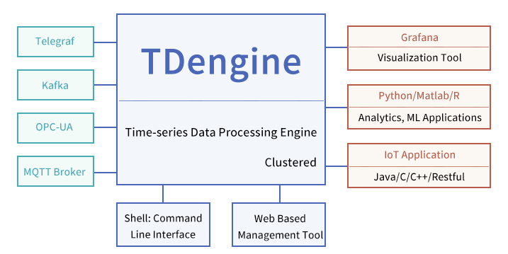

# TDengine Introduction

##  About TDengine

TDengine is a high-performance, scalable time-series database with SQL support. Its code including cluster feature is open souece under GNU AGPL v3.0. Besides the database, it provides caching, stream processing, data data subscription and other functionalities to reduce the complexity and cost of development and operation. TDengine differentiates itself from other TSDBs with the following advanatages.

- **High Peroformance**: TDengine outperforms other time series databases in data ingestion and querying while significantly reducing storage cost and compute costs, with an innovatively designed and purpose-built storage engine.

- **Scalable**: TDengine provides out-of-box scalability and high-availability through its native distributed design. Nodes can be added through simple configuration to achieve greater data processing power. In addition, this feature is open source.

- **SQL Support**: TDengine uses SQL as the query language, thereby reducing learning and migration costs, while adding SQL extensions to handle time-series data better, and supporting convenient and flexible schemaless data ingestion.

- **All in One**: TDengine has built-in caching, stream processing and data subscription functions, it is no longer necessary to integrate Kafka/Redis/HBase/Spark or other software in some scenarios. It makes the system architecture much simpler and easy to maintain.

- **Seamless Integration**: Without a single line of code, TDengine provide seamless integration with third-party tools such as Telegraf, Grafana, EMQ X, Prometheus, StatsD, collectd, etc. More will be integrated.

- **Zero Management**: Installation and cluster setup can be done in seconds. Data partitioning and sharding are executed automatically. TDengine’s running status can be monitored via Grafana or other DevOps tools.

- **Zero Learning Cost**: With SQL as the query language, support for ubiquitous tools like Python, Java, C/C++, Go, Rust, Node.js connectors, there is zero learning cost.

- **Interactive Console**: TDengine provides convenient console access to the database to run ad hoc queries, maintain the database, or manage the cluster without any programming.

TDengine can be widely applied to Internet of Things (IoT), Connected Vehicles, Industrial IoT, DevOps, energy, finance and many other scenarios. With TDengine, the total cost of ownership of time-series data platforms can be greatly reduced. However, since it makes full use of the characteristics of time-series data, TDengine cannot be used to process general data from web crawlers, microblogs, WeChat, e-commerce, ERP, CRM, and other sources.

Figure 1. TDengine Technology Ecosystem

## Overall Scenarios of TDengine

As a time-series data platform, the typical application scenarios of TDengine are mainly presented in the IoT, connected vehicles, DevOps and Industrial Internet categories, with users having a certain amount of data. The following sections of this document are mainly aimed at  IoT-relevant systems. Other systems, such as CRM, ERP, etc., are beyond the scope of this article.

### Characteristics and Requirements of Data Sources

From the perspective of data sources, designers can analyze the applicability of TDengine in target application systems as following.

| **Data Source Characteristics and Requirements**         | **Not Applicable** | **Might Be Applicable** | **Very Applicable** | **Description**                                              |
| -------------------------------------------------------- | ------------------ | ----------------------- | ------------------- | :----------------------------------------------------------- |
| A huge amount of total data                              |                    |                         | √                   | TDengine provides excellent scale-out functions in terms of capacity, and has a storage structure matching high compression ratio to achieve the best storage efficiency in the industry. |
| Data input velocity is occasionally or continuously huge |                    |                         | √                   | TDengine's performance is much higher than other similar products. It can continuously process a large amount of input data in the same hardware environment, and provide a performance evaluation tool that can easily run in the user environment. |
| A huge amount of data sources                            |                    |                         | √                   | TDengine is designed to include optimizations specifically for a huge amount of data sources, such as data writing and querying, which is especially suitable for efficiently processing massive (tens of millions or more) data sources. |

### System Architecture Requirements

| **System Architecture Requirements**              | **Not Applicable** | **Might Be Applicable** | **Very Applicable** | **Description**                                              |
| ------------------------------------------------- | ------------------ | ----------------------- | ------------------- | ------------------------------------------------------------ |
| Require a simple and reliable system architecture |                    |                         | √                   | TDengine's system architecture is very simple and reliable, with its own message queue, cache, stream computing, monitoring and other functions, and no need to integrate any additional third-party products. |
| Require fault-tolerance and high-reliability      |                    |                         | √                   | TDengine has cluster functions to automatically provide high-reliability functions such as fault tolerance and disaster recovery. |
| Standardization specifications                    |                    |                         | √                   | TDengine uses standard SQL language to provide main functions and follow standardization specifications. |

### System Function Requirements

| **System Architecture Requirements**              | **Not Applicable** | **Might Be Applicable** | **Very Applicable** | **Description**                                              |
| ------------------------------------------------- | ------------------ | ----------------------- | ------------------- | ------------------------------------------------------------ |
| Require completed data processing algorithms built-in |                    | √                    |                     | TDengine implements various general data processing algorithms, but has not properly handled all requirements of different industries, so special types of processing shall be processed at the application level. |
| Require a huge amount of crosstab queries             |                    | √                    |                     | This type of processing should be handled more by relational database systems, or TDengine and relational database systems should fit together to implement system functions. |

### System Performance Requirements

| **System Architecture Requirements**              | **Not Applicable** | **Might Be Applicable** | **Very Applicable** | **Description**                                              |
| ------------------------------------------------- | ------------------ | ----------------------- | ------------------- | ------------------------------------------------------------ |
| Require larger total processing capacity     |                    |                      | √                   | TDengine’s cluster functions can easily improve processing capacity via multi-server-cooperating. |
| Require high-speed data processing           |                    |                      | √                   | TDengine’s storage and data processing are designed to be optimized for IoT, can generally improve the processing speed by multiple times than other similar products. |
| Require fast processing of fine-grained data |                    |                      | √                   | TDengine has achieved the same level of performance with relational and NoSQL data processing systems. |

### System Maintenance Requirements

| **System Architecture Requirements**              | **Not Applicable** | **Might Be Applicable** | **Very Applicable** | **Description**                                              |
| ------------------------------------------------- | ------------------ | ----------------------- | ------------------- | ------------------------------------------------------------ |
| Require system with high-reliability         |                    |                      | √                   | TDengine has a very robust and reliable system architecture to implement simple and convenient daily operation with streamlined experiences for operators, thus human errors and accidents are eliminated to the greatest extent. |
| Require controllable operation learning cost |                    |                      | √                   | As above.                                                    |
| Require abundant talent supply               | √                  |                      |                     | As a new-generation product, it’s still difficult to find talents with TDengine experiences from the market. However, the learning cost is low. As the vendor, we also provide extensive operation training and counseling services. |
