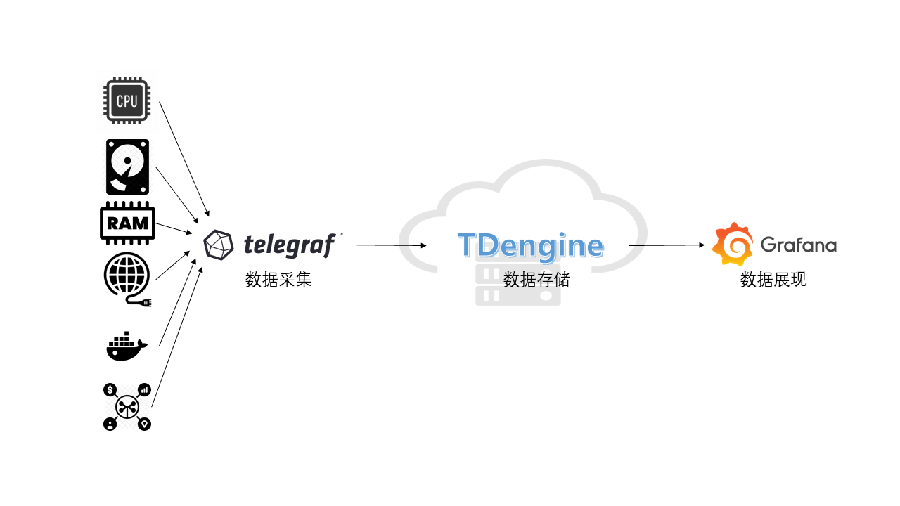
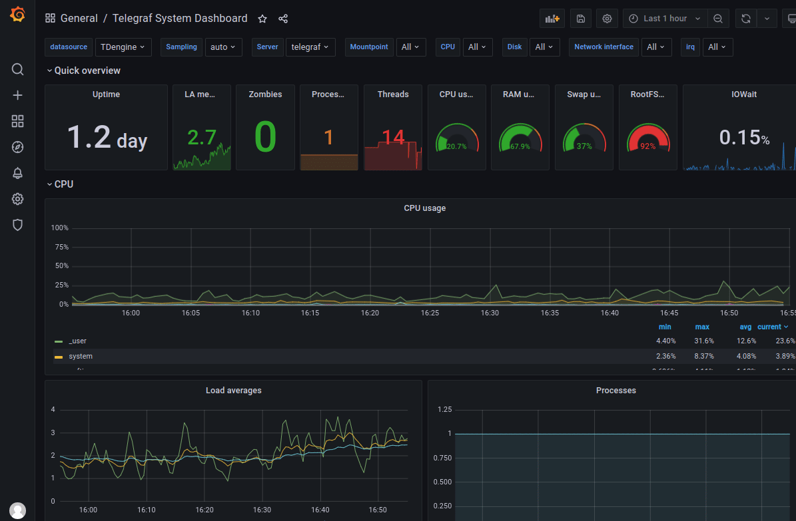

# Rapidly build an IT DevOps system with TDengine + Telegraf + Grafana

## Background

TDengine is an open-source big data platform designed and optimized for Internet of Things (IoT), Connected Vehicles, and Industrial IoT. Besides the 10x faster time-series database, it provides caching, stream computing, message queuing and other functionalities to reduce the complexity and costs of development and operations.

There are a lot of time-series data in the IT DevOps scenario, for example:

- Metrics of system resource: CPU, memory, IO and network status, etc.
- Metrics for software system: service status, number of connections, number of requests, number of the timeout, number of errors, response time, service type, and other metrics related to the specific business.

A mainstream IT DevOps system generally includes a data-collection module, a data persistent module, and a visualization module. Telegraf and Grafana are some of the most popular data-collection and visualization modules. But data persistent module can be varied. OpenTSDB and InfluxDB are some prominent from others. In recent times, TDengine, as emerged time-series data platform provides more advantages including high performance, high reliability, easier management, easier maintenance.

Here we introduce a way to build an IT DevOps system with TDengine, Telegraf, and Grafana. Even no need one line program code but just modify a few lines of configuration files.



## Installation steps

### Install Telegraf，Grafana and TDengine

Please refer to each component's official document for Telegraf, Grafana, and TDengine installation.

### Telegraf

Please refer to the [official document](https://portal.influxdata.com/downloads/).

### Grafana

Please refer to the [official document](https://grafana.com/grafana/download).

### TDengine

Please download TDengine 2.3.0.0 or the above version from TAOS Data's [official website](http://taosdata.com/en/all-downloads/).

## Setup data chain

### Download TDengine plugin to Grafana plugin's directory

```bash
1. wget -c https://github.com/taosdata/grafanaplugin/releases/download/v3.1.3/tdengine-datasource-3.1.3.zip
2. sudo unzip tdengine-datasource-3.1.3.zip -d /var/lib/grafana/plugins/
3. sudo chown grafana:grafana -R /var/lib/grafana/plugins/tdengine
4. echo -e "[plugins]\nallow_loading_unsigned_plugins = tdengine-datasource\n" | sudo tee -a /etc/grafana/grafana.ini
5. sudo systemctl restart grafana-server.service
```

### Modify /etc/telegraf/telegraf.conf

Please add few lines in /etc/telegraf/telegraf.conf as below. Please fill database name for what you desire to save Telegraf's data in TDengine. Please specify the correct value for the hostname of the TDengine server/cluster, username, and password:

```
[[outputs.http]]
  url = "http://<TDengine server/cluster host>:6041/influxdb/v1/write?db=<database name>"
  method = "POST"
  timeout = "5s"
  username = "<TDengine's username>"
  password = "<TDengine's password>"
  data_format = "influx"
  influx_max_line_bytes = 250
```

Then restart telegraf：

```bash
sudo systemctl start telegraf
```

### Import dashboard

Use your Web browser to access IP:3000 to log in to the Grafana management interface. The default username and password are admin/admin。

Click the 'gear' icon from the left bar to select 'Plugins'. You could find the icon of the TDengine data source plugin.

Click the 'plus' icon from the left bar to select 'Import'. You can download the dashboard JSON file from `https://github.com/taosdata/grafanaplugin/blob/master/examples/telegraf/grafana/dashboards/telegraf-dashboard-v0.1.0.json` then import it to the Grafana. After that, you should see the interface like:



## Summary

We demonstrated how to build a full-function IT DevOps system with TDengine, Telegraf, and Grafana. TDengine supports schemaless protocol data insertion capability from 2.3.0.0. Based on TDengine's powerful ecosystem software integration capability, the user can build a high efficient and easy-to-maintain IT DevOps system in a few minutes. Please find more detailed documentation about TDengine high-performance data insertion/query functions and more use cases from TAOS Data's official website.
