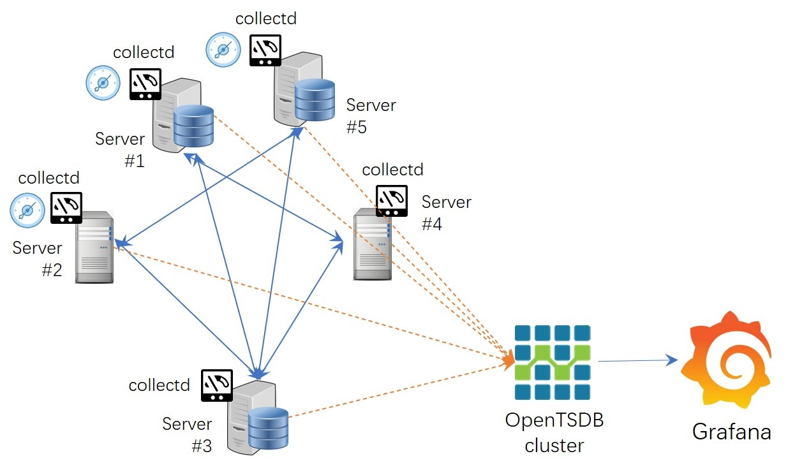
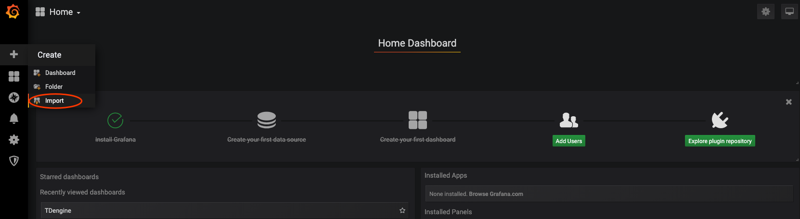
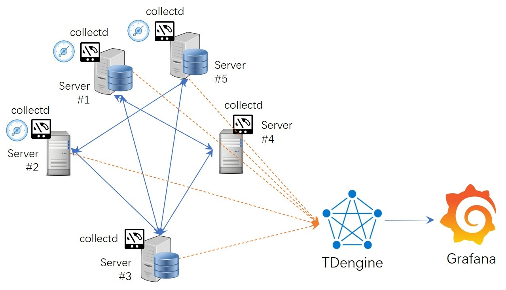

# Best practice of immigration from OpenTSDB to TDengine

As a distributed, scalable, HBase-based distributed temporal database system, OpenTSDB has been introduced and widely used in the field of operation and monitoring by people in DevOps due to its first-mover advantage. However, in recent years, with the rapid development of new technologies such as cloud computing, microservices, and containerization, enterprise-level services have become more and more diverse, and the architecture has become more and more complex, and the application operation infrastructure environment has become more and more diverse, which brings more and more pressure on system and operation monitoring. From this status quo, the use of OpenTSDB as the monitoring backend storage for DevOps is increasingly plagued by performance issues and slow feature upgrades, as well as the resulting increase in application deployment costs and reduced operational efficiency, which are becoming more and more serious as the system scales up.

In this context, to meet the fast-growing IoT big data market and technical demands, TOS Data has developed an innovative big data processing product TDengine independently after learning the advantages of many traditional relational databases, NoSQL databases, stream computing engines, message queues, etc. TDengine has its unique advantages in time-series big data processing. TDengine can effectively solve the problems currently encountered by OpenTSDB.

Compared with OpenTSDB, TDengine has the following distinctive features.

- Performance of data writing and querying far exceeds that of OpenTSDB.
- Efficient compression mechanism for time-series data, which compresses less than 1/5 of the storage space on disk.
- The installation and deployment is very simple, a single installation package to complete the installation and deployment, no other third-party software, the entire installation and deployment process in seconds;
- The built-in functions cover all the query functions supported by OpenTSDB, and also support more time-series data query functions, scalar functions and aggregation functions, and support advanced query functions such as multiple time-window aggregation, join query, expression operation, multiple group aggregation, user-defined sorting, and user-defined functions. Adopting SQL-like syntax rules, it is easier to learn and basically has no learning cost.
- Supports up to 128 tags with a total tag length of up to 16 KB.
- In addition to HTTP, it also provides interfaces to Java, Python, C, Rust, Go, and other languages, and supports a variety of enterprise-class standard connector protocols such as JDBC.

If we migrate applications originally running on OpenTSDB to TDengine, we can not only effectively reduce the consumption of computing and storage resources and the scale of deployed servers, but also greatly reduce the output of operation and maintenance costs, making operation and maintenance management simpler and easier, and significantly reducing the total cost of ownership. Like OpenTSDB, TDengine has also been open sourced, but the difference is that in addition to the stand-alone version, the latter has also achieved the open source of the cluster version, and the concern of being bound by the vendor has been swept away.

In the following section we will explain how to migrate OpenTSDB applications to TDengine quickly, securely and reliably without coding, using the most typical and widely used DevOps scenarios. Subsequent chapters will provide more in-depth coverage to facilitate migration for non-DevOps scenarios.

## Rapid migration of DevOps applications

### 1. Typical Application Scenarios

The overall system architecture of a typical DevOps application scenario is shown in the figure below (Figure 1).


<div align = center>Figure 1. Typical architecture in a DevOps scenario</div>

In this application scenario, there are Agent tools deployed in the application environment to collect machine metrics, network metrics, and application metrics, data collectors to aggregate information collected by agents, systems for data persistence storage and management, and tools for monitoring data visualization (e.g., Grafana, etc.).

Among them, Agents deployed in application nodes are responsible for providing operational metrics from different sources to collectd/Statsd, and collectd/StatsD is responsible for pushing the aggregated data to the OpenTSDB cluster system and then visualizing the data using the visualization board of Grafana.

### 2. Migration Service

- **TDengine installation and deployment**

First of all, TDengine should be installed. Download the latest stable version of TDengine from the official website, unzip it and run install.sh to install it. For help on using various installation packages, please refer to the blog ["Installation and uninstallation of various TDengine installation packages"](https://www.taosdata.com/blog/2019/08/09/566.html).

Note that after the installation, do not start the taosd service immediately, but start it after the parameters are correctly configured.

- **Adjusting the data collector configuration**

In TDengine version 2.3, an HTTP service taosAdapter is automatically enabled after the backend service taosd is started. The taosAdapter is compatible with Influxdb's Line Protocol and OpenTSDB's telnet/JSON write protocol, allowing data collected by collectd and StatsD to be pushed directly to TDengine.

If you use collectd, modify the configuration file in its default location /etc/collectd/collectd.conf to point to the IP address and port of the node where taosAdapter is deployed. Assuming the taosAdapter IP address is 192.168.1.130 and the port is 6046, configure it as follows

```html
LoadPlugin write_tsdb
<Plugin write_tsdb>
    <Node>
        Host "192.168.1.130"
        Port "6046"
        HostTags "status=production"
        StoreRates false
        AlwaysAppendDS false
    </Node
</Plugin>
```

This allows collectd to push the data to taosAdapter using the push to OpenTSDB plugin. taosAdapter will call the API to write the data to taosd, thus completing the writing of the data. If you are using StatsD adjust the profile information accordingly.

- **Adjusting the Dashboard system**

After the data has been written to TDengine properly, you can adapt Grafana to visualize the data written to TDengine. There is a connection plugin for Grafana in the TDengine installation directory connector/grafanaplugin. The way to use this plugin is simple.

First copy the entire dist directory under the grafanaplugin directory to Grafana's plugins directory (the default address is /var/lib/grafana/plugins/), and then restart Grafana to see the TDengine data source under the Add Data Source menu.

```shell
sudo cp -r . /var/lib/grafana/plugins/tdengine
sudo chown grafana:grafana -R /var/lib/grafana/plugins/tdengine
echo -e "[plugins]\nallow_loading_unsigned_plugins = taosdata-tdengine-datasource\n" | sudo tee -a /etc/grafana/grafana.ini
 
# start grafana service
sudo service grafana-server restart
# or with systemd
sudo systemctl start grafana-server
```


In addition, TDengine provides two default Dashboard templates for users to quickly view the information saved to the TDengine repository. You can simply import the templates from the Grafana directory into Grafana to activate their use.



<div align = center>Figure 2. Importing Grafana Templates</div>

After the above steps, you have completed the migration of OpenTSDB to TDengine. You can see that the whole process is very simple, no code needs to be written, and only some configuration files need to be adjusted to complete the migration work.

### 3. Post-migration architecture

After the migration is completed, the overall architecture of the system at this time is shown in the figure below (Figure 3), and the acquisition side, data writing side, and monitoring presentation side all remain stable during the whole process, which does not involve any important changes or alterations except for very few configuration adjustments. OpenTSDB to TDengine migration action, using TDengine more powerful processing power and query performance.

In most DevOps scenarios, if you have a small OpenTSDB cluster (3 nodes or less) as the storage side of DevOps, relying on OpenTSDB to provide data storage and query functions for the system persistence layer, then you can safely replace it with TDengine and save more compute and storage resources. With the same configuration of computing resources, a single TDengine can meet the service capacity provided by 3~5 OpenTSDB nodes. If the scale is relatively large, then a TDengine cluster is required.

If your application is particularly complex, or the application domain is not a DevOps scenario, you can continue reading subsequent chapters for a more comprehensive and in-depth look at the advanced topics of migrating OpenTSDB applications to TDengine.



<div align = center>Figure 3. System architecture after the migration is complete</div>

## Migration evaluation and strategy for other scenarios

### 1. Differences between TDengine and OpenTSDB

This chapter describes in detail the differences between OpenTSDB and TDengine at the system functionality level. After reading this chapter, you can thoroughly evaluate whether you can migrate certain complex OpenTSDB-based applications to TDengine, and what you should pay attention to after the migration.

TDengine currently only supports Grafana visual kanban rendering, so if your application uses a front-end kanban other than Grafana (e.g. [TSDash](https://github.com/facebook/tsdash), [Status Wolf](https://github.com/box/StatusWolf), etc.), then the front-end kanban cannot be migrated directly to TDengine and will need to be re-adapted to Grafana before it can function properly.

As of version 2.3.0.x, TDengine can only support collectd and StatsD as data collection aggregation software, but more data collection aggregation software will be provided in the future. If you use other types of data aggregators on the collection side, your application needs to be adapted to these two data aggregation systems to be able to write data properly. In addition to the two data aggregation end software protocols mentioned above, TDengine also supports writing data directly via InfluxDB's row protocol and OpenTSDB's data writing protocol, JSON format, and you can rewrite the logic on the data push side to write data using the row protocols supported by TDengine.

In addition, if you use the following features of OpenTSDB in your application, you need to understand the following considerations before migrating your application to TDengine.

1. `/api/stats`: TDengine provides a new mechanism for handling cluster state monitoring to meet your application's monitoring and maintenance needs of your application.
2. `/api/tree`: TDengine uses a hierarchy of database -> supertable -> sub-table to organize and maintain timelines, with all timelines belonging to the same supertable at the same level in the system. However, it is possible to simulate a logical multi-level structure of the application through the special construction of different tag values.
3. `Rollup And PreAggregates`: The use of Rollup and PreAggregates requires the application to decide where to access the Rollup results and in some scenarios to access the original results, the opaqueness of this structure makes the application processing logic extremely complex and completely non-portable. TDengine does not support automatic downsampling of multiple timelines and preaggregates (for a range of periods) for the time being, but due to its high-performance query processing logic, it can provide high performance even without relying on Rollup and preaggregates.
4. `Rate`: TDengine provides two functions to calculate the rate of change of values, namely Derivative (whose calculation results are consistent with InfluxDB's Derivative behavior) and IRate (whose calculation results are consistent with the IRate function in Prometheus). However, the results of these two functions differ slightly from Rate, but are more powerful overall. In addition,** all the calculation functions provided by OpenTSDB are supported by TDengine with corresponding query functions, and the query functions of TDengine far exceed the query functions supported by OpenTSDB,** which can greatly simplify your application processing logic.

Through the above introduction, I believe you should be able to understand the changes brought by the migration of OpenTSDB to TDengine, and this information will also help you correctly judge whether it is acceptable to migrate your application to TDengine, and experience the powerful timing data processing capability and convenient user experience provided by TDengine.

### 2. Migration strategy

First of all, the OpenTSDB-based system will be migrated involving data schema design, system scale estimation, data write end transformation, data streaming, and application adaptation; after that, the two systems will run in parallel for a period of time, and then the historical data will be migrated to TDengine. Of course, if your application has some functions that strongly depend on the above OpenTSDB features, and at the same time, You can consider keeping the original OpenTSDB system running while starting TDengine to provide the main services.

## Data model design

On the one hand, TDengine requires a strict schema definition for its incoming data. On the other hand, the data model of TDengine is richer than that of OpenTSDB, and the multi-valued model is compatible with all single-valued model building requirements.

Now let's assume a DevOps scenario where we use collectd to collect base metrics of devices, including memory, swap, disk, etc. The schema in OpenTSDB is as follows:

| No. | metric | value | type   | tag1 | tag2        | tag3                 | tag4      | tag5   |
| --- | ------ | ----- | ------ | ---- | ----------- | -------------------- | --------- | ------ |
| 1   | memory | value | double | host | memory_type | memory_type_instance | source    |        |
| 2   | swap   | value | double | host | swap_type   | swap_type_instance   | source    |        |
| 3   | disk   | value | double | host | disk_point  | disk_instance        | disk_type | source |


TDengine requires data stored to have a data schema, i.e., you need to create a supertable and specify the schema of the supertable before writing the data. For data schema creation, you have two ways to do this: 1) Take full advantage of TDengine's native data writing support for OpenTSDB by calling the API provided by TDengine to write the data (in text line or JSON format) to the super table and automate the creation of the single-value model. And automate the creation of single-value models. This approach does not require major adjustments to the data writing application, nor does it require conversion of the written data format.

At the C level, TDengine provides taos_insert_lines to write data in OpenTSDB format directly (in version 2.3.x this function corresponds to taos_schemaless_insert). For the code reference example, please refer to the sample code schemaless.c in the installation package directory.

 (2) Based on the full understanding of TDengine's data model, establish the mapping relationship between OpenTSDB and TDengine's data model adjustment manually, taking into account that OpenTSDB is a single-value mapping model, it is recommended to use the single-value model in TDengine. TDengine supports both multi-value and single-value models.

- **Single-valued model**.

The steps are as follows: the name of the metrics is used as the name of the TDengine super table, which is built with two basic data columns - timestamp and value, and the labels of the super table are equivalent to the label information of the metrics, and the number of labels is equal to the number of labels of the metrics. The sub-tables are named using a fixed rule row naming: `metric + '_' + tags1_value + '_' + tag2_value + '_' + tag3_value ... ` as sub-table names.

Create 3 super tables in TDengine.

```sql
create stable memory(ts timestamp, val float) tags(host binary(12)，memory_type binary(20), memory_type_instance binary(20), source binary(20));
create stable swap(ts timestamp, val double) tags(host binary(12), swap_type binary(20), swap_type_binary binary(20), source binary(20));
create stable disk(ts timestamp, val double) tags(host binary(12), disk_point binary(20), disk_instance binary(20), disk_type binary(20), source binary(20));
```


For sub-tables use dynamic table creation as shown below:

```sql
insert into memory_vm130_memory_bufferred_collectd  using memory tags(‘vm130’, ‘memory’, 'buffer', 'collectd') values(1632979445, 3.0656);
```

Eventually about 340 sub-tables and 3 super-tables will be created in the system. Note that if the use of concatenated tagged values causes the sub-table names to exceed the system limit (191 bytes), then some encoding (e.g. MD5) needs to be used to convert them to an acceptable length.

- **Multi-value model**

If you want to take advantage of TDengine's multi-value modeling capabilities, you need to first meet the requirements that different collection quantities have the same collection frequency and can reach the **data writing side simultaneously via a message queue**, thus ensuring that multiple metrics are written at once using SQL statements. The name of the metric is used as the name of the super table to create a multi-column model of data with the same collection frequency and capable of arriving at the same. The data can be collected with the same frequency and arrive in multiple columns. The names of the sub-tables are named using a fixed rule. Each metric above contains only one measurement value, so it cannot be transformed into a multi-value model.


## Data triage and application adaptation

Data is subscribed from the message queue and an adapted writer is started to write the data.

After the data starts to be written for a sustained period, SQL statements can be used to check whether the amount of data written meets the expected write requirements. The following SQL statement is used to count the amount of data.

```sql
select count(*) from memory
```

After completing the query, if the written data does not differ from the expected one, and there are no abnormal error messages from the writing program itself, then you can confirm that the data writing is complete and valid.

TDengine does not support query or data fetch processing using OpenTSDB query syntax, but it does provide support for each type of OpenTSDB query. You can check Annex 2 for the corresponding query processing adjustments and application usage, or refer to the TDengine user manual for a full understanding of the types of queries supported by TDengine.

TDengine supports the standard JDBC 3.0 interface for manipulating databases, but you can also use other types of high-level language connectors for querying and reading data to suit your application. See also the user manual for the specific operation and usage help.

## Historical data migration

### 1. Use the tool to migrate data automatically

To facilitate the migration of historical data, we provide a plug-in for the data synchronization tool DataX, which can automatically write data to TDengine, it should be noted that DataX's automated data migration can only support the data migration process of single-value models.

DataX Please refer to its help manual [github.com/taosdata/datax](http://github.com/taosdata/datax) for details on how to use DataX and how to use it to write data to TDengine.

### 2. Migrate data manually

If you need to use a multi-value model for data writing, you need to develop your tool to export data from OpenTSDB, then confirm which timelines can be merged and imported into the same timeline, and then write the time that can be imported at the same time to the database by SQL statement.

The manual migration of data requires attention to two issues.

1) When storing the exported data on the disk, the disk needs to have enough storage space to be able to adequately accommodate the exported data files. To avoid straining the disk file storage after exporting the full amount of data, a partial import mode can be adopted, with the timelines belonging to the same super table being exported first, and then the exported part of the data files are imported into the TDengine system

(2) Under the full-load operation of the system, if there are enough remaining computing and IO resources, a multi-threaded import mechanism can be established to maximize the efficiency of data migration. Considering the huge load on the CPU brought by data parsing, the maximum number of parallel tasks needs to be controlled to avoid the overall system overload triggered by importing historical data.

Due to the ease of operation of TDegnine itself, there is no need to perform index maintenance, data format change processing, etc. throughout the process, and the whole process only needs to be executed sequentially.

Once the historical data is fully imported into TDengine, the two systems are running simultaneously, after which the query requests can be switched to TDengine, thus achieving a seamless application switchover.

## Appendix 1: Correspondence table of OpenTSDB query functions

**Avg**

Equivalent function: avg

Example.

SELECT avg(val) FROM (SELECT first(val) FROM super_table WHERE ts >= startTime and ts <= endTime INTERVAL(20s) Fill(linear)) INTERVAL(20s)

Notes.

1. the value within the Interval needs to be the same as the interval value of the outer query.
As the interpolation of values in OpenTSDB uses linear interpolation, use fill(linear) to declare the interpolation type in the interpolation clause. The following functions with the same interpolation requirements are handled by this method. 3.
3. The 20s parameter in Interval means that the inner query will generate results in a 20-second window. In a real query, it needs to be adjusted to the time interval between different records. This ensures that the interpolation results are generated equivalently to the original data.
Due to the special interpolation strategy and mechanism of OpenTSDB, the way of interpolation before computation in Aggregate query makes it impossible for the computation result to be the same as TDengine. However, in the case of Downsample, TDengine, and OpenTSDB can obtain the same result (because OpenTSDB uses a completely different interpolation strategy for Aggregate and Downsample queries).
(since OpenTSDB uses a completely different interpolation strategy for aggregated and downsampled queries).[]() 


**Count**

Equivalent function: count

Example.

select count(*) from super_table_name;

 

**Dev**

Equivalent function: stddev

Example.

Select stddev(val) from table_name

 

**Estimated percentiles**

Equivalent function: apercentile

Example.

Select apercentile(col1, 50, “t-digest”) from table_name

Remark.

1. t-digest algorithm is used by default in OpenTSDB during approximate query processing, so to get the same calculation result, you need to specify the algorithm used in the apercentile function. tDengine can support two different approximate processing algorithms, which are declared by "default " and "t-digest" to declare.


**First**

Equivalent function: first

Example.

Select first(col1) from table_name

 

**Last**

Equivalent function: last

Example.

Select last(col1) from table_name

 

**Max**

Equivalent function: max

Example.

Select max(value) from (select first(val) value from table_name interval(10s) fill(linear)) interval(10s)

Note: The Max function requires interpolation, for the reasons given above.


**Min**

Equivalent function: min

Example.

Select min(value) from (select first(val) value from table_name interval(10s) fill(linear)) interval(10s);

 

**MinMax**

Equivalent function: max

Select max(val) from table_name

Note: This function does not require interpolation, so it can be calculated directly.


**MimMin**

Equivalent function: min

Select min(val) from table_name

Note: This function does not require interpolation, so it can be calculated directly.
 
 

**Percentile**

Equivalent function: percentile

备注：

 

**Sum**

Equivalent function: sum

Select max(value) from (select first(val) value from table_name interval(10s) fill(linear)) interval(10s)

Note: This function does not require interpolation, so it can be calculated directly.

 

**Zimsum**

Equivalent function: sum

Select sum(val) from table_name

Note: This function does not require interpolation, so it can be calculated directly.

 

完整示例：

```json
//OpenTSDB query JSON
query = {
"start":1510560000,
"end": 1515000009,
"queries":[{
"aggregator": "count",
"metric":"cpu.usage_user",
}]
}
 
// Equivalent SQL:
SELECT count(*)
FROM `cpu.usage_user`
WHERE ts>=1510560000 AND ts<=1515000009
```


## Appendix 2: Resource Estimation Methodology

### Data generation environment

We still use the hypothetical environment from Chapter 4 with 3 measurements. The data writing rate for temperature and humidity is one record every 5 seconds, with a timeline of 100,000. Air quality is written at a rate of one record every 10 seconds, with a timeline of 10,000, and a query request frequency of 500 QPS.

### Storage resource estimation

Assuming that the number of sensor devices that generate data and require storage is `n`, the frequency of data generation is ` t` records/second, and the length of each record is `L` bytes, the size of data generated per day is `n×t×L` bytes. assuming a compression ratio of C, the size of data generated per day is `(n×t×L)/C` bytes. storage resources are estimated to be able to accommodate 1.5 years The storage resources are estimated to be able to accommodate 1.5 years of data size. Under the production environment, the compression ratio C of TDengine is generally between 5 and 7, while adding 20% redundancy to the final result, we can calculate the required storage resources.

```matlab
(n×t×L)×(365×1.5)×(1+20%)/C
```

Combining the above formula and bringing the parameters into the calculation formula, the size of the raw data generated per year without considering tagging information is 11.8 TB. It should be noted that since tagging information is associated with each timeline in TDengine, it is not per record. So the size of the data volume to be recorded is somewhat reduced relative to the data generated, and this part of the tag data as a whole can be neglected. Assuming a compression ratio of 5, the size of the retained data ends up being 2.56 TB.

### Storage device selection considerations

The hard disk should be used with a better random read performance hard disk device, if you can have SSD, consider using SSD as much as possible. better random read performance of the disk is extremely helpful to improve the system query performance and can improve the overall query response performance of the system. To obtain better query performance, the performance index of single-threaded random read IOPS of the hard disk device should not be lower than 1000, it is better to reach 5000 IOPS or more. To obtain an evaluation of the current device random read IO performance, it is recommended that fio software be used to evaluate its operational performance (see Appendix 1 for details on how to use it) to confirm whether it can meet the large file random read performance requirements.

Hard disk write performance has little impact on TDengine; TDengine writes in append write mode, so as long as it has good sequential write performance, both SAS hard disks and SSDs, in general, can meet TDengine's requirements for disk write performance well.

### Computational resource estimation

Due to the specificity of IoT data, after the frequency of data generation is fixed, the process of TDengine writing maintains a relatively fixed amount of resource consumption (both computation and storage). As described in [TDengine Operation and Maintenance](https://www.taosdata.com/cn/documentation/administrator), 22,000 writes per second in this system consumes less than 1 CPU core.

In terms of estimating the CPU resources required for queries, assuming that the application requires 10,000 QPS from the database and each query consumes about 1 ms of CPU time, then each core provides 1,000 QPS of queries per second, and at least 10 cores are required to satisfy 10,000 QPS of query requests. To make the overall CPU load of the system less than 50%, the whole cluster needs 10 cores twice as many, i.e., 20 cores.

### Memory resource estimation

The database allocates memory for each Vnode by default 16MB*3 buffers, the cluster system includes 22 CPU cores, then 22 virtual node Vnodes will be established by default, each Vnode contains 1000 tables, then it can accommodate all the tables. Then it takes about 1 and a half hours to write a full block, thus triggering a dropped disk, which can be unadjusted. 22 Vnodes require a total memory cache of about 1GB. considering the memory required for queries, assuming a memory overhead of about 50MB per query, then 500 queries concurrently require about 25GB of memory.

In summary, a single 16-core 32GB machine can be used, or a cluster of two 8-core 16GB machines can be used.

## Appendix 3: Cluster Deployment and Startup

TDengine provides a wealth of help documentation on many aspects of cluster installation and deployment, here is an index of responsive documentation for your reference.

### Cluster Deployment

The first step is to install TDengine. Download the latest stable version of TDengine from the official website, unzip it and run install.sh to install it. Please refer to the blog ["Installing and uninstalling TDengine packages"](https://www.taosdata.com/blog/2019/08/09/566.html) for help on using the various installation packages.

Be careful not to start the taosd service immediately after the installation is complete, but only after the parameters are properly configured.

### Set the running parameters and start the service

To ensure that the system can get the necessary information to run properly. Please set the following key parameters correctly on the server-side.

FQDN, firstEp, secondEP, dataDir, logDir, tmpDir, serverPort. The specific meaning of each parameter and the requirements for setting them can be found in the documentation "TDengine Cluster Installation, Management" (https://www.taosdata.com/cn/ documentation/cluster)".

Follow the same steps to set the parameters on the node that needs to run and start the taosd service, then add the Dnode to the cluster.

Finally, start taos and execute the command show dnodes, if you can see all the nodes that have joined the cluster, then the cluster is successfully built. For the specific operation procedure and notes, please refer to the document "[TDengine Cluster Installation, Management](https://www.taosdata.com/cn/documentation/cluster)".

## Appendix 4: Super table names

Since the metric name of OpenTSDB has a dot (". "However, the dot has a special meaning in TDengine, as a separator between database and table names. TDengine also provides escapes to allow users to use keywords or special separators (e.g., dot) in (super) table names. To use special characters, the table name needs to be enclosed in escape characters, e.g. `cpu.usage_user` would be a legal (super) table name.

## Appendix 5: Reference Articles

1. [Quickly build an IT Ops monitoring system using TDengine + collectd/StatsD + Grafana](https://www.taosdata.com/cn/documentation20/devops/collectd)(Chinese)_
2. [Writing collection data directly to TDengine via collectd](https://www.taosdata.com/cn/documentation20/insert#collectd) (Chinese)

