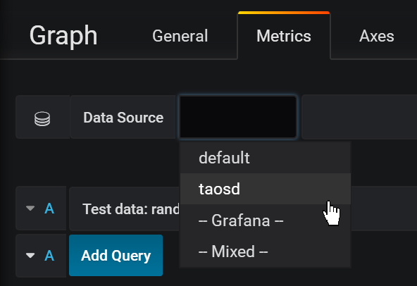

# Connect with other tools

## Telegraf

TDengine is easy to integrate with [Telegraf](https://www.influxdata.com/time-series-platform/telegraf/), an open-source server agent for collecting and sending metrics and events, without more development.

### Install Telegraf

At present, TDengine supports Telegraf newer than version 1.7.4. Users can go to the [download link] and choose the proper package to install on your system.

### Configure Telegraf

Telegraf is configured by changing items in the configuration file */etc/telegraf/telegraf.conf*.


In **output plugins** section，add _[[outputs.http]]_ iterm： 

- _url_: http://ip:6020/telegraf/udb, in which _ip_ is the IP address of any node in TDengine cluster. Port 6020 is the RESTful APT port used by TDengine. _udb_ is the name of the database to save data, which needs to create beforehand.
- _method_: "POST" 
- _username_: username to login TDengine
- _password_: password to login TDengine 
- _data_format_: "json"
- _json_timestamp_units_: "1ms"

In **agent** part：

- hostname: used to distinguish different machines. Need to be unique.
- metric_batch_size: 30，the maximum number of records allowed to write in Telegraf. The larger the value is, the less frequent requests are sent. For TDengine, the value should be less than 50.

Please refer to the [Telegraf docs](https://docs.influxdata.com/telegraf/v1.11/) for more information.

## Grafana

[Grafana] is an open-source system for time-series data display. It is easy to integrate TDengine and Grafana to build a monitor system. Data saved in TDengine can be fetched and shown on the Grafana dashboard.

### Install Grafana

For now, TDengine only supports Grafana newer than version 5.2.4. Users can go to the [Grafana download page] for the proper package to download.

### Configure Grafana

TDengine Grafana plugin is in the _/usr/local/taos/connector/grafana_ directory.
Taking Centos 7.2 as an example, just copy TDengine directory to _/var/lib/grafana/plugins_ directory and restart Grafana.

### Use Grafana

Users can log in the Grafana server (username/password:admin/admin) through localhost:3000 to configure TDengine as the data source. As is shown in the picture below, TDengine as a data source option is shown in the box:


When choosing TDengine as the data source, the Host in HTTP configuration should be configured as the IP address of any node of a TDengine cluster. The port should be set as 6020. For example, when TDengine and Grafana are on the same machine, it should be configured as _http://localhost:6020. 


Besides, users also should set the username and password used to log into TDengine. Then click _Save&Test_ button to save.


Then, TDengine as a data source should show in the Grafana data source list.


Then, users can create Dashboards in Grafana using TDengine as the data source:




 

Click _Add Query_ button to add a query and input the SQL command you want to run in the _INPUT SQL_ text box. The SQL command should expect a two-row, multi-column result, such as _SELECT count(*) FROM sys.cpu WHERE ts>=from and ts<​to interval(interval)_, in which, _from_, _to_ and _inteval_ are TDengine inner variables representing query time range and time interval.


_ALIAS BY_ field is to set the query alias. Click _GENERATE SQL_ to send the command to TDengine:


Please refer to the [Grafana official document] for more information about Grafana.


## Matlab

Matlab can connect to and retrieve data from TDengine by TDengine JDBC Driver.

### MatLab and TDengine JDBC adaptation

Several steps are required to adapt Matlab to TDengine. Taking adapting Matlab2017a on Windows10 as an example:

1. Copy the file _JDBCDriver-1.0.0-dist.jar_ in TDengine package to the directory _${matlab_root}\MATLAB\R2017a\java\jar\toolbox_
2. Copy the file _taos.lib_ in TDengine package to _${matlab_ root _dir}\MATLAB\R2017a\lib\win64_
3. Add the .jar package just copied to the Matlab classpath. Append the line below as the end of the file of _${matlab_ root _dir}\MATLAB\R2017a\toolbox\local\classpath.txt_

​          `$matlabroot/java/jar/toolbox/JDBCDriver-1.0.0-dist.jar`

4. Create a file called _javalibrarypath.txt_ in directory _${user_home}\AppData\Roaming\MathWorks\MATLAB\R2017a\_, and add the _taos.dll_ path in the file. For example, if the file _taos.dll_ is in the directory of _C:\Windows\System32_，then add the following line in file *javalibrarypath.txt*:

​          `C:\Windows\System32`

### TDengine operations in Matlab

After correct configuration, open Matlab:

- build a connection：

  `conn = database(‘db’, ‘root’, ‘taosdata’, ‘com.taosdata.jdbc.TSDBDriver’, ‘jdbc:TSDB://127.0.0.1:0/’)`

- Query：

  `sql0 = [‘select * from tb’]`

  `data = select(conn, sql0);`

- Insert a record:

  `sql1 = [‘insert into tb values (now, 1)’]`

  `exec(conn, sql1)`

Please refer to the file _examples\Matlab\TDengineDemo.m_ for more information.

## R 

Users can use R language to access the TDengine server with the JDBC interface. At first, install JDBC package in R:

```R
install.packages('rJDBC', repos='http://cran.us.r-project.org')
```

Then use _library_ function to load the package:

```R
library('RJDBC')
```

Then load the TDengine JDBC driver:

```R
drv<-JDBC("com.taosdata.jdbc.TSDBDriver","JDBCDriver-1.0.0-dist.jar", identifier.quote="\"")
```
If succeed, no error message will display. Then use the following command to try a database connection:

```R
conn<-dbConnect(drv,"jdbc:TSDB://192.168.0.1:0/?user=root&password=taosdata","root","taosdata")
```

Please replace the IP address in the command above to the correct one. If no error message is shown, then the connection is established successfully. TDengine supports below functions in _RJDBC_ package:


-	_dbWriteTable(conn, "test", iris, overwrite=FALSE, append=TRUE)_: write the data in a data frame _iris_ to the table _test_ in the TDengine server. Parameter _overwrite_ must be _false_. _append_ must be _TRUE_ and the schema of the data frame _iris_ should be the same as the table _test_.
-	_dbGetQuery(conn, "select count(*) from test")_: run a query command
-	_dbSendUpdate(conn, "use db")_: run any non-query command.
-	_dbReadTable(conn, "test"_): read all the data in table _test_
-	_dbDisconnect(conn)_: close a connection
-	_dbRemoveTable(conn, "test")_: remove table _test_

Below functions are **not supported** currently:
- _dbExistsTable(conn, "test")_: if talbe _test_ exists
- _dbListTables(conn)_: list all tables in the connection


[Telegraf]: www.taosdata.com
[download link]: https://portal.influxdata.com/downloads
[Telegraf document]: www.taosdata.com
[Grafana]: https://grafana.com
[Grafana download page]: https://grafana.com/grafana/download
[Grafana official document]: https://grafana.com/docs/

