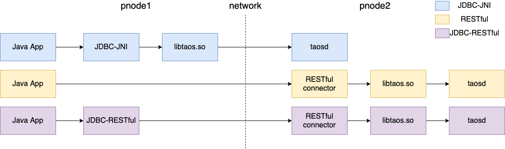

#  Java Connector

TDengine 提供了遵循 JDBC 标准（3.0）API 规范的 `taos-jdbcdriver` 实现，可在 maven 的中央仓库 [Sonatype Repository][1] 搜索下载。

`taos-jdbcdriver` 的实现包括 2 种形式： JDBC-JNI 和 JDBC-RESTful（taos-jdbcdriver-2.0.18 开始支持 JDBC-RESTful）。 JDBC-JNI 通过调用客户端 libtaos.so（或 taos.dll ）的本地方法实现， JDBC-RESTful 则在内部封装了 RESTful 接口实现。



上图显示了 3 种 Java 应用使用连接器访问 TDengine 的方式：

* JDBC-JNI：Java 应用在物理节点1（pnode1）上使用 JDBC-JNI 的 API ，直接调用客户端 API（libtaos.so 或 taos.dll）将写入和查询请求发送到位于物理节点2（pnode2）上的 taosd 实例。
* RESTful：应用将 SQL 发送给位于物理节点2（pnode2）上的 RESTful 连接器，再调用客户端 API（libtaos.so）。
* JDBC-RESTful：Java 应用通过 JDBC-RESTful 的 API ，将 SQL 封装成一个 RESTful 请求，发送给物理节点2的 RESTful 连接器。

TDengine 的 JDBC 驱动实现尽可能与关系型数据库驱动保持一致，但时序空间数据库与关系对象型数据库服务的对象和技术特征存在差异，导致 `taos-jdbcdriver` 与传统的 JDBC driver 也存在一定差异。在使用时需要注意以下几点：

* TDengine 目前不支持针对单条数据记录的删除操作。
* 目前不支持事务操作。
* 目前不支持表间的 union 操作。
* 目前不支持嵌套查询（nested query）。
* 对每个 Connection 的实例，至多只能有一个打开的 ResultSet 实例；如果在 ResultSet 还没关闭的情况下执行了新的查询，taos-jdbcdriver 会自动关闭上一个 ResultSet。


## JDBC-JNI和JDBC-RESTful的对比

<table >
<tr align="center"><th>对比项</th><th>JDBC-JNI</th><th>JDBC-RESTful</th></tr>
<tr align="center">
	<td>支持的操作系统</td>
	<td>linux、windows</td>
	<td>全平台</td>
</tr>
<tr align="center">
	<td>是否需要安装 client</td>
	<td>需要</td>
	<td>不需要</td>
</tr>
<tr align="center">
	<td>server 升级后是否需要升级 client</td>
	<td>需要</td>
	<td>不需要</td>
</tr>
<tr align="center">
	<td>写入性能</td>
	<td colspan="2">JDBC-RESTful 是 JDBC-JNI 的 50%～90% </td>
</tr>
<tr align="center">
	<td>查询性能</td>
	<td colspan="2">JDBC-RESTful 与 JDBC-JNI 没有差别</td>
</tr>
</table>


## 如何获取 taos-jdbcdriver

### maven 仓库

目前 taos-jdbcdriver 已经发布到 [Sonatype Repository][1] 仓库，且各大仓库都已同步。

* [sonatype][8]
* [mvnrepository][9]
* [maven.aliyun][10]

maven 项目中使用如下 pom.xml 配置即可：

```xml
<dependency>
  <groupId>com.taosdata.jdbc</groupId>
  <artifactId>taos-jdbcdriver</artifactId>
  <version>2.0.18</version>
</dependency>
```

### 源码编译打包

下载 [TDengine][3] 源码之后，进入 taos-jdbcdriver 源码目录 `src/connector/jdbc` 执行 `mvn clean package -Dmaven.test.skip=true` 即可生成相应 jar 包。


## JDBC的使用说明

### 获取连接

#### 指定URL获取连接

通过指定URL获取连接，如下所示：

```java
Class.forName("com.taosdata.jdbc.rs.RestfulDriver");
String jdbcUrl = "jdbc:TAOS-RS://taosdemo.com:6041/test?user=root&password=taosdata";
Connection conn = DriverManager.getConnection(jdbcUrl);
```

以上示例，使用 **JDBC-RESTful** 的 driver，建立了到 hostname 为 taosdemo.com，端口为 6041，数据库名为 test 的连接。这个 URL 中指定用户名（user）为 root，密码（password）为 taosdata。

使用 JDBC-RESTful 接口，不需要依赖本地函数库。与 JDBC-JNI 相比，仅需要：

1. driverClass 指定为“com.taosdata.jdbc.rs.RestfulDriver”；
2. jdbcUrl 以“jdbc:TAOS-RS://”开头；
3. 使用 6041 作为连接端口。

如果希望获得更好的写入和查询性能，Java 应用可以使用 **JDBC-JNI** 的driver，如下所示：

```java
Class.forName("com.taosdata.jdbc.TSDBDriver");
String jdbcUrl = "jdbc:TAOS://taosdemo.com:6030/test?user=root&password=taosdata";
Connection conn = DriverManager.getConnection(jdbcUrl);
```

以上示例，使用了 JDBC-JNI 的 driver，建立了到 hostname 为 taosdemo.com，端口为 6030（TDengine 的默认端口），数据库名为 test 的连接。这个 URL 中指定用户名（user）为 root，密码（password）为 taosdata。

**注意**：使用 JDBC-JNI 的 driver，taos-jdbcdriver 驱动包时需要依赖系统对应的本地函数库。

* libtaos.so
  在 linux 系统中成功安装 TDengine 后，依赖的本地函数库 libtaos.so 文件会被自动拷贝至 /usr/lib/libtaos.so，该目录包含在 Linux 自动扫描路径上，无需单独指定。

* taos.dll
  在 windows 系统中安装完客户端之后，驱动包依赖的 taos.dll 文件会自动拷贝到系统默认搜索路径 C:/Windows/System32 下，同样无需要单独指定。

> 在 windows 环境开发时需要安装 TDengine 对应的 [windows 客户端][14]，Linux 服务器安装完 TDengine 之后默认已安装 client，也可以单独安装 [Linux 客户端][15] 连接远程 TDengine Server。

JDBC-JNI 的使用请参见<a href=https://www.taosdata.com/blog/2020/11/11/1955.html>视频教程</a>。

TDengine 的 JDBC URL 规范格式为：
`jdbc:[TAOS|TAOS-RS]://[host_name]:[port]/[database_name]?[user={user}|&password={password}|&charset={charset}|&cfgdir={config_dir}|&locale={locale}|&timezone={timezone}]`

url中的配置参数如下：
* user：登录 TDengine 用户名，默认值 root。
* password：用户登录密码，默认值 taosdata。
* cfgdir：客户端配置文件目录路径，Linux OS 上默认值 /etc/taos ，Windows OS 上默认值 C:/TDengine/cfg。
* charset：客户端使用的字符集，默认值为系统字符集。
* locale：客户端语言环境，默认值系统当前 locale。
* timezone：客户端使用的时区，默认值为系统当前时区。


#### 指定URL和Properties获取连接

除了通过指定的 URL 获取连接，还可以使用 Properties 指定建立连接时的参数，如下所示：
```java
public Connection getConn() throws Exception{
  Class.forName("com.taosdata.jdbc.TSDBDriver");
  // Class.forName("com.taosdata.jdbc.rs.RestfulDriver");
  String jdbcUrl = "jdbc:TAOS://taosdemo.com:6030/test?user=root&password=taosdata";
  // String jdbcUrl = "jdbc:TAOS-RS://taosdemo.com:6041/test?user=root&password=taosdata";
  Properties connProps = new Properties();
  connProps.setProperty(TSDBDriver.PROPERTY_KEY_CHARSET, "UTF-8");
  connProps.setProperty(TSDBDriver.PROPERTY_KEY_LOCALE, "en_US.UTF-8");
  connProps.setProperty(TSDBDriver.PROPERTY_KEY_TIME_ZONE, "UTC-8");
  Connection conn = DriverManager.getConnection(jdbcUrl, connProps);
  return conn;
}
```

以上示例，建立一个到 hostname 为 taosdemo.com，端口为 6030，数据库名为 test 的连接。注释为使用 JDBC-RESTful 时的方法。这个连接在 url 中指定了用户名(user)为 root，密码（password）为 taosdata，并在 connProps 中指定了使用的字符集、语言环境、时区等信息。

properties 中的配置参数如下：
* TSDBDriver.PROPERTY_KEY_USER：登录 TDengine 用户名，默认值 root。
* TSDBDriver.PROPERTY_KEY_PASSWORD：用户登录密码，默认值 taosdata。
* TSDBDriver.PROPERTY_KEY_CONFIG_DIR：客户端配置文件目录路径，Linux OS 上默认值 /etc/taos ，Windows OS 上默认值 C:/TDengine/cfg。
* TSDBDriver.PROPERTY_KEY_CHARSET：客户端使用的字符集，默认值为系统字符集。
* TSDBDriver.PROPERTY_KEY_LOCALE：客户端语言环境，默认值系统当前 locale。
* TSDBDriver.PROPERTY_KEY_TIME_ZONE：客户端使用的时区，默认值为系统当前时区。


#### 使用客户端配置文件建立连接

当使用 JDBC-JNI 连接 TDengine 集群时，可以使用客户端配置文件，在客户端配置文件中指定集群的 firstEp、secondEp参数。
如下所示：

1. 在 Java 应用中不指定 hostname 和 port
```java
public Connection getConn() throws Exception{
  Class.forName("com.taosdata.jdbc.TSDBDriver");
  String jdbcUrl = "jdbc:TAOS://:/test?user=root&password=taosdata";
  Properties connProps = new Properties();
  connProps.setProperty(TSDBDriver.PROPERTY_KEY_CHARSET, "UTF-8");
  connProps.setProperty(TSDBDriver.PROPERTY_KEY_LOCALE, "en_US.UTF-8");
  connProps.setProperty(TSDBDriver.PROPERTY_KEY_TIME_ZONE, "UTC-8");
  Connection conn = DriverManager.getConnection(jdbcUrl, connProps);
  return conn;
}
```
2. 在配置文件中指定 firstEp 和 secondEp
```
# first fully qualified domain name (FQDN) for TDengine system
firstEp               cluster_node1:6030

# second fully qualified domain name (FQDN) for TDengine system, for cluster only
secondEp              cluster_node2:6030

# default system charset
# charset               UTF-8

# system locale
# locale                en_US.UTF-8
```

以上示例，jdbc 会使用客户端的配置文件，建立到 hostname 为 cluster_node1、端口为 6030、数据库名为 test 的连接。当集群中 firstEp 节点失效时，JDBC 会尝试使用 secondEp 连接集群。
TDengine 中，只要保证 firstEp 和 secondEp 中一个节点有效，就可以正常建立到集群的连接。

> 注意：这里的配置文件指的是调用 JDBC Connector 的应用程序所在机器上的配置文件，Linux OS 上默认值 /etc/taos/taos.cfg ，Windows OS 上默认值 C://TDengine/cfg/taos.cfg。

#### 配置参数的优先级

通过以上 3 种方式获取连接，如果配置参数在 url、Properties、客户端配置文件中有重复，则参数的`优先级由高到低`分别如下：
1. JDBC URL 参数，如上所述，可以在 JDBC URL 的参数中指定。
2. Properties connProps
3. 客户端配置文件 taos.cfg

例如：在 url 中指定了 password 为 taosdata，在 Properties 中指定了 password 为 taosdemo，那么，JDBC 会使用 url 中的 password 建立连接。

> 更多详细配置请参考[客户端配置][13]

### 创建数据库和表

```java
Statement stmt = conn.createStatement();

// create database
stmt.executeUpdate("create database if not exists db");

// use database
stmt.executeUpdate("use db");

// create table
stmt.executeUpdate("create table if not exists tb (ts timestamp, temperature int, humidity float)");
```

> 注意：如果不使用 `use db` 指定数据库，则后续对表的操作都需要增加数据库名称作为前缀，如 db.tb。

### 插入数据

```java
// insert data
int affectedRows = stmt.executeUpdate("insert into tb values(now, 23, 10.3) (now + 1s, 20, 9.3)");

System.out.println("insert " + affectedRows + " rows.");
```

> now 为系统内部函数，默认为服务器当前时间。
> `now + 1s` 代表服务器当前时间往后加 1 秒，数字后面代表时间单位：a(毫秒), s(秒), m(分), h(小时), d(天)，w(周), n(月), y(年)。

### 查询数据

```java
// query data
ResultSet resultSet = stmt.executeQuery("select * from tb");

Timestamp ts = null;
int temperature = 0;
float humidity = 0;
while(resultSet.next()){

    ts = resultSet.getTimestamp(1);
    temperature = resultSet.getInt(2);
    humidity = resultSet.getFloat("humidity");

    System.out.printf("%s, %d, %s\n", ts, temperature, humidity);
}
```

> 查询和操作关系型数据库一致，使用下标获取返回字段内容时从 1 开始，建议使用字段名称获取。

### 订阅

#### 创建

```java
TSDBSubscribe sub = ((TSDBConnection)conn).subscribe("topic", "select * from meters", false);
```

`subscribe` 方法的三个参数含义如下：

* topic：订阅的主题（即名称），此参数是订阅的唯一标识
* sql：订阅的查询语句，此语句只能是 `select` 语句，只应查询原始数据，只能按时间正序查询数据
* restart：如果订阅已经存在，是重新开始，还是继续之前的订阅

如上面的例子将使用 SQL 语句 `select * from meters` 创建一个名为 `topic` 的订阅，如果这个订阅已经存在，将继续之前的查询进度，而不是从头开始消费所有的数据。

#### 消费数据

```java
int total = 0;
while(true) {
    TSDBResultSet rs = sub.consume();
    int count = 0;
    while(rs.next()) {
        count++;
    }
    total += count;
    System.out.printf("%d rows consumed, total %d\n", count, total);
    Thread.sleep(1000);
}
```

`consume` 方法返回一个结果集，其中包含从上次 `consume` 到目前为止的所有新数据。请务必按需选择合理的调用 `consume` 的频率（如例子中的 `Thread.sleep(1000)`），否则会给服务端造成不必要的压力。

#### 关闭订阅

```java
sub.close(true);
```

`close` 方法关闭一个订阅。如果其参数为 `true` 表示保留订阅进度信息，后续可以创建同名订阅继续消费数据；如为 `false` 则不保留订阅进度。

### 关闭资源

```java
resultSet.close();
stmt.close();
conn.close();
```

> `注意务必要将 connection 进行关闭`，否则会出现连接泄露。


## 与连接池使用

**HikariCP**

* 引入相应 HikariCP maven 依赖：
```xml
<dependency>
    <groupId>com.zaxxer</groupId>
    <artifactId>HikariCP</artifactId>
    <version>3.4.1</version>
</dependency>
```

* 使用示例如下：
```java
 public static void main(String[] args) throws SQLException {
    HikariConfig config = new HikariConfig();
    // jdbc properties
    config.setJdbcUrl("jdbc:TAOS://127.0.0.1:6030/log");
    config.setUsername("root");
    config.setPassword("taosdata");
    // connection pool configurations
    config.setMinimumIdle(10);           //minimum number of idle connection
    config.setMaximumPoolSize(10);      //maximum number of connection in the pool
    config.setConnectionTimeout(30000); //maximum wait milliseconds for get connection from pool
    config.setMaxLifetime(0);       // maximum life time for each connection
    config.setIdleTimeout(0);       // max idle time for recycle idle connection
    config.setConnectionTestQuery("select server_status()"); //validation query

    HikariDataSource ds = new HikariDataSource(config); //create datasource

    Connection  connection = ds.getConnection(); // get connection
    Statement statement = connection.createStatement(); // get statement

    //query or insert
    // ...

    connection.close(); // put back to conneciton pool
}
```

> 通过 HikariDataSource.getConnection() 获取连接后，使用完成后需要调用 close() 方法，实际上它并不会关闭连接，只是放回连接池中。
> 更多 HikariCP 使用问题请查看[官方说明][5]

**Druid**

* 引入相应 Druid maven 依赖：

```xml
<dependency>
    <groupId>com.alibaba</groupId>
    <artifactId>druid</artifactId>
    <version>1.1.20</version>
</dependency>
```

* 使用示例如下：
```java
public static void main(String[] args) throws Exception {

    DruidDataSource dataSource = new DruidDataSource();
    // jdbc properties
    dataSource.setDriverClassName("com.taosdata.jdbc.TSDBDriver");
    dataSource.setUrl(url);
    dataSource.setUsername("root");
    dataSource.setPassword("taosdata");
    // pool configurations
    dataSource.setInitialSize(10);
    dataSource.setMinIdle(10);
    dataSource.setMaxActive(10);
    dataSource.setMaxWait(30000);
    dataSource.setValidationQuery("select server_status()");
	
    Connection  connection = dataSource.getConnection(); // get connection
    Statement statement = connection.createStatement(); // get statement
    //query or insert 
    // ...

    connection.close(); // put back to conneciton pool
}
```

> 更多 druid 使用问题请查看[官方说明][6]

**注意事项**
* TDengine `v1.6.4.1` 版本开始提供了一个专门用于心跳检测的函数 `select server_status()`，所以在使用连接池时推荐使用 `select server_status()` 进行 Validation Query。

如下所示，`select server_status()` 执行成功会返回 `1`。
```shell
taos> select server_status();
server_status()|
================
1              |
Query OK, 1 row(s) in set (0.000141s)
```


## 与框架使用

* Spring JdbcTemplate 中使用 taos-jdbcdriver，可参考 [SpringJdbcTemplate][11]
* Springboot + Mybatis 中使用，可参考 [springbootdemo][12]


## TAOS-JDBCDriver 版本以及支持的 TDengine 版本和 JDK 版本

| taos-jdbcdriver 版本 | TDengine 版本     | JDK 版本 |
| -------------------- | ----------------- | -------- |
| 2.0.12 及以上        | 2.0.8.0 及以上    | 1.8.x    |
| 2.0.4 - 2.0.11       | 2.0.0.0 - 2.0.7.x | 1.8.x    |
| 1.0.3                | 1.6.1.x 及以上    | 1.8.x    |
| 1.0.2                | 1.6.1.x 及以上    | 1.8.x    |
| 1.0.1                | 1.6.1.x 及以上    | 1.8.x    |


## TDengine DataType 和 Java DataType

TDengine 目前支持时间戳、数字、字符、布尔类型，与 Java 对应类型转换如下：

| TDengine DataType | Java DataType      |
| ----------------- | ------------------ |
| TIMESTAMP         | java.sql.Timestamp |
| INT               | java.lang.Integer  |
| BIGINT            | java.lang.Long     |
| FLOAT             | java.lang.Float    |
| DOUBLE            | java.lang.Double   |
| SMALLINT, TINYINT | java.lang.Short    |
| BOOL              | java.lang.Boolean  |
| BINARY, NCHAR     | java.lang.String   |


## 常见问题

* java.lang.UnsatisfiedLinkError: no taos in java.library.path

  **原因**：程序没有找到依赖的本地函数库 taos。

  **解决方法**：windows 下可以将 C:\TDengine\driver\taos.dll 拷贝到 C:\Windows\System32\ 目录下，linux 下将建立如下软链 `ln -s /usr/local/taos/driver/libtaos.so.x.x.x.x /usr/lib/libtaos.so` 即可。

* java.lang.UnsatisfiedLinkError: taos.dll Can't load AMD 64 bit on a IA 32-bit platform

  **原因**：目前 TDengine 只支持 64 位 JDK。

  **解决方法**：重新安装 64 位 JDK。

* 其它问题请参考 [Issues][7]

[1]: https://search.maven.org/artifact/com.taosdata.jdbc/taos-jdbcdriver
[2]: https://mvnrepository.com/artifact/com.taosdata.jdbc/taos-jdbcdriver
[3]: https://github.com/taosdata/TDengine
[4]: https://www.taosdata.com/blog/2019/12/03/jdbcdriver%e6%89%be%e4%b8%8d%e5%88%b0%e5%8a%a8%e6%80%81%e9%93%be%e6%8e%a5%e5%ba%93/
[5]: https://github.com/brettwooldridge/HikariCP
[6]: https://github.com/alibaba/druid
[7]: https://github.com/taosdata/TDengine/issues
[8]: https://search.maven.org/artifact/com.taosdata.jdbc/taos-jdbcdriver
[9]: https://mvnrepository.com/artifact/com.taosdata.jdbc/taos-jdbcdriver
[10]: https://maven.aliyun.com/mvn/search
[11]: https://github.com/taosdata/TDengine/tree/develop/tests/examples/JDBC/SpringJdbcTemplate
[12]: https://github.com/taosdata/TDengine/tree/develop/tests/examples/JDBC/springbootdemo
[13]: https://www.taosdata.com/cn/documentation20/administrator/#%E5%AE%A2%E6%88%B7%E7%AB%AF%E9%85%8D%E7%BD%AE
[14]: https://www.taosdata.com/cn/all-downloads/#TDengine-Windows-Client
[15]: https://www.taosdata.com/cn/getting-started/#%E5%BF%AB%E9%80%9F%E4%B8%8A%E6%89%8B

