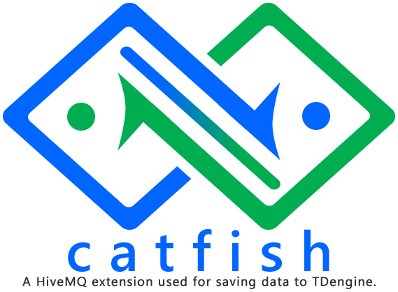
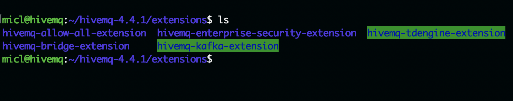
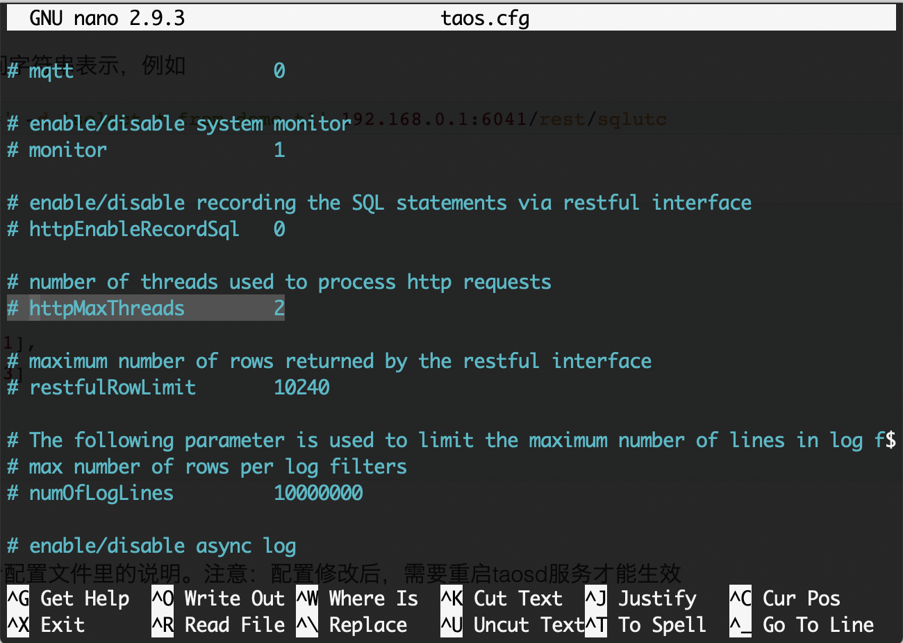

# TDengine Extension of HiveMQ (Codename: Catfish)

This is a HiveMQ extension that supports data save to TDEngine.

Documentation is [**HERE**](docs/index.md).

## Deployment

1. Please download hivemq-tdengine-extension-1.1-distribution.zip from [releases](https://github.com/micli/Catfish/releases/download/v1.1.0/hivemq-tdengine-extension-1.1-distribution.zip).
2. Unzip the file: hivemq-tdengine-extension-1.1-distribution.zip on local folder.
3. Put the whole folder into {HIVEMQHOME}/extensions/ as below:

4. Create a configuration file named "TDengine.properties" under hivemq-tdengine-extension. The template as below:

TDengine.properties
```shell
host: {TDengine Server IP/hostname}
port:6041
user: {TDengine account}
password:{password}

prefix:mqtt_msg
database:testdb

reportingInterval:1
connectTimeout:5000
```
|Properties|Meaning|
|-|-|
|host| The TDengine server name / IP address.|
|port|TDengine service listening port, default is 6041.|
|user|The TDengine db user name, usually the user should has write permissions.|
|password|The password of db login user.|
|prefix|The name of super table in TDengine.|
|database|The name of TDengine database.|
|reportingInterval|The performance metric report intervals. It's not in use.|
|connectTimeout|HTTP connect timeout in milliseconds.|

***At least, you should specify TDengine server host/IP address. Other settings will be set to default value.***

5. start HiveMQ service by {HIVEMQHOME}/bin/run.sh

Notes:
****
It doesen't need to create any database or tables in TDengine service. Just specify database name and table name by database and prefix properties in TDengine.properties. These database objects will created automatically.
****

## Enable Firewall Rules

The TDengine extension needs to access TDengine REST APIs which is locate on TDengine services with port 6041. Please configure firewall to enable outbound rule to communicate to 6041.

By default, the HiveMQ service exposes 1883 to recevied MQTT traffic, please enable it either.

## Tuning I/O Performance

There are two ways to extend I/O performance:
+ Separate database into multiple files.
+ Extends REST APIs serve threads number.

### Separate database into multiple files

If you want to improve I/O performance of database, you can specified how much time range into a database files when Create database. Then you can put database name into TDengine.properties file. The syntax as below:

```sql
CREATE DATABASE demo DAYS 10 CACHE 16000 ROWS 2000 
```
+ days: number of days to cover for a data file
+ keep: number of days to keep the data
+ rows: number of rows of records in a block in data file.

As an administrator, you can specify days, keep, rows parameters to get best performance when create database.

Please don't worry about TDengine exetsion changes these configurations. Because TDengine extension use "CREATE DATABASE IF NOT EXISTS " clause. It won't affect existing database.

### Extends REST APIs serve threads number

The TDengine extension uses REST APIs to communicate to TDengine service. By default, there are only 2 threads serve HTTP traffic. If you have a heavy MQTT traffic, please add the number of httMaxThreads.



For details, please review:
[TDengine Documentation](https://www.taosdata.com/en/documentation/administrator/#Configuration-on-Server)

## Build from source

Build this project is very simple. It only needs OpenJDK 11 and Maven.

For install OpenJDK 11, please check https://openjdk.java.net/install/.

For install Maven, please check https://maven.apache.org/install.html.

Then you can build code directly.

```shell

# Get code from Github.
> git clone https://www.github.com/micli/Catfish.git
# change current folder.
> cd Catfish/hivemq-tdengine-extension/
# Build extension
> mvn package

```
