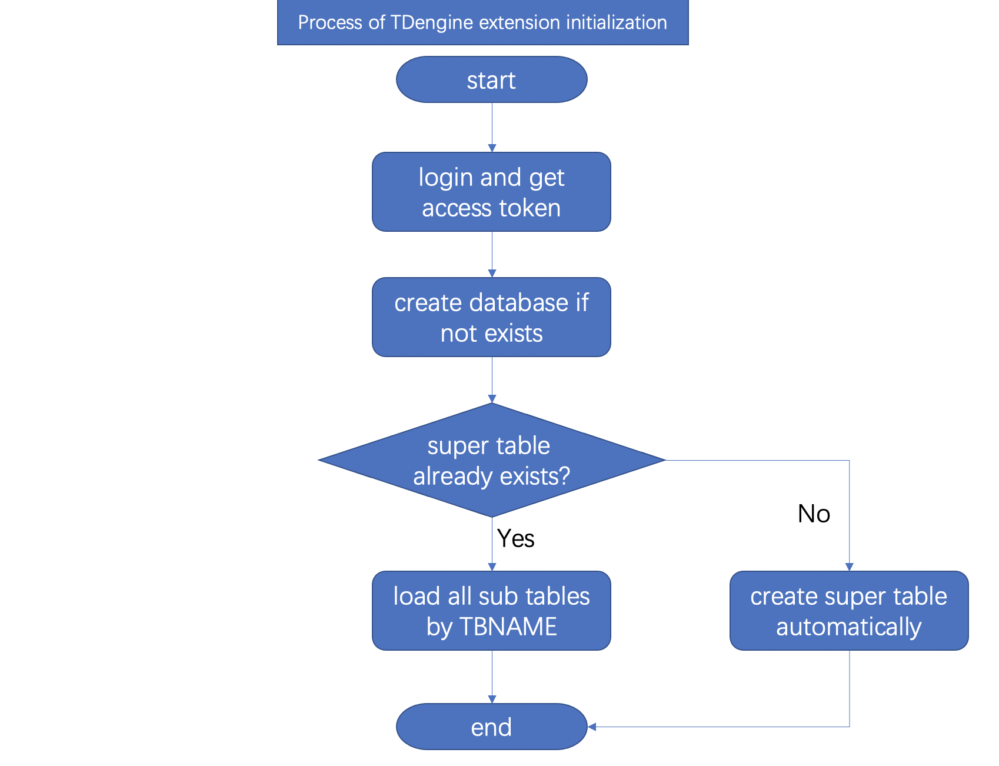

# Design Document

In this document, you will learn how to implement an extension to save data to TDengine.

## JDBC or RESTful APIs?

There are tow ways to communicate to TDengine service: JDBC and REST API. This extension uses REST APIs.

The reason is considered user deployment. If using JDBC, you need to deploy taos.dll/libtaos.so file besides extension deployment. In typecial scenarios, TDengine services is not hosted on same server/virtual machine/docker image with HiveMQ.

It means that user has to manually copy taos.dll/libtaos.so file. For details, please view [offical documentation](https://www.taosdata.com/en/documentation/connector/#Java-Connector).

Using REST APIs is easy to deployment. User doesn't need and additional action for deployment.

## Super Table / Sub Table Model

Super Table is a significant feature that introduced by TDengine. It doesn't maintain raw data but used as a template of physical table.

As TDengine documentation said, STable is an abstract and a template for a type of device. A STable contains a set of devices (tables) that have the same schema or data structure. Besides the shared schema, a STable has a set of tags, like the model, serial number and so on. Tags are used to record the static attributes for the devices and are used to group a set of devices (tables) for aggregation. Tags are metadata of a table and can be added, deleted or changed.

TDengine does not save tags as a part of the data points collected. Instead, tags are saved as metadata. Each table has a set of tags. To improve query performance, tags are all cached and indexed. One table can only belong to one STable, but one STable may contain many tables.

For easy query and organized data in future, the TDengine extension decide to use Super table/sub table model to maintain data.

When TDengine extension started, it automatically check super table exists or not. If Super Table does not exsits, it will be created automatically.

TDengine extension will use device id as sub table name. If a device id occurs first time. TDengine extension will create a new sub table mapping to this device id immediately. All data regarding this device id will be store into this new sub table then.

## Concurrent and Async I/O

As we know, HiveMQ calls PublishInboundInterceptor::onInboundPublish() when receives a MQTT data. If onInboundPublish() costs long time to handle data, is that will affect HiveMQ performance?

By debugging code of HiveMQ, you can notice that HiveMQ uses parallel library to call onInboundPublish() function in each time. This is very useful for high I/O scenarios. 

```java
... Call stack top ...
	at com.github.micli.catfish.TDengineInterceptor.onInboundPublish(TDengineInterceptor.java:54)
	at cO.f$b.a(Unknown Source)
	at cO.f$b.apply(Unknown Source)
	at cN.q$b.a(Unknown Source)
	at cN.q$b.c(Unknown Source)
	at cN.q$b.b(Unknown Source)
	at cN.q$b.run(Unknown Source)
	at java.base/java.util.concurrent.Executors$RunnableAdapter.call(Executors.java:515)
	at java.base/java.util.concurrent.FutureTask.run(FutureTask.java:264)
	at java.base/java.util.concurrent.ThreadPoolExecutor.runWorker(ThreadPoolExecutor.java:1128)
	at java.base/java.util.concurrent.ThreadPoolExecutor$Worker.run(ThreadPoolExecutor.java:628)
	at java.base/java.lang.Thread.run(Thread.java:834)
```
It doesn't mean that we don't need async I/O to improve performance. The next step of code improvement is change synchronized call to asynchronous call. At ver.1.1.0, TDengine extension has been impletmented asynchronus handler in PublishInboundInterceptor::onInboundPublish() method. That will reduce time latency between MQTT publishers and MQTT subscribers. At ver.1.1.2, TDengine extension has been replaced async HTTP access (executeSQLAsync) with sync HTTP method(executeSQL). I don't know whether it's effectively improved I/O. Because all workloads will be moved to TDengine services.

## Automatically create database objects

To make this extension very easy to use, at the beginning of the design I consider how to maintains all of database objects automatically. With this feature, user don't need manually create database, tables. All objects creation by TDengine extension.

The initialization of TDengine extension as below:



If it's first time start, TDengine extension will automatically create database and super table. The super table will be used as sub table template. Each new device id will be mapping to a new sub table in future.

If it's not first time start, TDengine extension will retrieve device id and sub table name by below SQL statement:

```sql
SELECT deviceId, TBNAME FROM [super table]
```
This mapping data will be loaded into a hash map object in Java. When MQTT data arrived to extension, it will check hash map to retrieve table name for data insert. If new device added at extension runtime, TDengine extension will automatically create sub table and add deive id/ table mapping into hash table.

With above functionals, that can support super table/sub table model for store data in TDengine database.
