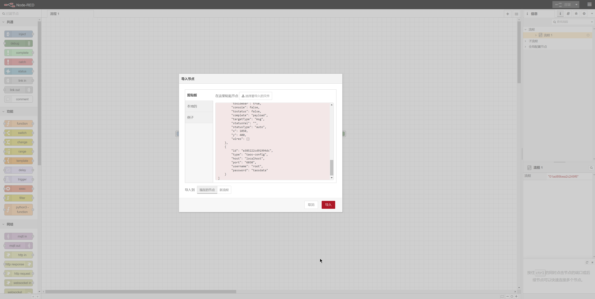
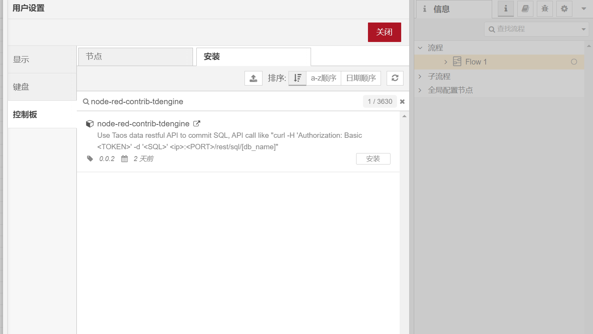
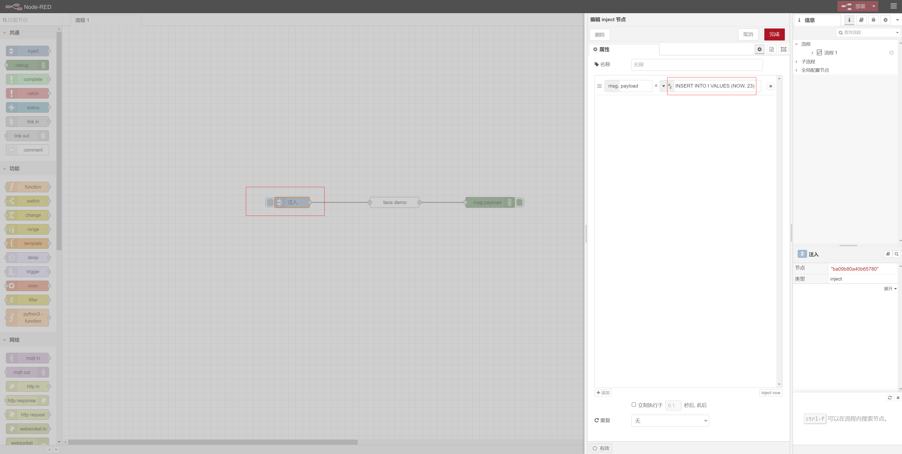

This repositry create a custom Node-Red node for configing TDengine server connection and execute SQL from preview node msg.payload
## Design
Use Taos data restful API to commit SQL, API call like
```
curl -H 'Authorization: Basic <TOKEN>' -d '<SQL>' <ip>:<PORT>/rest/sql/[db_name]
```

Input options:
* DB Server: Setup server connection or select a exist server
* DB Name: Database to execute SQL

Use [axios](https://axios-http.com/) to call http request

## Usage

1. Start Node-Red
2. Install TDengine node
3. Add "taos query" node to workspace from palette 
4. Setup a TDengine server and database name
5. Add function or other node to create SQL, put SQL into msg.payload
6. Link to "taos query" node

### Demo
1. Start Node-Red by docker
```
docker run -it -p 1880:1880 -v node_red_data:/data --name mynodered nodered/node-red
```
2. Import sample flow "demo/flow.json"

3. Install TDengine node by name "node-red-contrib-tdengine", current version is 0.0.2

4. Modify your TDengine server config

5. Edit test SQL

6. Start flow by click Inject node
